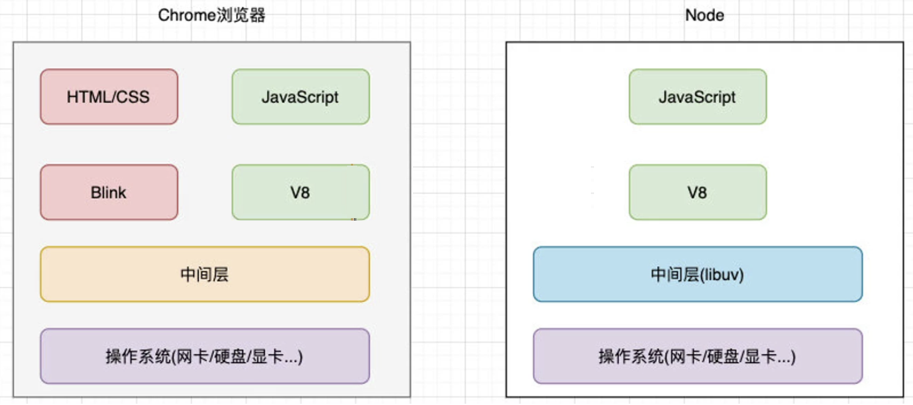
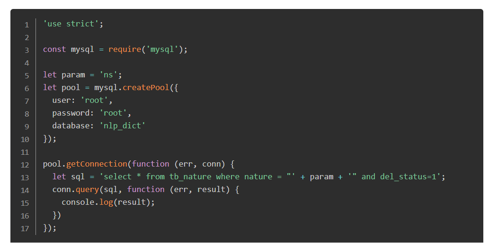
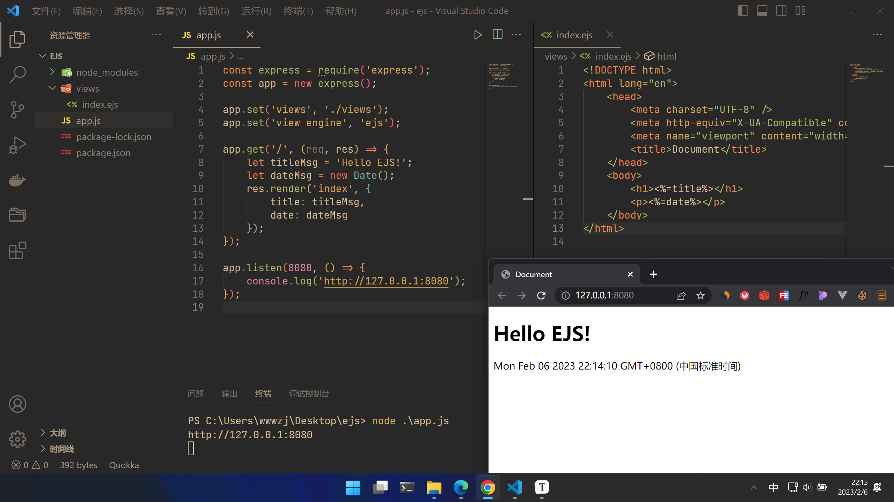
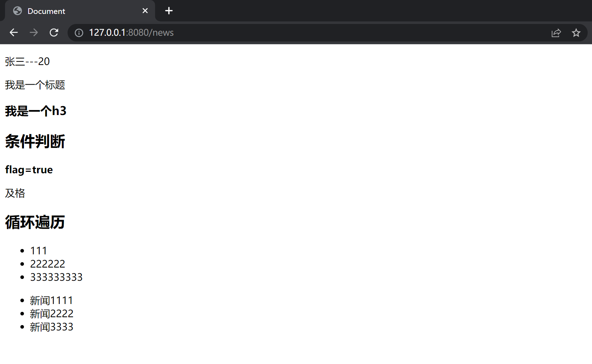
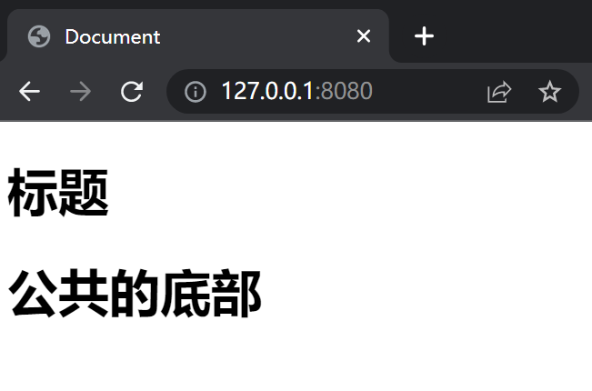
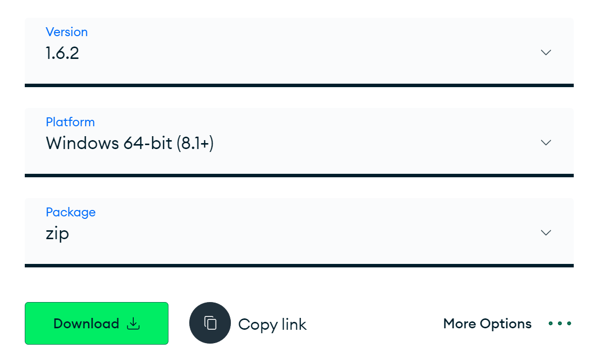
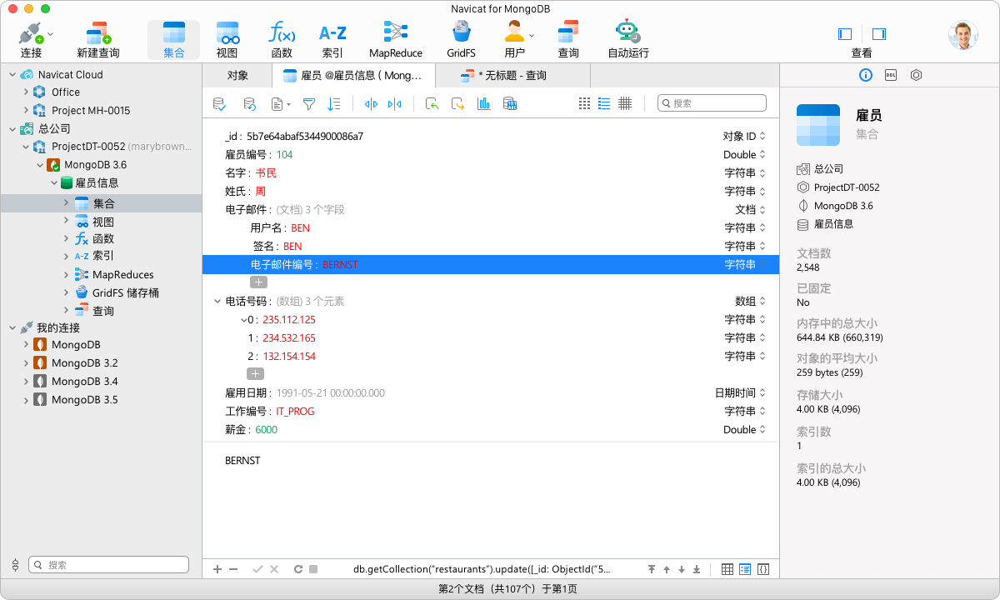
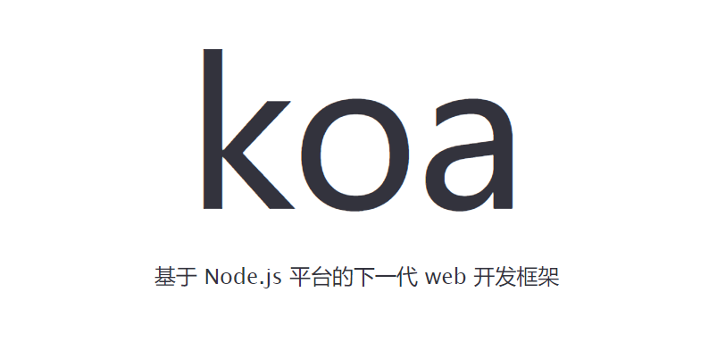
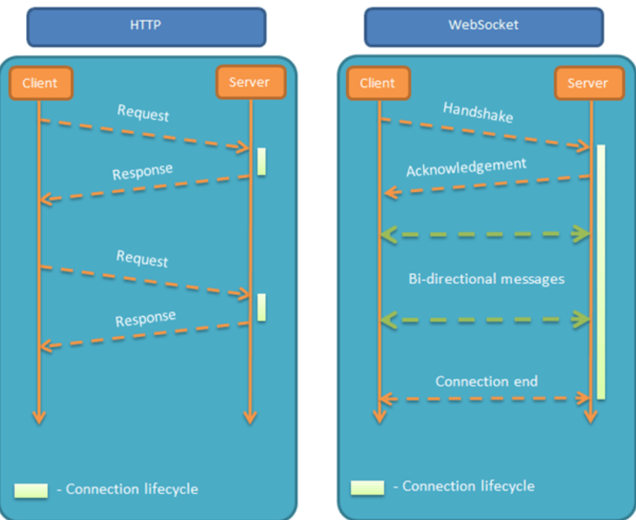

# Node.js

> 作者：kerwin（千锋）
>
> > 在此基础上，[JERRY-Z-J-R](https://github.com/JERRY-Z-J-R) 进行了大量的文档优化和补充！

# 一、Node.js基础

## 1.1 认识Node.js

> Node.js 是一个 javascript 运行环境。它让 javascript 可以开发后端程序，实现几乎其他后端语言实现的所有功能，可以与 PHP、Java、Python、.NET、Ruby 等后端语言平起平坐。
>
> Node.js 是基于 V8 引擎，V8 是 Google 发布的开源 JavaScript 引擎，本身就是用于 Chrome 浏览器的 js 解释部分，但是 Ryan Dahl 这哥们，鬼才般的把这个 V8 搬到了服务器上，用于做服务器的软件。

### 1.1.1 node.js的特性

- Node.js 语法完全是 js 语法，只要你懂 js 基础就可以学会 Node.js 后端开发
- Node.js 超强的高并发能力，实现高性能服务器
- 开发周期短、开发成本低、学习成本低

### 1.1.2 浏览器环境 vs Node环境



Node.js 不包含浏览器的 API，即不包括 DOM、BOM 等！Node.js 的 API 所针对的是后端开发所用的 API。

Node.js 可以解析 JS 代码（没有浏览器安全级别的限制）提供很多系统级别的 API，如：

- 文件的读写（File System）

  ```js
  const fs = require('fs');
  
  fs.readFile('./ajax.png', 'utf-8', (err, content) => {
      console.log(content);
  });
  ```

- 进程的管理（Process）

  ```js
  function main(argv) {
      console.log(argv);
  }
  
  main(process.argv.slice(2));
  ```
  
- 网络通信（HTTP/HTTPS）

  ```js
  const http = require("http");
  
  http.createServer((req,res) => {
      res.writeHead(200, {
          "content-type": "text/plain"
      });
      res.write("hello node.js");
      res.end();
  }).listen(3000);
  ```


## 1.2 开发环境搭建

中文官网：http://nodejs.cn/download/

建议下载 LTS 长期支持版本！


下载后，双击下一步，默认安装即可。

`node -version` 成功打印版本号，即安装成功！

使用 Node.js 独立运行 js 代码：`node xxx.js`

## 1.3 CommonJS、模块、包

为了提高开发的工程化，让合理性、效率性、可维护性、安全性得到保证，所以 Node.js 项目的开发有：CommonJS、模块、包 的概念。


### 1.3.1 CommonJS规范

CommonJS 规范是为了解决 JavaScript 的作用域问题而定义的模块形式，可以使每个模块在它自身的命名空间中执行。

CommonJS 规范包含许多的内容，其中 模块、包 都属于其中的内容。


CommonJS 只是一套规范，不包含实现，真正的实现是在 Node.js/Webpack 中来部分实现的。


### 1.3.2 modules模块化规范写法

我们可以把公共的功能抽离成为一个单独的 js 文件作为一个模块，默认情况下，这个模块里面的方法或者属性，外面是没法访问的。如果要让外部可以访问模块里面的方法或者属性，就必须在模块里面通过 `exports` 或者 `module.exports` 暴露属性或者方法，在使用时通过 `require` 导入。

m1.js：

```js
const name = 'gp19';

const sayName = () => {
  console.log(name);
};

console.log('module 1');

// 接口暴露方法一：
module.exports = {
  say: sayName
};

// 接口暴露方法二：
exports.say = sayName;

// 错误！
exports = {
  say: sayName
};
```

main.js：

```js
// 在哪个文件中使用便在哪里引入
const m1 = require('./m1');
m1.say();

// 运行结果：
module 1	// 导入时会自动运行导入的文件
gp19
```

假如有 a.js b.js c.js 三个文件，b.js 导入了 a.js，c.js 需要使用 b.js 中共享的部分，那么在 c.js 中直接导入 b.js 即可，不用导入 a.js，因为导入 b.js 的时候 b.js 会自动执行，而 b.js 内导入的 a.js 也便会被间接自动执行了。

Node.js 有许多功能各式各样的自带模块和第三方模块，对于自带模块我们直接导入使用即可，对于第三方模块我们下载后导入使用即可，而对于业务代码或者自制模块，我们则需要自己实现模块代码并导出再导入使用。

> Node.js 默认使用的是 CommonJS 模块化规范，但是目前新版本的 Node.js 也支持切换为 ES6 模块化写法！

## 1.4 Npm&Yarn

npm（“Node 包管理器”）是 JavaScript 运行时 Node.js 的默认程序包管理器。

npm 由两个主要部分组成:

- 用于发布和下载程序包的 CLI（命令行界面）工具
- 托管 JavaScript 程序包的 [在线存储库](https://www.npmjs.com/)

安装 node.js 后，npm 便自动安装了。

### 1.4.1 npm的使用

```
npm init	// 初始化项目，创建 package.json（记录了项目信息以及各种依赖包信息）
npm install 包名 [–g] （uninstall、update）	// 安装、卸载、更新包（-g 参数，全局安装、卸载、更新）
npm install 包名 --save-dev (uninstall、update)
简单来说：
使用命令 --save 或者说不写命令 --save，都会把信息记录到 dependencies 中；
dependencies 中记录的都是项目在运行时需要的文件；
使用命令 --save-dev 则会把信息记录到 devDependencies 中；
devDependencies 中记录的是项目在开发过程中需要使用的一些文件，在项目最终运行时是不需要的；
也就是说我们开发完成后，最终的项目中是不需要这些文件的；
————————————————————————————————————————————————————————————————————————————————————————————————
npm list -g 		    // 不加 -g，列举当前目录下的安装包)
npm info 包名			   // 查看包详细信息
npm install md5@2		// 安装指定版本的 md5 包（这里直接指定大版本）
npm outdated			// 检查包是否已经过时

npm install				// 根据 package.json 中记录的包依赖信息，下载还原所有包依赖

// dependencies 注意点：
"dependencies": {    "md5": "^2.1.0"  }  	^ 表示 如果 直接 npm install 将会安装 md5 2.*.* 最新版本
"dependencies": {    "md5": "~2.1.0"  }  	~ 表示 如果 直接 npm install 将会安装 md5 2.1.* 最新版本
"dependencies": {    "md5": "*"  }  	 	* 表示 如果 直接 npm install 将会安装 md5 最新版本
```

### 1.4.2 全局安装nrm 

> NRM（npm registry manager）是 npm 的镜像源管理工具，有时候国外资源太慢，使用这个就可以快速地在 npm 源间切换。

`手动切换方法： npm config set registry https://registry.npm.taobao.org`

**安装 nrm**

在命令行执行命令 `npm install -g nrm`，全局安装 nrm。

**使用 nrm**

执行命令 `nrm ls` 查看可选的源。 其中，带 `*` 的是当前使用的源，上面的输出表明当前源是官方源。

**切换 nrm**

如果要切换到 taobao 源，执行命令 `nrm use taobao`。

**测试速度**

你还可以通过 `nrm test` 测试相应源的响应时间。

扩展：

> 

 ```bash
 npm install -g cnpm --registry=https://registry.npmmirror.com
 ```

### 1.4.3 yarn使用

> yarn 是 npm 的一个第三方升级版，不过目前的 npm 也比较好用了，哪个用的习惯用哪个即可。

```shell
npm install -g yarn
```

```js
对比 npm：
	速度超快: Yarn 缓存了每个下载过的包，所以再次使用时无需重复下载。
    同时利用并行下载以最大化资源利用率，因此安装速度更快。
    超级安全: 在执行代码之前，Yarn 会通过算法校验每个安装包的完整性。

开始新项目
	yarn init 
添加依赖包
	yarn add [package] 
	yarn add [package]@[version]
	yarn add [package] -g
	yarn add [package] --dev 
升级依赖包
	 yarn upgrade [package]@[version] 
移除依赖包
	 yarn remove [package]
	 
安装项目的全部依赖
	 yarn install 
```

## 1.5 ES模块化写法

Node.js 默认是 CommonJS 模块化写法，不过新版的 Node.js 也支持 ES 的模块化写法了，切换方法是在 package.js 中设置 `"type": "module"`，注意：package.json 中默认是没有 "type" 属性的，其 "type" 属性默认为 "commonjs"。

### 1.5.1 内置模块

#### 01 http模块

> 要使用 HTTP 服务器和客户端，则必须 `require('http')`。

```js
const http = require('http');

http.createServer((req, res) => {
    // req 接受浏览器的请求参数
    // res 响应内容
    res.write('hello');
    res.write('world');
    // end 表示这一轮响应结束（必须要有）
    res.end();
    // res.end('这里也可以写东西，在结束前响应的内容');
    // write() end() 内不能直接放 js 的数据类型比如，数组、对象，而应把这些数据类型用字符串格式
}).listen(80, () => {
    console.log('server start');
});
```

```js
const http = require('http');

http.createServer((req, res) => {
    // 可以直接返回 HTML 页面，浏览器拿到后会自动解析
    res.write(`
    <!DOCTYPE html>
    <html>
    	<head>
    		<title>Node.js</title>
    	</head>
    	<body>
    		<h1>Hello Node</h1>
    	</body>
    </html>
    `);
    res.end();
}).listen(80, () => {
    console.log('server start');
});
```

```js
const http = require('http');

http.createServer((req, res) => {
    // 实际上，浏览器收到 html 字符串后，会默认当作 "Content-Type": "text/html"
    // 这里我们在响应头中直接指定类型
    // 往后的响应中，推荐都指定类型，防止意外发生
    // 这里我们也指定了状态码 200 表示成功，404 表示资源不存在，500 表示服务器错误
    res.writeHead(200, { "Content-Type": "text/html" });
    res.write(`
    <!DOCTYPE html>
    <html>
    	<head>
    		<title>Node.js</title>
    	</head>
    	<body>
    		<h1>Hello Node</h1>
    	</body>
    </html>
    `);
    res.end();
}).listen(80, () => {
    console.log('server start');
}); 
```

```js
const http = require('http');

http.createServer((req, res) => {
    // charset=utf-8 可以解决中文乱码
    res.writeHead(200, { "Content-Type": "text/html; charset=utf-8"});
    res.write(`
    <!DOCTYPE html>
    <html>
    	<head>
    		<title>Node.js</title>
    	</head>
    	<body>
    		<h1>你好 Node！</h1>
    	</body>
    </html>
    `);
    res.end();
}).listen(80, () => {
    console.log('server start');
}); 
```

```js
const http = require('http');

http.createServer((req, res) => {
    console.log(req.url);
    // 解决浏览器默认会请求图标的问题
    if (req.url === '/favicon.ico') {
        return;
    }
    // 当我们请求服务器时，req.url 包含我们所请求的地址，所以我们可以这样做：
    res.writeHead(renderStatus(req.url), { "Content-Type": "text/html; charset=utf-8" });
    res.write(renderHTML(req.url));
    res.end();
}).listen(80, () => {
    console.log('server start');
});

function renderStatus(url) {
    const arr = ['/home', '/list'];
    return arr.includes(url) ? 200 : 404;
}

function renderHTML(url) {
    switch (url) {
        case '/home':
            return `
            <!DOCTYPE html>
    		<html>
    			<head>
    				<title>Home</title>
    			</head>
    			<body>
    				<h1>你好 Home！</h1>
    			</body>
   			</html>
            `;
        case '/list':
            return `
            <!DOCTYPE html>
    		<html>
    			<head>
    				<title>List</title>
    			</head>
    			<body>
    				<h1>你好 List！</h1>
    			</body>
   			</html>
            `;
        default:
            return `
            <!DOCTYPE html>
    		<html>
    			<head>
    				<title>404</title>
    			</head>
    			<body>
    				<h1>404 Not Found</h1>
    			</body>
   			</html>
            `;
    }
}

/*
上面的代码都集中在一个文件中，较为复杂，我们可以模块化拆分
将 renderStatus(url) 和 renderHTML(url) 单独放在文件中，在通过导出和导入使用
*/
```

从上面这个例子，我们就实现了用 Node.js 打造一个 Web 服务器（根据请求路径返回页面），API 接口服务器（根据请求路径返回数据）的目的，虽然比较原始和繁琐，不能接受额外的参数（需要对 req.url 进行处理，url 模块可以方便的处理），还会遇到跨域问题（需要其他模块的支持），但至少五脏俱全，之后我们还会学习相关的 Web 框架，更优雅、更强大的来实现服务器。

```js
// http 模块的另外一种写法
const http = require('http');

const server = http.createServer((req, res) => {
  res.writeHead(200, { 'Content-Type': 'application/json' });
  res.end(JSON.stringify({
    data: 'Hello World!'
  }));
  // {"data":"Hello World!"}
});

server.listen(80);
```

```js
// http 模块的另外一种写法
const http = require('http');

const server = http.createServer();

// 监听请求事件
server.on('request', (request, res) => {
  res.writeHead(200, { 'Content-Type': 'application/json' });
  res.end(JSON.stringify({
    data: 'Hello World!'
  }));
  // {"data":"Hello World!"}
});

server.listen(80);
```

#### 02 url模块

**02.1 parse**

> 新版的 Node.js 已经弃用该方法，新的解决方案请参考文档。

url 模块中的 parse 方法可以用于解析 url 地址：

```js
const url = require('url');
const urlString = 'https://www.baidu.com:443/ad/index.html?id=8&name=mouse#tag=110';
const parsedStr = url.parse(urlString);
console.log(parsedStr);
/*
Url {
  protocol: 'https:',
  slashes: true,
  auth: null,
  host: 'www.baidu.com:443',
  port: '443',
  hostname: 'www.baidu.com',
  hash: '#tag=110',
  search: '?id=8&name=mouse',
  query: 'id=8&name=mouse',
  pathname: '/ad/index.html',
  path: '/ad/index.html?id=8&name=mouse',
  href: 'https://www.baidu.com:443/ad/index.html?id=8&name=mouse#tag=110'
}
*/
```

```js
const url = require('url');
const urlString = 'https://www.baidu.com:443/ad/index.html?id=8&name=mouse#tag=110';
// 加上 true 之后， query 自动转为 js 对象
const parsedStr = url.parse(urlString, true);
console.log(parsedStr);
console.log(parsedStr.query);
console.log(parsedStr.query.id);
console.log(parsedStr.query.name);
/*
Url {
  protocol: 'https:',
  slashes: true,
  auth: null,
  host: 'www.baidu.com:443',
  port: '443',
  hostname: 'www.baidu.com',
  hash: '#tag=110',
  search: '?id=8&name=mouse',
  query: [Object: null prototype] { id: '8', name: 'mouse' },
  pathname: '/ad/index.html',
  path: '/ad/index.html?id=8&name=mouse',
  href: 'https://www.baidu.com:443/ad/index.html?id=8&name=mouse#tag=110'
}
[Object: null prototype] { id: '8', name: 'mouse' }
8
mouse
*/
```

**02.2 format**

> 新版的 Node.js 已经弃用该方法，新的解决方案请参考文档。

url 模块中的 format 方法可以用于将 Url 对象合成为 url 地址：

```js
const url = require('url');
const urlObject = {
  protocol: 'https:',
  slashes: true,
  auth: null,
  host: 'www.baidu.com:443',
  port: '443',
  hostname: 'www.baidu.com',
  hash: '#tag=110',
  search: '?id=8&name=mouse',
  query: { id: '8', name: 'mouse' },
  pathname: '/ad/index.html',
  path: '/ad/index.html?id=8&name=mouse'
}
const parsedObj = url.format(urlObject);
console.log(parsedObj);
// https://www.baidu.com:443/ad/index.html?id=8&name=mouse#tag=110
```

**02.3 resolve**

> 新版的 Node.js 已经弃用该方法，新的解决方案请参考文档。

url 模块中的 resolve方法可以用于拼接 url。

```js
const url = require('url');
// 注意最后加/，不加/的区别
var a = url.resolve('/one/two/three', 'four');  
var b = url.resolve('http://example.com/', '/one');
var c = url.resolve('http://example.com/one', '/two');
console.log(a + "，" + b + "，" + c); 
// /one/two/four，http://example.com/one，http://example.com/two
```

> 由于之前的方法已经不推荐使用，下面介绍目前最新的解决方案。

```js
const urlString = 'https://www.baidu.com:443/ad/index.html?id=8&name=mouse#tag=110';
const myUrl = new URL(urlString, 'https://www.baidu.com:443');
console.log(myUrl);
/*
URL {
  href: 'https://www.baidu.com/ad/index.html?id=8&name=mouse#tag=110',
  origin: 'https://www.baidu.com',
  protocol: 'https:',
  username: '',
  password: '',
  host: 'www.baidu.com',
  hostname: 'www.baidu.com',
  port: '',
  pathname: '/ad/index.html',
  search: '?id=8&name=mouse',
  searchParams: URLSearchParams { 'id' => '8', 'name' => 'mouse' },
  hash: '#tag=110'
}
*/
console.log(myUrl.searchParams);
// URLSearchParams { 'id' => '8', 'name' => 'mouse' }
console.log(myUrl.searchParams.get('id'));
// 8
console.log(myUrl.searchParams.get('name'));
// mouse
for (let obj of myUrl.searchParams) {
    console.log(obj);
}
/*
[ 'id', '8' ]
[ 'name', 'mouse' ]
*/
for (let [key, value] of myUrl.searchParams) {
    console.log(key, value);
}
/*
id 8
name mouse
*/

// 还有更多的方法请查看文档……
```

#### 03 querystring模块

**03.1 parse**

```js
const querystring = require('querystring');
var qs = 'x=3&y=4';
var parsed = querystring.parse(qs);
console.log(parsed);
// [Object: null prototype] { x: '3', y: '4' }
console.log(parsed.x);
// 3
```

**03.2 stringify**

```js
const querystring = require('querystring');
var qo = {
  x: 3,
  y: 4
};
var parsed = querystring.stringify(qo);
console.log(parsed);
// x=3&y=4
```

**03.3 escape/unescape**




在 querystring 中也有 escape 这个功能：

```js
const querystring = require('querystring');
var str = 'id=3&city=北京&url=https://www.baidu.com';
var escaped = querystring.escape(str);
console.log(escaped);
// id%3D3%26city%3D%E5%8C%97%E4%BA%AC%26url%3Dhttps%3A%2F%2Fwww.baidu.com
```

```js
const querystring = require('querystring');
var str = 'id%3D3%26city%3D%E5%8C%97%E4%BA%AC%26url%3Dhttps%3A%2F%2Fwww.baidu.com';
var unescaped = querystring.unescape(str);
console.log(unescaped);
// id=3&city=北京&url=https://www.baidu.com
```

#### 04 http模块补充

**04.1 接口：jsonp**

利用 JSONP 解决前端跨域问题：

```js
// 前端代码
var oscript = document.createElement('script');
// JSONP 利用 script 标签没有跨域限制的条件
oscript.src = 'http://127.0.0.1:8080/api/user?callback=test'
document.body.appendChild(oscript);
function test(obj) {
    console.log(obj);
}

// 服务器返回函数的调用：test({"name": "jerry"})
// 前端自动执行预留好的函数：test()

// JSONP 只支持 GET 请求而不支持 POST 请求！
// 没有关于 JSONP 调用的错误处理，一但回调函数调用失败，浏览器会以静默失败的方式处理 
```

```js
const http = require('http');
const url = require('url');

const app = http.createServer((req, res) => {
  let urlObj = url.parse(req.url, true);

  switch (urlObj.pathname) {
    case '/api/user':
      res.end(`${urlObj.query.callback}({"name": "jerry"})`);
      break;
    default:
      res.end('404.');
      break;
  }
});

app.listen(8080, () => {
  console.log('localhost:8080');
});
```

**04.2 跨域：CORS**

浏览器会自动进行 CORS 通信，只要后端实现了 CORS，就实现了跨院。

服务端设置 Access-Control-Allow-Origin 就可以开启 CORS，该属性表示哪些域名可以访问资源，如果设置 * 则表示所有的网站都可以访问资源。

```js
var http = require("http");
var url = require("url");

http.createServer((req,res) => {
    var urlobj = url.parse(req.url,true);

    res.writeHead(200,{
        "Content-Type":"application/json;charset=utf-8",
        // cors 头
        "access-control-allow-origin":"*"
    });

    switch(urlobj.pathname){
        case "/api/aaa":
            res.end(`${JSON.stringify({
                name:"kerwin",
                age:100
            })}`);
            break;
        default:
            res.end("404");
    };
}).listen(3000);
```
**04.3 模拟get**

Node.js 也可以模拟 get 以及 post，使其成为一个客户端向其他服务器请求数据，这样的特性使得 Node.js 也通常用来开发中间层（服务器网关：对接集群中的各台服务器），同时还解决了跨域问题，因为跨域只发生在浏览器与服务器之间，而服务器与服务器之间是没有跨域的。

```js
var http = require("http");
// 由于猫眼的 API 是 https 协议的，所以我们要引入 https 模块
var https = require("https");
var url = require("url");

http.createServer((req,res) => {
    var urlobj = url.parse(req.url, true);

    res.writeHead(200,{
        "Content-Type":"application/json;charset=utf-8",
        "access-control-allow-origin":"*"
    });

    switch(urlobj.pathname){
        case "/api/aaa":
            // 客户端去猫眼要数据
            httpget((data) => {
                res.end(data);
            });
            break;
        default:
            res.end("404");
    }
}).listen(3000);


function httpget(cb){
    var data = "";
    https.get(`https://i.maoyan.com/api/mmdb/movie/v3/list/hot.json?ct=%E5%8C%97%E4%BA%AC&ci=1&channelId=4`,(res) => {
        // 当请求体数据比较大时，是一段一段过来的，res.on('data') 表示每当有段数据返回就触发该函数
        // chunk 表示每次到达的数据段
        res.on("data", chunk => {
            data += chunk;
        });

        // res.on('end') 表示全部数据端都接收到后触发该函数
        res.on("end",() => {
            console.log(data);
            // 触发回调函数
            cb(data);
        });
    });
}

// 1. 浏览器请求 http://127.0.0.1:3000/api/aaa
// 2. Node.js 服务器接收到浏览器请求后模拟 get 请求去间接请求猫眼的 API
// 3. 由于 Node.js 服务器与猫眼服务器之间没有跨域限制，所以 Node.js 服务器成功拿到了数据
// 4. Node.js 服务器再将数据响应给浏览器
```

**04.4 模拟post：服务器提交（攻击）**

```js
const https = require('https');
const querystring = require('querystring');

const postData = querystring.stringify({
  province: '上海',
  city: '上海',
  district: '宝山区',
  address: '同济支路199号智慧七立方3号楼2-4层',
  latitude: 43.0,
  longitude: 160.0,
  message: '求购一条小鱼',
  contact: '13666666',
  type: 'sell',
  time: 1571217561
});

const options = {
  protocol: 'https:',
  hostname: 'ik9hkddr.qcloud.la',
  method: 'POST',
  port: 443,
  path: '/index.php/trade/add_item',
  headers: {
    'Content-Type': 'application/x-www-form-urlencoded',
    'Content-Length': Buffer.byteLength(postData)
  }
};

function doPost() {
  let data;

  let req = https.request(options, (res) => {
    res.on('data', chunk => data += chunk);
    res.on('end', () => {
      console.log(data);
    });
  });

  req.write(postData);
  req.end();
};

// 不间断的密集请求，就会造成服务器攻击
// setInterval(() => {
//   doPost();
// }, 1000);
```

**04.5 爬虫**

我们通过 Node.js 直接获取 HTML 网页，再对 HTML 进行语义分析，便可实现爬虫，批量拿到我们想要的数据。

> 当网站不是前后端分离的架构时，前端页面数据就不是通过 Ajax 这样的方式请求得到的，后端也不会提供 API 接口，这些页面一般是后端直接生成的，所以我们想要批量拿到数据，就只能依靠爬虫。

```js
var http = require("http");
var https = require("https");
var url = require("url");
var cheerio = require("cheerio");

http.createServer((req, res) => {
    var urlobj = url.parse(req.url, true);

    res.writeHead(200, {
        "Content-Type":"application/json;charset=utf-8",
        "access-control-allow-origin":"*"
    });

    switch(urlobj.pathname) {
        case "/api/aaa":
            httpget(data => {
                res.end(spider(data));
            });
            break;
        default:
            res.end("404");
    }
}).listen(3000);

function httpget(cb) {
    var data = "";
    https.get(`https://i.maoyan.com/`, res => {
        res.on("data", chunk => {
            data += chunk;
        });

        res.on("end", () => {
            // data 就是 HTML 页面
            console.log(data);
            cb(data);
        });
    });
}

function spider(data) {
    // 我们可以使用正则表达式解析 HTML 获取我们想要的数据，但是太过于复杂，我们一般借助第三方库进行解析
    // cheerio 模块可以帮助我们将 HTML 页面快速的转为 DOM 节点，方便我们进行页面的解析
    // npm i cheerio 
    let $ = cheerio.load(data);
    
    let $moviewlist = $(".column.content");
    let movies = [];

    $moviewlist.each((index, value) => {
        movies.push({
            title:$(value).find(".title").text(),
            grade:$(value).find(".grade").text(),
            actor:$(value).find(".actor").text()
        })
    })

    console.log(movies);
    return JSON.stringify(movies);
}

/*
[
[
     {
          "title": "阿凡达：水之道",
          "grade": "9.1",
          "actor": "主演:萨姆·沃辛顿,佐伊·索尔达娜,西格妮·韦弗"
     },
     {
          "title": "绝望主夫",
          "grade": "9.0",
          "actor": "主演:常远,李嘉琦,王成思"
     },
     {
          "title": "想见你",
          "grade": "9.0",
          "actor": "主演:柯佳嬿,许光汉,施柏宇"
     },
     {
          "title": "航海王：红发歌姬",
          "grade": "9.1",
          "actor": "主演:田中真弓,中井和哉,冈村明美"
     },
     {
          "title": "穿靴子的猫2",
          "grade": "9.2",
          "actor": "主演:安东尼奥·班德拉斯,萨尔玛·海耶克,哈维·吉兰"
     },
     {
          "title": "名侦探柯南：万圣节的新娘",
          "grade": "9.1",
          "actor": "主演:高山南,山崎和佳奈,小山力也"
     },
     {
          "title": "西游记之七十二变",
          "grade": "",
          "actor": "主演:刘婧荦,刘琮,图特哈蒙"
     },
     {
          "title": "龙珠超：超级人造人",
          "grade": "",
          "actor": "主演:野泽雅子,古川登志夫,久川绫"
     },
     {
          "title": "女生规则",
          "grade": "",
          "actor": "主演:阿米达普·巴强,塔丝·潘努,基尔蒂·库哈里"
     },
     {
          "title": "放牛班的春天",
          "grade": "9.6",
          "actor": "主演:热拉尔·朱诺,弗朗西斯·贝尔兰德,凯德·麦拉德"
     },
     {
          "title": "扫黑行动",
          "grade": "7.9",
          "actor": "主演:周一围,秦海璐,张智霖"
     },
     {
          "title": "唬胆特工",
          "grade": "8.5",
          "actor": "主演:凯文·哈特,伍迪·哈里森,凯莉·库柯"
     }
]
*/
```

#### 05 event模块

Node.js 提供的一种用来实现 “消息订阅与发布” 的模块。

在一些场景中，比起回调函数来它非常的方便！

```js
const EventEmitter = require('events');

const event = new EventEmitter();

// 订阅消息
event.on('play', (movie) => {
    console.log(movie);
});

// 发布消息
event.emit('play', '我和我的祖国');
event.emit('play', '中国机长');
```

改造我们之前的爬虫案例：

```js
var http = require("http");
var https = require("https");
var url = require("url");
var cheerio = require("cheerio");
const EventEmitter = require("events");

var event = null;
http.createServer((req, res) => {
    var urlobj = url.parse(req.url, true);

    res.writeHead(200,{
        "Content-Type":"application/json;charset=utf-8",
        "access-control-allow-origin":"*"
    });

    switch(urlobj.pathname) {
        case "/api/aaa":
            // 一定要在这里 new EventEmitter()，而不是最外层!
            // 因为一但在最外层 new EventEmitter()，那么每次执行到此处，event 身上都会重复订阅新的 cb 消息，一但某处发布了 cb 消息，将会触发多个 cb 消息中的回调函数！
            event = new EventEmitter();
            event.on("cb", data => {
                res.end(data);
            });
            httpget();
            break;
        default:
            res.end("404");
    }
}).listen(3000);

function httpget() {
    var data = "";
    https.get(`https://i.maoyan.com/`, res => {
        res.on("data", chunk => {
            data += chunk;
        });

        res.on("end", () => {
            // data 就是 HTML 页面
            console.log(data);
            event.emit("cb");
        });
    });
}

function spider(data) {
    // 我们可以使用正则表达式解析 HTML 获取我们想要的数据，但是太过于复杂，我们一般借助第三方库进行解析
    // cheerio 模块可以帮助我们将 HTML 页面快速的转为 DOM 节点，方便我们进行页面的解析
    // npm i cheerio 
    let $ = cheerio.load(data);
    
    let $moviewlist = $(".column.content");
    let movies = [];

    $moviewlist.each((index, value) => {
        movies.push({
            title:$(value).find(".title").text(),
            grade:$(value).find(".grade").text(),
            actor:$(value).find(".actor").text()
        })
    })

    console.log(movies);
    return JSON.stringify(movies);
}
```

#### 06 fs文件操作模块

```js
const fs = require('fs');

// 创建文件夹
fs.mkdir('./avatar', err => {
    // console.log(err)
    if (err && err.code === 'EEXIST') {
        console.log('目录已经存在');
    }
});

// 文件夹改名
fs.rename('./avatar', './avatar2', err => {
    if (err && err.code === 'ENOENT') {
        console.log('目录不存在');
    }
});

// 删除文件夹
fs.rmdir('./avatar', err => {
    if (err && err.code === 'ENOENT') {
        console.log('目录不存在');
    }
    if (err && err.code === 'ENOTEMPTY') {
        console.log('目录不为空');
    }
});

// 写内容到文件里（没有文件会自动创建文件，有文件会直接覆盖，没有目录会报错）
fs.writeFile('./avatar/a.txt', '你好', err => {
    console.log(err);
});

// 给文件追加内容
fs.appendFile('./avatar/a.txt', '\nhello world', err => {
    console.log(err);
});

// 读取文件内容
fs.readFile('./avatar/a.txt', (err, data) => {
    if (!err) {
        // 默认 data 是一个 buffer 对象
        console.log(data);
        // 将 buffer 对象转为 utf-8 字符串
        console.log(data.toString('utf-8'));
    }
});

// 可以直接指定读取编码
fs.readFile('./avatar/a.txt', 'utf-8', (err, data) => {
    if (!err) {
        console.log(data);
    }
});

// 删除文件
fs.unlink('./avatar/a.txt', err => {
    console.log(err);
});

// 批量写文件
for (var i = 0; i < 10; i++) {
  fs.writeFile(`./logs/log-${i}.txt`, `log-${i}`, (err) => {
    console.log('done.')
  })
}

// 读取目录信息
fs.readdir('./avatar', (err, data) => {
    if (!err) {
        // data 是一个数组，元素是目录中的各文件或目录的名称
        console.log(data);
    }
});

// 读取目标的信息（类型，创建时间，大小……）
fs.stat('./avatar/b.txt', (err, data) => {
    // 是文件吗？
    console.log(data.isFile());
    // 是目录吗？
    console.log(data.isDirectory());
    // 大小是多少？单位：bytes
    console.log(data.size());
});

// 清空目录后删除目录（rmdir 只能删除空目录）
fs.readdir('./avatar', (err, data) => {
    // 清空目录（目录中只有文件的情况，如果目录中还有目录，那要利用递归来解决）
    data.forEach(item => {
        fs.unlink(`./avatar/${item}`, err => {
            console.log(err);
        });
    });

    // 会报错！因为 fs.unlink 是异步进行的！并不会阻塞，在目录还未清空完时，就会执行 fs.rmdir 那么就会报错！
    // 解决方法：方法1：利用 Promise 来封装，方法2：用计数器来记录 unlink 的成功次数……，方法3：将 unlink 改为 unlinkSync（同步模式，会阻塞等待结果返回再执行）
    fs.rmdir('./avatar', err => {
        console.log(err);
    });
});

// 同步读取文件（在原有 API 的基础上加上 Sync，其他 API 同理）
// 会阻塞等待结果返回再向后执行代码
// 错误处理需要用 try catch
try {
    const content = fs.readFileSync('./avatar/c.txt', 'utf-8');
    console.log(content);
    console.log('-----');
} catch(err) {
    console.log(err.message);
}

// 异步读取文件：方法一（回调函数）
fs.readFile('./avatar/c.txt', 'utf-8', (err, content) => {
    console.log(content);
    console.log('-----');
});
console.log('#####');

// 异步读取文件：方法二（Promise）
const fs = require("fs").promises;

fs.readFile('./avatar/c.txt', 'utf-8').then(result => {
    console.log(result);
}).catch(err => {
    console.log(err);
});

// 清空目录后删除目录
fs.readdir('./avatar').then(async data => {
    let arr = [];
    data.forEach(item => {
        arr.push(fs.unlink(`./avatar/${item}`));
    });
    await Promise.all(arr);
    await fs.rmdir('./avatar');
});

// 清空目录后删除目录
fs.readdir('./avatar').then(async data => {
    await Promise.all(data.map(item => fs.unlink(`./avatar/${item}`)));
    await fs.rmdir('./avatar');
});
```

在 `fs` 模块中，提供同步方法是为了方便使用。那我们到底是应该用异步方法还是同步方法呢？

由于 Node 环境执行的 JavaScript 代码是服务器端代码，所以绝大部分需要在服务器运行期反复执行业务逻辑的代码，必须使用异步，否则同步代码在执行时期，服务器将停止响应，因为 JavaScript 只有一个执行线程。

服务器启动时如果需要读取配置文件，或者结束时需要写入到状态文件时，可以使用同步代码，因为这些代码只在启动和结束时执行一次，不影响服务器正常运行时的异步执行。

#### 07 stream流模块

`stream` 是 Node.js 提供的又一个仅在服务区端可用的模块，目的是支持 “流” 这种数据结构。

什么是流？流是一种抽象的数据结构。想象水流，当在水管中流动时，就可以从某个地方（例如自来水厂）源源不断地到达另一个地方（比如你家的洗手池）。我们也可以把数据看成是数据流，比如你敲键盘的时候，就可以把每个字符依次连起来，看成字符流。这个流是从键盘输入到应用程序，实际上它还对应着一个名字：标准输入流。

如果应用程序把字符一个一个输出到显示器上，这也可以看成是一个流，这个流也有名字：标准输出流。

流的特点是数据是有序的，而且必须依次读取，或者依次写入，不能像 Array 那样随机定位。

有些流用来读取数据，比如从文件读取数据时，可以打开一个文件流，然后从文件流中不断地读取数据。

有些流用来写入数据，比如向文件写入数据时，只需要把数据不断地往文件流中写进去就可以了。

在 Node.js 中，流也是一个对象，我们只需要响应流的事件就可以了：`data` 事件表示流的数据已经可以读取了，`end` 事件表示这个流已经到末尾了，没有数据可以读取了，`error` 事件表示出错了。

> 为什么需要流？
>
> 假如我们用 fs 读写一个特别大的文件，那么读写过程中这个文件的全部内容会直接被加载到 Node.js 的可用内存中，造成内存使用量的急剧升高！所以我们在操作大文件时需要用流的形式来操作！同样的对于 http 模块，如果我们接收请求或响应请求时为一个大文件，那么我们也需要使用流的形式来操作！

```js
var fs = require('fs');

// 打开一个流：
var rs = fs.createReadStream('sample.txt', 'utf-8');

// data 事件：只要有数据流传递就会触发
// data 事件可能会被触发多次！（小文件可能一次就完了，大文件就需要多次）
// chunk 是每次收到的数据流片段
rs.on('data', chunk => {
    console.log('chunk' + chunk);
});

// end 事件：数据流全部传递完成触发
// end 事件只会被触发一次！
rs.on('end', () => {
    console.log('END');
});

// error 事件：发生错误时触发
rs.on('error', err => {
    console.log('ERROR: ' + err);
});
```

要注意，`data` 事件可能会有多次，每次传递的 `chunk` 是流的一部分数据。

要以流的形式写入文件，只需要不断调用 `write()` 方法，最后以 `end()` 结束：

```js
var fs = require('fs');

var ws = fs.createWriteStream('output.txt', 'utf-8');
// 每次 write 都是以一个流片段写入
ws.write('使用Stream写入文本数据...\n');
ws.write('END');
ws.end();
```

`pipe` 就像可以把两个水管串成一个更长的水管一样，两个流也可以串起来。

pipe：管道、传送

一个 `Readable` 流和一个 `Writable` 流串起来后，所有的数据自动从 `Readable` 流进入 `Writable` 流，这种操作叫 `pipe`。

我们用 pipe 就可以实现诸如：一边读数据流，一边把数据流写入文件的操作！从而以更高性能的实现大文件的复制！

并且 `pipe()` 方法会自己协调读取与写入的流速差问题，完毕之后还会自动关闭！

在 Node.js 中，`Readable` 流有一个 `pipe()` 方法，就是用来干这件事的。

让我们用 `pipe()` 把一个文件流和另一个文件流串起来，这样源文件的所有数据就自动写入到目标文件里了，所以，这实际上是一个复制文件的程序：

```js
const fs = require('fs');

const readstream = fs.createReadStream('./1.txt');
const writestream = fs.createWriteStream('./2.txt');

// 输出 ————pipe————> 输入
readstream.pipe(writestream);
```

#### 08 zlib模块

浏览器请求服务器的前端静态资源，服务器就会先读取静态资源再响应给浏览器，但是如果资源比较大，那么网络发送的延时就会比较高，我们可以对资源进行压缩发送，浏览器拿到后再进行解压就会比较快！压缩算法比较多，我们认识一个比较出名的 zlib


```js
const fs = require('fs');
const zlib = require('zlib');

const gzip = zlib.createGzip();

const readstream = fs.createReadStream('./note.txt');
const writestream = fs.createWriteStream('./note2.txt');

readstream.pipe(gzip).pipe(writestream);
```

静态资源案例
```js
const http = require('http');
const fs = require('fs');
const zlib = require('zlib');
const gzip = zlib.createGzip();
http.createServer((req, res) => {
    // 实际上，req 和 res 都是流对象！
    // 读取一个静态文件
    const readStream = fs.createReadStream('./index.js');
    res.writeHead(200, {
        // 指定内存类型和字符集编码
        'Content-Type': 'application/x-javascript;charset=utf-8',
        // 指定内容编码
        'Content-Encoding': 'gzip'
    });
    // 先把流交给 gzip 压缩，随即交给 res
    readStream.pipe(gzip).pipe(res);
}).listen(8080, () => {
    console.log('server start');
});
```

#### 09 crypto模块

crypto 模块的目的是为了提供通用的加密和哈希算法。用纯 JavaScript 代码实现这些功能不是不可能，但速度会非常慢。Node.js 用 C/C++ 实现这些算法后，通过 cypto 这个模块暴露为 JavaScript 接口，这样用起来方便，运行速度也快。

MD5 是一种常用的哈希算法，用于给任意数据一个“签名”。这个签名通常用一个十六进制的字符串表示：

```js
const crypto = require('crypto');

// 创建 hash 方法（md5算法）
const hash = crypto.createHash('md5');

// 可任意多次调用 update()
hash.update('Hello, world!');
hash.update('Hello, nodejs!');

// 以 16 进制的方式进行展示
console.log(hash.digest('hex'));
// 以 base64 的方式进行展示
console.log(hash.digest('base64'));
```

`update()` 方法默认字符串编码为 `UTF-8`，也可以传入 Buffer。

如果要计算 SHA1，只需要把 `'md5'` 改成 `'sha1'`，就可以得到 SHA1 的结果。

Hmac 算法也是一种哈希算法，它可以利用 MD5 或 SHA1 等哈希算法。不同的是，Hmac 还需要一个密钥：

```js
const crypto = require('crypto');

const hmac = crypto.createHmac('sha256', 'secret-key');

hmac.update('Hello, world!');
hmac.update('Hello, nodejs!');

console.log(hmac.digest('hex'));
```

只要密钥发生了变化，那么同样的输入数据也会得到不同的签名，因此可以把 Hmac 理解为用随机数 “增强” 的哈希算法。

AES 是一种常用的对称加密算法，加解密都用同一个密钥。crypto 模块提供了 AES 支持，但是需要自己封装好函数，以便使用，此处不再展开。

### 1.5.2 路由

> 后面我们会学习 Express 及 Koa，这些框架都是以 “路由 + 中间件” 为核心的！所以我们这里以纯 Node.js 的方式来模块化的方式实现一下基本的路由，同时设计 use 方法，来模拟中间件……

#### 01 基础

- index.js

```js
const server = require('./server');
const route = require('./route');
const api = require('./api');

//注册路由
server.use(route);
server.use(api);

server.start();
```

- server.js

```js
const http = require('http');
const Router = {};

function use(obj) {
    Object.assign(Router, obj);
}

function start() {
    http.createServer((req, res) => {
        const myURL = new URL(req.url, 'http://127.0.0.1');
        try {
            // Router 是一个对象，可以用 [] 访问属性
            Router[myURL.pathname](res);
        } catch (error) {
            Router['/404'](res);
        }
    }).listen(3000, () => {
        console.log('server start');
    });
}

exports.start = start;
exports.use = use;
```

- route.js

```js
const fs = require('fs');

function render(res, path, type = '') {
    res.writeHead(200, { 'Content-Type': `${type ? type : 'text/html'};charset=utf8` });
    res.write(fs.readFileSync(path), 'utf-8');
    res.end();
}
const route = {
    '/login': res => {
        render(res, './static/login.html');
    },
    '/home': res => {
        render(res, './static/home.html');
    },
    '/404': res => {
        res.writeHead(404, { 'Content-Type': 'text/html;charset=utf8' });
        res.write(fs.readFileSync('./static/404.html'), 'utf-8');
        res.end();
    },
    '/favicon.ico': res => {
        render(res, './static/favicon.ico', 'image/x-icon');
    }
};

module.exports = route;
```

- api.js

```js
function render(res, data, type = '') {
    res.writeHead(200, { 'Content-Type': `${type ? type : 'application/json'};charset=utf8` });
    res.write(data);
    res.end();
}
const apiRouter = {
    '/api/login': res => {
        render(res, `{ok: 1}`);
    }
};

module.exports = apiRouter;
```

#### 02 获取参数

- index.js

```js
const server = require('./server');
const route = require('./route');
const api = require('./api');

//注册路由
server.use(route);
server.use(api);

server.start();
```

- server.js

```js
const http = require('http');
const Router = {};

function use(obj) {
    Object.assign(Router, obj);
}

function start() {
    http.createServer((req, res) => {
        const myURL = new URL(req.url, 'http://127.0.0.1');

        try {
            Router[myURL.pathname](req, res);
        } catch (error) {
            Router['/404'](req, res);
        }
    }).listen(3000, () => {
        console.log('server start');
    });
}

exports.start = start;
exports.use = use;
```

- route.js

```js
const fs = require('fs');

function render(res, path, type = '') {
    res.writeHead(200, { 'Content-Type': `${type ? type : 'text/html'};charset=utf8` });
    res.write(fs.readFileSync(path), 'utf-8');
    res.end();
}
const route = {
    '/login': (req, res) => {
        render(res, './static/login.html');
    },
    '/home': (req, res) => {
        render(res, './static/home.html');
    },
    '/404': (req, res) => {
        res.writeHead(404, { 'Content-Type': 'text/html;charset=utf8' });
        res.write(fs.readFileSync('./static/404.html'), 'utf-8');
        res.end();
    },
    '/favicon.ico': (req, res) => {
        render(res, './static/favicon.ico', 'image/x-icon');
    }
};

module.exports = route;
```

- api.js

```js
function render(res, data, type = '') {
    res.writeHead(200, { 'Content-Type': `${type ? type : 'application/json'};charset=utf8` });
    res.write(data);
    res.end();
}

const apiRouter = {
    '/api/login': (req, res) => {
        // 获取 Get 参数
        const myURL = new URL(req.url, 'http://127.0.0.1');

        if (myURL.searchParams.get('username') === 'kerwin' && myURL.searchParams.get('password') === '123456') {
            render(res, `{"ok": 1}`);
        } else {
            render(res, `{"ok": 0}`);
        }
    },

    '/api/loginpost': (req, res) => {
        // 获取 Post 参数
        var post = '';
        req.on('data', chunk => {
            post += chunk;
        });

        req.on('end', () => {
            console.log(post);
            post = JSON.parse(post);
            if (post.username === 'kerwin' && post.password === '123456') {
                render(res, `{"ok": 1}`);
            } else {
                render(res, `{"ok": 0}`);
            }
        });
    }
};

module.exports = apiRouter;
```

#### 03 静态资源处理

- index.js

```js
const server = require('./server');
const route = require('./route');
const api = require('./api');

//注册路由
server.use(route);
server.use(api);

server.start();
```

- server.js

```js
const http = require('http');
const Router = {};

function use(obj) {
    Object.assign(Router, obj);
}

function start() {
    http.createServer((req, res) => {
        const myURL = new URL(req.url, 'http://127.0.0.1');

        try {
            Router[myURL.pathname](req, res);
        } catch (error) {
            Router['/404'](req, res);
        }
    }).listen(3000, () => {
        console.log('server start');
    });
}

exports.start = start;
exports.use = use;
```

- route.js

```js
const fs = require('fs');
const path = require('path');
const mime = require('mime');

function render(res, path, type = '') {
    res.writeHead(200, { 'Content-Type': `${type ? type : 'text/html'};charset=utf8` });
    res.write(fs.readFileSync(path), 'utf-8');
    res.end();
}
const route = {
    '/login': (req, res) => {
        render(res, './static/login.html');
    },
    '/': (req, res) => {
        render(res, './static/home.html');
    },
    '/home': (req, res) => {
        render(res, './static/home.html');
    },
    '/404': (req, res) => {
        if (readStaticFile(req, res)) {
            return;
        }
        res.writeHead(404, { 'Content-Type': 'text/html;charset=utf8' });
        res.write(fs.readFileSync('./static/404.html'), 'utf-8');
        res.end();
    }
};

// 静态资源管理
function readStaticFile(req, res) {
    // 获取路径
    const myURL = new URL(req.url, 'http://127.0.0.1:3000');
    const pathname = path.join(__dirname, '/static', myURL.pathname);
    if (myURL.pathname === '/') return false;
    if (fs.existsSync(pathname)) {
        // 处理显示返回
        render(res, pathname, mime.getType(myURL.pathname.split('.')[1]));
        return true;
    } else {
        return false;
    }
}

module.exports = route;
```

- api.js

```js
function render(res, data, type = '') {
    res.writeHead(200, { 'Content-Type': `${type ? type : 'application/json'};charset=utf8` });
    res.write(data);
    res.end();
}

const apiRouter = {
    '/api/login': (req, res) => {
        const myURL = new URL(req.url, 'http://127.0.0.1');

        if (myURL.searchParams.get('username') === 'kerwin' && myURL.searchParams.get('password') === '123456') {
            render(res, `{"ok": 1}`);
        } else {
            render(res, `{"ok": 0}`);
        }
    },

    '/api/loginpost': (req, res) => {
        var post = '';
        req.on('data', chunk => {
            post += chunk;
        });

        req.on('end', () => {
            console.log(post);
            post = JSON.parse(post);
            if (post.username === 'kerwin' && post.password === '123456') {
                render(res, `{"ok": 1}`);
            } else {
                render(res, `{"ok": 0}`);
            }
        });
    }
};

module.exports = apiRouter;
```

# 二、Express

> https://www.expressjs.com.cn/

基于 Node.js 平台，快速、开放、极简的 Web 开发框架。

## 2.1 特色


## 2.2 安装

```js
npm install express
```

## 2.3 路由

路由是指如何定义应用的端点（URIs）以及如何响应客户端的请求。

路由是由一个 URI、HTTP 请求（GET、POST等）和若干个句柄组成，它的结构如下：`app.METHOD(path, [callback...], callback)`，app 是 express 对象的一个实例，METHOD 是一个 HTTP 请求方法，path 是服务器上的路径， callback 是当路由匹配时要执行的函数。

下面是一个基本的路由示例：

```js
var express = require('express');
var app = express();

app.get('/', (req, res) => {
    // send 方法可以快捷的响应内容，不需要先 write 再 end
    // 并且 send 方法会自动识别内容设置响应头的类型，比如 JSON，HTML 等
    res.send('hello world');
});
```

路由路径和请求方法一起定义了请求的端点，它可以是字符串、字符串模式或者正则表达式。

```js
// 匹配根路径的请求
app.get('/', (req, res) => {
    res.send('root');
});

// 匹配 /about 路径的请求
app.get('/about', (req, res) => {
    res.send('about');
});

// 匹配 /random.text 路径的请求
app.get('/random.text', (req, res) => {
    res.send('random.text');
});
```

使用字符串模式的路由路径示例：

```js
// 匹配 acd 和 abcd
app.get('/ab?cd', (req, res) => {
    res.send('ab?cd');
});

// 匹配 /ab/******
app.get('/ab/:id', (req, res) => {
    res.send('aaaaaaa');
});

// 匹配 abcd、abbcd、abbbcd 等
app.get('/ab+cd', (req, res) => {
    res.send('ab+cd');
});

// 匹配 abcd、abxcd、abRABDOMcd、ab123cd 等
app.get('/ab*cd', (req, res) => {
    res.send('ab*cd');
});

// 匹配 /abe 和 /abcde
app.get('/ab(cd)?e', (req, res) => {
    res.send('ab(cd)?e');
});
```

使用正则表达式的路由路径示例：

```js
// 匹配任何路径中含有 a 的路径：
app.get(/a/, (req, res) => {
    res.send('/a/');
});

// 匹配 butterfly、dragonfly，不匹配 butterflyman、dragonfly man 等
app.get(/.*fly$/, (req, res) => {
    res.send('/.*fly$/');
});
```

可以为请求处理提供多个回调函数，其行为类似“中间件”。唯一的区别是这些回调函数有可能调用 next('route') 方法而略过其他路由回调函数。可以利用该机制为路由定义前提条件，如果在现有路径上继续执行没有意义，则可将控制权交给剩下的路径。

```js
app.get('/example/a', (req, res) => {
    res.send('Hello from A!');
});
```

使用多个回调函数处理路由（记得指定 next 对象）：

```js
app.get('/example/b', (req, res, next) => {
    console.log('response will be sent by the next function ...');
    next();
}, (req, res) => {
    res.send('Hello from B!');
});
```

使用回调函数数组处理路由：

```js
var cb0 = (req, res, next) => {
    console.log('CB0');
    next();
};

var cb1 = (req, res, next) => {
    console.log('CB1');
    next();
};

var cb2 = (req, res) => {
    res.send('Hello from C!');
};

app.get('/example/c', [cb0, cb1, cb2]);
```

混合使用函数和函数数组处理路由：

```js
var cb0 = (req, res, next) => {
    console.log('CB0');
    next();
};

var cb1 = (req, res, next) => {
    console.log('CB1');
    next();
};

app.get('/example/d', [cb0, cb1], (req, res, next) => {
    console.log('response will be sent by the next function ...');
    next();
}, (req, res) => {
    res.send('Hello from D!');
});
```

## 2.4 中间件

Express 是一个自身功能极简，完全是由路由和中间件构成一个的 Web 开发框架：从本质上来说，一个 Express 应用就是在调用各种中间件。

中间件（Middleware） 是一个函数，它可以访问请求对象（request object (req)）, 响应对象（response object (res)）, 和 Web 应用中处于请求-响应循环流程中的中间件，一般被命名为 next 的变量。

中间件的功能包括：

- 执行任何代码
- 修改请求和响应对象
- 终结请求-响应循环
- 调用堆栈中的下一个中间件

如果当前中间件没有终结请求-响应循环，则必须调用 next() 方法将控制权交给下一个中间件，否则请求就会挂起。

Express 应用可使用如下几种中间件：

- 应用级中间件
- 路由级中间件
- 错误处理中间件
- 内置中间件
- 第三方中间件

使用可选则挂载路径，可在应用级别或路由级别装载中间件。另外，你还可以同时装在一系列中间件函数，从而在一个挂载点上创建一个子中间件栈。

### 2.4.1 应用级中间件

应用级中间件绑定到 app 对象 使用 app.use() 和 app.METHOD()，其中，METHOD 是需要处理的 HTTP 请求的方法，例如 GET, PUT, POST 等等，全部小写。例如：

```js
var app = express();

// 没有挂载路径的中间件，应用的每个请求都会执行该中间件
app.use((req, res, next) => {
    console.log('Time:', Date.now());
    next();
});
```

### 2.4.2 路由级中间件

路由级中间件和应用级中间件一样，只是它绑定的对象为 express.Router()。

```js
var router = express.Router();
```

```js
var app = express();
var router = express.Router();

// 没有挂载路径的中间件，通过该路由的每个请求都会执行该中间件
router.use((req, res, next) => {
    console.log('Time:', Date.now());
    next();
});

// 一个中间件栈，显示任何指向 /user/:id 的 HTTP 请求的信息
router.use('/user/:id', (req, res, next) => {
    console.log('Request URL:', req.originalUrl);
    next();
}, (req, res, next) => {
    console.log('Request Type:', req.method);
    next();
});

// 一个中间件栈，处理指向 /user/:id 的 GET 请求
router.get('/user/:id', (req, res, next) => {
  // 如果 user id 为 0, 跳到下一个路由
  if (req.params.id == 0) next('route');
  // 负责将控制权交给栈中下一个中间件
  else next();
}, (req, res, next) => {
  // 渲染常规页面
  res.render('regular');
});

// 处理 /user/:id， 渲染一个特殊页面
router.get('/user/:id', (req, res, next) => {
  console.log(req.params.id);
  res.render('special');
});

// 将路由挂载至应用
app.use('/', router);
```

### 2.4.3 错误处理中间件

错误处理中间件和其他中间件定义类似，只是要使用 4 个参数，而不是 3 个，其签名如下： (err, req, res, next)。

```js
app.use((err, req, res, next) => {
  console.error(err.stack)
  res.status(500).send('Something broke!')
})
```

### 2.4.4 内置的中间件

express.static 是 Express 唯一内置的中间件。它基于 serve-static，负责在 Express 应用中提托管静态资源。每个应用可有多个静态目录。

```js
app.use(express.static('public'));
app.use(express.static('uploads'));
app.use(express.static('files'));
```

### 2.4.5 第三方中间件

安装所需功能的 node 模块，并在应用中加载，可以在应用级加载，也可以在路由级加载。

下面的例子安装并加载了一个解析 cookie 的中间件：cookie-parser

```
npm install cookie-parser
```

```js
var express = require('express');
var app = express();
var cookieParser = require('cookie-parser');

// 加载用于解析 cookie 的中间件
app.use(cookieParser());
```

## 2.5 获取请求参数

get

```js
req.query
```

post

```js
app.use(express.urlencoded({extended:false}))
app.use(express.json())
req.body
```

## 2.6 利用 Express 托管静态文件

通过 Express 内置的 express.static 可以方便地托管静态文件，例如图片、CSS、JavaScript 文件等。

将静态资源文件所在的目录作为参数传递给 express.static 中间件就可以提供静态资源文件的访问了。例如，假设在 public 目录放置了图片、CSS 和 JavaScript 文件，你就可以：

```js
app.use(express.static('public'));
```

现在，public 目录下面的文件就可以访问了。

```js
http://localhost:3000/images/kitten.jpg
http://localhost:3000/css/style.css
http://localhost:3000/js/app.js
http://localhost:3000/images/bg.png
http://localhost:3000/hello.html
```

> 所有文件的路径都是相对于存放目录的，因此，存放静态文件的目录名不会出现在 URL 中。

如果你的静态资源存放在多个目录下面，你可以多次调用 express.static 中间件：

```js
app.use(express.static('public'));
app.use(express.static('files'));
```

访问静态资源文件时，express.static 中间件会根据目录添加的顺序查找所需的文件。

如果你希望所有通过 express.static 访问的文件都存放在一个“虚拟（virtual）”目录（即目录根本不存在）下面，可以通过为静态资源目录指定一个挂载路径的方式来实现，如下所示：

```js
app.use('/static', express.static('public'));
```

现在，你就可以通过带有 “/static” 前缀的地址来访问 public 目录下面的文件了。

```js
http://localhost:3000/static/images/kitten.jpg
http://localhost:3000/static/css/style.css
http://localhost:3000/static/js/app.js
http://localhost:3000/static/images/bg.png
http://localhost:3000/static/hello.html
```

## 2.7 服务端渲染（模板引擎）

网站开发模式有两种：服务端渲染 和 前后端分离。

服务端渲染：前端程序员写好页面模板，叫给后端，到用户请求过来后，后端查询数据库，将数据拼接到页面模板中，然后直接响应完整的页面给用户。

前后端分离：前端程序员开发页面，后端程序员写接口，前端程序员通过 Ajax 等技术，动态请求后端 API 接口的数据，然后动态替换页面内容。

优缺点：前后端分离的开发模式，效率更高，前端做前端的，后端干后端的，互不干扰，但是前后端分离项目的 SEO 并不优好！因为浏览器拿到的第一手页面是一个没有数据的空页面，数据都是后面 Ajax 请求过来的，所以搜索引擎在第一时间爬取页面时，啥也拿不到，搜索排名就会特别不利！	


我们这里简单的介绍一个 Node.js 中处理模板的库 ejs：

EJS：高效的嵌入式 JavaScript 模板引擎。

中文文档：[EJS -- 嵌入式 JavaScript 模板引擎 | EJS 中文文档 (bootcss.com)](https://ejs.bootcss.com/)

```js
npm i ejs
```

需要在应用中进行如下设置才能让 Express 渲染模板文件：

注意：app.set() 是 Express 的一个配置方法，里面有固定的配置选项，目前不需要深究！

- 配置模板文件的目录：`app.set('views', './views');`
- 配置模板引擎：`app.set('view engine', 'ejs');`

基本用法示例：



再看一个更复杂的例子：

```js
// app.js
const express = require('express');
const app = express();

app.set('views', './views');
app.set('view engine', 'ejs');

app.get('/news', (req, res) => {
    let userinfo = {
        username: '张三',
        age: 20
    };
    let title = '我是一个标题';
    let article = '<h3>我是一个h3</h3>';

    let list = ['111', '222222', '333333333'];

    let newsList = [{ title: '新闻1111' }, { title: '新闻2222' }, { title: '新闻3333' }];

    res.render('news', {
        userinfo: userinfo,
        title: title,
        article: article,
        flag: true,
        score: 60,
        list: list,
        newsList: newsList
    });
});

app.listen(8080, () => {
    console.log('http://127.0.0.1:8080');
});
```

```ejs
<!-- news.ejs -->
<!DOCTYPE html>
<html lang="en">
    <head>
        <meta charset="UTF-8" />
        <meta http-equiv="X-UA-Compatible" content="IE=edge" />
        <meta name="viewport" content="width=device-width, initial-scale=1.0" />
        <title>Document</title>
    </head>
    <body>
        <p><%=userinfo.username%> --- <%=userinfo.age%></p>
        <p><%=title%></p>
        <p><%-article%></p>
        <h2>条件判断</h2>
        <%if(flag==true)%>
        <%if(score>=60)else%>
        <h2>循环遍历</h2>
        <ul>
            <%for(let i=0;i<list.length;i++){%>
                <li><%=list[i]%></li>
            <%}%>        
        </ul>
        <ul>
            <%for(let i=0;i<newsList.length;i++){%>
                <li><%=newsList[i].title%></li>
            <%}%>        
        </ul>
    </body>
</html>
```



ejs 还可以引入模板：

首先、在 views 文件夹中新建模板页面 footer.ejs：

```ejs
<footer>
    <h1>公共的底部</h1>
</footer>
```

 然后在 index.ejs 中调用模板页面：

```ejs
<!DOCTYPE html>
<html lang="en">
    <head>
        <meta charset="UTF-8" />
        <meta http-equiv="X-UA-Compatible" content="IE=edge" />
        <meta name="viewport" content="width=device-width, initial-scale=1.0" />
        <title>Document</title>
    </head>
    <body>
        <h1><%=title%></h1>
        <%-include('footer.ejs')%>
    </body>
</html>
```

app.js 中的代码：

```js
const express = require('express');
const app = express();

app.set('views', './views');
app.set('view engine', 'ejs');

app.get('/', (req, res) => {
    res.render('index', { title: '标题' });
});

app.listen(8080, () => {
    console.log('http://127.0.0.1:8080');
});
```



还有更多的功能，请参考相关文档……

# 三、MongoDB

## 3.1 关系型与非关系型数据库

【关系型数据库（SQL）】

什么是关系型数据库：

> 关系型数据库指的是使用关系模型（二维表格模型）来组织数据的数据库。 

什么是关系模型：

> 关系模型可以简单理解为二维表格模型，而一个关系型数据库就是由一堆二维表及其之间的关系组成的一个数据组织。 

常见关系型数据库管理系统：

- Oracle 
- MySQL 
- SQLServer 
- SQLite 
- PostgreSQL 
- DB2 

关系型数据库的优势：

- 采用二维表结构非常贴近正常思维逻辑更容易理解
- 支持通用的 SQL（结构化查询语言） 
- 丰富的完整性大大减少了数据冗余和数据不一致的问题，并且全部由表结构组成，文件格式一致 
- 可以用 SQL 在多个表之间做非常繁杂的查询 
- 提供对事务的支持，能保证系统中事务的正确执行，同时提供事务的恢复、回滚、并发控制和死锁问题的解决 
- 数据实时存储在磁盘中，安全可靠
- 历史悠久，各种开发工具、生态链和解决方案都很完善

关系型数据库存在的不足：

>  随着互联网的不断发展，数据日益增多，因此关系型数据库面对海量的数据会存在很多的不足。 

- 高并发读写能力差：网站类用户的并发性访问非常高，而一台数据库的最大连接数有限，且硬盘 I/O 有限，不能满足很多人同时连接 
- 海量数据情况下读写效率低：对大数据量的表进行读写操作时，需要等待较长的时间等待响应 
- 可扩展性不佳：不像 Web 服务器那样可以方便的添加硬件和服务节点来拓展性能和负荷工作能力 
- 数据模型灵活度低：关系型数据库的数据模型定义严格，无法快速容纳新的数据类型（需要提前知道需要存储什么样类型的数据） 

【非关系型数据库（NOSQL）】

什么是非关系型数据库：

> 非关系型数据库又被称为 NoSQL（Not Only SQL )，意为不仅仅是 SQL。
>
> 通常指数据以对象的形式存储在数据库中，而对象之间的关系通过每个对象自身的属性来决定，常用于存储非结构化的数据。 

常见的 NOSQL 数据库：

- 键值数据库：Redis、Memcached、Riak 
- 列族数据库：Bigtable、HBase、Cassandra 
- 文档数据库：MongoDB、CouchDB、MarkLogic 
- 图形数据库：Neo4j、InfoGrid 

非关系型数据库的优势：

- 非关系型数据库存储数据的格式可以是 key-value 形式、文档形式、图片形式等。使用灵活，应用场景广泛，而关系型数据库则只支持基础类型 
- 速度快，效率高！NoSQL 可以使用硬盘或内存作为载体，而关系型数据库只能使用硬盘（所以速度慢） 
- 海量数据的维护和处理非常轻松，成本低。
- 非关系型数据库具有扩展简单、高并发、高稳定性、成本低廉的优势 
- 可以方便的实现数据的分布式处理 

非关系型数据库存在的不足：

- 非关系型数据库暂时不提供 SQL 支持，学习和使用成本较高 
- 非关系数据库没有事务处理，无法保证数据的完整性和安全性，适合处理海量数据，但是不一定安全 
- 功能没有关系型数据库完善 
- 复杂表关联查询不容易实现

## 3.2 什么是MongoDB

【简单介绍】

MongoDB 是一个基于分布式文件存储的数据库。

由 C++ 语言编写，旨在为 WEB 应用提供可扩展的高性能数据存储解决方案。

MongoDB 是一个介于关系数据库和非关系数据库之间的产品，是非关系数据库当中功能最丰富，最像关系数据库的。

它支持的数据结构非常松散，是类似于 JSON 的 BSON 格式，因此可以存储比较复杂的数据类型。

MongoDB 最大的特点是它支持的查询语言非常强大，其语法有点类似于面向对象的查询语言，几乎可以实现类似关系数据库单表查询的绝大部分功能，而且还支持对数据建立索引。

【业务应用场景】

传统的关系型数据库（如 MySQL），在数据操作的三高需求以及应对 Web2.0 的网站需求面前，显得力不从心，而 MongoDB 可应对 “三高“ 需求：

- 对数据库高并发读写的需求

- 对海量数据的高效率存储和访问的需求

- 对数据库的高可扩展性和高可用性的需求

【具体应用场景】

- 社交场景，使用 MongoDB 存储存储用户信息，以及用户发表的朋友圈信息，通过地理位置索引实现附近的人、地点等功能
- 游戏场景，使用 MongoDB 存储游戏用户信息，用户的装备、积分等直接以内嵌文档的形式存储，方便查询、高效率存储和访问
- 物流场景，使用 MongoDB 存储订单信息，订单状态在运送过程中会不断更新，以 MongoDB 内嵌数组的形式来存储，一次查询就能将订单所有的变更读取出来
- 物联网场景，使用 MongoDB 存储所有接入的智能设备信息，以及设备汇报的日志信息，并对这些信息进行多维度的分析
- 视频直播，使用 MongoDB 存储用户信息、点赞互动信息等。
- ……

这些应用场景中，数据操作方面的共同特点是：

（1）数据量大

（2）写入操作频繁（读写都很频繁）

（3）价值较低的数据，对事务性要求不高

对于这样的数据，我们更适合使用 MongoDB 来实现数据的存储。

【什么时候选择 MongoDB】

- 应用不需要事务及复杂 join 支持

- 需求可能经常变化，数据模型无法确定，想快速迭代开发

- 应用需要 2000-3000 以上的读写 QPS（更高也可以）

- 应用需要对海量数据的高效率存储和访问的需求

- 应用需要 99.999% 高可用

- 应用需要大量的地理位置查询、文本查、实时更新的信息查

相对 MySQL，在以上以用场景可以以更低的成本解决问题（包括学习、开发、运维等成本）

【基本数据结构】

| SQL术语/概念 | MongoDB术语/概念 |                解释/说明                |
| :----------: | :--------------: | :-------------------------------------: |
|   database   |     database     |                 数据库                  |
|    table     |    collection    |              数据库表/集合              |
|     row      |     document     |             数据记录行/文档             |
|    column    |      field       |               数据字段/域               |
|    index     |      index       |                  索引                   |
| table joins  |                  |         表连接，MongoDB 不支持          |
| primary key  |   primary key    | 主键，MongoDB 自动将 _id 字段设置为主键 |

【数据类型】

MongoDB 的最小存储单位就是文档 document 对象。文档 document 对象对应于关系型数据库的行。数据在 MongoDB 中以 BSON（Binary-JSON）文档的格式存储在磁盘上。

BSON（Binary Serialized Document Format）是一种类 JSON 的一种二进制形式的存储格式，简称 Binary JSON；BSON 和 JSON 一样，支持内嵌的文档对象和数组对象，但是 BSON 有 JSON 没有的一些数据类型，如 Date 和 Bin Data 类型。

BSON 采用了类似于 C 语言结构体的表示方法，支持内嵌的文档对象和数组对象，具有轻量性、可遍历性、高效性的三个特点，可以有效描述非结构化数据和结构化数据。这种格式的优点是灵活性高，但它的缺点是空间利用率不是很理想。

BSON 中，除了基本 JSON 类型：string，integer，boolean，double，null，array 和 object，BSON 还使用了特殊的数据类型。这些类型包括 date, object id, binary data, regular expression 和 code。每一个驱动都以特定语言的方式实现了这些类型，查看你的驱动的文档来获取详细信息。

【下表为 MongoDB 中常用的几种数据类型】

| 数据类型           | 描述                                                         |
| :----------------- | :----------------------------------------------------------- |
| String             | 字符串。存储数据常用的数据类型。在 MongoDB 中，UTF-8 编码的字符串才是合法的。 |
| Integer            | 整型数值。用于存储数值。根据你所采用的服务器，可分为 32 位或 64 位。 |
| Boolean            | 布尔值。用于存储布尔值（真/假）。                            |
| Double             | 双精度浮点值。用于存储浮点值。                               |
| Min/Max keys       | 将一个值与 BSON（二进制的 JSON）元素的最低值和最高值相对比。 |
| Arrays             | 用于将数组或列表或多个值存储为一个键。                       |
| Timestamp          | 时间戳。记录文档修改或添加的具体时间。                       |
| Object             | 用于内嵌文档。                                               |
| Null               | 用于创建空值。                                               |
| Symbol             | 符号。该数据类型基本上等同于字符串类型，但不同的是，它一般用于采用特殊符号类型的语言。 |
| Date               | 日期时间。用 UNIX 时间格式来存储当前日期或时间。你可以指定自己的日期时间：创建 Date 对象，传入年月日信息。 |
| Object ID          | 对象 ID。用于创建文档的 ID。                                 |
| Binary Data        | 二进制数据。用于存储二进制数据。                             |
| Code               | 代码类型。用于在文档中存储 JavaScript 代码。                 |
| Regular expression | 正则表达式类型。用于存储正则表达式。                         |

## 3.3 安装和启动MongoDB

MongoDB 官网：[[MongoDB：应用程序数据平台 | MongoDB](https://www.mongodb.com/zh-cn)](https://www.mongodb.com/)

MongoDB 有企业版和社区版（企业版要收费）

社区版下载地址：[Download MongoDB Community Server | MongoDB](https://www.mongodb.com/try/download/community)

选择版本，系统，以及安装包方式（这里我选择 zip 绿色安装版）


放在 D 盘并解压：


注意：MongoDB6.0 以后做出了重大改变，已经不再默认为你安装 Shell 工具（命令行客户端），在这之前 bin 目录中除了 mongod.exe 这个服务器之外，还有一个 mongo.exe 命令行客户端，现在这个命令行客户端以及默认不会安装了，我们需要安装一个额外的 Shell：https://www.mongodb.com/try/download/shell，我们依旧选择 zip 绿色安装版：



我们依旧放到 D 盘里解压……

最后我们把 MongoDB 的 bin 与 MongoSh 的 bin 都添加到系统环境变量 PATH 中……

我们打开命令行输入以下两个命令：

`mongod --version`

`mongosh --version`

成功识别即为安装成功！

启动 MongoDB：

- 首先在 D 盘下创建一个 db 空目录，比如：D:\mongodb\db
- 在命令行中执行：`mongod --dbpath=D:\mongodb\db`，该命令会启动 MongoDB 服务器，并指定数据的存放位置
- 在命令行中执行：`mogosh`，该命令会打开 MongoDB Shell 客户端并连接上服务器

注意：以上方式，我们不能关闭 mongod 的命令行窗口，一旦关闭服务器就停止了！

下面，我们以 Windows 服务的方式来启动 MongoDB：

- 在 MongoDB 安装路径的目录下新建配置文件 mongo.config，例如：D:\mongodb-win32-x86_64-windows-6.0.4\mongo.config

- 向 mongo.config 写入一下内容：

    ```
    dbpath=D:\mongodb\db
    logpath=D:\mongodb\log\mongo.log
    auth=true
    ```

    注意：我们刚才没有配置日志文件，我们现在去 D:\mongodb 下创建一个 log 文件夹，在里面创建一个 mongo.log 空文件

- 以配置文件启动 MongoDB 服务，管理员身份进入命令行窗口（切忌一定要是管理员身份）

    ```shell
    mongod --config "D:\mongodb-win32-x86_64-windows-6.0.4\mongo.config" --install --serviceName "MongoDB"
    ```

- 此时服务已经安装成功，运行方式：

    ```shell
    net start mongodb # 开启服务
    net stop mongodb  # 关闭服务
    ```

## 3.4 在命令行中操作数据库

- [MongoDB中文手册|官方文档中文版 - MongoDB-CN-Manual (mongoing.com)](https://docs.mongoing.com/)
- [MongoDB中文网](https://www.mongodb.org.cn/)

- [MongoDB 教程 | 菜鸟教程 (runoob.com)](https://www.runoob.com/mongodb/mongodb-tutorial.html)

## 3.5 可视化工具进行增删改查

- [Download Studio 3T for MongoDB | Windows, macOS & Linux](https://studio3t.com/download-studio3t-free)（专业强大，收费，但提供免费的阉割版）


- [Navicat for MongoDB | MongoDB 数据库管理和开发工具](https://navicat.com.cn/products/navicat-for-mongodb)（专业强大，收费，容易上手）



## 3.6 Node.js连接操作数据库

- [mongodb - npm (npmjs.com)](https://www.npmjs.com/package/mongodb)（Node.js 的官方 MongoDB 驱动程序）
- [mongoose - npm (npmjs.com)](https://www.npmjs.com/package/mongoose)（优雅的 Node.js MongoDB 对象建模）

通常我们选择使用 mongoose，因为它可以非常方便的利用对象建模的方式来进行操作！

# 四、接口规范与业务分层

## 4.1 接口规范


## 4.2 业务分层


# 五、Koa2



官网：[Koa (koajs) -- 基于 Node.js 平台的下一代 web 开发框架 | Koajs 中文文档 (bootcss.com)](https://koa.bootcss.com/#)

【简介】

koa 是由 Express 原班人马打造的，致力于成为一个更小、更富有表现力、更健壮的 Web 框架。使用 koa 编写 web 应用，通过组合不同的 generator，可以免除重复繁琐的回调函数嵌套，并极大地提升错误处理的效率。koa 不在内核方法中绑定任何中间件，它仅仅提供了一个轻量优雅的函数库，使得编写 Web 应用变得得心应手。

【koa vs Express】

通常都会说 koa 是洋葱模型，这重点在于中间件的设计。但是按照上面的分析，会发现 Express 也是类似的，不同的是 Express 中间件机制使用了 Callback 实现，这样如果出现异步则可能会使你在执行顺序上感到困惑，因此如果我们想做接口耗时统计、错误处理的话 koa 的这种中间件模式处理起来更方便些。最后一点响应机制也很重要，koa 不是立即响应，是整个中间件处理完成在最外层进行了响应，而 Express 则是立即响应。

【更轻量】

- koa 不提供内置的中间件；
- koa 不提供路由，而是把路由这个库分离出来了（koa/router）

【Context】

koa 增加了一个 Context 的对象，作为这次请求的上下文对象（在 koa2 中作为中间件的第一个参数传入）。同时 Context 上也挂载了 Request 和 Response 两个对象。和 Express 类似，这两个对象都提供了大量的便捷方法辅助开发, 这样的话对于在保存一些公有的参数的话变得更加合情合理。

【异步流程控制】

Express 采用 callback 来处理异步，koa1 采用 generator，koa2 采用 async/await。

generator 和 async/await 使用同步的写法来处理异步，明显好于 callback 和 promise。

【中间件模型】

Express 基于 connect 中间件，线性模型。

koa 中间件采用洋葱模型（对于每个中间件，在完成了一些事情后，可以非常优雅的将控制权传递给下一个中间件，并能够等待它完成，当后续的中间件完成处理后，控制权又回到了自己）

koa 的中间件执行顺序是 U 形的，而 Express 则是直线型的：也就是说，在每一次 next() 后，都会进入下一个中间件，等最后一个中间件执行完以后，再从最后一个中间件的 next() 之后的代码往回执行，这也就是所谓的 U 型，而对于 express 来说，就只是按照顺序，一个一个 next 下去。


# 六、Socket编程

## 6.1 WebSocket介绍

假如我们需要后端分多次主动响应数据给前端，我们之前的 HTTP 协议就不太好实现了！比如，我们设计一个实时股票系统，股票趋势一旦更新后端就需要立马发送数据到前端，如果我们依旧利用 HTTP 协议的话，那么就只能是通过客户端 “轮询” 的方式，例如每间隔 10 秒就给服务器发送一次请求来获取最新的数据，但是这种解决方案是极度不好的！因为就算数据没有更新，客户端依旧会不停的请求服务器，造成服务器的压力，其次如果数据更新的时间并不固定，比如某些时候几个小时更新，某些时候几毫秒就更新，那么客户端是无法设计一个好的轮询时间标准，而 WebSocket 就是解决这种问题的！



应用场景：

- 实时弹幕

- 即时通讯

- 协同编辑

- 基于位置的应用

- 体育实况更新

- 股票基金报价实时更新

WebSocket 并不是全新的协议，而是利用了 HTTP 协议来建立连接，然后基于 TCP 全双工通讯。我们来看看 WebSocket 连接是如何创建的。

首先，WebSocket 连接必须由浏览器发起，因为请求协议是一个标准的 HTTP 请求，格式如下：

```
GET ws://localhost:3000/ws/chat HTTP/1.1
Host: localhost
Upgrade: websocket
Connection: Upgrade
Origin: http://localhost:3000
Sec-WebSocket-Key: client-random-string
Sec-WebSocket-Version: 13
```

该请求和普通的 HTTP 请求有几点不同：

1. GET 请求的地址不是类似 `/path/`，而是以 `ws://` 开头的地址
2. 请求头 `Upgrade: websocket` 和 `Connection: Upgrade` 表示这个连接将要被转换为 WebSocket 连接
3. `Sec-WebSocket-Key` 是用于标识这个连接，并非用于加密数据
4. `Sec-WebSocket-Version` 指定了 WebSocket 的协议版本

随后，服务器如果接受该请求，就会返回如下响应：

```
HTTP/1.1 101 Switching Protocols
Upgrade: websocket
Connection: Upgrade
Sec-WebSocket-Accept: server-random-string
```

该响应代码 `101` 表示本次连接的 HTTP 协议即将被更改，更改后的协议就是 `Upgrade: websocket` 指定的 WebSocket 协议。

版本号和子协议规定了双方能理解的数据格式，以及是否支持压缩等。如果仅使用 WebSocket 的 API，就不需要关心这些。

现在，一个 WebSocket 连接就建立成功了，浏览器和服务器就可以随时主动发送消息给对方。消息有两种，一种是文本，一种是二进制数据。通常，我们可以发送 JSON 格式的文本，这样，在浏览器处理起来就十分容易。

为什么 WebSocket 连接可以实现全双工通信而 HTTP 连接不行呢？实际上 HTTP 协议是建立在 TCP 协议之上的，TCP 协议本身就实现了全双工通信，但是 HTTP 协议的请求－应答机制限制了全双工通信。WebSocket 连接建立以后，其实只是简单规定了一下：接下来，咱们通信就不使用 HTTP 协议了，直接互相发数据吧……

安全的 WebSocket 连接机制和 HTTPS 类似。首先，浏览器用 `wss://xxx` 创建 WebSocket 连接时，会先通过 HTTPS 创建安全的连接，然后该 HTTPS 连接升级为 WebSocket 连接，底层通信走的仍然是安全的 SSL/TLS 协议。

**浏览器支持**

很显然，要支持 WebSocket 通信，浏览器得支持这个协议，这样才能发出 `ws://xxx` 的请求。目前，支持 WebSocket 的主流浏览器如下：

[WebSocket - Web API 接口参考 | MDN (mozilla.org)](https://developer.mozilla.org/zh-CN/docs/Web/API/WebSocket)

- Chrome
- Firefox
- IE >= 10
- Sarafi >= 6
- Android >= 4.4
- iOS >= 8

**服务器支持**

由于 WebSocket 是一个协议，服务器具体怎么实现，取决于所用编程语言和框架本身。Node.js 本身支持的协议包括 TCP 协议和 HTTP 协议，要支持 WebSocket 协议，需要对 Node.js 提供的 HTTPServer 做额外的开发。已经有若干基于 Node.js 的稳定可靠的 WebSocket 实现，我们直接用 npm 安装使用即可！

## 6.2 ws模块

[ws - npm (npmjs.com)](https://www.npmjs.com/package/ws)

安装：`npm i ws`

【聊天室案例】

```html
<!-- 浏览器端 index.html -->
<!DOCTYPE html>
<html lang="en">
    <head>
        <meta charset="UTF-8" />
        <meta name="viewport" content="width=device-width, initial-scale=1.0" />
        <title>Document</title>
    </head>
    <body>
        <h1>聊天室</h1>
        <script>
            const ws = new WebSocket('ws://localhost:8080');
            // 连接成功触发 onopen 事件
            ws.onopen = () => {
                console.log('连接成功');
            };
            // 接收到消息触发 onmessage 事件
            ws.onmessage = msgObj => {
                console.log(msgObj.data);
            };
            // 连接失败触发 onerror 事件
            ws.onerror = error => {
                console.log(error);
            };
            // 连接断开时触发 onclose 事件
            ws.onclose = () => {
                console.log('连接断开');
            };
            // ws.send() 方法可以向服务器发送数据
            // ws.close() 方法可以主动关闭连接
        </script>
    </body>
</html>
```

```js
// 服务端 app.js
const express = require('express');
const WebSocket = require('ws');

// HTTP 部分
const app = express();
app.use(express.static('./public'));
app.get('/', (req, res) => {
    res.send('这里是 HTTP！');
});
// 此处的端口不能和 WebScoket 的冲突
app.listen(80);

// WebScoket 部分
const WebSocketServer = WebSocket.WebSocketServer;
const wss = new WebSocketServer({ port: 8080 });

// 有客户端连接时触发 connection 事件
wss.on('connection', function connection(ws) {
    // 有客户端发送消息给服务器时触发 message 事件
    ws.on('message', function message(data) {
        console.log('接收到的数据：', data);
        // 把消息转发给所有连接了的客户端
        wss.clients.forEach(function each(client) {
            // 把自己排除后的其他正在连接中的客户端
            if (client !== ws && client.readyState === WebSocket.OPEN) {
                // 响应数据（非二进制）
                client.send(data, { binary: false });
            }
        });
    });
    // 客户端连接成功发送欢迎词
    ws.send('欢迎来到聊天室！');
    // 客户端断开连接时触发 close 事件
    ws.on('close', () => {
        console.log('客户端断开了链接！');
    });
});
```

我们打开四个浏览器窗口来进行测试：


还有一个重要的问题，那就是 WebSocket 如何携带信息呢？毕竟 WebSocket 不像 HTTP 那样可以携带请求头信息，那要如何解决呢？

当然，你可能会想那直接使用 `WebSocket.send()` 方法给服务端发送信息不就可以了，但是这种方法主要是用来发送数据的，而之前放在 HTTP 请求头里面的信息用 send 来发送就不太规范，也不太方便！

答案是：WebSocket 请求 URL 可以携带数据！

```js
// 客户端
const ws = new WebSocket('ws://localhost:8080?name=JERRY&age=18');
```

> 更符合实际的例子，携带 Token：`const ws = new WebSocket(ws://localhost:8080?token=${localStorage.getItem('token')});`

那 ws 要怎么接收呢？答案是：`req.url`

```js
// 服务端
wss.on('connection', function connection(ws, req) {
    // req.url 就是连接时携带的 url 数据
    console.log(req.url);   // /?name=JERRY&age=18
    // 用 URL 处理一下
    const url = new URL(req.url, 'ws://localhost:8080');
    const urlMsg = url.searchParams;
    console.log(urlMsg);    // URLSearchParams { 'name' => 'JERRY', 'age' => '18' }
    console.log(urlMsg.get('name'));    // JERRY
    console.log(urlMsg.get('age'));     // 18
    ws.on('message', function message(data) {
        console.log('接收到的数据：', data);
        wss.clients.forEach(function each(client) {
            if (client !== ws && client.readyState === WebSocket.OPEN) {
                client.send(data, { binary: false });
            }
        });
    });
    ws.send('欢迎来到聊天室！');
    ws.on('close', () => {
        console.log('客户端断开了链接！');
    });
});
```

## 6.3 socket.io模块

[socket.io - npm (npmjs.com)](https://www.npmjs.com/package/socket.io)

安装：`npm i socket.io`

socket.io 相比 ws 模块使用起来更为方便，而且兼容性更好，如果客户端不支持 WebSocket，那么 socket.io 会自动使用轮询模式……

# 七、mocha

单元测试是用来对一个模块、一个函数或者一个类来进行正确性检验的测试工作。

比如对函数 abs()，我们可以编写出以下几个测试用例：

输入正数，比如 1、1.2、0.99，期待返回值与输入相同；

输入负数，比如 -1、-1.2、-0.99，期待返回值与输入相反；

输入 0，期待返回 0；

输入非数值类型，比如 null、[]、{}，期待抛出 Error。

把上面的测试用例放到一个测试模块里，就是一个完整的单元测试。

如果单元测试通过，说明我们测试的这个函数能够正常工作。如果单元测试不通过，要么函数有 bug，要么测试条件输入不正确，总之，需要修复使单元测试能够通过。

单元测试通过后有什么意义呢？如果我们对 abs() 函数代码做了修改，只需要再跑一遍单元测试，如果通过，说明我们的修改不会对 abs() 函数原有的行为造成影响，如果测试不通过，说明我们的修改与原有行为不一致，要么修改代码，要么修改测试。

这种以测试为驱动的开发模式最大的好处就是确保一个程序模块的行为符合我们设计的测试用例。在将来修改的时候，可以极大程度地保证该模块行为仍然是正确的。

mocha 是 JavaScript 的一种单元测试框架，既可以在浏览器环境下运行，也可以在 Node.js 环境下运行。

使用 mocha，我们就只需要专注于编写单元测试本身，然后让 mocha 去自动运行所有的测试，并给出测试结果。

mocha 的特点主要有：

1. 既可以测试简单的 JavaScript 函数，又可以测试异步代码，因为异步是 JavaScript 的特性之一
2. 可以自动运行所有测试，也可以只运行特定的测试
3. 可以支持 before、after、beforeEach 和 afterEach 来编写初始化代码

[mocha - npm (npmjs.com)](https://www.npmjs.com/package/mocha)

安装：`npm i mocha`

官网：https://mochajs.org/

类似的还有一个 JS 测试框架也非常的好用和流行：[Jest中文文档 | Jest中文网 · 🃏 Jest - 令人愉快的 JavaScript 测试框架 (jestjs.cn)](https://www.jestjs.cn/)
