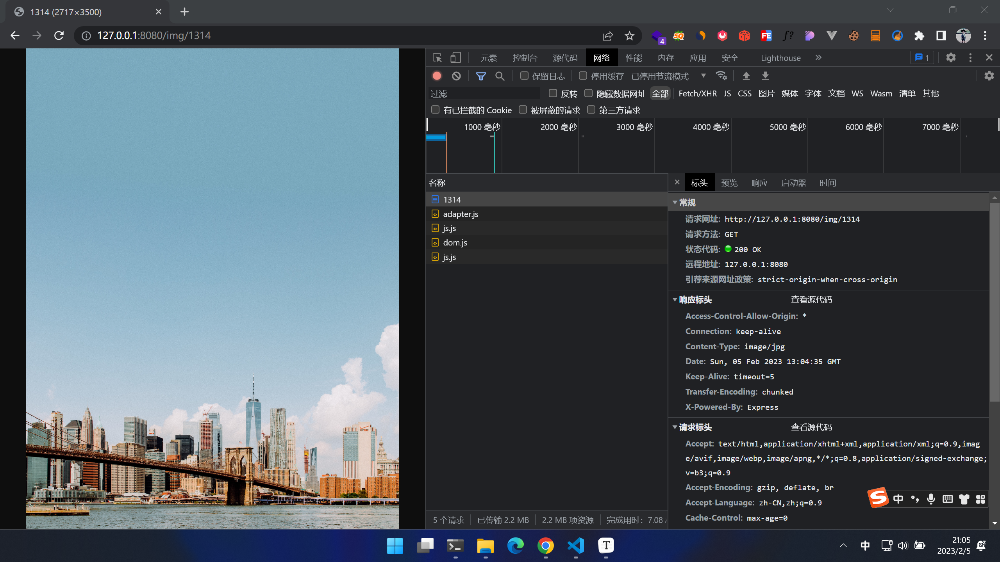
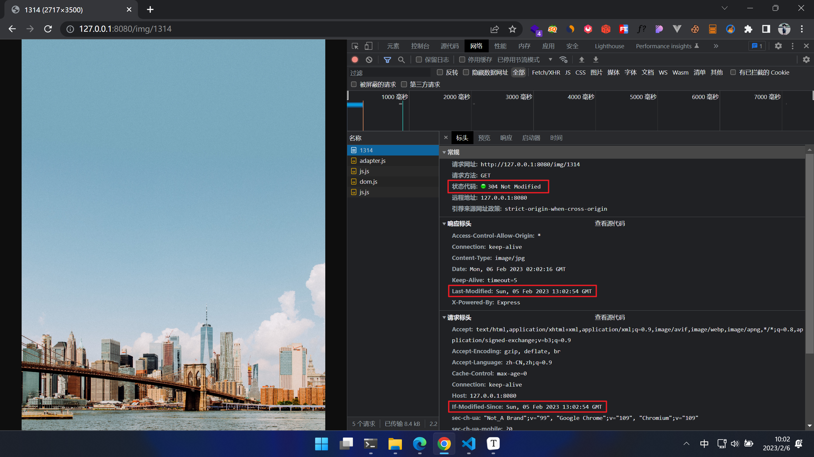
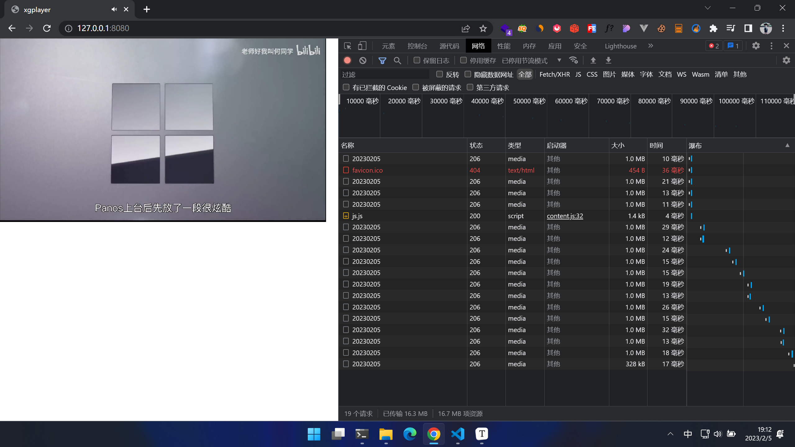

# 【图像与媒体】

> 原创内容，转载请注明出处！

许多情况下，图片、音频、视频都是一个网站中常见的组成部分，尤其是图片！而本文就在 Node.js Express 的环境下，讲解一下如何处理图像与媒体的上传和响应。

## 一、图片

一般情况下，网站上的图片分为三种：

- 小图标
- 普通图片

【小图标】

例如：网页图标、用户头像……

方案：

- 网页图标：一般由前端自行解决！常见的方式例如：图标字体、精灵图、SVG……
- 用户头像：一般由前端进行裁剪（形状 + 大小），再将裁剪好的图片编码为 base64 格式字符串，然后发送给后端，后端直接存入数据库，当前端请求头像时，后端直接响应 base64 格式字符串，前端拿到后解码为图片格式（注意：这种方式仅限于头像展示区较小，一般不能高于 100KB，否则 base64 字符串会过长，不利于网络发送，以及数据库存储）

【普通图片】

例如：网站首页图、网站广告图、文章封面图、商品效果图、一般的社交分享图、一般的内容图……

方案 1：

前端以 `multipart/form-data` 格式上传图片文件，后端 Express 借助 `multer` 中间件来将图片文件转存到后端指定的静态资源文件夹中，同时将图片文件的存放路径及文件名存入数据库，当前端请求图片时，后端直接返回图片文件路径及文件名，前端拿到后拼接上服务器的 IP 即可获取图片（注意：这种方式的前提是需要将图片所在文件夹挂载为静态资源目录）

> 此种方式，Express.static 默认会采用 “协商缓存”，浏览器在请求服务器资源时，服务器在响应资源的响应头中会设置 Last-Modified，浏览器在下次请求同一资源时，会自动在请求头中包含 If-Modified-Since，这个时间就是缓存文件的 Last-Modified，服务端会自动判断这个时间和当前请求的文件的修改时间就可以确定是返回 304 还是 200，如果文件已经被更新了，服务器就会响应新的文件资源并返回 200，如果文件没被更新，那么会返回 304，浏览器便会直接使用缓存中的文件。其次，除了 Last-Modified 的方式外，Express.static 它同时还使用了 Etag 的方式，两种方式双重验证……
>
> > 聊到这里，那就顺便讲一讲浏览器缓存机制（重点）
> >
> > 通常浏览器缓存有两种：
> >
> > 一、强缓存
> >
> > 强缓存是设置过期时间，超过设置的时间才会发请求，否则就会直接走缓存，连请求也不会发。
> >
> > 状态码是 200。
> >
> > 强缓存要慎用！除非你确定资源在你所设定的缓存期限内，一定不会变化！
> >
> > 二、协商缓存（对比缓存）
> >
> > 协商缓存常用模式有两种，一种是 `Last-Modified`，一种是 `Etag`。
> >
> > Last-Modified 就是资源的修改时间。如果客户端来请求服务器一个文件，服务器便会给响应头加上 Last-Modified 返回给客户端，客户端下次请求同一个文件时，会自动带上 If-Modified-Since（内容就是 Last-Modified 记录的时间内容），服务器收到后会对比这个时间跟服务端目前的资源的修改时间是否一样，如果一样说明没改，响应 304 ，浏览器会从缓存里拿文件，如果不一样说明改了，发送全新的文件并响应 200 给浏览器。
> >
> > Etag 是根据内容来判断文件修改没有。可以发现上面修改时间有几个明显弊端：如果资源是 CDN 给的，用户第一次拿某个 CDN 的文件，第二次拿另一个 CDN 的文件，实际上文件内容没变，但却拿了两次，就浪费流量了。另外如果一个文件高速修改，比如 1 秒钟修改了好几次，实际最后记录的修改时间跟客户端拿的修改时间一样，客户端也会认为文件没改，实际文件已经改了。而 Etag 就是解决此类问题的！
> >
> > 总结下 Last-Modified 就是看文件修改时间，Etag 就是看摘要算法，所以 Etag 要更耗性能，但也更安全！
> >
> > 状态码是 304（未过期，取缓存） 或 200（过期，重发）
> >
> > 三、设置
> >
> > 【强缓存】
> >
> > 强缓存设置靠请求头的 Cache-Control 或 Expires，Expires 是老的方案，现在越来越多浏览器支持 Cache-Control 了，也可以全都设上。
> >
> > 当既有 Cache-Control 又有 Expires 时，Cache-Control 优先级更高！
> >
> > Cache-Control 设置的是个相对于现在的时间，单位是秒，Expires 设置的是 GMT 时间，所以 Cache-Control 要更合理，因为一旦客户端主机上的时间是错误的情况下，使用 Expires 的 GMT 时间可能就会发生意想不到的错误！而 Cache-Control 是基于客户端主机的相对时间，就不会发生问题。
> >
> > 以设置 10 秒为例：
> >
> > ```js
> > res.setHeader('Expires', new Date(Date.now() + 10 * 1000).toGMTString());
> > res.setHeader('Cache-Control', 'max-age=10');
> > ```
> >
> > 另外 Cache-Control 设置 `no-cache` 就不会强缓存，设置 `no-store` 就不会缓存。
> >
> > 【协商缓存】
> >
> > 先看 Last-Modified 设置：
> >
> > 服务端设置 Last-Modified 后，浏览器请求同一个资源会带 If-Modified-Since 的请求头，所以服务端还要获取这个请求头的时间进行对比，相等返回 304 提前关闭请求即可，浏览器会自己去缓存里拿。
> >
> > ```js
> > // fs.stat 获取文件信息
> > let statObj = fs.statSync(文件路径);
> > // 获取文件修改时间
> > let ctime = statObj.ctime.toGMTString();
> > // 设置 Last-Modified 响应头
> > res.setHeader('Last-Modified', ctime);
> > // 获取 If-Modified-Since 请求头（注意，此时要全部小写！）
> > let ifModifiedSince = req.headers['if-modified-since'];
> > if(ifModifiedSince === ctime) {
> >     res.statusCode = 304;
> >     return res.end();
> > }
> > // 内容已经变化，返回 200 并响应内容...
> > ```
> >
> > 看一下 Etag 设置：
> >
> > Etag 要稍微复杂点，主要看摘要算法，一般的摘要算法是用 md5，由于 md5 存在暴力破解，所以也可以采用 sha1 或 sha256 等加盐算法，其中盐值就是相当于自己的一个密码本，要暴力破解必须知道盐值才行。
> >
> > 这些算法在 Node.js 自带的 crypto 里都有。
> >
> > ```js
> > // 读取文件内容
> > let content = fs.readFileSync(文件路径, 'utf8');
> > // 对内容进行加密并获得加密结果的哈希字符串
> > let hash = crypto.createHash('md5').update(content).digest('base64');
> > // 设置 Etag 响应头
> > res.setHeader('Etag', hash);
> > // 获取 If-None-Match 请求头（注意，此时要全部小写！）
> > let ifNoneMatch = req.headers['if-none-match'];
> > if(ifNoneMatch === hash) {
> >     res.statusCode = 304;
> >     return res.end();
> > }
> > // 内容已经变化，返回 200 并响应内容...
> > ```

方案 2：

直接读取文件流并通过管道转到响应流中……

```js
const express = require('express');
const cors = require('cors');
const fs = require('fs');

const app = express();

app.use(cors());

// 获取图片路由
app.get('/img/:id', (req, res) => {
    // 获取图片 id（在这里也就是图片文件名）
    const imgId = req.params.id;
    // 获取服务运行路径（ Node.js 进程的当前工作目录）
    const processPath = process.cwd();
    // 得到目标图片文件的路径（视频在根路径下的 resources 目录内，1314.jpg）
    const imgPath = `${processPath}/resources/${imgId}.jpg`;
    // 设置响应头
    const headers = {
        'Content-Type': 'image/jpg'
    };
    res.writeHead(200, headers);
    // 以流的形式读取图片文件
    const videoStream = fs.createReadStream(imgPath);
    // 用管道将读取的图片流转到响应流（req res 本身就是一个流对象）
    videoStream.pipe(res);
});

app.listen(8080, () => {
    console.log('http://127.0.0.1:8080');
});
```



但是注意，此种方式默认是没有任何缓存机制的！浏览器重复请求同一图片，都会原模原样的再走一次请求流程，服务器也原模原样再响应一次，严重浪费资源！

所以，我们改进一下（这里我们用 Last-Modified 的协商缓存方式）

```js
const express = require('express');
const cors = require('cors');
const fs = require('fs');

const app = express();

app.use(cors());

// 获取图片路由
app.get('/img/:id', (req, res) => {
    // 获取图片 id（在这里也就是图片文件名）
    const imgId = req.params.id;
    // 获取服务运行路径（ Node.js 进程的当前工作目录）
    const processPath = process.cwd();
    // 得到目标图片文件的路径（视频在根路径下的 resources 目录内，1314.jpg）
    const imgPath = `${processPath}/resources/${imgId}.jpg`;
    // fs.stat 获取图片文件信息
    let statObj = fs.statSync(imgPath);
    // 获取文件修改时间
    let ctime = statObj.ctime.toGMTString();
    // 设置响应头
    res.setHeader('Content-Type', 'image/jpg');
    res.setHeader('Last-Modified', ctime);
    // 获取 If-Modified-Since 请求头（注意，此时要全部小写！）
    let ifModifiedSince = req.headers['if-modified-since'];
    if (ifModifiedSince === ctime) {
        res.statusCode = 304;
        return res.end();
    }
    res.statusCode = 200;
    // 以流的形式读取图片文件
    const videoStream = fs.createReadStream(imgPath);
    // 用管道将读取的图片流转到响应流（req res 本身就是一个流对象）
    videoStream.pipe(res);
});

app.listen(8080, () => {
    console.log('http://127.0.0.1:8080');
});
```

我们再次请求同一图片：



## 二、视频

一般情况下，网站上的视频分为两种：

- 小视频（网页装饰小视频、体积较小（<10MB）的短视频、不带任何控件的广告视频或轮播视频……）
- 长视频（教学视频、影视视频……）

【小视频】

推荐直接利用静态资源挂载的方式！并且浏览器端可以直接使用原生的 `<video>` 标签来展示视频。

【长视频】

- 情况一

如果视频的形式比较单一，同时也不用考虑视频资源的安全性问题，也不会涉及视频的转码压缩等，并且播放视频的地方不是太多，那么也可以使用静态资源挂载的方式！

但是有个特别的注意点！客户端请不要再使用原生的播放控件！（例如：浏览器 HTML5 的 `<video>`），原因是对于这类长视频来说，一般视频的文件大小及时长都比较大，而且用户很可能会反复的前后拖动进度条，如果使用原生的播放控件（例如：`<video>`）那么该控件很大概率上是没有对请求的视频流进行针对性的处理的！可能会造成网络资源的极大浪费！比如：同样的一个视频请求接口，用原生控件请求视频流并播放，那么平均下来如果需要 100MB 的网络请求消耗，而改用专业的播放控件来请求视频流并播放，可能平均只需要 30MB 的网络请求消耗！这是因为，用户播放这种长视频时可以会经常性反复拖动进度条，而专业的播放器会合理的处理这种 “非线性” 的视频流请求过程，并能缓存已经播放过的视频部分，极大程度上节省带宽！同时，对于长视频而言，一般还会有许多额外的功能需求（不仅仅是播放，还会掺杂诸如：清晰度切换、播放速度切换、视频旋转、进度条特殊标记、弹幕、外挂字幕、画中画等）用原生播放控件实现起来较为复杂，而且每个平台的原生播放控件的接口规格也不一样，要跨平台就更复杂了！

总之：请记得，长视频不要使用原生控件！这里推荐一款开源的跨平台高性能多功能视频播放控件：[西瓜播放器 (bytedance.com)](https://v2.h5player.bytedance.com/)

- 情况二

如果需要对视频进行处理，如：转码、压缩、剪辑等（一般是视频网站）那么通常会单独用一台或多台高性能服务器来专门处理这些需求，并且这些服务器需要较高的 GPU 性能，一般会基于 [FFmpeg](https://ffmpeg.org/) 这个开源的视频流处理工具来开发相应的功能！但是如果你是小型的企业，或者你没有精通流媒体技术的团队，那么自己开发的代价可能会非常高（当然如果只是简单的压缩视频和转换视频格式，那么还是可以应付得过来的），所以没有流媒体技术储备的小企业推荐把视频业务直接 “上云”，例如选择阿里云的 “视频点播” 等云服务，按需缴费即可！当然，对于大型的视频企业而言，自己开发更省钱，而且更能实现特定的业务需求。

其次，对于专门的视频网站而言（或者是涉及视频比较多的非视频网站）是绝对不可能用静态资源挂载的方式来响应视频的！而是直接通过 “流” 的形式读取视频文件并以 Range（范围请求/范围响应）的模式来根据客户端的需要一段一段地响应视频流……

同时，客户端更不可能用原生的播放控件，而是使用专业的播放控件！

这里以一个简单的例子来展示这种方式：

```js
// app.js
const express = require('express');
const cors = require('cors');
const fs = require('fs');

const app = express();

app.use(cors());

// 根路由
app.get('/', (req, res) => {
    // 响应一个 html 页面用作测试
    res.sendFile(__dirname + '/index.html');
});

// 视频流获取路由
app.get('/video/:id', (req, res) => {
    // 在请求头中，获取了 range（range 是当前在视频缓冲区中的部分）
    const range = req.headers.range;
   	// 如果 range 不存在，抛出一个错误
    if (!range) {
        res.status(400).send('无效的Range!');
    }
    // 获取视频 id（在这里也是视频文件名）
    const videoId = req.params.id;
    // 获取服务运行路径（ Node.js 进程的当前工作目录）
    const processPath = process.cwd(); 
    // 得到目标视频文件的路径（视频在根路径下的 resources 目录内，20230205.mp4）
    const videoPath = `${processPath}/resources/${videoId}.mp4`;
    // 以同步的方式获取目标视频文件的大小
    const videoSize = fs.statSync(videoPath).size;
    // 设置要随每个并发请求发送的块大小
    const chunkSize = 10 ** 6; // 1MB
    // 发送视频的起点（从请求头的 range 中获得）
    const start = Number(range.replace(/\D/g, ''));
    // 发送视频的终点（start + chunk 或 视频大小长度 之间的最小值，避免超出）
    const end = Math.min(start + chunkSize, videoSize - 1);
    // 确定实际发送的内容长度（终点 - 起点 + 1）
    const contentLength = end - start + 1;
    // 设置响应头
    const headers = {
        'Content-Range': `bytes ${start}-${end}/${videoSize}`,
        'Accept-Ranges': 'bytes',
        'Content-Length': contentLength,
        'Content-Type': 'video/mp4'
    };
    // 设置响应头
    // HTTP 206 Partial Content 成功状态响应代码表示请求已成功，并且主体包含所请求的数据区间，该数据区间是在请求的 Range 首部指定的。
    res.writeHead(206, headers);
    // 以流的形式读取视频文件（包括 start 和 end 值，以从文件中读取一定范围的字节，而不是整个文件）
    const videoStream = fs.createReadStream(videoPath, { start, end });
    // 用管道将读取的视频流转到响应流（req res 本身就是一个流对象）
    videoStream.pipe(res);
});

app.listen(8080, () => {
    console.log('http://127.0.0.1:8080');
});
```

```html
<!-- index.html（HTML 测试页面）-->
<!DOCTYPE html>
<html>
    <head>
        <meta charset="utf-8" />
        <meta name="viewport" content="width=device-width,initial-scale=1,maximum-scale=1,minimum-scale=1,user-scalable=no,minimal-ui" />
        <meta name="referrer" content="no-referrer" />
        <title>xgplayer</title>
        <style type="text/css">
            html,
            body {
                width: 100%;
                height: 100%;
                margin: auto;
                overflow: hidden;
            }
        </style>
    </head>
    <body>
        <div id="mse"></div>
        <!-- 采用西瓜视频播放器 -->
        <script src="http://unpkg.byted-static.com/xgplayer/2.31.6/browser/index.js" charset="utf-8"></script>
        <script>
            let player = new Player({
                id: 'mse',
                url: 'http://127.0.0.1:8080/video/20230205',
                playsinline: true,
                whitelist: ['']
            });
        </script>
    </body>
</html>
```



> 说明：以上案例只是处理视频流的一个最基本的实现过程，实际项目中要考虑更多的情况和功能，要复杂得多，例如视频流的缓存就没之前图片处理那么简单了，再例如为了减少客户端用户前后连续拖动进度条所带来的网络请求压力，通常在会把视频裁剪成几百帧低分辨率的进度预览图，用户拖动进度条时响应的是预览图，而不是视频流，并且预览图还可以做缓存，只有当用户拖动到某个点松开拖动控件时，才会真正去请求视频流，B站就是这么处理的，当然许多网站更粗暴，直接禁止客户端用户拖动进度条，只允许点击进度条某个时间点进行跳转……
>
> 

> 注意：此时很多人可能会想，为什么要用 Range（范围请求/范围响应）的模式呢？直接读取视频文件流然后直接通过管道转到响应流不就可以了吗？
>
> 看似可以，实际上根本不可以！！！
>
> 因为这样的话，整个视频流都属于一个响应，客户端会一直加载这个流然后播放视频，这就导致视频一旦开始播放（开始请求并响应视频流），那么视频就无法快进也无法后退！（你最多能刷新页面重新播放^^）
>
> 当然，这种方式用在图片和文件的响应上倒是可以的！

## 三、音频

处理思路与视频一致！

## 四、其他文件

处理思路与普通图片一致！