## SpringMVC_day01

>* 理解 SpringMVC 相关概念
>* 完成 SpringMVC 的入门案例
>* 学会使用 PostMan 工具发送请求和数据
>* 掌握 SpringMVC 如何接收请求、数据和响应结果
>* 掌握 RESTful 风格及其使用
>* 完成基于 RESTful 的案例编写

SpringMVC 是隶属于 Spring 框架的一部分，主要是用来进行 Web 开发，是对 Servlet 进行了封装。

对于 SpringMVC 我们主要学习如下内容：

* SpringMVC 简介
* ==请求与响应==
* ==REST 风格==
* ==SSM 整合（注解版）==
* 拦截器

SpringMVC 是处于 Web 层的框架，所以其主要的作用就是用来接收前端发过来的请求和数据然后经过处理并将处理的结果响应给前端，所以如何处理请求和响应是 SpringMVC 中非常重要的一块内容。

REST 是一种软件架构风格，可以降低开发的复杂性，提高系统的可伸缩性，后期的应用也是非常广泛。

SSM 整合是把咱们所学习的 SpringMVC+Spring+Mybatis 整合在一起来完成业务开发，是对我们所学习这三个框架的一个综合应用。

对于 SpringMVC 的学习，最终要达成的目标：

1. ==掌握基于 SpringMVC 获取请求参数和响应 json 数据操作==
2. ==熟练应用基于 REST 风格的请求路径设置与参数传递==
3. ==能够根据实际业务建立前后端开发通信协议并进行实现==
4. ==基于 SSM 整合技术开发任意业务模块功能==

## 1、SpringMVC概述

学习 SpringMVC 我们先来回顾下现在 web 程序是如何做的，咱们现在 web 程序大都基于三层架构来实现。

【三层架构】

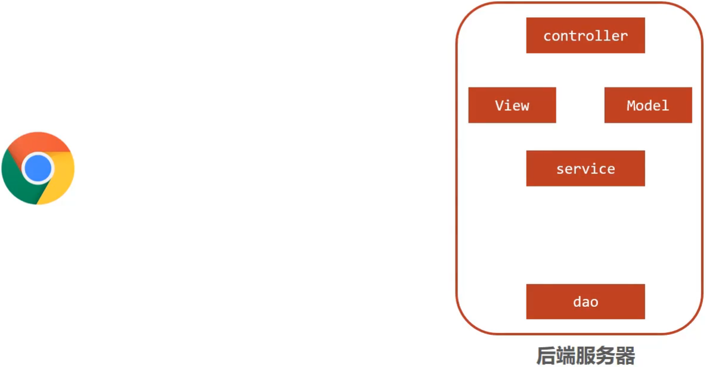

* 浏览器发送一个请求给后端服务器，后端服务器现在是使用 Servlet 来接收请求和数据

* 如果所有的处理都交给 Servlet 来处理的话，所有的东西都耦合在一起，对后期的维护和扩展极为不利

* 将后端服务器 Servlet 拆分成三层，分别是`web`、`service`和`dao（mapper）`
  * web 层主要由 servlet 来处理，负责页面请求和数据的收集以及响应结果给前端
  * service 层主要负责业务逻辑的处理
  * dao 层主要负责数据的增删改查操作
* servlet 处理请求和数据的时候，存在的问题是一个 servlet 只能处理一个请求
* Spring MVC 针对 web 层进行了优化，采用了 MVC 设计模式，将其设计为`controller`、`view`和`Model`
  * controller 负责请求和数据的接收，接收后将其转发给 service 进行业务处理
  * service 根据需要会调用 dao 对数据进行增删改查
  * dao 把数据处理完后将结果交给 service，service 再交给 controller
  * controller 根据需求组装成 Model 和 View，Model 和 View 组合起来生成页面转发给前端浏览器
  * 这样做的好处就是 controller 可以处理多个请求，并对请求进行分发，执行不同的业务操作

随着互联网的发展，上面的模式因为是同步调用，性能慢慢的跟不是需求，所以异步调用慢慢的走到了前端，”前后端分离“是现在比较流行的一种处理方式。

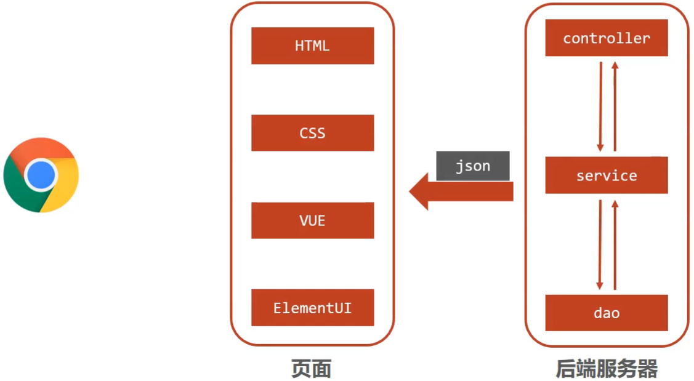


* 因为是异步调用，所以后端不需要返回 view 视图，将其去除
* 前端如果通过异步调用的方式进行交互，后台就需要将返回的数据转换成 json 格式进行返回
* SpringMVC==主要==负责的就是
  * controller 如何接收请求和数据
  * 如何将请求和数据转发给业务层
  * 如何将响应数据转换成 json 发回到前端

介绍了这么多，对 SpringMVC 进行一个定义

* SpringMVC 是一种基于 Java 实现 MVC 模型的轻量级 Web 框架

* 优点

  * 使用简单、开发便捷（相比于 Servlet）
  * 灵活性强

  这里所说的优点，就需要我们在使用的过程中慢慢体会。

## 2、SpringMVC入门案例

因为 SpringMVC 是一个 Web 框架，将来是要替换 Servlet，所以先来回顾下以前 Servlet 是如何进行开发的？

1. 创建 web 工程（Maven 结构）

2. 设置 tomcat 服务器，加载 web 工程（tomcat 插件）

3. 导入坐标（Servlet）

4. 定义处理请求的功能类（UserServlet）

5. 设置请求映射（配置映射关系）

SpringMVC 的制作过程和上述流程几乎是一致的，具体的实现流程是什么？

1. 创建 web 工程（Maven 结构）

2. 设置 tomcat 服务器，加载 web 工程（tomcat 插件）

3. 导入坐标（==SpringMVC== + Servlet）

4. 定义处理请求的功能类（==UserController==）

5. ==设置请求映射（配置映射关系）==

6. ==将 SpringMVC 设定加载到 Tomcat 容器中==

### 2.1 需求分析

### 2.2 案例制作

#### 步骤1：创建Maven项目

打开 IDEA，创建一个新的 web 项目


#### 步骤2：补全目录结构

因为使用骨架创建的项目结构不完整，需要手动补全

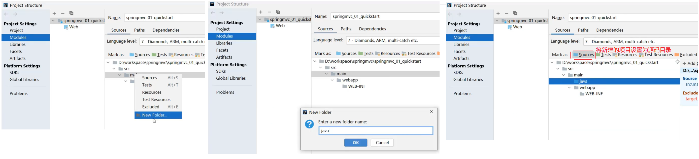

#### 步骤3：导入jar包

将 pom.xml 中多余的内容删除掉，再添加 SpringMVC 需要的依赖

```java
<?xml version="1.0" encoding="UTF-8"?>
<project xmlns="http://maven.apache.org/POM/4.0.0" xmlns:xsi="http://www.w3.org/2001/XMLSchema-instance"
  xsi:schemaLocation="http://maven.apache.org/POM/4.0.0 http://maven.apache.org/xsd/maven-4.0.0.xsd">
  <modelVersion>4.0.0</modelVersion>
  <groupId>com.itheima</groupId>
  <artifactId>springmvc_01_quickstart</artifactId>
  <version>1.0-SNAPSHOT</version>
  <packaging>war</packaging>

  <dependencies>
    <dependency>
      <groupId>javax.servlet</groupId>
      <artifactId>javax.servlet-api</artifactId>
      <version>3.1.0</version>
      <scope>provided</scope>
    </dependency>
    <dependency>
      <groupId>org.springframework</groupId>
      <artifactId>spring-webmvc</artifactId>
      <version>5.2.10.RELEASE</version>
    </dependency>
  </dependencies>

  <build>
    <plugins>
      <plugin>
        <groupId>org.apache.tomcat.maven</groupId>
        <artifactId>tomcat7-maven-plugin</artifactId>
        <version>2.1</version>
        <configuration>
          <port>80</port>
          <path>/</path>
        </configuration>
      </plugin>
    </plugins>
  </build>
</project>

```

**说明：**servlet 的坐标为什么需要添加`<scope>provided</scope>`?

* scope 是 maven 中 jar 包依赖作用范围的描述，
* 如果不设置默认是`compile`在在编译、运行、测试时均有效
* 如果运行有效的话就会和 tomcat 中的 servlet-api 包发生冲突，导致启动报错

* provided 代表的是该包只在编译和测试的时候用，运行的时候无效直接使用 tomcat 中的，就避免冲突

#### 步骤4：创建配置类

```java
@Configuration
@ComponentScan("com.itheima.controller")
public class SpringMvcConfig {
}
```

#### 步骤5：创建Controller类

```java
@Controller
public class UserController {
    @RequestMapping("/save")
    public void save() {
        System.out.println("user save ...");
    }
}

```

#### 步骤6：使用配置类替换web.xml

将 web.xml 删除，换成 ServletContainersInitConfig

```java
public class ServletContainersInitConfig extends AbstractDispatcherServletInitializer {
    // 加载 springmvc 配置类
    protected WebApplicationContext createServletApplicationContext() {
        // 初始化 WebApplicationContext 对象
        AnnotationConfigWebApplicationContext ctx = new AnnotationConfigWebApplicationContext();
        // 加载指定配置类
        ctx.register(SpringMvcConfig.class);
        return ctx;
    }

    // 设置由 springmvc 控制器处理的请求映射路径
    protected String[] getServletMappings() {
        return new String[]{"/"};
    }

    // 加载 spring 配置类
    protected WebApplicationContext createRootApplicationContext() {
        return null;
    }
}
```

#### 步骤7：配置Tomcat环境

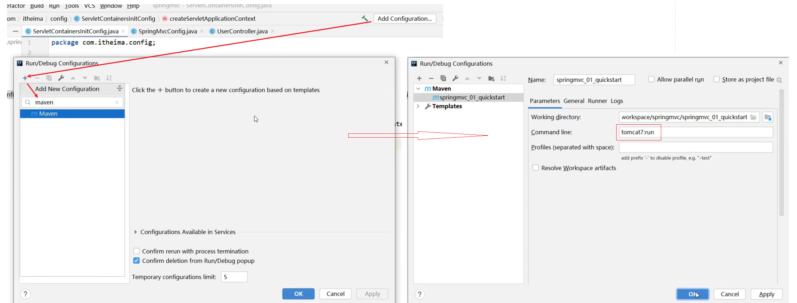

#### 步骤8：启动运行项目

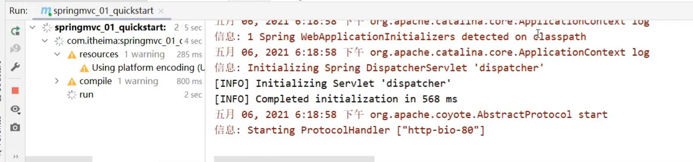

#### 步骤9：浏览器访问

浏览器输入`http://localhost/save`进行访问，会报如下错误：

#### 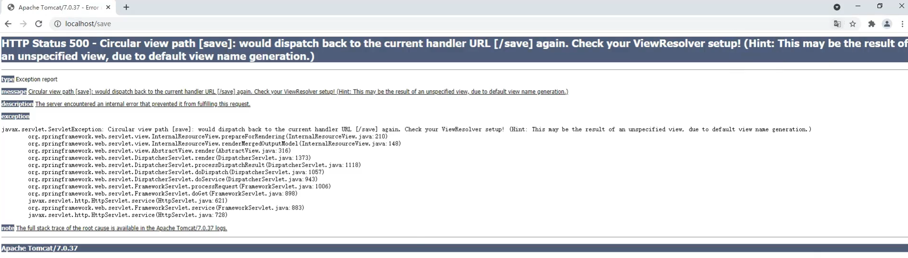

页面报错的原因是后台没有指定返回的页面，目前只需要关注控制台看`user save ...`有没有被执行即可。

#### 步骤10：修改Controller返回值解决上述问题

前面我们说过现在主要的是前端发送异步请求，后台响应 json 数据，所以接下来我们把 Controller 类的 save 方法进行修改

```java
@Controller
public class UserController {
    @RequestMapping("/save")
    public String save() {
        System.out.println("user save ...");
        return "{'info':'springmvc'}";
    }
}

```

再次重启 tomcat 服务器，然后重新通过浏览器测试访问,会发现还是会报错，这次的错是 404

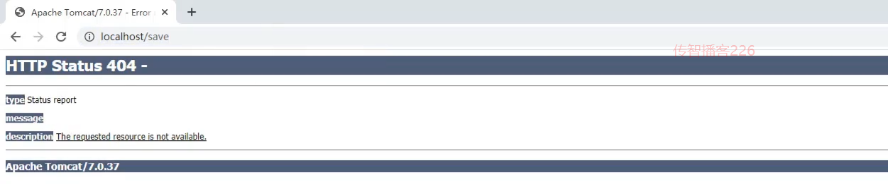

出错的原因是，如果方法直接返回字符串，springmvc 会把字符串当成页面的名称在项目中进行查找返回，因为不存在对应返回值名称的页面，所以会报 404 错误，找不到资源。

而我们其实是想要直接返回的是 json 数据，具体如何修改呢？

#### 步骤11：设置返回数据为json

```java
@Controller
public class UserController {
    @RequestMapping("/save")
    @ResponseBody
    public String save() {
        System.out.println("user save ...");
        return "{'info':'springmvc'}";
    }
}

```

再次重启 tomcat 服务器，然后重新通过浏览器测试访问，就能看到返回的结果数据：

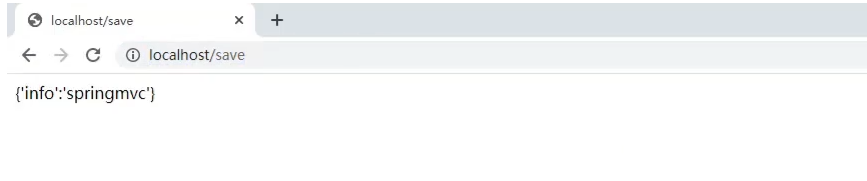

至此 SpringMVC 的入门案例就已经完成。

**注意事项**

* SpringMVC 是基于 Spring 的，在 pom.xml 只导入了`spring-webmvc`jar 包的原因是它会自动依赖 spring 相关坐标
* AbstractDispatcherServletInitializer 类是 SpringMVC 提供的快速初始化 Web3.0 容器的抽象类
* AbstractDispatcherServletInitializer 提供了三个接口方法供用户实现
  * createServletApplicationContext 方法，创建 Servlet 容器时，加载 SpringMVC 对应的 bean 并放入 WebApplicationContext 对象范围中，而 WebApplicationContext 的作用范围为 ServletContext 范围，即整个 web 容器范围
  * getServletMappings 方法，设定 SpringMVC 对应的请求映射路径，即 SpringMVC 拦截哪些请求
  * createRootApplicationContext 方法，如果创建 Servlet 容器时需要加载非 SpringMVC 对应的 bean，使用当前方法进行，使用方式和 createServletApplicationContext 相同。
  * createServletApplicationContext 用来加载 SpringMVC 环境
  * createRootApplicationContext 用来加载 Spring 环境

### 知识点1：@Controller

| 名称 | @Controller                      |
| ---- | -------------------------------- |
| 类型 | 类注解                           |
| 位置 | SpringMVC 控制器类定义上方       |
| 作用 | 设定 SpringMVC 的核心控制器 bean |

### 知识点2：@RequestMapping

| 名称     | @RequestMapping                  |
| -------- | -------------------------------- |
| 类型     | 类注解或方法注解                 |
| 位置     | SpringMVC 控制器类或方法定义上方 |
| 作用     | 设置当前控制器方法请求访问路径   |
| 相关属性 | value（默认），请求访问路径      |

### 知识点3：@ResponseBody

| 名称 | @ResponseBody                                    |
| ---- | ------------------------------------------------ |
| 类型 | 类注解或方法注解                                 |
| 位置 | SpringMVC 控制器类或方法定义上方                 |
| 作用 | 设置当前控制器方法响应内容为当前返回值，无需解析 |

### 2.3 入门案例总结

- 一次性工作
  - 创建工程，设置服务器，加载工程
  - 导入坐标
  - 创建 web 容器启动类，加载 SpringMVC 配置，并设置 SpringMVC 请求拦截路径
  - SpringMVC 核心配置类（设置配置类，扫描 controller 包，加载 Controller 控制器 bean）
- 多次工作
  - 定义处理请求的控制器类
  - 定义处理请求的控制器方法，并配置映射路径（@RequestMapping）与返回 json 数据（@ResponseBody）

### 2.4 工作流程解析

为了更好的使用 SpringMVC，我们将 SpringMVC 的使用过程总共分两个阶段来分析，分别是`启动服务器初始化过程`和`单次请求过程`

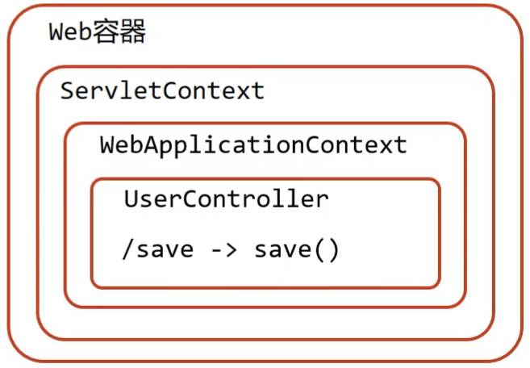

#### 2.4.1 启动服务器初始化过程

1. 服务器启动，执行 ServletContainersInitConfig 类，初始化 web 容器

   * 功能类似于以前的 web.xml

2. 执行 createServletApplicationContext 方法，创建了 WebApplicationContext 对象

   * 该方法加载 SpringMVC 的配置类 SpringMvcConfig 来初始化 SpringMVC 的容器

3. 加载 SpringMvcConfig 配置类

   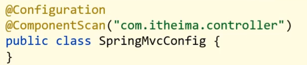

4. 执行 @ComponentScan 加载对应的 bean

   * 扫描指定包及其子包下所有类上的注解，如 Controller 类上的 @Controller 注解

5. 加载 UserController，每个 @RequestMapping 的名称对应一个具体的方法

   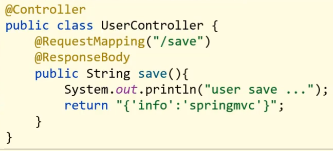

   * 此时就建立了 `/save` 和 save 方法的对应关系

6. 执行 getServletMappings 方法，设定 SpringMVC 拦截请求的路径规则

   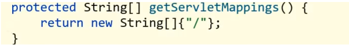

   * `/`代表所拦截请求的路径规则，只有被拦截后才能交给 SpringMVC 来处理请求


#### 2.4.2 单次请求过程

1. 发送请求`http://localhost/save`
2. web 容器发现该请求满足 SpringMVC 拦截规则，将请求交给 SpringMVC 处理
3. 解析请求路径 /save
4. 由 /save 匹配执行对应的方法 save(）
   * 上面的第五步已经将请求路径和方法建立了对应关系，通过 /save 就能找到对应的 save 方法
5. 执行 save()
6. 检测到有 @ResponseBody 直接将 save() 方法的返回值作为响应体返回给请求方

### 2.5 bean加载控制

#### 2.5.1 问题分析

入门案例的内容已经做完了，在入门案例中我们创建过一个`SpringMvcConfig`的配置类，再回想前面咱们学习 Spring 的时候也创建过一个配置类`SpringConfig`。这两个配置类都需要加载资源，那么它们分别都需要加载哪些内容？

我们先来看下目前我们的项目目录结构：

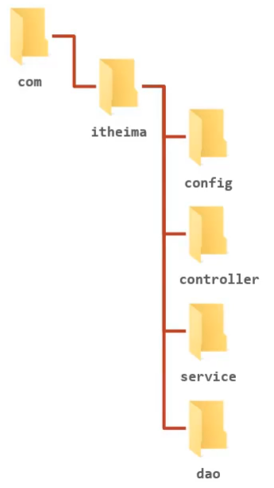

* config 目录存入的是配置类，写过的配置类有：

  * ServletContainersInitConfig
  * SpringConfig
  * SpringMvcConfig
  * JdbcConfig
  * MybatisConfig
* controller 目录存放的是 SpringMVC 的 controller 类
* service 目录存放的是 service 接口和实现类
* dao 目录存放的是 dao/Mapper 接口

controller、service 和 dao 这些类都需要被容器管理成 bean 对象，那么到底是该让 SpringMVC 加载还是让 Spring 加载呢？

* SpringMVC 加载其相关 bean（表现层 bean），也就是 controller 包下的类
* Spring 控制的 bean
  * 业务 bean（Service）
  * 功能 bean（DataSource、SqlSessionFactoryBean、MapperScannerConfigurer 等）

分析清楚谁该管哪些 bean 以后，接下来要解决的问题是如何让 Spring 和 SpringMVC 分开加载各自的内容。

在 SpringMVC 的配置类`SpringMvcConfig`中使用注解`@ComponentScan`，我们只需要将其扫描范围设置到 controller 即可，如：

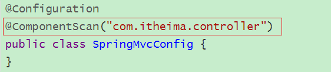

在 Spring 的配置类`SpringConfig`中使用注解`@ComponentScan`,当时扫描的范围中其实是已经包含了controller，如：

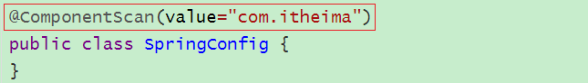

从包结构来看的话，Spring 已经多把 SpringMVC 的 controller 类也给扫描到，所以针对这个问题该如何解决，就是咱们接下来要学习的内容。

概括的描述下咱们现在的问题就是==因为功能不同，如何避免 Spring 错误加载到 SpringMVC 的 bean？==

#### 2.5.2 思路分析

针对上面的问题，解决方案也比较简单，就是：

* 加载 Spring 控制的 bean 的时候排除掉 SpringMVC 控制的 bean

具体该如何排除：

* 方式一：Spring 加载的 bean 设定扫描范围为精准范围，例如 service 包、dao 包等
* 方式二：Spring 加载的 bean 设定扫描范围为 com.itheima，排除掉 controller 包中的 bean
* 方式三：不区分 Spring 与 SpringMVC 的环境，加载到同一个环境中（了解即可）

#### 2.5.4 环境准备

- 创建一个 Web 的 Maven 项目

- pom.xml 添加 Spring 依赖

  ```xml
  <?xml version="1.0" encoding="UTF-8"?>
  
  <project xmlns="http://maven.apache.org/POM/4.0.0" xmlns:xsi="http://www.w3.org/2001/XMLSchema-instance"
    xsi:schemaLocation="http://maven.apache.org/POM/4.0.0 http://maven.apache.org/xsd/maven-4.0.0.xsd">
    <modelVersion>4.0.0</modelVersion>
  
    <groupId>com.itheima</groupId>
    <artifactId>springmvc_02_bean_load</artifactId>
    <version>1.0-SNAPSHOT</version>
    <packaging>war</packaging>
  
    <dependencies>
      <dependency>
        <groupId>javax.servlet</groupId>
        <artifactId>javax.servlet-api</artifactId>
        <version>3.1.0</version>
        <scope>provided</scope>
      </dependency>
      <dependency>
        <groupId>org.springframework</groupId>
        <artifactId>spring-webmvc</artifactId>
        <version>5.2.10.RELEASE</version>
      </dependency>
      <dependency>
        <groupId>com.alibaba</groupId>
        <artifactId>druid</artifactId>
        <version>1.1.16</version>
      </dependency>
  
      <dependency>
        <groupId>org.mybatis</groupId>
        <artifactId>mybatis</artifactId>
        <version>3.5.6</version>
      </dependency>
  
      <dependency>
        <groupId>mysql</groupId>
        <artifactId>mysql-connector-java</artifactId>
        <version>5.1.47</version>
      </dependency>
  
      <dependency>
        <groupId>org.springframework</groupId>
        <artifactId>spring-jdbc</artifactId>
        <version>5.2.10.RELEASE</version>
      </dependency>
  
      <dependency>
        <groupId>org.mybatis</groupId>
        <artifactId>mybatis-spring</artifactId>
        <version>1.3.0</version>
      </dependency>
    </dependencies>
  
    <build>
      <plugins>
        <plugin>
          <groupId>org.apache.tomcat.maven</groupId>
          <artifactId>tomcat7-maven-plugin</artifactId>
          <version>2.1</version>
          <configuration>
            <port>80</port>
            <path>/</path>
          </configuration>
        </plugin>
      </plugins>
    </build>
  </project>
  
  ```

- 创建对应的配置类

  ```java
  public class ServletContainersInitConfig extends AbstractDispatcherServletInitializer {
      protected WebApplicationContext createServletApplicationContext() {
          AnnotationConfigWebApplicationContext ctx = new AnnotationConfigWebApplicationContext();
          ctx.register(SpringMvcConfig.class);
          return ctx;
      }
      protected String[] getServletMappings() {
          return new String[]{"/"};
      }
      protected WebApplicationContext createRootApplicationContext() {
        return null;
      }
  }
  
  @Configuration
  @ComponentScan("com.itheima.controller")
  public class SpringMvcConfig {
  }
  
  @Configuration
  @ComponentScan("com.itheima")
  public class SpringConfig {
  }
  
  ```

- 编写 Controller，Service，Dao，Domain 类

  ```java
  @Controller
  public class UserController {
  
      @RequestMapping("/save")
      @ResponseBody
      public String save(){
          System.out.println("user save ...");
          return "{'info':'springmvc'}";
      }
  }
  
  public interface UserService {
      public void save(User user);
  }
  
  @Service
  public class UserServiceImpl implements UserService {
      public void save(User user) {
          System.out.println("user service ...");
      }
  }
  
  public interface UserDao {
      @Insert("insert into tbl_user(name,age)values(#{name},#{age})")
      public void save(User user);
  }
  public class User {
      private Integer id;
      private String name;
      private Integer age;
      //setter..getter..toString略
  }
  ```

最终创建好的项目结构如下：

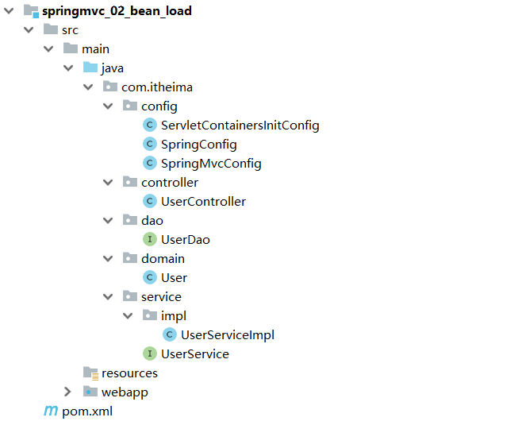

#### 2.5.5 设置bean加载控制

方式一：修改 Spring 配置类，设定扫描范围为精准范围。

```java
@Configuration
@ComponentScan({"com.itheima.service","comitheima.dao"})
public class SpringConfig {
}
```

**说明:**

上述只是通过例子说明可以精确指定让Spring扫描对应的包结构，真正在做开发的时候，因为Dao最终是交给`MapperScannerConfigurer`对象来进行扫描处理的，我们只需要将其扫描到 service 包即可。

方式二：修改 Spring 配置类，设定扫描范围为 com.itheima，排除掉 controller 包中的 bean

```java
@Configuration
@ComponentScan(value="com.itheima",
    excludeFilters=@ComponentScan.Filter(
    	type = FilterType.ANNOTATION,
        classes = Controller.class
    )
)
public class SpringConfig {
}
```

* excludeFilters 属性：设置扫描加载bean时，排除的过滤规则

* type属性：设置排除规则，当前使用按照bean定义时的注解类型进行排除

  * ANNOTATION：按照注解排除
  * ASSIGNABLE_TYPE：按照指定的类型过滤
  * ASPECTJ：按照 Aspectj 表达式排除，基本上不会用
  * REGEX：按照正则表达式排除
  * CUSTOM：按照自定义规则排除

  大家只需要知道第一种 ANNOTATION 即可

* classes属性：设置排除的具体注解类，当前设置排除 @Controller 定义的 bean

如何测试 controller 类已经被排除掉了？

```java
public class App {
	public static void main (String[] args){
        AnnotationConfigApplicationContext ctx = new AnnotationConfigApplicationContext(SpringConfig.class);
        System.out.println(ctx.getBean(UserController.class));
    }
}
```

如果被排除了，该方法执行就会报bean未被定义的错误

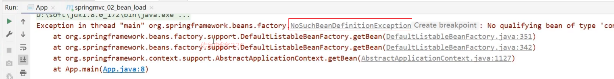

==注意:测试的时候，需要把 SpringMvcConfig 配置类上的 @ComponentScan 注解注释掉，否则不会报错==

出现问题的原因是：

* Spring 配置类扫描的包是`com.itheima`
* SpringMVC 的配置类，`SpringMvcConfig`上有一个 @Configuration 注解，也会被 Spring 扫描到
* SpringMvcConfig 上又有一个 @ComponentScan，把 controller 类又给扫描进来了
* 所以如果不把 @ComponentScan 注释掉，Spring 配置类将 Controller 排除，但是因为扫描到 SpringMVC 的配置类，又将其加载回来，演示的效果就出不来
* 解决方案，也简单，把 SpringMVC 的配置类移出 Spring 配置类的扫描范围即可。

最后一个问题，有了 Spring 的配置类，要想在 tomcat 服务器启动将其加载，我们需要修改 ServletContainersInitConfig

```java
public class ServletContainersInitConfig extends AbstractDispatcherServletInitializer {
    protected WebApplicationContext createServletApplicationContext() {
        AnnotationConfigWebApplicationContext ctx = new AnnotationConfigWebApplicationContext();
        ctx.register(SpringMvcConfig.class);
        return ctx;
    }
    protected String[] getServletMappings() {
        return new String[]{"/"};
    }
    protected WebApplicationContext createRootApplicationContext() {
      AnnotationConfigWebApplicationContext ctx = new AnnotationConfigWebApplicationContext();
        ctx.register(SpringConfig.class);
        return ctx;
    }
}
```

对于上述的配置方式，Spring 还提供了一种更简单的配置方式，可以不用再去创建`AnnotationConfigWebApplicationContext`对象，不用手动`register`对应的配置类，如何实现？

```java
public class ServletContainersInitConfig extends AbstractAnnotationConfigDispatcherServletInitializer {

    protected Class<?>[] getRootConfigClasses() {
        return new Class[]{SpringConfig.class};
    }

    protected Class<?>[] getServletConfigClasses() {
        return new Class[]{SpringMvcConfig.class};
    }

    protected String[] getServletMappings() {
        return new String[]{"/"};
    }
}
```

### 知识点1：@ComponentScan

| 名称     | @ComponentScan                                               |
| -------- | ------------------------------------------------------------ |
| 类型     | 类注解                                                       |
| 位置     | 类定义上方                                                   |
| 作用     | 设置 spring 配置类扫描路径，用于加载使用注解格式定义的 bean  |
| 相关属性 | excludeFilters：排除扫描路径中加载的 bean，需要指定类别（type）和具体项（classes）<br/>includeFilters：加载指定的 bean，需要指定类别（type）和具体项（classes） |

## 3、PostMan工具的使用

### 3.1 PostMan简介

代码编写完后，我们要想测试，只需要打开浏览器直接输入地址发送请求即可。发送的是`GET`请求可以直接使用浏览器，但是如果要发送的是`POST`请求呢?

如果要求发送的是post请求，我们就得准备页面在页面上准备form表单，测试起来比较麻烦。所以我们就需要借助一些第三方工具，如PostMan.

* PostMan是一款功能强大的网页调试与发送网页HTTP请求的Chrome插件。
* 作用：常用于进行接口测试

* 特征
  * 简单
  * 实用
  * 美观
  * 大方

### 3.2 PostMan安装

双击`资料\Postman-win64-8.3.1-Setup.exe`即可自动安装，

安装完成后，如果需要注册，可以按照提示进行注册，如果底部有跳过测试的链接也可以点击跳过注册


看到如下界面，就说明已经安装成功。

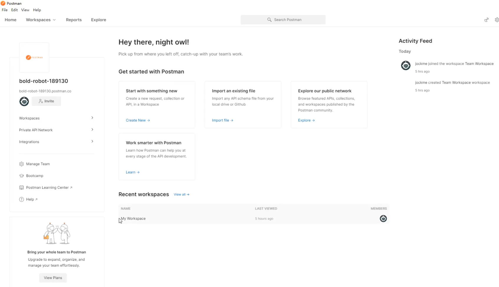

### 3.3 PostMan使用

#### 3.3.1 创建WorkSpace工作空间

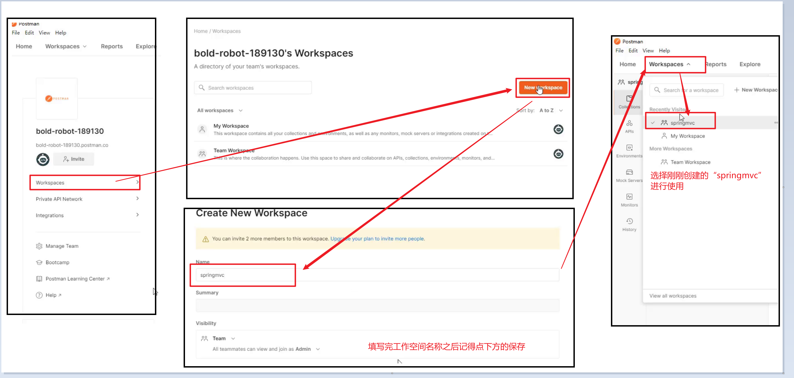

#### 3.3.2 发送请求

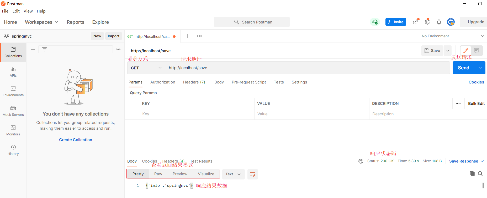

#### 3.3.3 保存当前请求

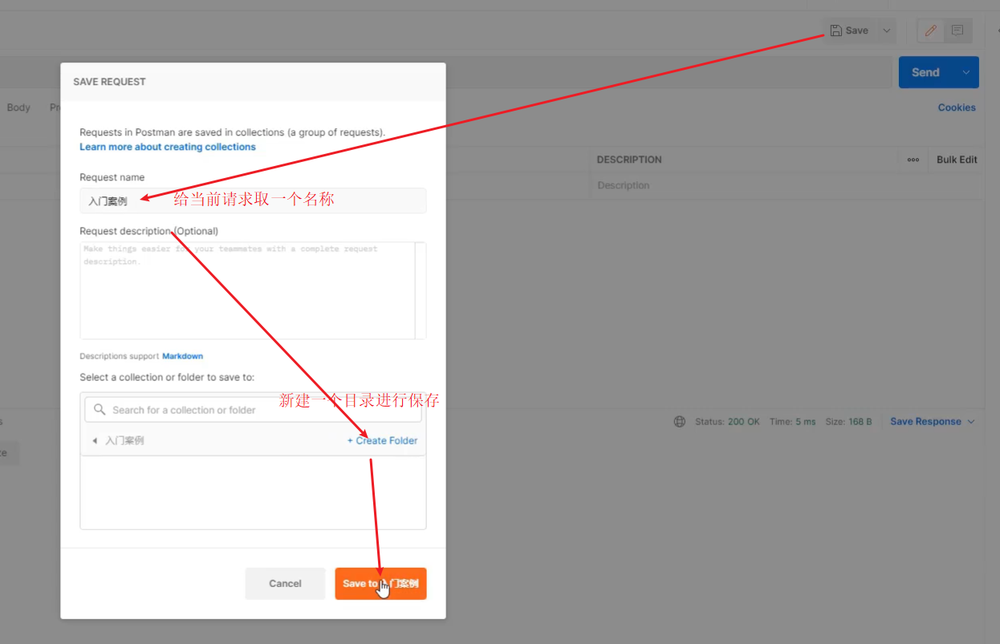

**注意：**第一次请求需要创建一个新的目录，后面就不需要创建新目录，直接保存到已经创建好的目录即可。

## 4、请求与响应

前面我们已经完成了入门案例相关的知识学习，接来了我们就需要针对 SpringMVC 相关的知识点进行系统的学习，之前我们提到过， SpringMVC 是 web 层的框架，主要的作用是接收请求、接收数据、响应结果，所以这一章节是学习 SpringMVC 的==重点==内容，我们主要会讲解四部分内容：

* 请求映射路径
* 请求参数
* 日期类型参数传递
* 响应 json 数据

### 4.1 设置请求映射路径

#### 4.1.1 环境准备

- 创建一个 Web 的 Maven 项目

- pom.xml 添加 Spring 依赖

  ```xml
  <?xml version="1.0" encoding="UTF-8"?>
  
  <project xmlns="http://maven.apache.org/POM/4.0.0" xmlns:xsi="http://www.w3.org/2001/XMLSchema-instance"
    xsi:schemaLocation="http://maven.apache.org/POM/4.0.0 http://maven.apache.org/xsd/maven-4.0.0.xsd">
    <modelVersion>4.0.0</modelVersion>
  
    <groupId>com.itheima</groupId>
    <artifactId>springmvc_03_request_mapping</artifactId>
    <version>1.0-SNAPSHOT</version>
    <packaging>war</packaging>
  
    <dependencies>
      <dependency>
        <groupId>javax.servlet</groupId>
        <artifactId>javax.servlet-api</artifactId>
        <version>3.1.0</version>
        <scope>provided</scope>
      </dependency>
      <dependency>
        <groupId>org.springframework</groupId>
        <artifactId>spring-webmvc</artifactId>
        <version>5.2.10.RELEASE</version>
      </dependency>
    </dependencies>
  
    <build>
      <plugins>
        <plugin>
          <groupId>org.apache.tomcat.maven</groupId>
          <artifactId>tomcat7-maven-plugin</artifactId>
          <version>2.1</version>
          <configuration>
            <port>80</port>
            <path>/</path>
          </configuration>
        </plugin>
      </plugins>
    </build>
  </project>
  
  ```

- 创建对应的配置类

  ```java
  public class ServletContainersInitConfig extends AbstractAnnotationConfigDispatcherServletInitializer {
  
      protected Class<?>[] getServletConfigClasses() {
          return new Class[]{SpringMvcConfig.class};
      }
      protected String[] getServletMappings() {
          return new String[]{"/"};
      }
      protected Class<?>[] getRootConfigClasses() {
          return new Class[0];
      }
  }
  
  @Configuration
  @ComponentScan("com.itheima.controller")
  public class SpringMvcConfig {
  }
  
  ```

- 编写 BookController 和 UserController

  ```java
  @Controller
  public class UserController {
      @RequestMapping("/save")
      @ResponseBody
      public String save(){
          System.out.println("user save ...");
          return "{'module':'user save'}";
      }
      
      @RequestMapping("/delete")
      @ResponseBody
      public String save(){
          System.out.println("user delete ...");
          return "{'module':'user delete'}";
      }
  }
  
  @Controller
  public class BookController {
  
      @RequestMapping("/save")
      @ResponseBody
      public String save(){
          System.out.println("book save ...");
          return "{'module':'book save'}";
      }
  }
  ```

最终创建好的项目结构如下:

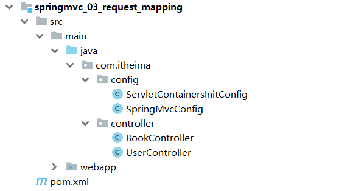

把环境准备好后，启动Tomcat服务器，后台会报错:

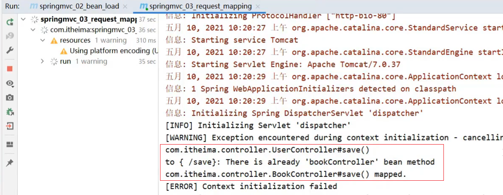

从错误信息可以看出：

* UserController 有一个 save 方法，访问路径为`http://localhost/save`
* BookController 也有一个 save 方法，访问路径为`http://localhost/save`
* 当访问`http://localhost/saved`的时候，到底是访问 UserController 还是 BookController？

#### 4.1.2 问题分析

团队多人开发，每人设置不同的请求路径，冲突问题该如何解决？

解决思路：为不同模块设置模块名作为请求路径前置

对于 Book 模块的 save，将其访问路径设置`http://localhost/book/save`

对于 User 模块的 save，将其访问路径设置`http://localhost/user/save`

这样在同一个模块中出现命名冲突的情况就比较少了。

#### 4.1.3 设置映射路径

##### 步骤1：修改Controller

```java
@Controller
public class UserController {

    @RequestMapping("/user/save")
    @ResponseBody
    public String save(){
        System.out.println("user save ...");
        return "{'module':'user save'}";
    }
    
    @RequestMapping("/user/delete")
    @ResponseBody
    public String save(){
        System.out.println("user delete ...");
        return "{'module':'user delete'}";
    }
}

@Controller
public class BookController {

    @RequestMapping("/book/save")
    @ResponseBody
    public String save(){
        System.out.println("book save ...");
        return "{'module':'book save'}";
    }
}
```

问题是解决了，但是每个方法前面都需要进行修改，写起来比较麻烦而且还有很多重复代码，如果 /user 后期发生变化，所有的方法都需要改，耦合度太高。

##### 步骤2：优化路径配置

优化方案：

```java
@Controller
@RequestMapping("/user")
public class UserController {

    @RequestMapping("/save")
    @ResponseBody
    public String save(){
        System.out.println("user save ...");
        return "{'module':'user save'}";
    }
    
    @RequestMapping("/delete")
    @ResponseBody
    public String save(){
        System.out.println("user delete ...");
        return "{'module':'user delete'}";
    }
}

@Controller
@RequestMapping("/book")
public class BookController {

    @RequestMapping("/save")
    @ResponseBody
    public String save(){
        System.out.println("book save ...");
        return "{'module':'book save'}";
    }
}
```

**注意:**

* 当类上和方法上都添加了`@RequestMapping`注解，前端发送请求的时候，要和两个注解的 value 值相加匹配才能访问到。
* @RequestMapping 注解 value 属性前面加不加`/`都可以

扩展小知识：

对于 PostMan 如何觉得字小不好看，可以使用`ctrl+=`调大，`ctrl+-`调小。

### 4.2 请求参数

请求路径设置好后，只要确保页面发送请求地址和后台 Controller 类中配置的路径一致，就可以接收到前端的请求，接收到请求后，如何接收页面传递的参数？

关于请求参数的传递与接收是和请求方式有关系的，目前比较常见的两种请求方式为：

* GET
* POST

针对于不同的请求前端如何发送，后端如何接收？

#### 4.2.1 环境准备

- 创建一个 Web 的 Maven 项目

- pom.xml 添加 Spring 依赖

  ```xml
  <?xml version="1.0" encoding="UTF-8"?>
  
  <project xmlns="http://maven.apache.org/POM/4.0.0" xmlns:xsi="http://www.w3.org/2001/XMLSchema-instance"
    xsi:schemaLocation="http://maven.apache.org/POM/4.0.0 http://maven.apache.org/xsd/maven-4.0.0.xsd">
    <modelVersion>4.0.0</modelVersion>
  
    <groupId>com.itheima</groupId>
    <artifactId>springmvc_03_request_mapping</artifactId>
    <version>1.0-SNAPSHOT</version>
    <packaging>war</packaging>
  
    <dependencies>
      <dependency>
        <groupId>javax.servlet</groupId>
        <artifactId>javax.servlet-api</artifactId>
        <version>3.1.0</version>
        <scope>provided</scope>
      </dependency>
      <dependency>
        <groupId>org.springframework</groupId>
        <artifactId>spring-webmvc</artifactId>
        <version>5.2.10.RELEASE</version>
      </dependency>
    </dependencies>
  
    <build>
      <plugins>
        <plugin>
          <groupId>org.apache.tomcat.maven</groupId>
          <artifactId>tomcat7-maven-plugin</artifactId>
          <version>2.1</version>
          <configuration>
            <port>80</port>
            <path>/</path>
          </configuration>
        </plugin>
      </plugins>
    </build>
  </project>
  
  ```

- 创建对应的配置类

  ```java
  public class ServletContainersInitConfig extends AbstractAnnotationConfigDispatcherServletInitializer {
  
      protected Class<?>[] getServletConfigClasses() {
          return new Class[]{SpringMvcConfig.class};
      }
      protected String[] getServletMappings() {
          return new String[]{"/"};
      }
      protected Class<?>[] getRootConfigClasses() {
          return new Class[0];
      }
  }
  
  @Configuration
  @ComponentScan("com.itheima.controller")
  public class SpringMvcConfig {
  }
  ```
  
- 编写 UserController

  ```java
  @Controller
  public class UserController {
      @RequestMapping("/commonParam")
      @ResponseBody
      public String commonParam(){
          return "{'module':'commonParam'}";
      }
  }
  ```

* 编写模型类，User 和 Address

  ```java
  public class Address {
      private String province;
      private String city;
      // setter...getter...略
  }
  
  public class User {
      private String name;
      private int age;
      // setter...getter...略
  }
  ```

最终创建好的项目结构如下:

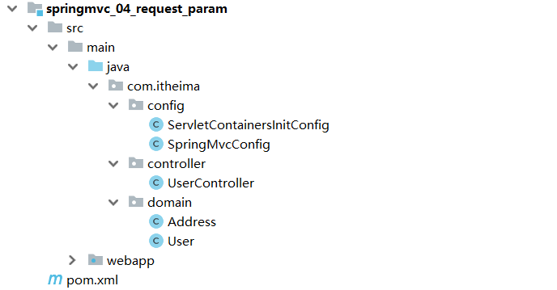

#### 4.2.2 参数传递

##### GET发送单个参数

发送请求与参数：

```
http://localhost/commonParam?name=itcast
```


接收参数：

```java
@Controller
public class UserController {

    @RequestMapping("/commonParam")
    @ResponseBody
    public String commonParam(String name) {
        System.out.println("普通参数传递 name ==> " + name);
        return "{'module':'commonParam'}";
    }
}
```

##### GET发送多个参数

发送请求与参数：

```
http://localhost/commonParam?name=itcast&age=15
```

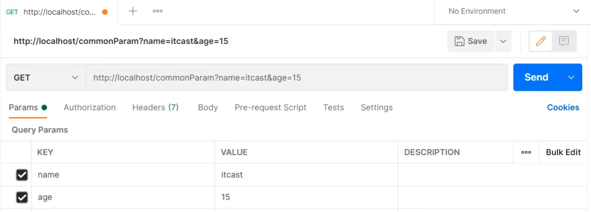

接收参数：

```java
@Controller
public class UserController {
    @RequestMapping("/commonParam")
    @ResponseBody
    public String commonParam(String name, int age) {
        System.out.println("普通参数传递 name ==> " + name);
        System.out.println("普通参数传递 age ==> " + age);
        return "{'module':'commonParam'}";
    }
}
```

##### GET请求中文乱码

如果我们传递的参数中有中文，你会发现接收到的参数会出现中文乱码问题。

发送请求:`http://localhost/commonParam?name=张三&age=18`

控制台:

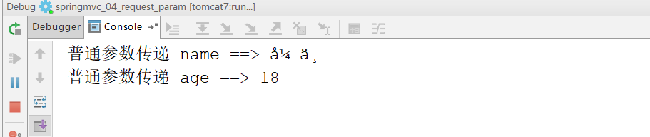

出现乱码的原因相信大家都清楚，Tomcat8.5 以后的版本已经处理了中文乱码的问题，但是 IDEA 中的 Tomcat 插件目前只到 Tomcat7，所以需要修改 pom.xml 来解决 GET 请求中文乱码问题

```xml
<build>
    <plugins>
      <plugin>
        <groupId>org.apache.tomcat.maven</groupId>
        <artifactId>tomcat7-maven-plugin</artifactId>
        <version>2.1</version>
        <configuration>
          <port>80</port>				<!-- tomcat端口号 -->
          <path>/</path> 				<!-- 虚拟目录 -->
          <uriEncoding>UTF-8</uriEncoding><!-- 访问路径编解码字符集 -->
        </configuration>
      </plugin>
    </plugins>
  </build>
```

##### POST发送参数

发送请求与参数：

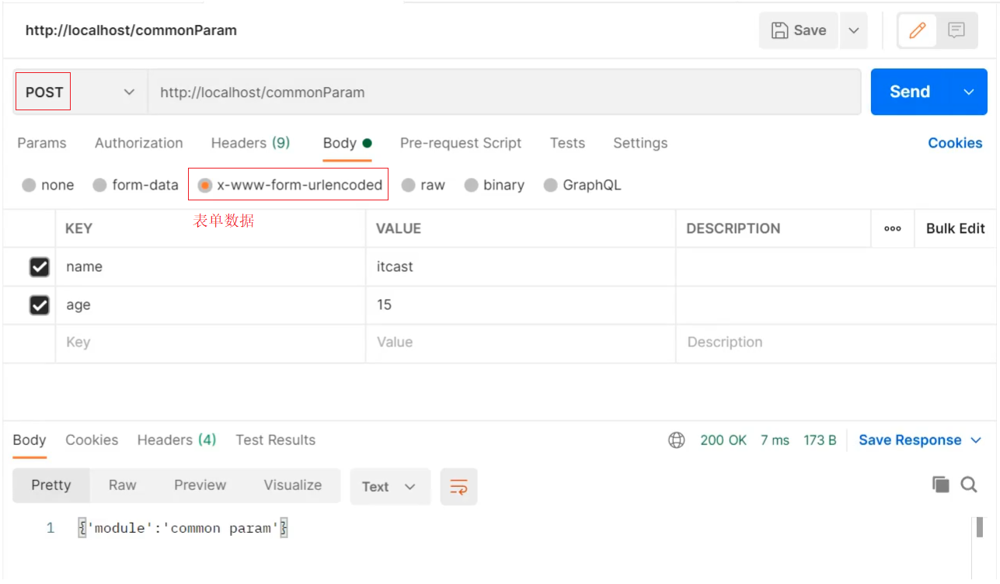接收参数：

和 GET 一致，不用做任何修改

```java
@Controller
public class UserController {
    @RequestMapping("/commonParam")
    @ResponseBody
    public String commonParam(String name, int age) {
        System.out.println("普通参数传递 name ==> " + name);
        System.out.println("普通参数传递 age ==> " + age);
        return "{'module':'commonParam'}";
    }
}
```

##### POST请求中文乱码

发送请求与参数：

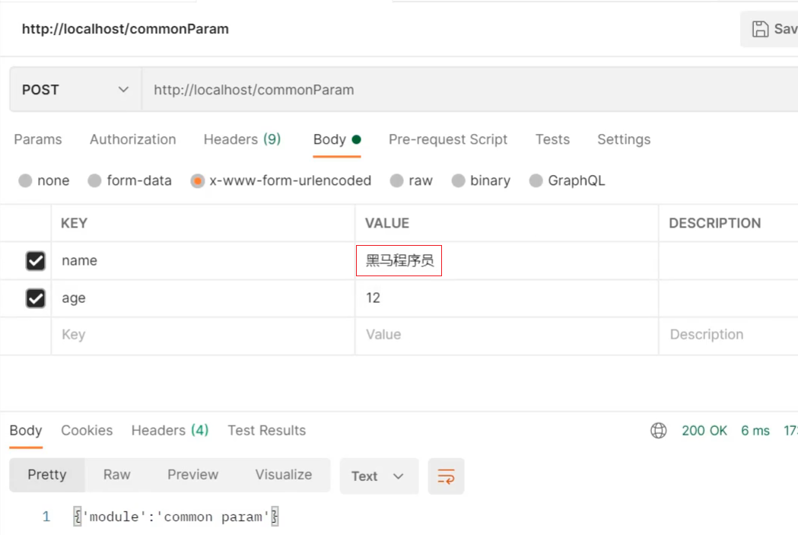

接收参数：

控制台打印，会发现有中文乱码问题。

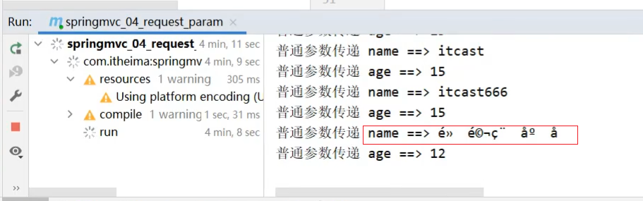

解决方案：配置过滤器

```java
public class ServletContainersInitConfig extends AbstractAnnotationConfigDispatcherServletInitializer {
    protected Class<?>[] getRootConfigClasses() {
        return new Class[0];
    }

    protected Class<?>[] getServletConfigClasses() {
        return new Class[]{SpringMvcConfig.class};
    }

    protected String[] getServletMappings() {
        return new String[]{"/"};
    }

    // 乱码处理
    @Override
    protected Filter[] getServletFilters() {
        CharacterEncodingFilter filter = new CharacterEncodingFilter();
        filter.setEncoding("UTF-8");
        return new Filter[]{filter};
    }
}
```

CharacterEncodingFilter 是在 spring-web 包中，所以用之前需要导入对应的 jar 包。

### 4.3 五种类型参数传递

前面我们已经能够使用 GET 或 POST 来发送请求和数据，所携带的数据都是比较简单的数据，接下来在这个基础上，我们来研究一些比较复杂的参数传递，常见的参数种类有：

* 普通参数
* POJO 类型参数
* 嵌套 POJO 类型参数
* 数组类型参数
* 集合类型参数

这些参数如何发送，后台改如何接收？我们一个个来学习。

#### 4.3.1 普通参数

* 普通参数：url地址传参，地址参数名与形参变量名相同，定义形参即可接收参数。

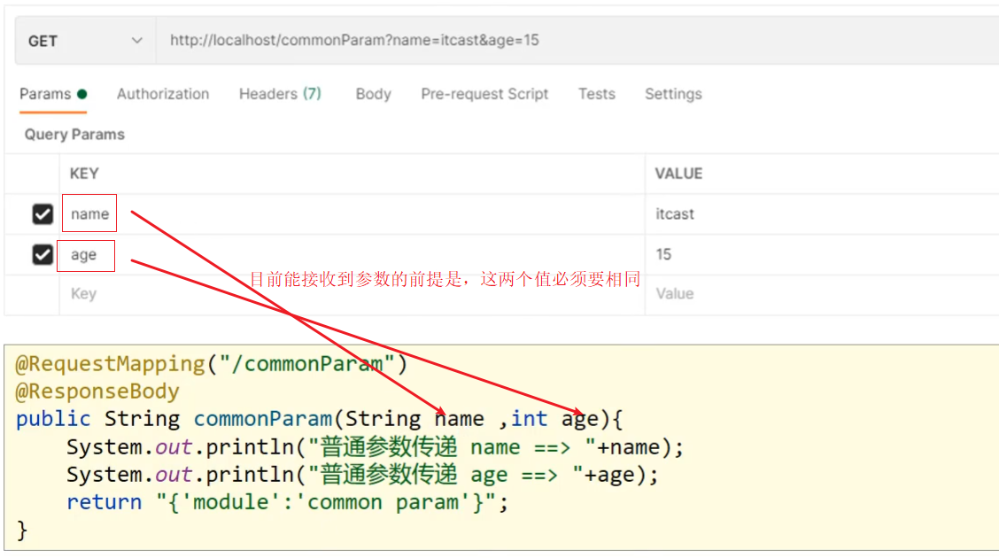

如果形参与地址参数名不一致该如何解决？

发送请求与参数:

```
http://localhost/commonParamDifferentName?name=张三&age=18
```

后台接收参数:

```java
@RequestMapping("/commonParamDifferentName")
@ResponseBody
public String commonParamDifferentName(String userName , int age) {
    System.out.println("普通参数传递 userName ==> " + userName);
    System.out.println("普通参数传递 age ==> " + age);
    return "{'module':'common param different name'}";
}
```

因为前端给的是`name`，后台接收使用的是`userName`，两个名称对不上，导致接收数据失败：

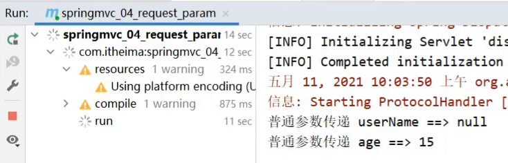

解决方案：使用 @RequestParam 注解

```java
@RequestMapping("/commonParamDifferentName")
    @ResponseBody
    public String commonParamDifferentName(@RequestParam("name") String userName, int age) {
        System.out.println("普通参数传递 userName ==> " + userName);
        System.out.println("普通参数传递 age ==> " + age);
        return "{'module':'common param different name'}";
    }
```

**注意：写上 @RequestParam 注解框架就不需要自己去解析注入，能提升框架处理性能**

#### 4.3.2 POJO数据类型

简单数据类型一般处理的是参数个数比较少的请求，如果参数比较多，那么后台接收参数的时候就比较复杂，这个时候我们可以考虑使用 POJO 数据类型。

* POJO参数：请求参数名与形参对象属性名相同，定义 POJO 类型形参即可接收参数

此时需要使用前面准备好的 POJO 类，先来看下 User

```java
public class User {
    private String name;
    private int age;
    // setter...getter...略
}
```

发送请求和参数：

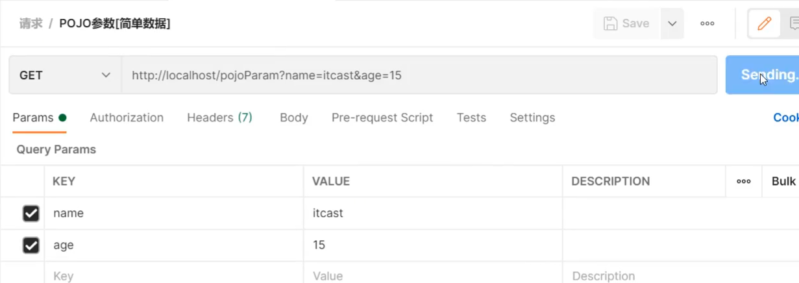

后台接收参数：

```java
// POJO参数：请求参数与形参对象中的属性对应即可完成参数传递
@RequestMapping("/pojoParam")
@ResponseBody
public String pojoParam(User user) {
    System.out.println("pojo参数传递 user ==> " + user);
    return "{'module':'pojo param'}";
}
```

**注意:**

* POJO 参数接收，前端 GET 和 POST 发送请求数据的方式不变。
* ==请求参数 key 的名称要和 POJO 中属性的名称一致，否则无法封装。==

#### 4.3.3 嵌套POJO类型参数

如果 POJO 对象中嵌套了其他的 POJO 类，如：

```java
public class Address {
    private String province;
    private String city;
    // setter...getter...略
}
public class User {
    private String name;
    private int age;
    private Address address;
    // setter...getter...略
}
```

* 嵌套 POJO 参数：请求参数名与形参对象属性名相同，按照对象层次结构关系即可接收嵌套 POJO 属性参数

发送请求和参数：

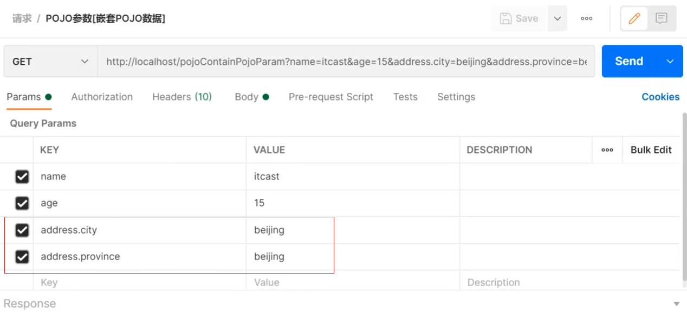

后台接收参数：

```java
// POJO参数：请求参数与形参对象中的属性对应即可完成参数传递
@RequestMapping("/pojoParam")
@ResponseBody
public String pojoParam(User user) {
    System.out.println("pojo参数传递 user ==> " + user);
    return "{'module':'pojo param'}";
}
```

**注意:**

==请求参数 key 的名称要和 POJO 中属性的名称一致，否则无法封装==

#### 4.3.4 数组类型参数

举个简单的例子，如果前端需要获取用户的爱好，爱好绝大多数情况下都是多个，如何发送请求数据和接收数据呢？

* 数组参数：请求参数名与形参对象属性名相同且请求参数为多个，定义数组类型即可接收参数

发送请求和参数：

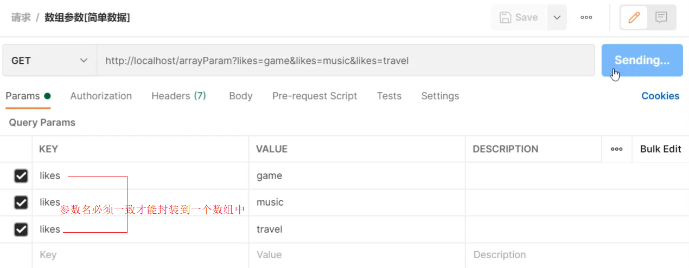

后台接收参数：

```java
  // 数组参数：同名请求参数可以直接映射到对应名称的形参数组对象中
    @RequestMapping("/arrayParam")
    @ResponseBody
    public String arrayParam(String[] likes){
        System.out.println("数组参数传递 likes ==> "+ Arrays.toString(likes));
        return "{'module':'array param'}";
    }
```

#### 4.3.5 集合类型参数

数组能接收多个值，那么集合是否也可以实现这个功能呢？

发送请求和参数：

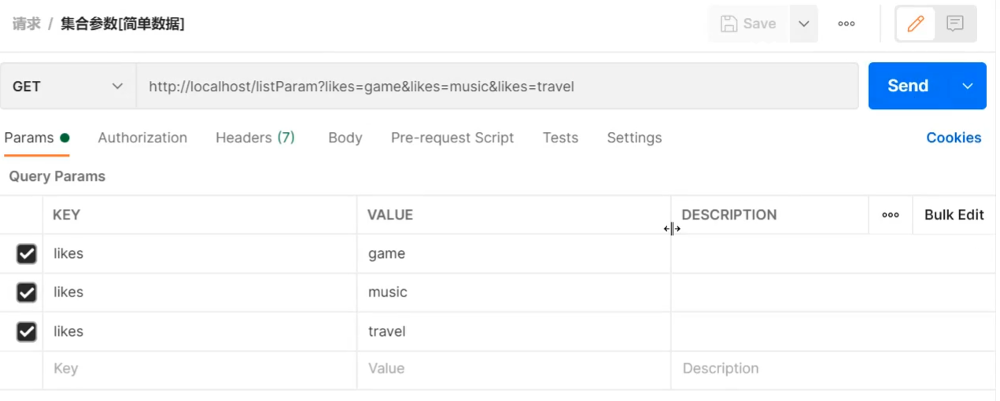

后台接收参数：

```java
// 集合参数：同名请求参数可以使用 @RequestParam 注解映射到对应名称的集合对象中作为数据
@RequestMapping("/listParam")
@ResponseBody
public String listParam(List<String> likes){
    System.out.println("集合参数传递 likes ==> "+ likes);
    return "{'module':'list param'}";
}
```

运行会报错：

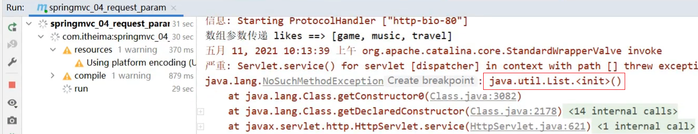

错误的原因是：SpringMVC 将 List 看做是一个 POJO 对象来处理，将其创建一个对象并准备把前端的数据封装到对象中，但是 List 是一个接口无法创建对象，所以报错。

解决方案是：使用`@RequestParam`注解

```java
// 集合参数：同名请求参数可以使用 @RequestParam 注解映射到对应名称的集合对象中作为数据
@RequestMapping("/listParam")
@ResponseBody
public String listParam(@RequestParam List<String> likes){
    System.out.println("集合参数传递 likes ==> "+ likes);
    return "{'module':'list param'}";
}
```

* 集合保存普通参数：请求参数名与形参集合对象名相同且请求参数为多个，@RequestParam 绑定参数关系
* 对于简单数据类型使用数组会比集合更简单些。

### 知识点1：@RequestParam

| 名称     | @RequestParam                                          |
| -------- | ------------------------------------------------------ |
| 类型     | 形参注解                                               |
| 位置     | SpringMVC 控制器方法形参定义前面                       |
| 作用     | 绑定请求参数与处理器方法形参间的关系                   |
| 相关参数 | required：是否为必传参数 <br/>defaultValue：参数默认值 |

### 4.4 JSON数据传输参数

前面我们说过，现在比较流行的开发方式为异步调用。前后台以异步方式进行交换，传输的数据使用的是==JSON==，所以前端如果发送的是 JSON 数据，后端该如何接收？

对于 JSON 数据类型，我们常见的有三种：

- json普通数组（["value1","value2","value3",...]）
- json对象（{key1:value1,key2:value2,...}）
- json对象数组（[{key1:value1,...},{key2:value2,...}]）

对于上述数据，前端如何发送，后端如何接收？

#### JSON普通数组

###### 步骤1：pom.xml添加依赖

SpringMVC 默认使用的是 jackson 来处理 json 的转换，所以需要在 pom.xml 添加 jackson 依赖

```xml
<dependency>
    <groupId>com.fasterxml.jackson.core</groupId>
    <artifactId>jackson-databind</artifactId>
    <version>2.9.0</version>
</dependency>
```

###### 步骤2：PostMan发送JSON数据

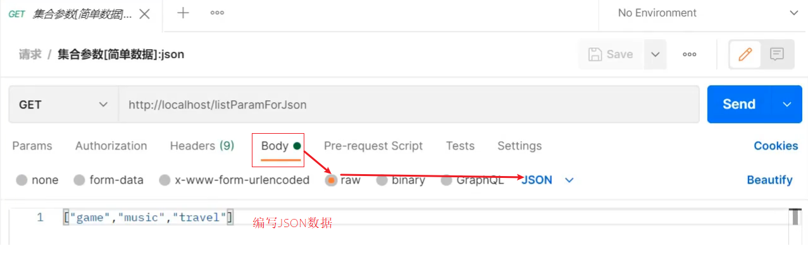

###### 步骤3：开启SpringMVC注解支持

在 SpringMVC 的配置类中开启 SpringMVC 的注解支持，这里面就包含了将 JSON 转换成对象的功能。

```java
@Configuration
@ComponentScan("com.itheima.controller")
// 开启 json 数据类型自动转换
@EnableWebMvc
public class SpringMvcConfig {
}
```

###### 步骤4：参数前添加@RequestBody

```java
// 使用 @RequestBody 注解将外部传递的 json 数组数据映射到形参的集合对象中作为数据
@RequestMapping("/listParamForJson")
@ResponseBody
public String listParamForJson(@RequestBody List<String> likes){
    System.out.println("list common(json)参数传递 list ==> " + likes);
    return "{'module':'list common for json param'}";
}
```

###### 步骤5：启动运行程序

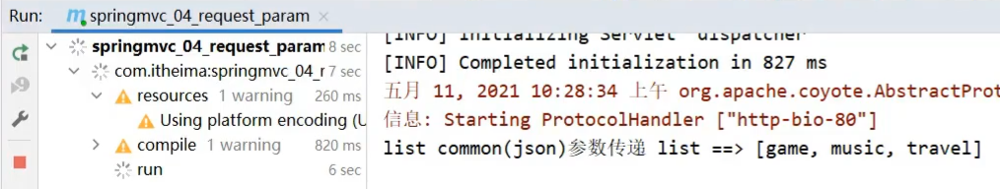

JSON 普通数组的数据就已经传递完成，下面针对 JSON 对象数据和 JSON 对象数组的数据该如何传递呢？

#### JSON对象数据

我们会发现，只需要关注请求和数据如何发送？后端数据如何接收？

请求和数据的发送：

```json
{
	"name": "itcast",
	"age": 15
}
```

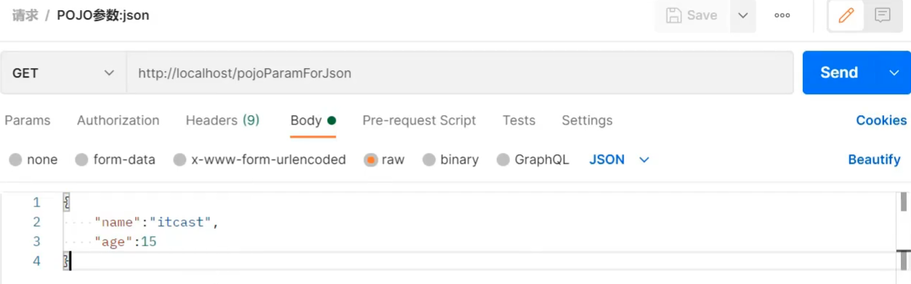

后端接收数据：

```java
@RequestMapping("/pojoParamForJson")
@ResponseBody
public String pojoParamForJson(@RequestBody User user) {
    System.out.println("pojo(json)参数传递 user ==> " + user);
    return "{'module':'pojo for json param'}";
}
```

启动程序访问测试：

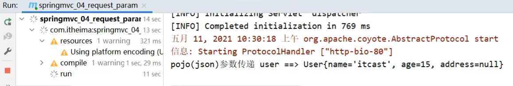

**说明：**

address 为 null 的原因是前端没有传递数据给后端。

如果想要 address 也有数据，我们需求修改前端传递的数据内容：

```json
{
	"name": "itcast",
	"age": 15,
    "address": {
        "province": "beijing",
        "city": "beijing"
    }
}
```

再次发送请求，就能看到 address 中的数据：

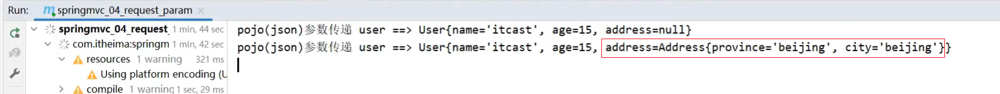

#### JSON对象数组

集合中保存多个 POJO 该如何实现？

请求和数据的发送:

```json
[
    {"name": "itcast", "age": 15},
    {"name": "itheima", "age": 12}
]
```

 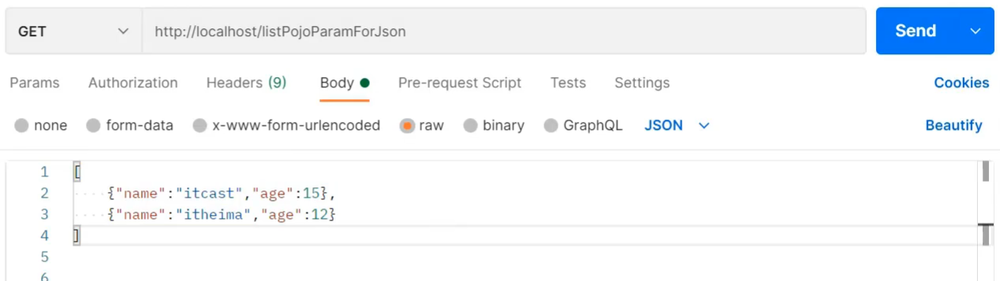

后端接收数据：

```java
@RequestMapping("/listPojoParamForJson")
@ResponseBody
public String listPojoParamForJson(@RequestBody List<User> list){
    System.out.println("list pojo(json)参数传递 list ==> "+list);
    return "{'module':'list pojo for json param'}";
}
```

启动程序访问测试：

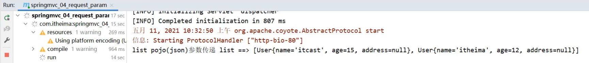

**小结**

SpringMVC 接收 JSON 数据的实现步骤为：

(1) 导入 jackson 包

(2) 使用 PostMan 发送 JSON 数据

(3) 开启 SpringMVC 注解驱动，在配置类上添加 @EnableWebMvc 注解

(4) Controller 方法的参数前添加 @RequestBody 注解

#### 知识点1：@EnableWebMvc

| 名称 | @EnableWebMvc               |
| ---- | --------------------------- |
| 类型 | ==配置类注解==              |
| 位置 | SpringMVC 配置类定义上方    |
| 作用 | 开启 SpringMVC 多项辅助功能 |

#### 知识点2：@RequestBody

| 名称 | @RequestBody                                                 |
| ---- | ------------------------------------------------------------ |
| 类型 | ==形参注解==                                                 |
| 位置 | SpringMVC 控制器方法形参定义前面                             |
| 作用 | 将请求中请求体所包含的数据传递给请求参数，此注解一个处理器方法只能使用一次 |

#### @RequestBody 与 @RequestParam 区别

* 区别
  * @RequestParam 用于接收 url 地址传参，表单传参【application/x-www-form-urlencoded】
  * @RequestBody 用于接收 json 数据【application/json】

* 应用
  * 后期开发中，发送 json 格式数据为主，@RequestBody 应用较广
  * 如果发送非 json 格式数据，选用 @RequestParam 接收请求参数

### 4.5 日期类型参数传递

前面我们处理过简单数据类型、POJO 数据类型、数组和集合数据类型以及 JSON 数据类型，接下来我们还得处理一种开发中比较常见的一种数据类型，`日期类型`

日期类型比较特殊，因为对于日期的格式有N多中输入方式，比如：

* 2088-08-18
* 2088/08/18
* 08/18/2088
* ......

针对这么多日期格式，SpringMVC 该如何接收，它能很好的处理日期类型数据么？

#### 步骤1：编写方法接收日期数据

在 UserController 类中添加方法，把参数设置为日期类型

```java
@RequestMapping("/dataParam")
@ResponseBody
public String dataParam(Date date)
    System.out.println("参数传递 date ==> "+date);
    return "{'module':'data param'}";
}
```

#### 步骤2：启动Tomcat服务器

查看控制台是否报错，如果有错误，先解决错误。

#### 步骤3：使用PostMan发送请求

使用 PostMan 发送 GET 请求，并设置 date 参数

`http://localhost/dataParam?date=2088/08/08`

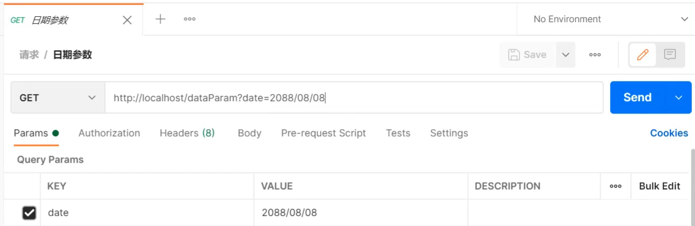

#### 步骤4：查看控制台

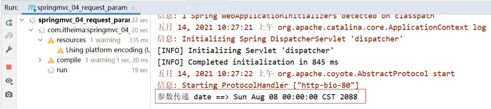

通过打印，我们发现 SpringMVC 可以接收日期数据类型，并将其打印在控制台。

这个时候，我们就想如果把日期参数的格式改成其他的，SpringMVC 还能处理么?

#### 步骤5：更换日期格式

为了能更好的看到程序运行的结果，我们在方法中多添加一个日期参数

```java
@RequestMapping("/dataParam")
@ResponseBody
public String dataParam(Date date, Date date1)
    System.out.println("参数传递 date ==> "+date);
    return "{'module':'data param'}";
}
```

使用 PostMan 发送请求，携带两个不同的日期格式，

`http://localhost/dataParam?date=2088/08/08&date1=2088-08-08`

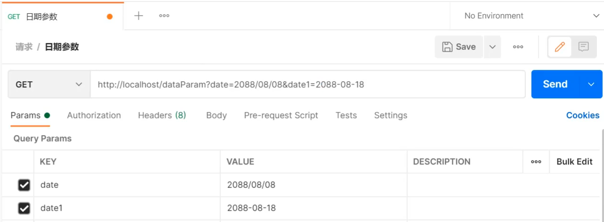

发送请求和数据后，页面会报 400，控制台会报出一个错误：

Resolved [org.springframework.web.method.annotation.==MethodArgumentTypeMismatchException==: Failed to convert value of type 'java.lang.String' to required type 'java.util.Date'; nested exception is org.springframework.core.convert.==ConversionFailedException==: Failed to convert from type [java.lang.String] to type [java.util.Date] for value '2088-08-08'; nested exception is java.lang.IllegalArgumentException]

从错误信息可以看出，错误的原因是在将`2088-08-08`转换成日期类型的时候失败了，原因是 SpringMVC 默认支持的字符串转日期的格式为`yyyy/MM/dd`，而我们现在传递的不符合其默认格式，SpringMVC 就无法进行格式转换，所以报错。

解决方案也比较简单，需要使用`@DateTimeFormat`

```java
@RequestMapping("/dataParam")
@ResponseBody
public String dataParam(Date date, @DateTimeFormat(pattern="yyyy-MM-dd") Date date1) {
    System.out.println("参数传递 date ==> " + date);
	System.out.println("参数传递 date1(yyyy-MM-dd) ==> " + date1);
    return "{'module':'data param'}";
}
```

重新启动服务器，重新发送请求测试，SpringMVC 就可以正确的进行日期转换了

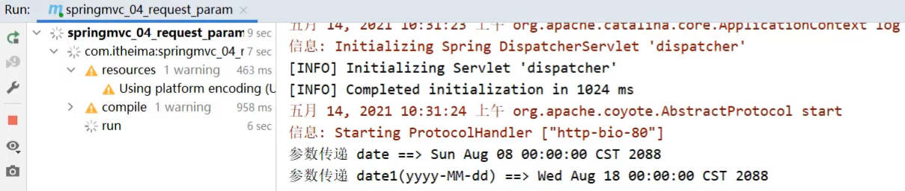

#### 步骤6：携带时间的日期

接下来我们再来发送一个携带时间的日期，看下 SpringMVC 该如何处理？

先修改 UserController 类，添加第三个参数

```java
@RequestMapping("/dataParam")
@ResponseBody
public String dataParam(Date date,
                        @DateTimeFormat(pattern="yyyy-MM-dd") Date date1,
                        @DateTimeFormat(pattern="yyyy/MM/dd HH:mm:ss") Date date2) {
    System.out.println("参数传递 date ==> " + date);
	System.out.println("参数传递 date1(yyyy-MM-dd) ==> " + date1);
	System.out.println("参数传递 date2(yyyy/MM/dd HH:mm:ss) ==> " + date2);
    return "{'module':'data param'}";
}
```

使用 PostMan 发送请求，携带两个不同的日期格式，

`http://localhost/dataParam?date=2088/08/08&date1=2088-08-08&date2=2088/08/08 8:08:08`

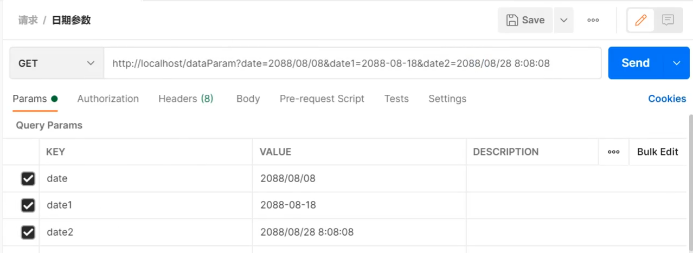

重新启动服务器，重新发送请求测试，SpringMVC 就可以将日期时间的数据进行转换

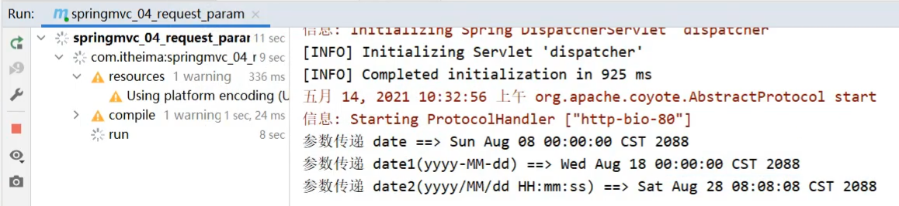


#### 知识点1：@DateTimeFormat

| 名称     | @DateTimeFormat                 |
| -------- | ------------------------------- |
| 类型     | ==形参注解==                    |
| 位置     | SpringMVC 控制器方法形参前面    |
| 作用     | 设定日期时间型数据格式          |
| 相关属性 | pattern：指定日期时间格式字符串 |

#### 内部实现原理

讲解内部原理之前，我们需要先思考个问题：

* 前端传递字符串，后端使用日期 Date 接收
* 前端传递 JSON 数据，后端使用对象接收
* 前端传递字符串，后端使用 Integer 接收
* 后台需要的数据类型有很多中
* 在数据的传递过程中存在很多类型的转换

问：谁来做这个类型转换？

答：SpringMVC

问：SpringMVC 是如何实现类型转换的?

答：SpringMVC 中提供了很多类型转换接口和实现类

在框架中，有一些类型转换接口，其中有：

* (1) Converter 接口

```java
/**
*	S: the source type
*	T: the target type
*/
public interface Converter<S, T> {
    @Nullable
    // 该方法就是将从页面上接收的数据(S)转换成我们想要的数据类型(T)返回
    T convert(S source);
}
```

**注意：Converter所属的包为`org.springframework.core.convert.converter`**

Converter 接口的实现类

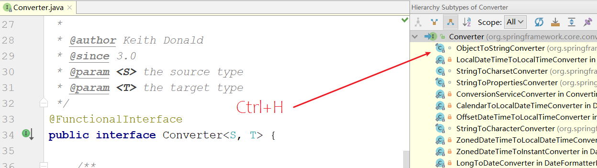

框架中有提供很多对应 Converter 接口的实现类，用来实现不同数据类型之间的转换，如：

请求参数年龄数据（String→Integer）

日期格式转换（String → Date）

* (2) HttpMessageConverter 接口

该接口是实现对象与 JSON 之间的转换工作

**==注意：SpringMVC 的配置类把 @EnableWebMvc 当做标配配置上去，不要省略==**

### 4.6 响应

SpringMVC 接收到请求和数据后，进行一些了的处理，当然这个处理可以是转发给 Service，Service 层再调用 Dao 层完成的，不管怎样，处理完以后，都需要将结果告知给用户。

比如：根据用户 ID 查询用户信息、查询用户列表、新增用户等。

对于响应，主要就包含两部分内容：

* 响应页面
* 响应数据
  * 文本数据
  * json 数据

因为异步调用是目前常用的主流方式，所以我们需要更关注的就是如何返回 JSON 数据，对于其他只需要认识了解即可。

#### 4.6.1 环境准备

- 创建一个 Web 的 Maven 项目

- pom.xml 添加 Spring 依赖

  ```xml
  <?xml version="1.0" encoding="UTF-8"?>
  
  <project xmlns="http://maven.apache.org/POM/4.0.0" xmlns:xsi="http://www.w3.org/2001/XMLSchema-instance"
    xsi:schemaLocation="http://maven.apache.org/POM/4.0.0 http://maven.apache.org/xsd/maven-4.0.0.xsd">
    <modelVersion>4.0.0</modelVersion>
  
    <groupId>com.itheima</groupId>
    <artifactId>springmvc_05_response</artifactId>
    <version>1.0-SNAPSHOT</version>
    <packaging>war</packaging>
  
    <dependencies>
      <dependency>
        <groupId>javax.servlet</groupId>
        <artifactId>javax.servlet-api</artifactId>
        <version>3.1.0</version>
        <scope>provided</scope>
      </dependency>
      <dependency>
        <groupId>org.springframework</groupId>
        <artifactId>spring-webmvc</artifactId>
        <version>5.2.10.RELEASE</version>
      </dependency>
      <dependency>
        <groupId>com.fasterxml.jackson.core</groupId>
        <artifactId>jackson-databind</artifactId>
        <version>2.9.0</version>
      </dependency>
    </dependencies>
  
    <build>
      <plugins>
        <plugin>
          <groupId>org.apache.tomcat.maven</groupId>
          <artifactId>tomcat7-maven-plugin</artifactId>
          <version>2.1</version>
          <configuration>
            <port>80</port>
            <path>/</path>
          </configuration>
        </plugin>
      </plugins>
    </build>
  </project>
  
  ```

- 创建对应的配置类

  ```java
  public class ServletContainersInitConfig extends AbstractAnnotationConfigDispatcherServletInitializer {
      protected Class<?>[] getRootConfigClasses() {
          return new Class[0];
      }
  
      protected Class<?>[] getServletConfigClasses() {
          return new Class[]{SpringMvcConfig.class};
      }
  
      protected String[] getServletMappings() {
          return new String[]{"/"};
      }
  
      // 乱码处理
      @Override
      protected Filter[] getServletFilters() {
          CharacterEncodingFilter filter = new CharacterEncodingFilter();
          filter.setEncoding("UTF-8");
          return new Filter[]{filter};
      }
  }
  
  @Configuration
  @ComponentScan("com.itheima.controller")
  // 开启 json 数据类型自动转换
  @EnableWebMvc
  public class SpringMvcConfig {
  }
  ```
  
- 编写模型类 User

  ```java
  public class User {
      private String name;
      private int age;
      // getter...setter...toString省略
  }
  ```

- webapp下创建 page.jsp

  ```jsp
  <html>
  <body>
  <h2>Hello Spring MVC!</h2>
  </body>
  </html>
  ```

- 编写 UserController

  ```java
  @Controller
  public class UserController {
  }
  ```

最终创建好的项目结构如下：


#### 4.6.2 响应页面[了解]

##### 步骤1：设置返回页面

```java
@Controller
public class UserController {
    
    @RequestMapping("/toJumpPage")
    // 注意
    // 1.此处不能添加 @ResponseBody，如果加了该注入，会直接将 page.jsp 当字符串返回前端
    // 2.方法需要返回 String
    public String toJumpPage(){
        System.out.println("跳转页面");
        return "page.jsp";
    }
    
}
```

##### 步骤2：启动程序测试

此处涉及到页面跳转，所以不适合采用PostMan进行测试，直接打开浏览器，输入

`http://localhost/toJumpPage`

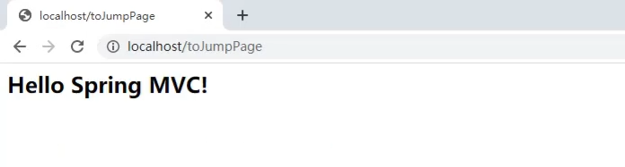

#### 4.6.3 返回文本数据[了解]

##### 步骤1：设置返回文本内容

```java
@Controller
public class UserController {
   	@RequestMapping("/toText")
	// 注意此处该注解就不能省略，如果省略了，会把 response text 当前页面名称去查找，如果没有回报404错误
    @ResponseBody
    public String toText(){
        System.out.println("返回纯文本数据");
        return "response text";
    }
    
}
```

##### 步骤2：启动程序测试

此处不涉及到页面跳转，因为我们现在发送的是 GET 请求，可以使用浏览器也可以使用 PostMan 进行测试，输入地址`http://localhost/toText`访问

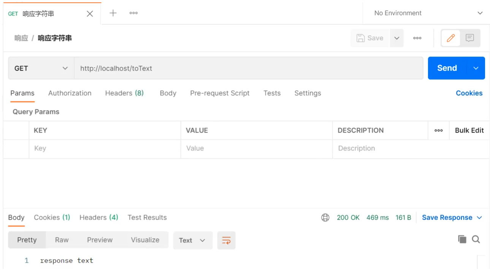

#### 4.6.4 响应JSON数据

##### 响应POJO对象

```java
@Controller
public class UserController {
    @RequestMapping("/toJsonPOJO")
    @ResponseBody
    public User toJsonPOJO(){
        System.out.println("返回json对象数据");
        User user = new User();
        user.setName("itcast");
        user.setAge(15);
        return user;
    }
    
}
```

返回值为实体类对象，设置返回值为实体类类型，即可实现返回对应对象的 json 数据，需要依赖==@ResponseBody==注解和==@EnableWebMvc==注解

重新启动服务器，访问`http://localhost/toJsonPOJO`

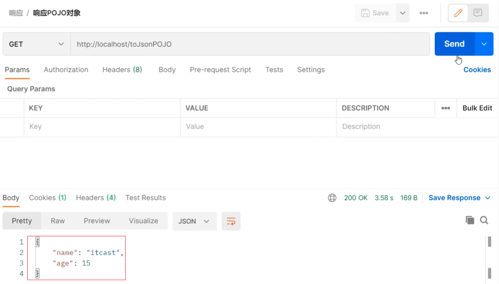

##### 响应POJO集合对象

```java
@Controller
public class UserController {
    
    @RequestMapping("/toJsonList")
    @ResponseBody
    public List<User> toJsonList(){
        System.out.println("返回json集合数据");
        User user1 = new User();
        user1.setName("传智播客");
        user1.setAge(15);

        User user2 = new User();
        user2.setName("黑马程序员");
        user2.setAge(12);

        List<User> userList = new ArrayList<User>();
        userList.add(user1);
        userList.add(user2);

        return userList;
    }   
}
```

重新启动服务器，访问`http://localhost/toJsonList`

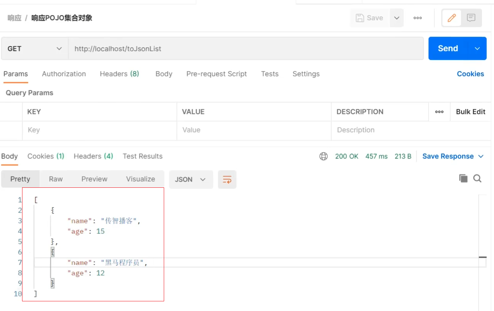

#### 知识点1：@ResponseBody

| 名称     | @ResponseBody                                                |
| -------- | ------------------------------------------------------------ |
| 类型     | ==方法\类注解==                                              |
| 位置     | SpringMVC 控制器方法定义上方和控制类上                       |
| 作用     | 设置当前控制器返回值作为响应体,<br/>写在类上，该类的所有方法都有该注解功能 |
| 相关属性 | pattern：指定日期时间格式字符串                              |

**说明:**

* 该注解可以写在类上或者方法上
* 写在类上就是该类下的所有方法都有 @ReponseBody 功能
* 当方法上有 @ReponseBody 注解后
  * 方法的返回值为字符串，会将其作为文本内容直接响应给前端
  * 方法的返回值为对象，会将对象转换成 JSON 响应给前端

此处又使用到了类型转换，内部还是通过 Converter 接口的实现类完成的，所以 Converter 除了前面所说的功能外，它还可以实现:

* 对象转 Json 数据（POJO -> json）
* 集合转 Json 数据（Collection -> json）

## 5、Rest风格

对于 Rest 风格，我们需要学习的内容包括：

* REST 简介
* REST 入门案例
* REST 快速开发
* 案例：基于 RESTful 页面数据交互

### 5.1 REST简介

* ==REST==（Representational State Transfer），表现形式状态转换，它是一种软件架构==风格==

  当我们想表示一个网络资源的时候，可以使用两种方式：

  * 传统风格资源描述形式
    * `http://localhost/user/getById?id=1` 查询 id 为 1 的用户信息
    * `http://localhost/user/saveUser` 保存用户信息
  * REST 风格描述形式
    * `http://localhost/user/1` 
    * `http://localhost/user`

传统方式一般是一个请求 url 对应一种操作，这样做不仅麻烦，也不安全，因为会程序的人读取了你的请求 url 地址，就大概知道该 url 实现的是一个什么样的操作。

查看 REST 风格的描述，你会发现请求地址变的简单了，并且光看请求 URL 并不是很能猜出来该 URL 的具体功能

所以 REST 的优点有：

- 隐藏资源的访问行为，无法通过地址得知对资源是何种操作
- 书写简化

但是我们的问题也随之而来了，一个相同的 url 地址即可以是新增也可以是修改或者查询，那么到底我们该如何区分该请求到底是什么操作呢？

* 按照 REST 风格访问资源时使用==行为动作==区分对资源进行了何种操作
  * `http://localhost/users`	查询全部用户信息 GET（查询）
  * `http://localhost/users/1`  查询指定用户信息 GET（查询）
  * `http://localhost/users`    添加用户信息 POST（新增/保存）
  * `http://localhost/users`    修改用户信息 PUT（修改/更新）
  * `http://localhost/users/1`  删除用户信息 DELETE（删除）

请求的方式比较多，但是比较常用的就 4 种，分别是`GET`，`POST`，`PUT`，`DELETE`。

按照不同的请求方式代表不同的操作类型。

* 发送 GET 请求是用来做查询
* 发送 POST 请求是用来做新增
* 发送 PUT 请求是用来做修改
* 发送 DELETE 请求是用来做删除

但是==注意==：

* 上述行为是约定方式，约定不是规范，可以打破，所以称 REST 风格，而不是 REST 规范
  * REST 提供了对应的架构方式，按照这种架构设计项目可以降低开发的复杂性，提高系统的可伸缩性
  * REST 中规定 GET/POST/PUT/DELETE 针对的是 查询/新增/修改/删除，但是我们如果非要用 GET 请求做删除，这点在程序上运行是可以实现的
  * 但是如果绝大多数人都遵循这种风格，你写的代码让别人读起来就有点莫名其妙了
* 描述模块的名称通常使用复数，也就是加 s 的格式描述，表示此类资源，而非单个资源，例如：users、books、accounts......

清楚了什么是 REST 风格后，我们后期会经常提到一个概念叫`RESTful`，那什么又是 RESTful 呢？

* 根据 REST 风格对资源进行访问称为==RESTful==。

后期我们在进行开发的过程中，大多是都是遵从 REST 风格来访问我们的后台服务，所以可以说咱们以后都是基于 RESTful 来进行开发的。

### 5.2 RESTful入门案例

#### 5.2.1 环境准备

- 创建一个 Web 的 Maven 项目

- pom.xml 添加 Spring 依赖

  ```xml
  <?xml version="1.0" encoding="UTF-8"?>
  
  <project xmlns="http://maven.apache.org/POM/4.0.0" xmlns:xsi="http://www.w3.org/2001/XMLSchema-instance"
    xsi:schemaLocation="http://maven.apache.org/POM/4.0.0 http://maven.apache.org/xsd/maven-4.0.0.xsd">
    <modelVersion>4.0.0</modelVersion>
  
    <groupId>com.itheima</groupId>
    <artifactId>springmvc_06_rest</artifactId>
    <version>1.0-SNAPSHOT</version>
    <packaging>war</packaging>
  
    <dependencies>
      <dependency>
        <groupId>javax.servlet</groupId>
        <artifactId>javax.servlet-api</artifactId>
        <version>3.1.0</version>
        <scope>provided</scope>
      </dependency>
      <dependency>
        <groupId>org.springframework</groupId>
        <artifactId>spring-webmvc</artifactId>
        <version>5.2.10.RELEASE</version>
      </dependency>
      <dependency>
        <groupId>com.fasterxml.jackson.core</groupId>
        <artifactId>jackson-databind</artifactId>
        <version>2.9.0</version>
      </dependency>
    </dependencies>
  
    <build>
      <plugins>
        <plugin>
          <groupId>org.apache.tomcat.maven</groupId>
          <artifactId>tomcat7-maven-plugin</artifactId>
          <version>2.1</version>
          <configuration>
            <port>80</port>
            <path>/</path>
          </configuration>
        </plugin>
      </plugins>
    </build>
  </project>
  
  ```

- 创建对应的配置类

  ```java
  public class ServletContainersInitConfig extends AbstractAnnotationConfigDispatcherServletInitializer {
      protected Class<?>[] getRootConfigClasses() {
          return new Class[0];
      }
  
      protected Class<?>[] getServletConfigClasses() {
          return new Class[]{SpringMvcConfig.class};
      }
  
      protected String[] getServletMappings() {
          return new String[]{"/"};
      }
  
      // 乱码处理
      @Override
      protected Filter[] getServletFilters() {
          CharacterEncodingFilter filter = new CharacterEncodingFilter();
          filter.setEncoding("UTF-8");
          return new Filter[]{filter};
      }
  }
  
  @Configuration
  @ComponentScan("com.itheima.controller")
  // 开启json数据类型自动转换
  @EnableWebMvc
  public class SpringMvcConfig {
  }
  
  
  ```

- 编写模型类 User 和 Book

  ```java
  public class User {
      private String name;
      private int age;
      // getter...setter...toString省略
  }
  
  public class Book {
      private String name;
      private double price;
      // getter...setter...toString省略
  }
  ```

- 编写 UserController 和 BookController

  ```java
  @Controller
  public class UserController {
  	@RequestMapping("/save")
      @ResponseBody
      public String save(@RequestBody User user) {
          System.out.println("user save..." + user);
          return "{'module':'user save'}";
      }
  
      @RequestMapping("/delete")
      @ResponseBody
      public String delete(Integer id) {
          System.out.println("user delete..." + id);
          return "{'module':'user delete'}";
      }
  
      @RequestMapping("/update")
      @ResponseBody
      public String update(@RequestBody User user) {
          System.out.println("user update..." + user);
          return "{'module':'user update'}";
      }
  
      @RequestMapping("/getById")
      @ResponseBody
      public String getById(Integer id) {
          System.out.println("user getById..." + id);
          return "{'module':'user getById'}";
      }
  
      @RequestMapping("/findAll")
      @ResponseBody
      public String getAll() {
          System.out.println("user getAll...");
          return "{'module':'user getAll'}";
      }
  }
  
  
  @Controller
  public class BookController {
      
  	@RequestMapping(value = "/books", method = RequestMethod.POST)
      @ResponseBody
      public String save(@RequestBody Book book) {
          System.out.println("book save..." + book);
          return "{'module':'book save'}";
      }
  
      @RequestMapping(value = "/books/{id}", method = RequestMethod.DELETE)
      @ResponseBody
      public String delete(@PathVariable Integer id) {
          System.out.println("book delete..." + id);
          return "{'module':'book delete'}";
      }
  
      @RequestMapping(value = "/books",method = RequestMethod.PUT)
      @ResponseBody
      public String update(@RequestBody Book book) {
          System.out.println("book update..." + book);
          return "{'module':'book update'}";
      }
  
      @RequestMapping(value = "/books/{id}",method = RequestMethod.GET)
      @ResponseBody
      public String getById(@PathVariable Integer id) {
          System.out.println("book getById..." + id);
          return "{'module':'book getById'}";
      }
  
      @RequestMapping(value = "/books",method = RequestMethod.GET)
      @ResponseBody
      public String getAll() {
          System.out.println("book getAll...");
          return "{'module':'book getAll'}";
      }
  }
  ```

最终创建好的项目结构如下：

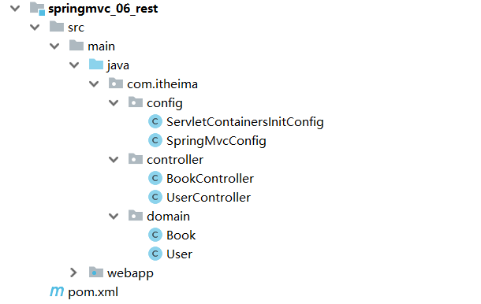

#### 5.2.2 思路分析

> 需求：将之前的增删改查替换成 RESTful 的开发方式。
>
> 1、之前不同的请求有不同的路径,现在要将其修改为统一的请求路径
>
>  修改前：新增：/save ，修改：/update，删除：/delete...
>
>  修改后：增删改查：/users
>
> 2、根据 GET 查询、POST 新增、PUT 修改、DELETE 删除对方法的请求方式进行限定
>
> 3、发送请求的过程中如何设置请求参数？

#### 5.2.3 修改RESTful风格

##### 新增

```java
@Controller
public class UserController {
	// 设置当前请求方法为 POST，表示 REST 风格中的添加操作
    @RequestMapping(value = "/users", method = RequestMethod.POST)
    @ResponseBody
    public String save() {
        System.out.println("user save...");
        return "{'module':'user save'}";
    }
}
```

* 将请求路径更改为`/users`

  * 访问该方法使用 POST：`http://localhost/users`

* 使用 method 属性限定该方法的访问方式为`POST`

  * 如果发送的不是 POST 请求，比如发送 GET 请求，则会报错

    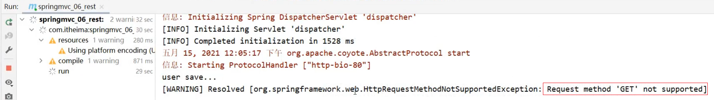

##### 删除

```java
@Controller
public class UserController {
    // 设置当前请求方法为 DELETE，表示 REST 风格中的删除操作
	@RequestMapping(value = "/users", method = RequestMethod.DELETE)
    @ResponseBody
    public String delete(Integer id) {
        System.out.println("user delete..." + id);
        return "{'module':'user delete'}";
    }
}
```

* 将请求路径更改为`/users`
  - 访问该方法使用 DELETE: `http://localhost/users`

访问成功，但是删除方法没有携带所要删除数据的 id，所以针对 RESTful 的开发，如何携带数据参数？

###### 传递路径参数

前端发送请求的时候使用：`http://localhost/users/1`，路径中的`1`就是我们想要传递的参数。

后端获取参数，需要做如下修改：

* 修改 @RequestMapping 的 value 属性，将其中修改为`/users/{id}`，目的是和路径匹配
* 在方法的形参前添加 @PathVariable 注解

```java
@Controller
public class UserController {
    // 设置当前请求方法为 DELETE，表示 REST 风格中的删除操作
	@RequestMapping(value = "/users/{id}", method = RequestMethod.DELETE)
    @ResponseBody
    public String delete(@PathVariable Integer id) {
        System.out.println("user delete..." + id);
        return "{'module':'user delete'}";
    }
}
```

**思考如下两个问题：**

(1) 如果方法形参的名称和路径`{}`中的值不一致，该怎么办？

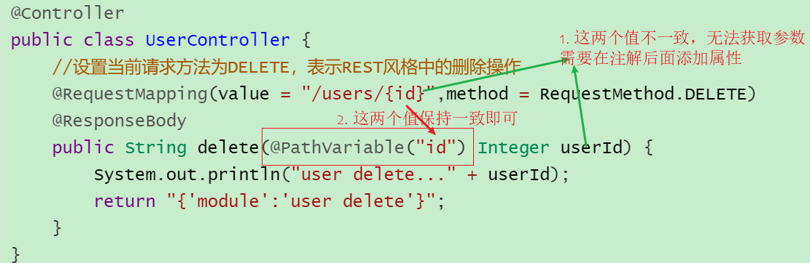

(2) 如果有多个参数需要传递该如何编写？

前端发送请求的时候使用:`http://localhost/users/1/tom`，路径中的`1`和`tom`就是我们想要传递的两个参数。

后端获取参数，需要做如下修改：

```java
@Controller
public class UserController {
    // 设置当前请求方法为 DELETE，表示 REST 风格中的删除操作
	@RequestMapping(value = "/users/{id}/{name}", method = RequestMethod.DELETE)
    @ResponseBody
    public String delete(@PathVariable Integer id, @PathVariable String name) {
        System.out.println("user delete..." + id + "," + name);
        return "{'module':'user delete'}";
    }
}
```

##### 修改

```java
@Controller
public class UserController {
    // 设置当前请求方法为 PUT，表示 REST 风格中的修改操作
    @RequestMapping(value = "/users", method = RequestMethod.PUT)
    @ResponseBody
    public String update(@RequestBody User user) {
        System.out.println("user update..." + user);
        return "{'module':'user update'}";
    }
}
```

- 将请求路径更改为`/users`

  - 访问该方法使用 PUT: `http://localhost/users`

- 访问并携带参数：

  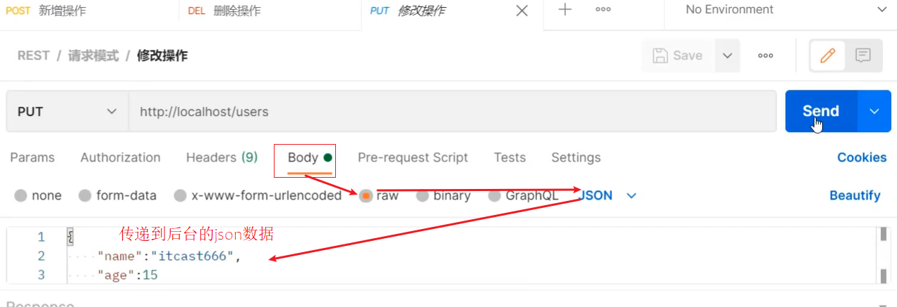

##### 根据ID查询

```java
@Controller
public class UserController {
    // 设置当前请求方法为 GET，表示 REST 风格中的查询操作
    @RequestMapping(value = "/users/{id}", method = RequestMethod.GET)
    @ResponseBody
    public String getById(@PathVariable Integer id){
        System.out.println("user getById..." + id);
        return "{'module':'user getById'}";
    }
}
```

将请求路径更改为`/users`

- 访问该方法使用 GET：`http://localhost/users/666`

##### 查询所有

```java
@Controller
public class UserController {
    // 设置当前请求方法为 GET，表示 REST 风格中的查询操作
    @RequestMapping(value = "/users", method = RequestMethod.GET)
    @ResponseBody
    public String getAll() {
        System.out.println("user getAll...");
        return "{'module':'user getAll'}";
    }
}
```

将请求路径更改为`/users`

- 访问该方法使用 GET：`http://localhost/users`

**小结**

RESTful 入门案例，我们需要学习的内容如下：

(1) 设定 Http 请求动作（动词）

@RequestMapping(value="", ==method== = RequestMethod.==POST|GET|PUT|DELETE==)

(2) 设定请求参数（路径变量）

@RequestMapping(value="/users/=={id}==", method = RequestMethod.DELETE)

@ReponseBody

public String delete(==@PathVariable== Integer ==id==) {

}

#### 知识点1：@PathVariable

| 名称 | @PathVariable                                                |
| ---- | ------------------------------------------------------------ |
| 类型 | ==形参注解==                                                 |
| 位置 | SpringMVC 控制器方法形参定义前面                             |
| 作用 | 绑定路径参数与处理器方法形参间的关系，要求路径参数名与形参名一一对应 |

关于接收参数，我们学过三个注解`@RequestBody`、`@RequestParam`、`@PathVariable`，这三个注解之间的区别和应用分别是什么？

* 区别
  * @RequestParam 用于接收 url 地址传参或表单传参
  * @RequestBody 用于接收 json 数据
  * @PathVariable 用于接收路径参数，使用 {参数名称} 描述路径参数
* 应用
  * 后期开发中，发送请求参数超过 1 个，便以 json 格式为主，@RequestBody 应用较广
  * 如果发送非 json 格式数据，选用 @RequestParam 接收请求参数
  * 采用 RESTful 进行开发，当参数数量较少时，例如 1 个，可以采用 @PathVariable 接收请求路径变量，通常用于传递 id 值

### 5.3 RESTful快速开发

做完了 RESTful 的开发，你会发现==好麻烦==，麻烦在哪？

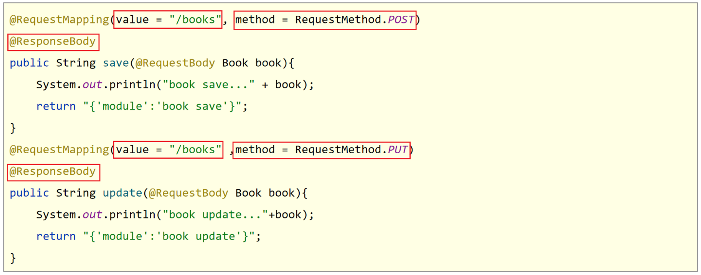

问题1：每个方法的 @RequestMapping 注解中都定义了访问路径 /books，重复性太高。

问题2：每个方法的 @RequestMapping 注解中都要使用 method 属性定义请求方式，重复性太高。

问题3：每个方法响应 json 都需要加上 @ResponseBody 注解，重复性太高。

对于上面所提的这三个问题，具体该如何解决？

```java
@RestController // @Controller + ReponseBody
@RequestMapping("/books")
public class BookController {
    
	// @RequestMapping(method = RequestMethod.POST)
    @PostMapping
    // @ReponseBody
    public String save(@RequestBody Book book) {
        System.out.println("book save..." + book);
        return "{'module':'book save'}";
    }

    // @RequestMapping(value = "/{id}", method = RequestMethod.DELETE)
    @DeleteMapping("/{id}")
    // @ReponseBody
    public String delete(@PathVariable Integer id) {
        System.out.println("book delete..." + id);
        return "{'module':'book delete'}";
    }

    // @RequestMapping(method = RequestMethod.PUT)
    @PutMapping
    // @ReponseBody
    public String update(@RequestBody Book book) {
        System.out.println("book update..." + book);
        return "{'module':'book update'}";
    }

    // @RequestMapping(value = "/{id}", method = RequestMethod.GET)
    @GetMapping("/{id}")
    // @ReponseBody
    public String getById(@PathVariable Integer id) {
        System.out.println("book getById..." + id);
        return "{'module':'book getById'}";
    }

    // @RequestMapping(method = RequestMethod.GET)
    @GetMapping
    // @ReponseBody
    public String getAll() {
        System.out.println("book getAll...");
        return "{'module':'book getAll'}";
    }
    
}
```

对于刚才的问题，我们都有对应的解决方案：

问题1：每个方法的 @RequestMapping 注解中都定义了访问路径 /books，重复性太高。

```
将 @RequestMapping 提到类上面，用来定义所有方法共同的访问路径。
```

问题2：每个方法的 @RequestMapping 注解中都要使用 method 属性定义请求方式，重复性太高。

```
使用 @GetMapping  @PostMapping  @PutMapping  @DeleteMapping 代替
```

问题3：每个方法响应 json 都需要加上 @ResponseBody 注解，重复性太高。

```
1.将 ResponseBody 提到类上面，让所有的方法都有 @ResponseBody 的功能
2.使用 @RestController 注解替换 @Controller 与 @ResponseBody 注解，简化书写
```

#### 知识点1：@RestController

| 名称 | @RestController                                              |
| ---- | ------------------------------------------------------------ |
| 类型 | ==类注解==                                                   |
| 位置 | 基于 SpringMVC 的 RESTful 开发控制器类定义上方               |
| 作用 | 设置当前控制器类为 RESTful 风格，<br/>等同于 @Controller 与 @ResponseBody 两个注解组合功能 |

#### 知识点2：@GetMapping @PostMapping @PutMapping @DeleteMapping

| 名称     | @GetMapping @PostMapping @PutMapping @DeleteMapping          |
| -------- | ------------------------------------------------------------ |
| 类型     | ==方法注解==                                                 |
| 位置     | 基于 SpringMVC 的 RESTful 开发控制器方法定义上方             |
| 作用     | 设置当前控制器方法请求访问路径与请求动作，每种对应一个请求动作，<br/>例如 @GetMapping 对应 GET 请求 |
| 相关属性 | value（默认）：请求访问路径                                  |

### 5.4 RESTful案例

#### 5.4.1 需求分析

需求一：图片列表查询，从后台返回数据，将数据展示在页面上

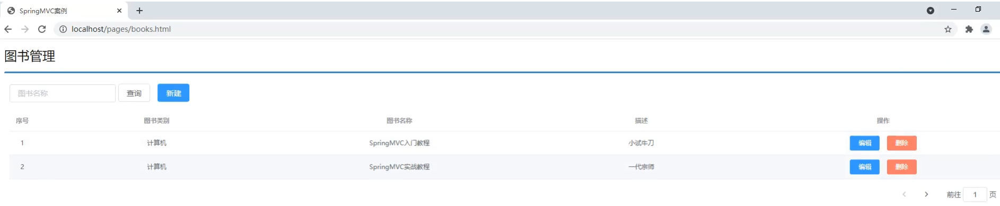

需求二：新增图片，将新增图书的数据传递到后台，并在控制台打印


**说明：**此次案例的重点是在 SpringMVC 中如何使用 RESTful 实现前后台交互，所以本案例并没有和数据库进行交互，所有数据使用`假`数据来完成开发。

步骤分析：

> 1. 搭建项目导入 jar 包
>
> 2. 编写 Controller 类，提供两个方法，一个用来做列表查询，一个用来做新增
>
> 3. 在方法上使用 RESTful 进行路径设置
>
> 4. 完成请求、参数的接收和结果的响应
>
> 5. 使用 PostMan 进行测试
>
> 6. 将前端页面拷贝到项目中
>
> 7. 页面发送 ajax 请求
>
> 8. 完成页面数据的展示

#### 5.4.2 环境准备

- 创建一个 Web 的 Maven 项目

- pom.xml 添加 Spring 依赖

  ```xml
  <?xml version="1.0" encoding="UTF-8"?>
  
  <project xmlns="http://maven.apache.org/POM/4.0.0" xmlns:xsi="http://www.w3.org/2001/XMLSchema-instance"
    xsi:schemaLocation="http://maven.apache.org/POM/4.0.0 http://maven.apache.org/xsd/maven-4.0.0.xsd">
    <modelVersion>4.0.0</modelVersion>
  
    <groupId>com.itheima</groupId>
    <artifactId>springmvc_07_rest_case</artifactId>
    <version>1.0-SNAPSHOT</version>
    <packaging>war</packaging>
  
    <dependencies>
      <dependency>
        <groupId>javax.servlet</groupId>
        <artifactId>javax.servlet-api</artifactId>
        <version>3.1.0</version>
        <scope>provided</scope>
      </dependency>
      <dependency>
        <groupId>org.springframework</groupId>
        <artifactId>spring-webmvc</artifactId>
        <version>5.2.10.RELEASE</version>
      </dependency>
      <dependency>
        <groupId>com.fasterxml.jackson.core</groupId>
        <artifactId>jackson-databind</artifactId>
        <version>2.9.0</version>
      </dependency>
    </dependencies>
  
    <build>
      <plugins>
        <plugin>
          <groupId>org.apache.tomcat.maven</groupId>
          <artifactId>tomcat7-maven-plugin</artifactId>
          <version>2.1</version>
          <configuration>
            <port>80</port>
            <path>/</path>
          </configuration>
        </plugin>
      </plugins>
    </build>
  </project>
  
  ```

- 创建对应的配置类

  ```java
  public class ServletContainersInitConfig extends AbstractAnnotationConfigDispatcherServletInitializer {
      protected Class<?>[] getRootConfigClasses() {
          return new Class[0];
      }
  
      protected Class<?>[] getServletConfigClasses() {
          return new Class[]{SpringMvcConfig.class};
      }
  
      protected String[] getServletMappings() {
          return new String[]{"/"};
      }
  
      // 乱码处理
      @Override
      protected Filter[] getServletFilters() {
          CharacterEncodingFilter filter = new CharacterEncodingFilter();
          filter.setEncoding("UTF-8");
          return new Filter[]{filter};
      }
  }
  
  @Configuration
  @ComponentScan("com.itheima.controller")
  // 开启 json 数据类型自动转换
  @EnableWebMvc
  public class SpringMvcConfig {
  }
  
  
  ```

- 编写模型类Book

  ```java
  public class Book {
      private Integer id;
      private String type;
      private String name;
      private String description;
      // setter...getter...toString略
  }
  ```

- 编写BookController

  ```java
  @Controller
  public class BookController {  
  }
  ```

最终创建好的项目结构如下：

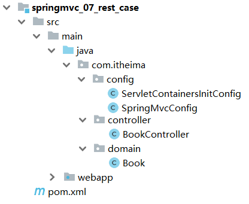

#### 5.4.2 后台接口开发

##### 步骤1：编写Controller类并使用RESTful进行配置

```java
@RestController
@RequestMapping("/books")
public class BookController {

    @PostMapping
    public String save(@RequestBody Book book){
        System.out.println("book save ==> "+ book);
        return "{'module':'book save success'}";
    }

 	@GetMapping
    public List<Book> getAll(){
        System.out.println("book getAll is running ...");
        List<Book> bookList = new ArrayList<Book>();

        Book book1 = new Book();
        book1.setType("计算机");
        book1.setName("SpringMVC入门教程");
        book1.setDescription("小试牛刀");
        bookList.add(book1);

        Book book2 = new Book();
        book2.setType("计算机");
        book2.setName("SpringMVC实战教程");
        book2.setDescription("一代宗师");
        bookList.add(book2);

        Book book3 = new Book();
        book3.setType("计算机丛书");
        book3.setName("SpringMVC实战教程进阶");
        book3.setDescription("一代宗师呕心创作");
        bookList.add(book3);

        return bookList;
    }

}
```

##### 步骤2：使用PostMan进行测试

测试新增

```json
{
    "type":"计算机丛书",
    "name":"SpringMVC终极开发",
    "description":"这是一本好书"
}
```

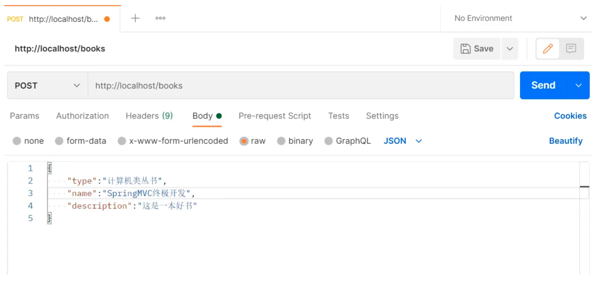

测试查询

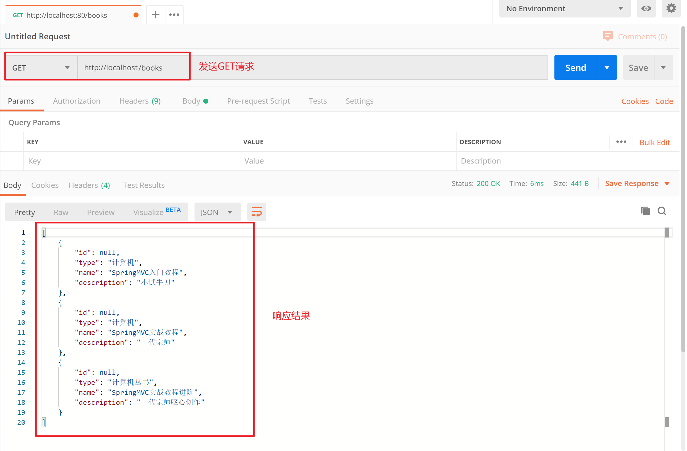

#### 5.4.3 页面访问处理

##### 步骤1：拷贝静态页面

将`资料\功能页面`下的所有内容拷贝到项目的`webapp`目录下

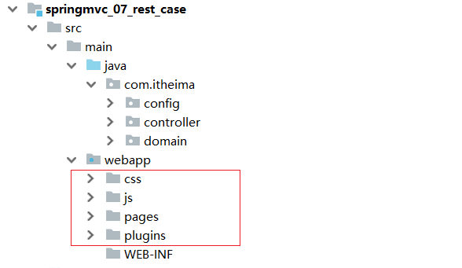

##### 步骤2：访问pages目录下的books.html

打开浏览器输入`http://localhost/pages/books.html`

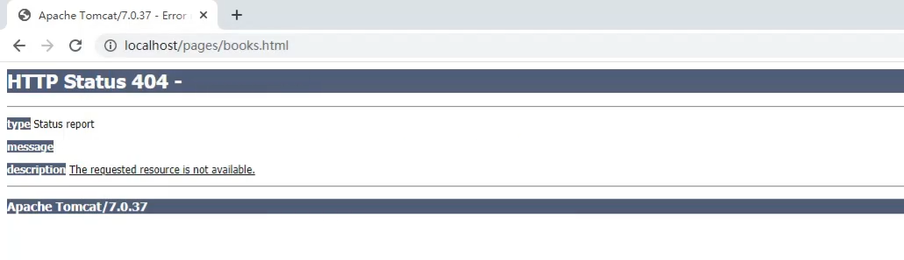

(1) 出现错误的原因？

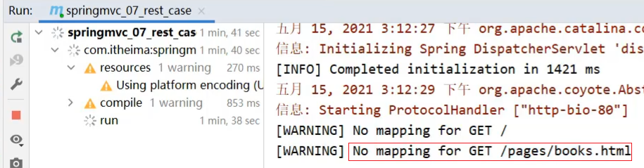

SpringMVC 拦截了静态资源，根据 /pages/books.html 去 controller 找对应的方法，找不到所以会报 404 的错误。

(2) SpringMVC 为什么会拦截静态资源呢？

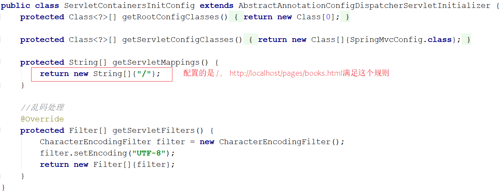

(3) 解决方案？

* SpringMVC 需要将静态资源进行放行。

```java
@Configuration
public class SpringMvcSupport extends WebMvcConfigurationSupport {
    // 设置静态资源访问过滤，当前类需要设置为配置类，并被扫描加载
    @Override
    protected void addResourceHandlers(ResourceHandlerRegistry registry) {
        // 当访问 /pages/???? 时候，从 /pages 目录下查找内容
        registry.addResourceHandler("/pages/**").addResourceLocations("/pages/");
        registry.addResourceHandler("/js/**").addResourceLocations("/js/");
        registry.addResourceHandler("/css/**").addResourceLocations("/css/");
        registry.addResourceHandler("/plugins/**").addResourceLocations("/plugins/");
    }
}
```

* 该配置类是在 config 目录下，SpringMVC 扫描的是 controller 包，所以该配置类还未生效，要想生效需要将 SpringMvcConfig 配置类进行修改

```java
@Configuration
@ComponentScan({"com.itheima.controller","com.itheima.config"})
@EnableWebMvc
public class SpringMvcConfig {
}

或者

@Configuration
@ComponentScan("com.itheima")
@EnableWebMvc
public class SpringMvcConfig {
}
```

##### 步骤3：修改books.html页面

```html
<!DOCTYPE html>

<html>
    <head>
        <!-- 页面meta -->
        <meta charset="utf-8">
        <title>SpringMVC案例</title>
        <!-- 引入样式 -->
        <link rel="stylesheet" href="../plugins/elementui/index.css">
        <link rel="stylesheet" href="../plugins/font-awesome/css/font-awesome.min.css">
        <link rel="stylesheet" href="../css/style.css">
    </head>

    <body class="hold-transition">

        <div id="app">

            <div class="content-header">
                <h1>图书管理</h1>
            </div>

            <div class="app-container">
                <div class="box">
                    <div class="filter-container">
                        <el-input placeholder="图书名称" style="width: 200px;" class="filter-item"></el-input>
                        <el-button class="dalfBut">查询</el-button>
                        <el-button type="primary" class="butT" @click="openSave()">新建</el-button>
                    </div>

                    <el-table size="small" current-row-key="id" :data="dataList" stripe highlight-current-row>
                        <el-table-column type="index" align="center" label="序号"></el-table-column>
                        <el-table-column prop="type" label="图书类别" align="center"></el-table-column>
                        <el-table-column prop="name" label="图书名称" align="center"></el-table-column>
                        <el-table-column prop="description" label="描述" align="center"></el-table-column>
                        <el-table-column label="操作" align="center">
                            <template slot-scope="scope">
                                <el-button type="primary" size="mini">编辑</el-button>
                                <el-button size="mini" type="danger">删除</el-button>
                            </template>
                        </el-table-column>
                    </el-table>

                    <div class="pagination-container">
                        <el-pagination
                            class="pagiantion"
                            @current-change="handleCurrentChange"
                            :current-page="pagination.currentPage"
                            :page-size="pagination.pageSize"
                            layout="total, prev, pager, next, jumper"
                            :total="pagination.total">
                        </el-pagination>
                    </div>

                    <!-- 新增标签弹层 -->
                    <div class="add-form">
                        <el-dialog title="新增图书" :visible.sync="dialogFormVisible">
                            <el-form ref="dataAddForm" :model="formData" :rules="rules" label-position="right" label-width="100px">
                                <el-row>
                                    <el-col :span="12">
                                        <el-form-item label="图书类别" prop="type">
                                            <el-input v-model="formData.type"/>
                                        </el-form-item>
                                    </el-col>
                                    <el-col :span="12">
                                        <el-form-item label="图书名称" prop="name">
                                            <el-input v-model="formData.name"/>
                                        </el-form-item>
                                    </el-col>
                                </el-row>
                                <el-row>
                                    <el-col :span="24">
                                        <el-form-item label="描述">
                                            <el-input v-model="formData.description" type="textarea"></el-input>
                                        </el-form-item>
                                    </el-col>
                                </el-row>
                            </el-form>
                            <div slot="footer" class="dialog-footer">
                                <el-button @click="dialogFormVisible = false">取消</el-button>
                                <el-button type="primary" @click="saveBook()">确定</el-button>
                            </div>
                        </el-dialog>
                    </div>

                </div>
            </div>
        </div>
    </body>

    <!-- 引入组件库 -->
    <script src="../js/vue.js"></script>
    <script src="../plugins/elementui/index.js"></script>
    <script type="text/javascript" src="../js/jquery.min.js"></script>
    <script src="../js/axios-0.18.0.js"></script>

    <script>
        var vue = new Vue({
            el: '#app',
            data: {
			   dataList: [],	// 当前页要展示的分页列表数据
                formData: {},	 // 表单数据
                dialogFormVisible: false,	// 增加表单是否可见
                dialogFormVisible4Edit:false,	// 编辑表单是否可见
                pagination: {},	// 分页模型数据，暂时弃用
            },

            // 钩子函数，VUE对象初始化完成后自动执行
            created() {
                this.getAll();
            },

            methods: {
                // 重置表单
                resetForm() {
                    // 清空输入框
                    this.formData = {};
                },

                // 弹出添加窗口
                openSave() {
                    this.dialogFormVisible = true;
                    this.resetForm();
                },

                // 添加
                saveBook () {
                    axios.post("/books",this.formData).then((res)=>{

                    });
                },

                // 主页列表查询
                getAll() {
                    axios.get("/books").then((res)=>{
                        this.dataList = res.data;
                    });
                },

            }
        })
    </script>
</html>
```

