## SpringMVC_day02

**今日内容**

> * 完成SSM的整合开发
> * 能够理解并实现统一结果封装与统一异常处理
> * 能够完成前后台功能整合开发
> * 掌握拦截器的编写

## 1，SSM整合

前面我们已经把`Mybatis`、`Spring`和`SpringMVC`三个框架进行了学习，今天主要的内容就是把这三个框架整合在一起完成我们的业务功能开发，具体如何来整合，我们一步步来学习。

### 1.1 流程分析

(1) 创建工程

* 创建一个Maven的web工程
* pom.xml添加SSM需要的依赖jar包
* 编写Web项目的入口配置类，实现`AbstractAnnotationConfigDispatcherServletInitializer`重写以下方法
  * getRootConfigClasses()	：返回Spring的配置类->需要==SpringConfig==配置类
  * getServletConfigClasses() ：返回SpringMVC的配置类->需要==SpringMvcConfig==配置类
  * getServletMappings()      : 设置SpringMVC请求拦截路径规则
  * getServletFilters()       ：设置过滤器，解决POST请求中文乱码问题

(2)SSM整合[==重点是各个配置的编写==]

* SpringConfig
  * 标识该类为配置类 @Configuration
  * 扫描Service所在的包 @ComponentScan
  * 在Service层要管理事务 @EnableTransactionManagement
  * 读取外部的properties配置文件 @PropertySource
  * 整合Mybatis需要引入Mybatis相关配置类 @Import
    * 第三方数据源配置类 JdbcConfig
      * 构建DataSource数据源，DruidDataSouroce,需要注入数据库连接四要素， @Bean @Value
      * 构建平台事务管理器，DataSourceTransactionManager,@Bean
    * Mybatis配置类 MybatisConfig
      * 构建SqlSessionFactoryBean并设置别名扫描与数据源，@Bean
      * 构建MapperScannerConfigurer并设置DAO层的包扫描
* SpringMvcConfig
  * 标识该类为配置类 @Configuration
  * 扫描Controller所在的包 @ComponentScan
  * 开启SpringMVC注解支持 @EnableWebMvc

(3)功能模块[与具体的业务模块有关]

* 创建数据库表
* 根据数据库表创建对应的模型类
* 通过Dao层完成数据库表的增删改查(接口+自动代理)
* 编写Service层[Service接口+实现类]
  * @Service
  * @Transactional
  * 整合Junit对业务层进行单元测试
    * @RunWith
    * @ContextConfiguration
    * @Test
* 编写Controller层
  * 接收请求 @RequestMapping @GetMapping @PostMapping @PutMapping @DeleteMapping
  * 接收数据 简单、POJO、嵌套POJO、集合、数组、JSON数据类型
    * @RequestParam
    * @PathVariable
    * @RequestBody
  * 转发业务层 
    * @Autowired
  * 响应结果
    * @ResponseBody

### 1.2 整合配置

掌握上述的知识点后，接下来，我们就可以按照上述的步骤一步步的来完成SSM的整合。

#### 步骤1：创建Maven的web项目

可以使用Maven的骨架创建

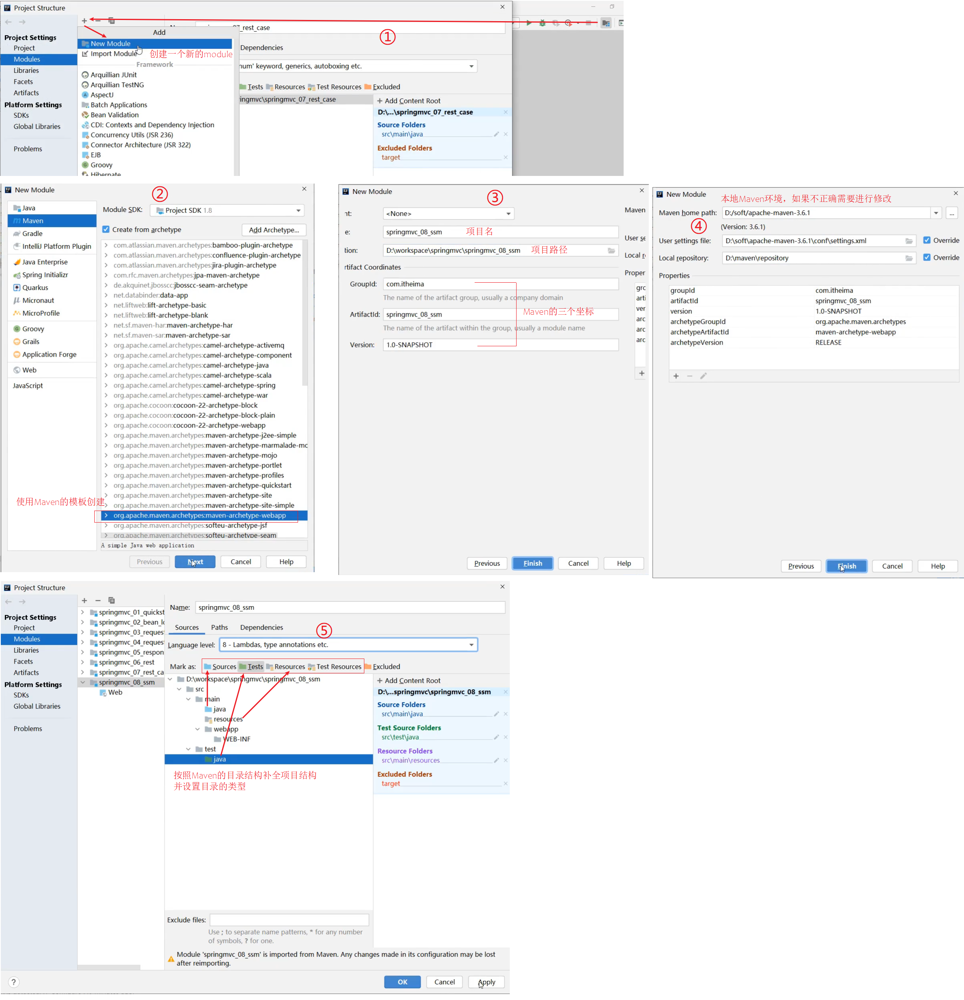

#### 步骤2:添加依赖

pom.xml添加SSM所需要的依赖jar包

```xml
<?xml version="1.0" encoding="UTF-8"?>

<project xmlns="http://maven.apache.org/POM/4.0.0" xmlns:xsi="http://www.w3.org/2001/XMLSchema-instance"
  xsi:schemaLocation="http://maven.apache.org/POM/4.0.0 http://maven.apache.org/xsd/maven-4.0.0.xsd">
  <modelVersion>4.0.0</modelVersion>

  <groupId>com.itheima</groupId>
  <artifactId>springmvc_08_ssm</artifactId>
  <version>1.0-SNAPSHOT</version>
  <packaging>war</packaging>

  <dependencies>
    <dependency>
      <groupId>org.springframework</groupId>
      <artifactId>spring-webmvc</artifactId>
      <version>5.2.10.RELEASE</version>
    </dependency>

    <dependency>
      <groupId>org.springframework</groupId>
      <artifactId>spring-jdbc</artifactId>
      <version>5.2.10.RELEASE</version>
    </dependency>

    <dependency>
      <groupId>org.springframework</groupId>
      <artifactId>spring-test</artifactId>
      <version>5.2.10.RELEASE</version>
    </dependency>

    <dependency>
      <groupId>org.mybatis</groupId>
      <artifactId>mybatis</artifactId>
      <version>3.5.6</version>
    </dependency>

    <dependency>
      <groupId>org.mybatis</groupId>
      <artifactId>mybatis-spring</artifactId>
      <version>1.3.0</version>
    </dependency>

    <dependency>
      <groupId>mysql</groupId>
      <artifactId>mysql-connector-java</artifactId>
      <version>5.1.47</version>
    </dependency>

    <dependency>
      <groupId>com.alibaba</groupId>
      <artifactId>druid</artifactId>
      <version>1.1.16</version>
    </dependency>

    <dependency>
      <groupId>junit</groupId>
      <artifactId>junit</artifactId>
      <version>4.12</version>
      <scope>test</scope>
    </dependency>

    <dependency>
      <groupId>javax.servlet</groupId>
      <artifactId>javax.servlet-api</artifactId>
      <version>3.1.0</version>
      <scope>provided</scope>
    </dependency>

    <dependency>
      <groupId>com.fasterxml.jackson.core</groupId>
      <artifactId>jackson-databind</artifactId>
      <version>2.9.0</version>
    </dependency>
  </dependencies>

  <build>
    <plugins>
      <plugin>
        <groupId>org.apache.tomcat.maven</groupId>
        <artifactId>tomcat7-maven-plugin</artifactId>
        <version>2.1</version>
        <configuration>
          <port>80</port>
          <path>/</path>
        </configuration>
      </plugin>
    </plugins>
  </build>
</project>


```

#### 步骤3:创建项目包结构

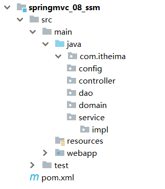

* config目录存放的是相关的配置类
* controller编写的是Controller类
* dao存放的是Dao接口，因为使用的是Mapper接口代理方式，所以没有实现类包
* service存的是Service接口，impl存放的是Service实现类
* resources:存入的是配置文件，如Jdbc.properties
* webapp:目录可以存放静态资源
* test/java:存放的是测试类

#### 步骤4:创建SpringConfig配置类

```java
@Configuration
@ComponentScan({"com.itheima.service"})
@PropertySource("classpath:jdbc.properties")
@Import({JdbcConfig.class,MyBatisConfig.class})
@EnableTransactionManagement
public class SpringConfig {
}
```

#### 步骤5:创建JdbcConfig配置类

```java
public class JdbcConfig {
    @Value("${jdbc.driver}")
    private String driver;
    @Value("${jdbc.url}")
    private String url;
    @Value("${jdbc.username}")
    private String username;
    @Value("${jdbc.password}")
    private String password;

    @Bean
    public DataSource dataSource(){
        DruidDataSource dataSource = new DruidDataSource();
        dataSource.setDriverClassName(driver);
        dataSource.setUrl(url);
        dataSource.setUsername(username);
        dataSource.setPassword(password);
        return dataSource;
    }

    @Bean
    public PlatformTransactionManager transactionManager(DataSource dataSource){
        DataSourceTransactionManager ds = new DataSourceTransactionManager();
        ds.setDataSource(dataSource);
        return ds;
    }
}
```

#### 步骤6:创建MybatisConfig配置类

```java
public class MyBatisConfig {
    @Bean
    public SqlSessionFactoryBean sqlSessionFactory(DataSource dataSource){
        SqlSessionFactoryBean factoryBean = new SqlSessionFactoryBean();
        factoryBean.setDataSource(dataSource);
        factoryBean.setTypeAliasesPackage("com.itheima.domain");
        return factoryBean;
    }

    @Bean
    public MapperScannerConfigurer mapperScannerConfigurer(){
        MapperScannerConfigurer msc = new MapperScannerConfigurer();
        msc.setBasePackage("com.itheima.dao");
        return msc;
    }
}
```

#### 步骤7:创建jdbc.properties

在resources下提供jdbc.properties,设置数据库连接四要素

```properties
jdbc.driver=com.mysql.jdbc.Driver
jdbc.url=jdbc:mysql://localhost:3306/ssm_db
jdbc.username=root
jdbc.password=root
```

#### 步骤8:创建SpringMVC配置类

```java
@Configuration
@ComponentScan("com.itheima.controller")
@EnableWebMvc
public class SpringMvcConfig {
}
```

#### 步骤9:创建Web项目入口配置类

```java
public class ServletConfig extends AbstractAnnotationConfigDispatcherServletInitializer {
    //加载Spring配置类
    protected Class<?>[] getRootConfigClasses() {
        return new Class[]{SpringConfig.class};
    }
    //加载SpringMVC配置类
    protected Class<?>[] getServletConfigClasses() {
        return new Class[]{SpringMvcConfig.class};
    }
    //设置SpringMVC请求地址拦截规则
    protected String[] getServletMappings() {
        return new String[]{"/"};
    }
    //设置post请求中文乱码过滤器
    @Override
    protected Filter[] getServletFilters() {
        CharacterEncodingFilter filter = new CharacterEncodingFilter();
        filter.setEncoding("utf-8");
        return new Filter[]{filter};
    }
}

```

至此SSM整合的环境就已经搭建好了。在这个环境上，我们如何进行功能模块的开发呢?

### 1.3 功能模块开发

> 需求:对表tbl_book进行新增、修改、删除、根据ID查询和查询所有

#### 步骤1:创建数据库及表

```sql
create database ssm_db character set utf8;
use ssm_db;
create table tbl_book(
  id int primary key auto_increment,
  type varchar(20),
  name varchar(50),
  description varchar(255)
)

insert  into `tbl_book`(`id`,`type`,`name`,`description`) values (1,'计算机理论','Spring实战 第五版','Spring入门经典教程，深入理解Spring原理技术内幕'),(2,'计算机理论','Spring 5核心原理与30个类手写实践','十年沉淀之作，手写Spring精华思想'),(3,'计算机理论','Spring 5设计模式','深入Spring源码刨析Spring源码中蕴含的10大设计模式'),(4,'计算机理论','Spring MVC+Mybatis开发从入门到项目实战','全方位解析面向Web应用的轻量级框架，带你成为Spring MVC开发高手'),(5,'计算机理论','轻量级Java Web企业应用实战','源码级刨析Spring框架，适合已掌握Java基础的读者'),(6,'计算机理论','Java核心技术 卷Ⅰ 基础知识(原书第11版)','Core Java第11版，Jolt大奖获奖作品，针对Java SE9、10、11全面更新'),(7,'计算机理论','深入理解Java虚拟机','5个纬度全面刨析JVM,大厂面试知识点全覆盖'),(8,'计算机理论','Java编程思想(第4版)','Java学习必读经典，殿堂级著作！赢得了全球程序员的广泛赞誉'),(9,'计算机理论','零基础学Java(全彩版)','零基础自学编程的入门图书，由浅入深，详解Java语言的编程思想和核心技术'),(10,'市场营销','直播就这么做:主播高效沟通实战指南','李子柒、李佳奇、薇娅成长为网红的秘密都在书中'),(11,'市场营销','直播销讲实战一本通','和秋叶一起学系列网络营销书籍'),(12,'市场营销','直播带货:淘宝、天猫直播从新手到高手','一本教你如何玩转直播的书，10堂课轻松实现带货月入3W+');
```

#### 步骤2:编写模型类

```java
public class Book {
    private Integer id;
    private String type;
    private String name;
    private String description;
    //getter...setter...toString省略
}
```

#### 步骤3:编写Dao接口

```java
public interface BookDao {

//    @Insert("insert into tbl_book values(null,#{type},#{name},#{description})")
    @Insert("insert into tbl_book (type,name,description) values(#{type},#{name},#{description})")
    public void save(Book book);

    @Update("update tbl_book set type = #{type}, name = #{name}, description = #{description} where id = #{id}")
    public void update(Book book);

    @Delete("delete from tbl_book where id = #{id}")
    public void delete(Integer id);

    @Select("select * from tbl_book where id = #{id}")
    public Book getById(Integer id);

    @Select("select * from tbl_book")
    public List<Book> getAll();
}
```

#### 步骤4:编写Service接口和实现类

```java
@Transactional
public interface BookService {
    /**
     * 保存
     * @param book
     * @return
     */
    public boolean save(Book book);

    /**
     * 修改
     * @param book
     * @return
     */
    public boolean update(Book book);

    /**
     * 按id删除
     * @param id
     * @return
     */
    public boolean delete(Integer id);

    /**
     * 按id查询
     * @param id
     * @return
     */
    public Book getById(Integer id);

    /**
     * 查询全部
     * @return
     */
    public List<Book> getAll();
}
```

```java
@Service
public class BookServiceImpl implements BookService {
    @Autowired
    private BookDao bookDao;

    public boolean save(Book book) {
        bookDao.save(book);
        return true;
    }

    public boolean update(Book book) {
        bookDao.update(book);
        return true;
    }

    public boolean delete(Integer id) {
        bookDao.delete(id);
        return true;
    }

    public Book getById(Integer id) {
        return bookDao.getById(id);
    }

    public List<Book> getAll() {
        return bookDao.getAll();
    }
}
```

**说明:**

* bookDao在Service中注入的会提示一个红线提示，为什么呢?

  * BookDao是一个接口，没有实现类，接口是不能创建对象的，所以最终注入的应该是代理对象
  * 代理对象是由Spring的IOC容器来创建管理的
  * IOC容器又是在Web服务器启动的时候才会创建
  * IDEA在检测依赖关系的时候，没有找到适合的类注入，所以会提示错误提示
  * 但是程序运行的时候，代理对象就会被创建，框架会使用DI进行注入，所以程序运行无影响。

* 如何解决上述问题?

  * 可以不用理会，因为运行是正常的

  * 设置错误提示级别

    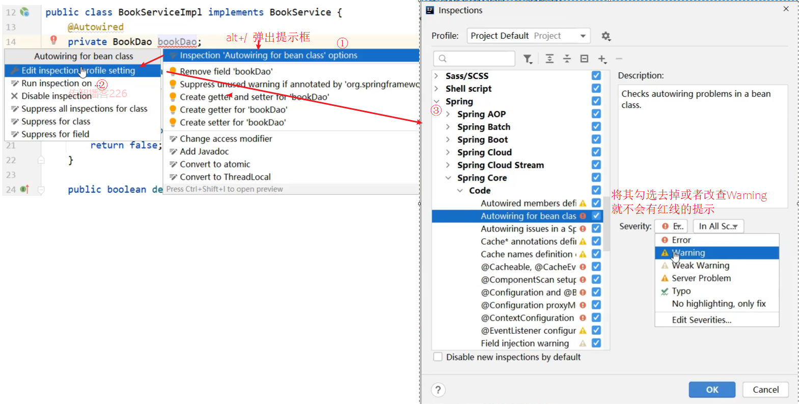


#### 步骤5:编写Contorller类

```java
@RestController
@RequestMapping("/books")
public class BookController {

    @Autowired
    private BookService bookService;

    @PostMapping
    public boolean save(@RequestBody Book book) {
        return bookService.save(book);
    }

    @PutMapping
    public boolean update(@RequestBody Book book) {
        return bookService.update(book);
    }

    @DeleteMapping("/{id}")
    public boolean delete(@PathVariable Integer id) {
        return bookService.delete(id);
    }

    @GetMapping("/{id}")
    public Book getById(@PathVariable Integer id) {
        return bookService.getById(id);
    }

    @GetMapping
    public List<Book> getAll() {
        return bookService.getAll();
    }
}
```

对于图书模块的增删改查就已经完成了编写，我们可以从后往前写也可以从前往后写，最终只需要能把功能实现即可。

接下来我们就先把业务层的代码使用`Spring整合Junit`的知识点进行单元测试:

### 1.4 单元测试

#### 步骤1:新建测试类

```java
@RunWith(SpringJUnit4ClassRunner.class)
@ContextConfiguration(classes = SpringConfig.class)
public class BookServiceTest {

}
```

#### 步骤2:注入Service类

```java
@RunWith(SpringJUnit4ClassRunner.class)
@ContextConfiguration(classes = SpringConfig.class)
public class BookServiceTest {

    @Autowired
    private BookService bookService;


}
```

#### 步骤3:编写测试方法

我们先来对查询进行单元测试。

```java
@RunWith(SpringJUnit4ClassRunner.class)
@ContextConfiguration(classes = SpringConfig.class)
public class BookServiceTest {

    @Autowired
    private BookService bookService;

    @Test
    public void testGetById(){
        Book book = bookService.getById(1);
        System.out.println(book);
    }

    @Test
    public void testGetAll(){
        List<Book> all = bookService.getAll();
        System.out.println(all);
    }

}
```

根据ID查询，测试的结果为:

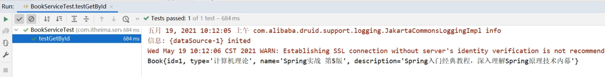

查询所有，测试的结果为:

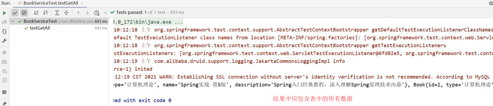

### 1.5 PostMan测试

#### 新增

`http://localhost/books`

```json
{
	"type":"类别测试数据",
    "name":"书名测试数据",
    "description":"描述测试数据"
}
```

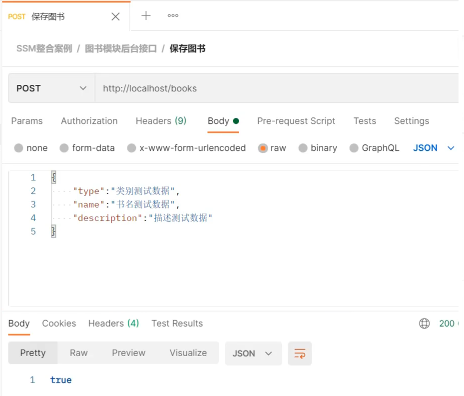

#### 修改

`http://localhost/books`

```json
{
    "id":13,
	"type":"类别测试数据",
    "name":"书名测试数据",
    "description":"描述测试数据"
}
```

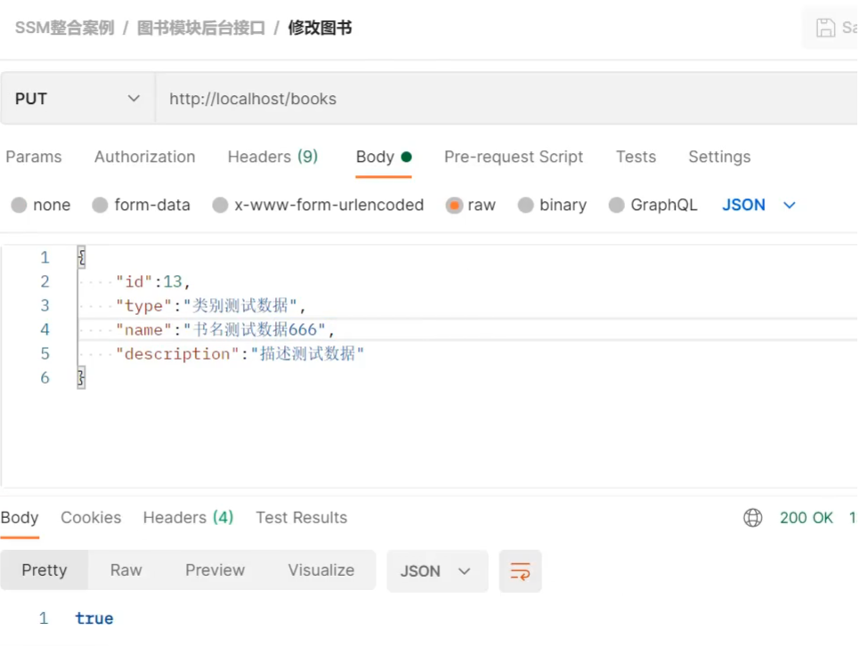

#### 删除

`http://localhost/books/14`

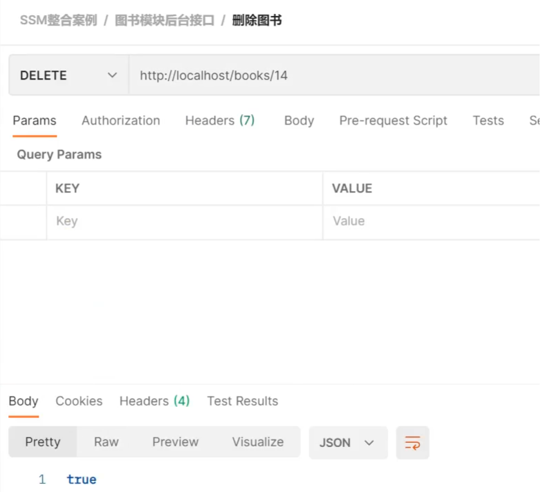

#### 查询单个

`http://localhost/books/1`

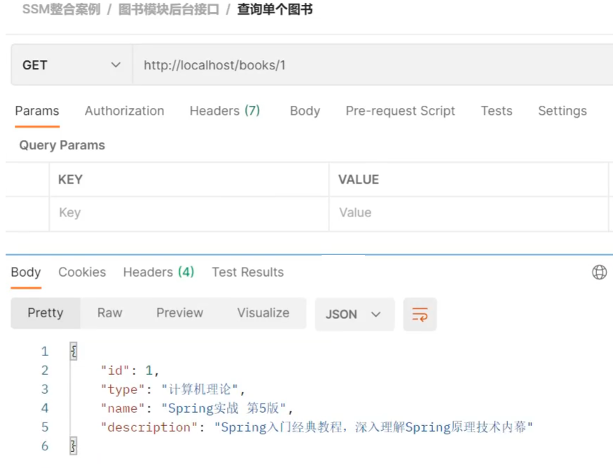

#### 查询所有

`http://localhost/books`

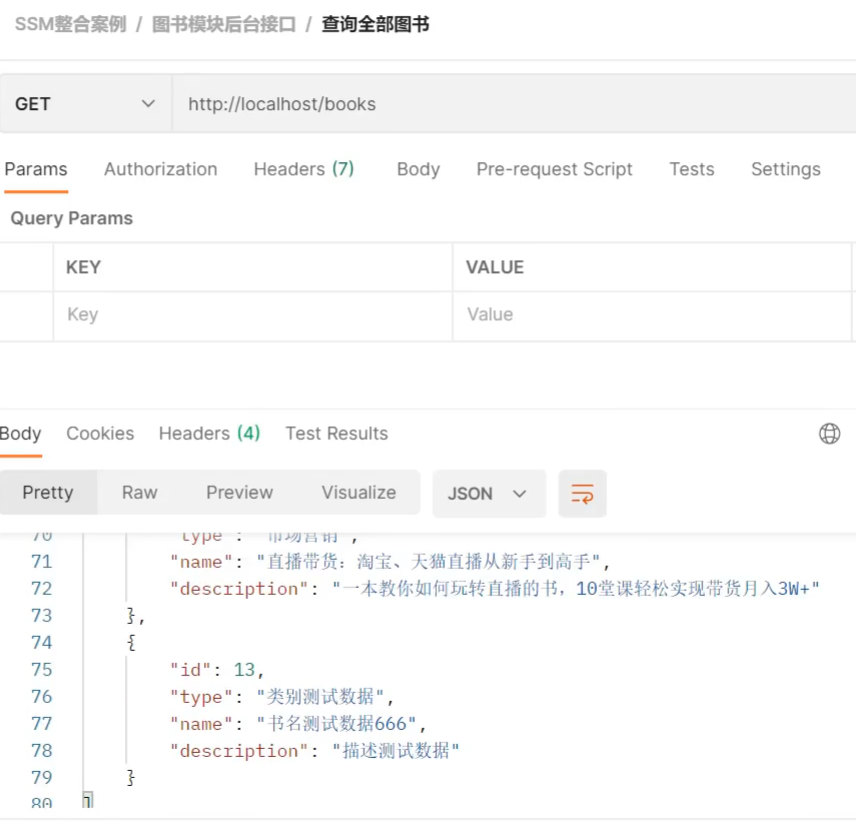

## 2，统一结果封装

### 2.1 表现层与前端数据传输协议定义

SSM整合以及功能模块开发完成后，接下来，我们在上述案例的基础上分析下有哪些问题需要我们去解决下。首先第一个问题是:

* 在Controller层增删改返回给前端的是boolean类型数据

  

* 在Controller层查询单个返回给前端的是对象

  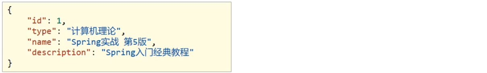

* 在Controller层查询所有返回给前端的是集合对象

  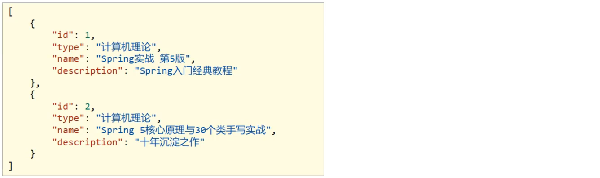

目前我们就已经有三种数据类型返回给前端，如果随着业务的增长，我们需要返回的数据类型会越来越多。对于前端开发人员在解析数据的时候就比较凌乱了，所以对于前端来说，如果后台能够返回一个统一的数据结果，前端在解析的时候就可以按照一种方式进行解析。开发就会变得更加简单。

所以我们就想能不能将返回结果的数据进行统一，具体如何来做，大体的思路为:

* 为了封装返回的结果数据:==创建结果模型类，封装数据到data属性中==
* 为了封装返回的数据是何种操作及是否操作成功:==封装操作结果到code属性中==
* 操作失败后为了封装返回的错误信息:==封装特殊消息到message(msg)属性中==

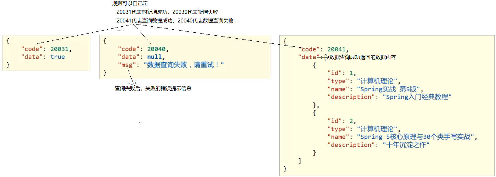

根据分析，我们可以设置统一数据返回结果类

```java
public class Result{
	private Object data;
	private Integer code;
	private String msg;
}
```

**注意:**Result类名及类中的字段并不是固定的，可以根据需要自行增减提供若干个构造方法，方便操作。

### 2.2 表现层与前端数据传输协议实现

前面我们已经分析了如何封装返回结果数据，具体在项目中该如何实现，我们通过个例子来操作一把

#### 2.2.1 环境准备

- 创建一个Web的Maven项目
- pom.xml添加SSM整合所需jar包
- 创建对应的配置类
- 编写Controller、Service接口、Service实现类、Dao接口和模型类
- resources下提供jdbc.properties配置文件

因为这个项目环境的内容和SSM整合的内容是一致的，所以我们就不在把代码粘出来了，大家在练习的时候可以在前面整合的例子案例环境下，进行本节内容的开发。

最终创建好的项目结构如下:

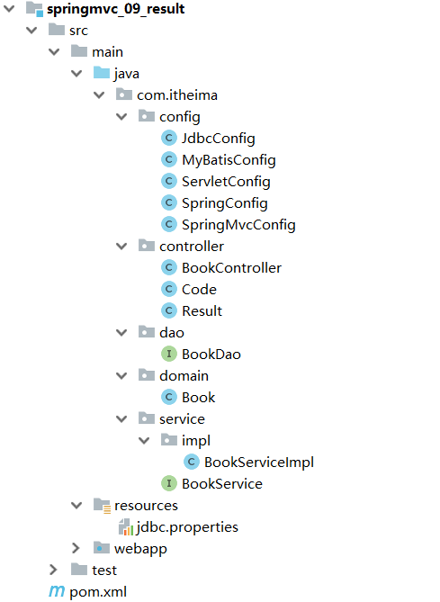

#### 2.2.2 结果封装

对于结果封装，我们应该是在表现层进行处理，所以我们把结果类放在controller包下，当然你也可以放在domain包，这个都是可以的，具体如何实现结果封装，具体的步骤为:

##### 步骤1:创建Result类

```java
public class Result {
    //描述统一格式中的数据
    private Object data;
    //描述统一格式中的编码，用于区分操作，可以简化配置0或1表示成功失败
    private Integer code;
    //描述统一格式中的消息，可选属性
    private String msg;

    public Result() {
    }
	//构造方法是方便对象的创建
    public Result(Integer code,Object data) {
        this.data = data;
        this.code = code;
    }
	//构造方法是方便对象的创建
    public Result(Integer code, Object data, String msg) {
        this.data = data;
        this.code = code;
        this.msg = msg;
    }
	//setter...getter...省略
}
```

##### 步骤2:定义返回码Code类

```java
//状态码
public class Code {
    public static final Integer SAVE_OK = 20011;
    public static final Integer DELETE_OK = 20021;
    public static final Integer UPDATE_OK = 20031;
    public static final Integer GET_OK = 20041;

    public static final Integer SAVE_ERR = 20010;
    public static final Integer DELETE_ERR = 20020;
    public static final Integer UPDATE_ERR = 20030;
    public static final Integer GET_ERR = 20040;
}

```

**注意:**code类中的常量设计也不是固定的，可以根据需要自行增减，例如将查询再进行细分为GET_OK,GET_ALL_OK,GET_PAGE_OK等。

##### 步骤3:修改Controller类的返回值

```java
//统一每一个控制器方法返回值
@RestController
@RequestMapping("/books")
public class BookController {

    @Autowired
    private BookService bookService;

    @PostMapping
    public Result save(@RequestBody Book book) {
        boolean flag = bookService.save(book);
        return new Result(flag ? Code.SAVE_OK:Code.SAVE_ERR,flag);
    }

    @PutMapping
    public Result update(@RequestBody Book book) {
        boolean flag = bookService.update(book);
        return new Result(flag ? Code.UPDATE_OK:Code.UPDATE_ERR,flag);
    }

    @DeleteMapping("/{id}")
    public Result delete(@PathVariable Integer id) {
        boolean flag = bookService.delete(id);
        return new Result(flag ? Code.DELETE_OK:Code.DELETE_ERR,flag);
    }

    @GetMapping("/{id}")
    public Result getById(@PathVariable Integer id) {
        Book book = bookService.getById(id);
        Integer code = book != null ? Code.GET_OK : Code.GET_ERR;
        String msg = book != null ? "" : "数据查询失败，请重试！";
        return new Result(code,book,msg);
    }

    @GetMapping
    public Result getAll() {
        List<Book> bookList = bookService.getAll();
        Integer code = bookList != null ? Code.GET_OK : Code.GET_ERR;
        String msg = bookList != null ? "" : "数据查询失败，请重试！";
        return new Result(code,bookList,msg);
    }
}
```

##### 步骤4:启动服务测试

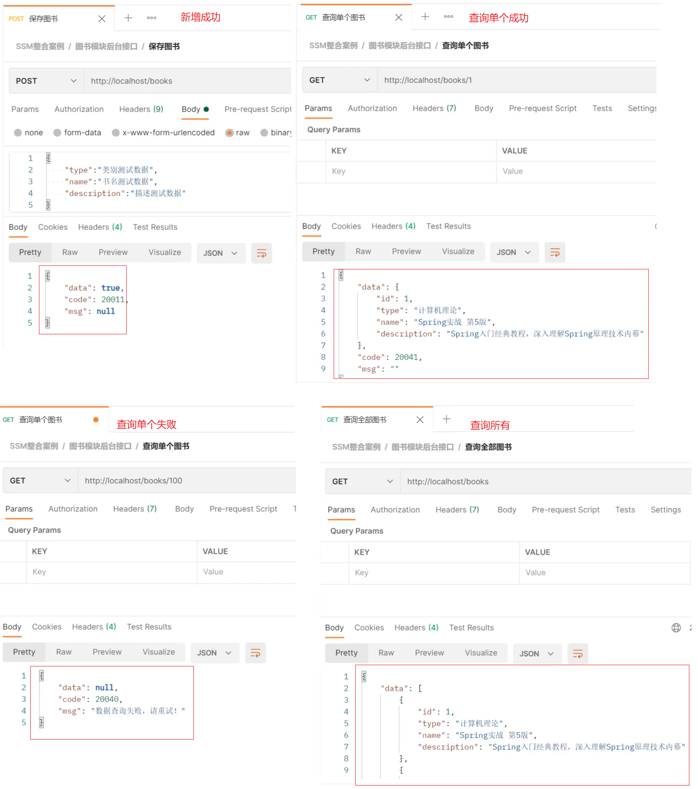

至此，我们的返回结果就已经能以一种统一的格式返回给前端。前端根据返回的结果，先从中获取`code`,根据code判断，如果成功则取`data`属性的值，如果失败，则取`msg`中的值做提示。

## 3，统一异常处理

### 3.1 问题描述

在讲解这一部分知识点之前，我们先来演示个效果，修改BookController类的`getById`方法

```java
@GetMapping("/{id}")
public Result getById(@PathVariable Integer id) {
    //手动添加一个错误信息
    if(id==1){
        int i = 1/0;
    }
    Book book = bookService.getById(id);
    Integer code = book != null ? Code.GET_OK : Code.GET_ERR;
    String msg = book != null ? "" : "数据查询失败，请重试！";
    return new Result(code,book,msg);
}
```

重新启动运行项目，使用PostMan发送请求，当传入的id为1，则会出现如下效果：

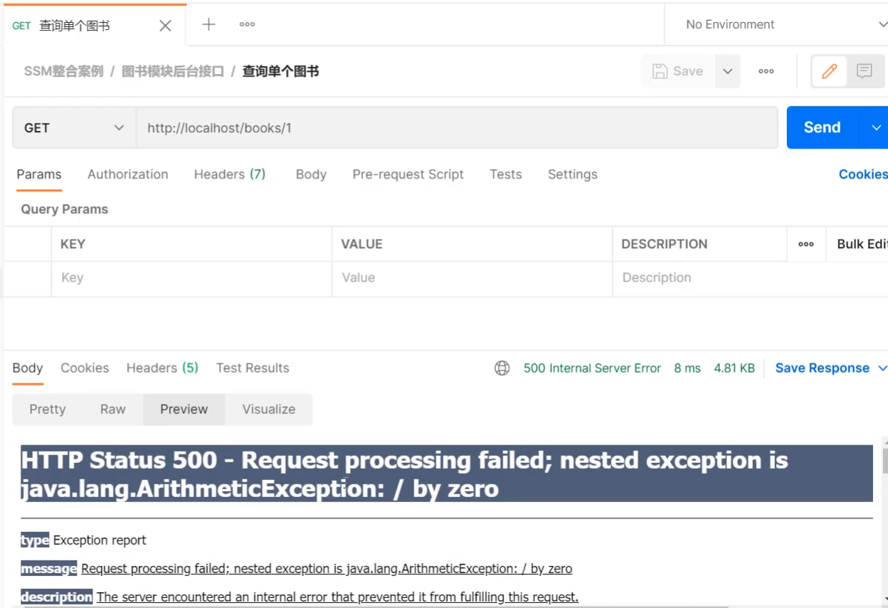

前端接收到这个信息后和之前我们约定的格式不一致，这个问题该如何解决?

在解决问题之前，我们先来看下异常的种类及出现异常的原因:

- 框架内部抛出的异常：因使用不合规导致
- 数据层抛出的异常：因外部服务器故障导致（例如：服务器访问超时）
- 业务层抛出的异常：因业务逻辑书写错误导致（例如：遍历业务书写操作，导致索引异常等）
- 表现层抛出的异常：因数据收集、校验等规则导致（例如：不匹配的数据类型间导致异常）
- 工具类抛出的异常：因工具类书写不严谨不够健壮导致（例如：必要释放的连接长期未释放等）

看完上面这些出现异常的位置，你会发现，在我们开发的任何一个位置都有可能出现异常，而且这些异常是不能避免的。所以我们就得将异常进行处理。

**思考**

1. 各个层级均出现异常，异常处理代码书写在哪一层?

   ==所有的异常均抛出到表现层进行处理==

2. 异常的种类很多，表现层如何将所有的异常都处理到呢?

   ==异常分类==

3. 表现层处理异常，每个方法中单独书写，代码书写量巨大且意义不强，如何解决?

   ==AOP==

对于上面这些问题及解决方案，SpringMVC已经为我们提供了一套解决方案:

* 异常处理器:

  * 集中的、统一的处理项目中出现的异常。

    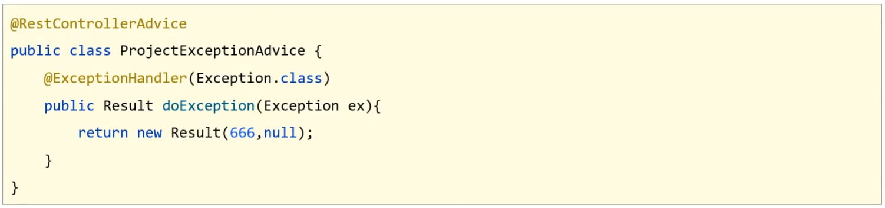

### 3.2 异常处理器的使用

#### 3.2.1 环境准备

- 创建一个Web的Maven项目
- pom.xml添加SSM整合所需jar包
- 创建对应的配置类
- 编写Controller、Service接口、Service实现类、Dao接口和模型类
- resources下提供jdbc.properties配置文件

内容参考前面的项目或者直接使用前面的项目进行本节内容的学习。

最终创建好的项目结构如下:


#### 3.2.2 使用步骤

##### 步骤1:创建异常处理器类

```java
//@RestControllerAdvice用于标识当前类为REST风格对应的异常处理器
@RestControllerAdvice
public class ProjectExceptionAdvice {
    //除了自定义的异常处理器，保留对Exception类型的异常处理，用于处理非预期的异常
    @ExceptionHandler(Exception.class)
    public void doException(Exception ex){
      	System.out.println("嘿嘿,异常你哪里跑！")
    }
}

```

==确保SpringMvcConfig能够扫描到异常处理器类==

##### 步骤2:让程序抛出异常

修改`BookController`的getById方法，添加`int i = 1/0`.

```java
@GetMapping("/{id}")
public Result getById(@PathVariable Integer id) {
  	int i = 1/0;
    Book book = bookService.getById(id);
    Integer code = book != null ? Code.GET_OK : Code.GET_ERR;
    String msg = book != null ? "" : "数据查询失败，请重试！";
    return new Result(code,book,msg);
}
```

##### 步骤3:运行程序，测试

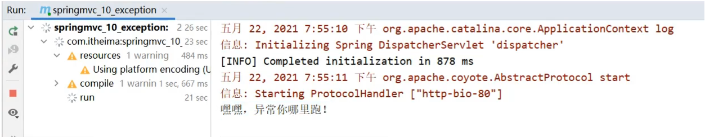

说明异常已经被拦截并执行了`doException`方法。

##### 异常处理器类返回结果给前端

```java
//@RestControllerAdvice用于标识当前类为REST风格对应的异常处理器
@RestControllerAdvice
public class ProjectExceptionAdvice {
    //除了自定义的异常处理器，保留对Exception类型的异常处理，用于处理非预期的异常
    @ExceptionHandler(Exception.class)
    public Result doException(Exception ex){
      	System.out.println("嘿嘿,异常你哪里跑！")
        return new Result(666,null,"嘿嘿,异常你哪里跑！");
    }
}

```

启动运行程序，测试

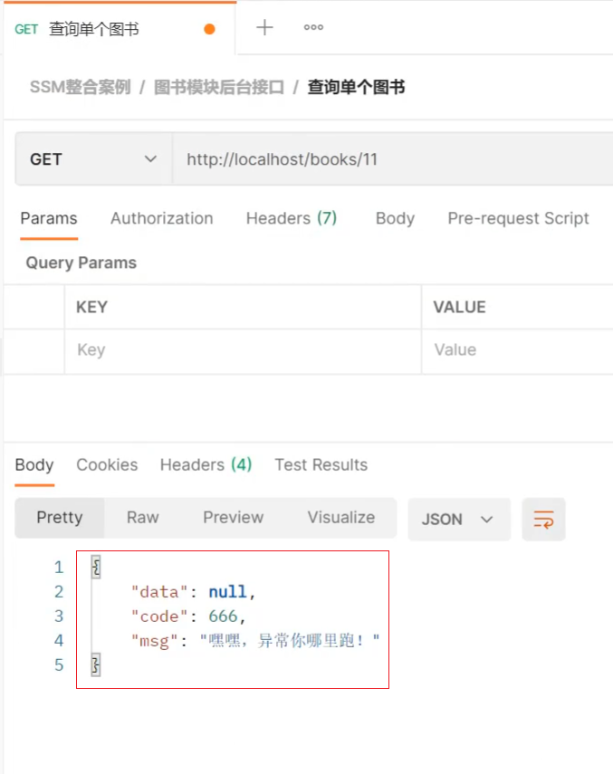

至此，就算后台执行的过程中抛出异常，最终也能按照我们和前端约定好的格式返回给前端。

#### 知识点1：@RestControllerAdvice

| 名称 | @RestControllerAdvice              |
| ---- | ---------------------------------- |
| 类型 | ==类注解==                         |
| 位置 | Rest风格开发的控制器增强类定义上方 |
| 作用 | 为Rest风格开发的控制器类做增强     |

**说明:**此注解自带@ResponseBody注解与@Component注解，具备对应的功能


#### 知识点2：@ExceptionHandler

| 名称 | @ExceptionHandler                                            |
| ---- | ------------------------------------------------------------ |
| 类型 | ==方法注解==                                                 |
| 位置 | 专用于异常处理的控制器方法上方                               |
| 作用 | 设置指定异常的处理方案，功能等同于控制器方法，<br/>出现异常后终止原始控制器执行,并转入当前方法执行 |

**说明：**此类方法可以根据处理的异常不同，制作多个方法分别处理对应的异常

### 3.3 项目异常处理方案

#### 3.3.1 异常分类

异常处理器我们已经能够使用了，那么在咱们的项目中该如何来处理异常呢?

因为异常的种类有很多，如果每一个异常都对应一个@ExceptionHandler，那得写多少个方法来处理各自的异常，所以我们在处理异常之前，需要对异常进行一个分类:

- 业务异常（BusinessException）

  - 规范的用户行为产生的异常

    - 用户在页面输入内容的时候未按照指定格式进行数据填写，如在年龄框输入的是字符串

      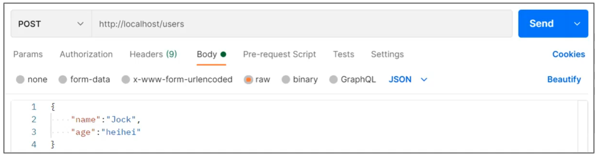

  - 不规范的用户行为操作产生的异常

    - 如用户故意传递错误数据

      

- 系统异常（SystemException）

  - 项目运行过程中可预计但无法避免的异常
    - 比如数据库或服务器宕机

- 其他异常（Exception）

  - 编程人员未预期到的异常，如:用到的文件不存在

    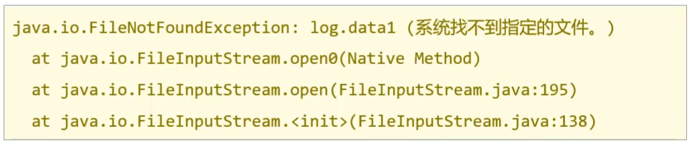

将异常分类以后，针对不同类型的异常，要提供具体的解决方案:

#### 3.3.2 异常解决方案

- 业务异常（BusinessException）
  - 发送对应消息传递给用户，提醒规范操作
    - 大家常见的就是提示用户名已存在或密码格式不正确等
- 系统异常（SystemException）
  - 发送固定消息传递给用户，安抚用户
    - 系统繁忙，请稍后再试
    - 系统正在维护升级，请稍后再试
    - 系统出问题，请联系系统管理员等
  - 发送特定消息给运维人员，提醒维护
    - 可以发送短信、邮箱或者是公司内部通信软件
  - 记录日志
    - 发消息和记录日志对用户来说是不可见的，属于后台程序
- 其他异常（Exception）
  - 发送固定消息传递给用户，安抚用户
  - 发送特定消息给编程人员，提醒维护（纳入预期范围内）
    - 一般是程序没有考虑全，比如未做非空校验等
  - 记录日志

#### 3.3.3 异常解决方案的具体实现

> 思路:
>
> 1.先通过自定义异常，完成BusinessException和SystemException的定义
>
> 2.将其他异常包装成自定义异常类型
>
> 3.在异常处理器类中对不同的异常进行处理

##### 步骤1:自定义异常类

```java
//自定义异常处理器，用于封装异常信息，对异常进行分类
public class SystemException extends RuntimeException{
    private Integer code;

    public Integer getCode() {
        return code;
    }

    public void setCode(Integer code) {
        this.code = code;
    }

    public SystemException(Integer code, String message) {
        super(message);
        this.code = code;
    }

    public SystemException(Integer code, String message, Throwable cause) {
        super(message, cause);
        this.code = code;
    }

}

//自定义异常处理器，用于封装异常信息，对异常进行分类
public class BusinessException extends RuntimeException{
    private Integer code;

    public Integer getCode() {
        return code;
    }

    public void setCode(Integer code) {
        this.code = code;
    }

    public BusinessException(Integer code, String message) {
        super(message);
        this.code = code;
    }

    public BusinessException(Integer code, String message, Throwable cause) {
        super(message, cause);
        this.code = code;
    }

}


```

**说明:**

* 让自定义异常类继承`RuntimeException`的好处是，后期在抛出这两个异常的时候，就不用在try...catch...或throws了
* 自定义异常类中添加`code`属性的原因是为了更好的区分异常是来自哪个业务的

##### 步骤2:将其他异常包成自定义异常

假如在BookServiceImpl的getById方法抛异常了，该如何来包装呢?

```java
public Book getById(Integer id) {
    //模拟业务异常，包装成自定义异常
    if(id == 1){
        throw new BusinessException(Code.BUSINESS_ERR,"请不要使用你的技术挑战我的耐性!");
    }
    //模拟系统异常，将可能出现的异常进行包装，转换成自定义异常
    try{
        int i = 1/0;
    }catch (Exception e){
        throw new SystemException(Code.SYSTEM_TIMEOUT_ERR,"服务器访问超时，请重试!",e);
    }
    return bookDao.getById(id);
}
```

具体的包装方式有：

* 方式一:`try{}catch(){}`在catch中重新throw我们自定义异常即可。
* 方式二:直接throw自定义异常即可

上面为了使`code`看着更专业些，我们在Code类中再新增需要的属性

```java
//状态码
public class Code {
    public static final Integer SAVE_OK = 20011;
    public static final Integer DELETE_OK = 20021;
    public static final Integer UPDATE_OK = 20031;
    public static final Integer GET_OK = 20041;

    public static final Integer SAVE_ERR = 20010;
    public static final Integer DELETE_ERR = 20020;
    public static final Integer UPDATE_ERR = 20030;
    public static final Integer GET_ERR = 20040;
    public static final Integer SYSTEM_ERR = 50001;
    public static final Integer SYSTEM_TIMEOUT_ERR = 50002;
    public static final Integer SYSTEM_UNKNOW_ERR = 59999;

    public static final Integer BUSINESS_ERR = 60002;
}

```

##### 步骤3:处理器类中处理自定义异常

```java
//@RestControllerAdvice用于标识当前类为REST风格对应的异常处理器
@RestControllerAdvice
public class ProjectExceptionAdvice {
    //@ExceptionHandler用于设置当前处理器类对应的异常类型
    @ExceptionHandler(SystemException.class)
    public Result doSystemException(SystemException ex){
        //记录日志
        //发送消息给运维
        //发送邮件给开发人员,ex对象发送给开发人员
        return new Result(ex.getCode(),null,ex.getMessage());
    }

    @ExceptionHandler(BusinessException.class)
    public Result doBusinessException(BusinessException ex){
        return new Result(ex.getCode(),null,ex.getMessage());
    }

    //除了自定义的异常处理器，保留对Exception类型的异常处理，用于处理非预期的异常
    @ExceptionHandler(Exception.class)
    public Result doOtherException(Exception ex){
        //记录日志
        //发送消息给运维
        //发送邮件给开发人员,ex对象发送给开发人员
        return new Result(Code.SYSTEM_UNKNOW_ERR,null,"系统繁忙，请稍后再试！");
    }
}
```

##### 步骤4:运行程序

根据ID查询，

如果传入的参数为1，会报`BusinessException`

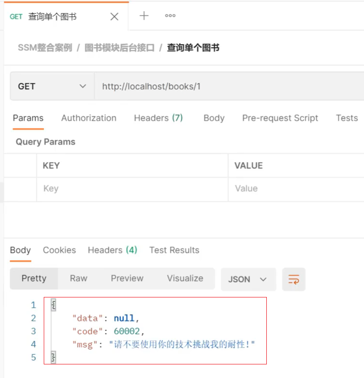

如果传入的是其他参数，会报`SystemException`

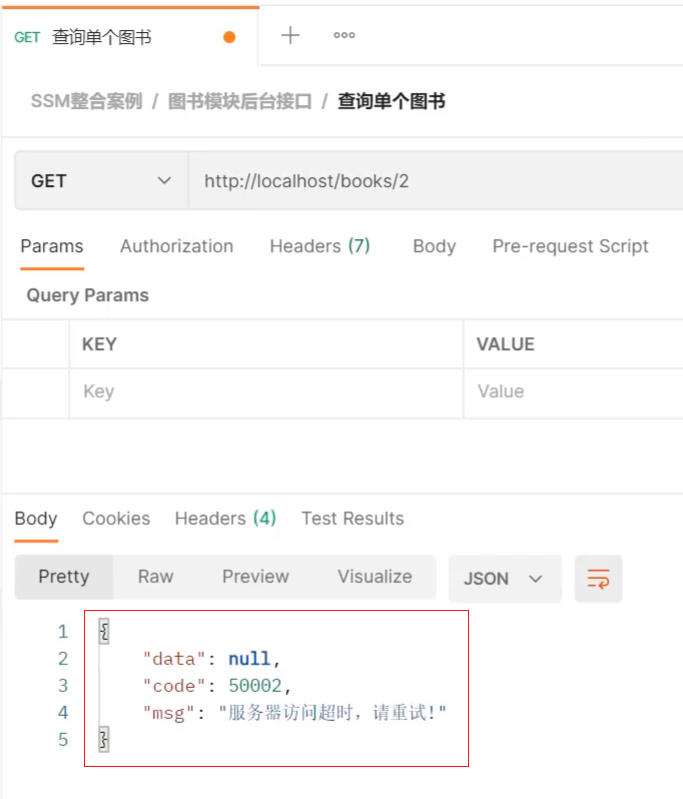

对于异常我们就已经处理完成了，不管后台哪一层抛出异常，都会以我们与前端约定好的方式进行返回，前端只需要把信息获取到，根据返回的正确与否来展示不同的内容即可。

**小结**

以后项目中的异常处理方式为:

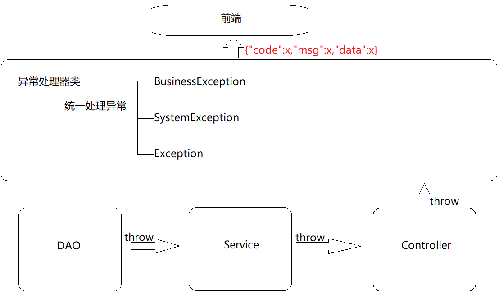

## 4，前后台协议联调

### 4.1 环境准备

- 创建一个Web的Maven项目
- pom.xml添加SSM整合所需jar包
- 创建对应的配置类
- 编写Controller、Service接口、Service实现类、Dao接口和模型类
- resources下提供jdbc.properties配置文件

内容参考前面的项目或者直接使用前面的项目进行本节内容的学习。

最终创建好的项目结构如下:

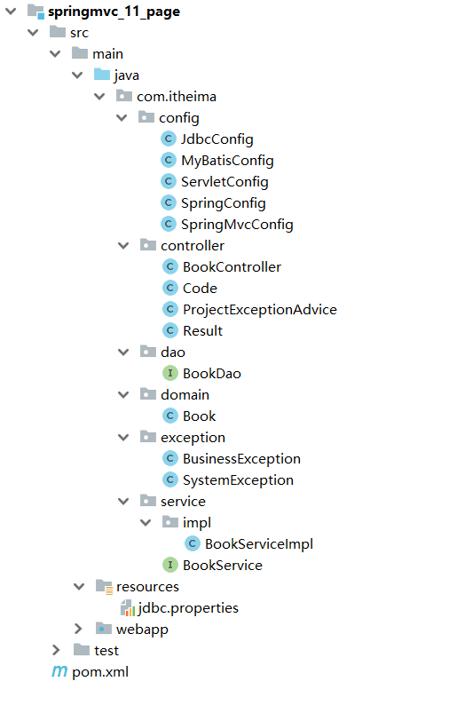

1. 将`资料\SSM功能页面`下面的静态资源拷贝到webapp下。

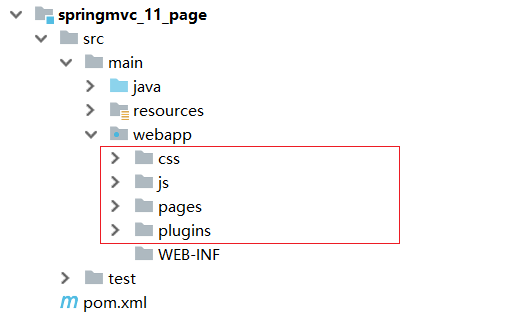

2. 因为添加了静态资源，SpringMVC会拦截，所有需要在SpringConfig的配置类中将静态资源进行放行。

* 新建SpringMvcSupport

  ```java
  @Configuration
  public class SpringMvcSupport extends WebMvcConfigurationSupport {
      @Override
      protected void addResourceHandlers(ResourceHandlerRegistry registry) {
          registry.addResourceHandler("/pages/**").addResourceLocations("/pages/");
          registry.addResourceHandler("/css/**").addResourceLocations("/css/");
          registry.addResourceHandler("/js/**").addResourceLocations("/js/");
          registry.addResourceHandler("/plugins/**").addResourceLocations("/plugins/");
      }
  }
  ```

* 在SpringMvcConfig中扫描SpringMvcSupport

  ```java
  @Configuration
  @ComponentScan({"com.itheima.controller","com.itheima.config"})
  @EnableWebMvc
  public class SpringMvcConfig {
  }
  ```

接下来我们就需要将所有的列表查询、新增、修改、删除等功能一个个来实现下。

### 4.2 列表功能

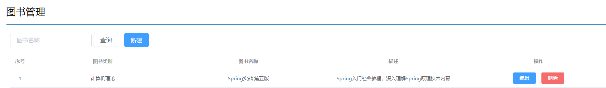

> 需求:页面加载完后发送异步请求到后台获取列表数据进行展示。
>
> 1.找到页面的钩子函数，`created()`
>
> 2.`created()`方法中调用了`this.getAll()`方法
>
> 3.在getAll()方法中使用axios发送异步请求从后台获取数据
>
> 4.访问的路径为`http://localhost/books`
>
> 5.返回数据

返回数据res.data的内容如下:

```json
{
    "data": [
        {
            "id": 1,
            "type": "计算机理论",
            "name": "Spring实战 第五版",
            "description": "Spring入门经典教程，深入理解Spring原理技术内幕"
        },
        {
            "id": 2,
            "type": "计算机理论",
            "name": "Spring 5核心原理与30个类手写实践",
            "description": "十年沉淀之作，手写Spring精华思想"
        },...
    ],
    "code": 20041,
    "msg": ""
}
```

发送方式:

```js
getAll() {
    //发送ajax请求
    axios.get("/books").then((res)=>{
        this.dataList = res.data.data;
    });
}
```

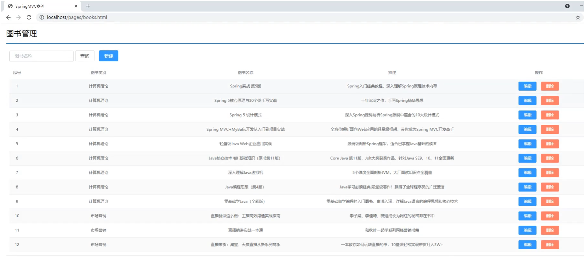

### 4.3 添加功能


> 需求:完成图片的新增功能模块
>
> 1.找到页面上的`新建`按钮，按钮上绑定了`@click="handleCreate()"`方法
>
> 2.在method中找到`handleCreate`方法，方法中打开新增面板
>
> 3.新增面板中找到`确定`按钮,按钮上绑定了`@click="handleAdd()"`方法
>
> 4.在method中找到`handleAdd`方法
>
> 5.在方法中发送请求和数据，响应成功后将新增面板关闭并重新查询数据

`handleCreate`打开新增面板

```js
handleCreate() {
    this.dialogFormVisible = true;
},
```

`handleAdd`方法发送异步请求并携带数据

```js
handleAdd () {
    //发送ajax请求
    //this.formData是表单中的数据，最后是一个json数据
    axios.post("/books",this.formData).then((res)=>{
        this.dialogFormVisible = false;
        this.getAll();
    });
}
```

### 4.4 添加功能状态处理

基础的新增功能已经完成，但是还有一些问题需要解决下:

> 需求:新增成功是关闭面板，重新查询数据，那么新增失败以后该如何处理?
>
> 1.在handlerAdd方法中根据后台返回的数据来进行不同的处理
>
> 2.如果后台返回的是成功，则提示成功信息，并关闭面板
>
> 3.如果后台返回的是失败，则提示错误信息

(1)修改前端页面

```js
handleAdd () {
    //发送ajax请求
    axios.post("/books",this.formData).then((res)=>{
        //如果操作成功，关闭弹层，显示数据
        if(res.data.code == 20011){
            this.dialogFormVisible = false;
            this.$message.success("添加成功");
        }else if(res.data.code == 20010){
            this.$message.error("添加失败");
        }else{
            this.$message.error(res.data.msg);
        }
    }).finally(()=>{
        this.getAll();
    });
}
```

(2)后台返回操作结果，将Dao层的增删改方法返回值从`void`改成`int`

```java
public interface BookDao {

//    @Insert("insert into tbl_book values(null,#{type},#{name},#{description})")
    @Insert("insert into tbl_book (type,name,description) values(#{type},#{name},#{description})")
    public int save(Book book);

    @Update("update tbl_book set type = #{type}, name = #{name}, description = #{description} where id = #{id}")
    public int update(Book book);

    @Delete("delete from tbl_book where id = #{id}")
    public int delete(Integer id);

    @Select("select * from tbl_book where id = #{id}")
    public Book getById(Integer id);

    @Select("select * from tbl_book")
    public List<Book> getAll();
}
```

(3)在BookServiceImpl中，增删改方法根据DAO的返回值来决定返回true/false

```java
@Service
public class BookServiceImpl implements BookService {
    @Autowired
    private BookDao bookDao;

    public boolean save(Book book) {
        return bookDao.save(book) > 0;
    }

    public boolean update(Book book) {
        return bookDao.update(book) > 0;
    }

    public boolean delete(Integer id) {
        return bookDao.delete(id) > 0;
    }

    public Book getById(Integer id) {
        if(id == 1){
            throw new BusinessException(Code.BUSINESS_ERR,"请不要使用你的技术挑战我的耐性!");
        }
//        //将可能出现的异常进行包装，转换成自定义异常
//        try{
//            int i = 1/0;
//        }catch (Exception e){
//            throw new SystemException(Code.SYSTEM_TIMEOUT_ERR,"服务器访问超时，请重试!",e);
//        }
        return bookDao.getById(id);
    }

    public List<Book> getAll() {
        return bookDao.getAll();
    }
}

```

(4)测试错误情况，将图书类别长度设置超出范围即可

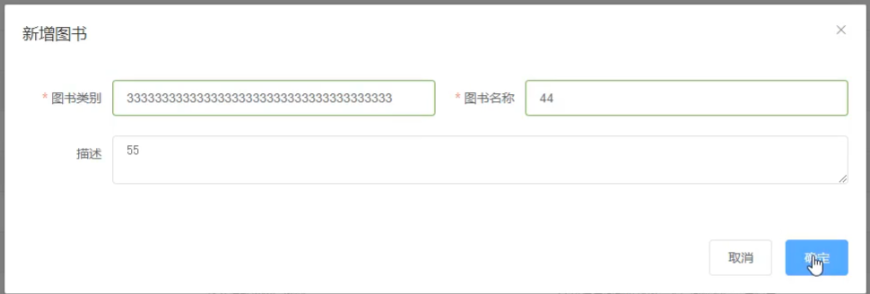

处理完新增后，会发现新增还存在一个问题，

新增成功后，再次点击`新增`按钮会发现之前的数据还存在，这个时候就需要在新增的时候将表单内容清空。

```js
resetForm(){
	this.formData = {};
}
handleCreate() {
    this.dialogFormVisible = true;
    this.resetForm();
}
```

### 4.5 修改功能

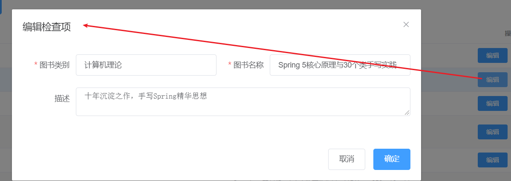

>需求:完成图书信息的修改功能
>
>1.找到页面中的`编辑`按钮，该按钮绑定了`@click="handleUpdate(scope.row)"`
>
>2.在method的`handleUpdate`方法中发送异步请求根据ID查询图书信息
>
>3.根据后台返回的结果，判断是否查询成功
>
>​	如果查询成功打开修改面板回显数据，如果失败提示错误信息
>
>4.修改完成后找到修改面板的`确定`按钮，该按钮绑定了`@click="handleEdit()"`
>
>5.在method的`handleEdit`方法中发送异步请求提交修改数据
>
>6.根据后台返回的结果，判断是否修改成功
>
>​	如果成功提示错误信息，关闭修改面板，重新查询数据，如果失败提示错误信息

scope.row代表的是当前行的行数据，也就是说,scope.row就是选中行对应的json数据，如下:

```json
{
    "id": 1,
    "type": "计算机理论",
    "name": "Spring实战 第五版",
    "description": "Spring入门经典教程，深入理解Spring原理技术内幕"
}
```

修改`handleUpdate`方法

```js
//弹出编辑窗口
handleUpdate(row) {
    // console.log(row);   //row.id 查询条件
    //查询数据，根据id查询
    axios.get("/books/"+row.id).then((res)=>{
        if(res.data.code == 20041){
            //展示弹层，加载数据
            this.formData = res.data.data;
            this.dialogFormVisible4Edit = true;
        }else{
            this.$message.error(res.data.msg);
        }
    });
}
```

修改`handleEdit`方法

```js
handleEdit() {
    //发送ajax请求
    axios.put("/books",this.formData).then((res)=>{
        //如果操作成功，关闭弹层，显示数据
        if(res.data.code == 20031){
            this.dialogFormVisible4Edit = false;
            this.$message.success("修改成功");
        }else if(res.data.code == 20030){
            this.$message.error("修改失败");
        }else{
            this.$message.error(res.data.msg);
        }
    }).finally(()=>{
        this.getAll();
    });
}
```

至此修改功能就已经完成。

### 4.6 删除功能

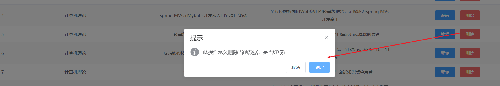

> 需求:完成页面的删除功能。
>
> 1.找到页面的删除按钮，按钮上绑定了`@click="handleDelete(scope.row)"`
>
> 2.method的`handleDelete`方法弹出提示框
>
> 3.用户点击取消,提示操作已经被取消。
>
> 4.用户点击确定，发送异步请求并携带需要删除数据的主键ID
>
> 5.根据后台返回结果做不同的操作
>
> ​	如果返回成功，提示成功信息，并重新查询数据
>
> ​	如果返回失败，提示错误信息，并重新查询数据

修改`handleDelete`方法

```js
handleDelete(row) {
    //1.弹出提示框
    this.$confirm("此操作永久删除当前数据，是否继续？","提示",{
        type:'info'
    }).then(()=>{
        //2.做删除业务
        axios.delete("/books/"+row.id).then((res)=>{
            if(res.data.code == 20021){
                this.$message.success("删除成功");
            }else{
                this.$message.error("删除失败");
            }
        }).finally(()=>{
            this.getAll();
        });
    }).catch(()=>{
        //3.取消删除
        this.$message.info("取消删除操作");
    });
}
```

接下来，下面是一个完整页面

```html
<!DOCTYPE html>

<html>

    <head>

        <!-- 页面meta -->

        <meta charset="utf-8">

        <meta http-equiv="X-UA-Compatible" content="IE=edge">

        <title>SpringMVC案例</title>

        <meta content="width=device-width,initial-scale=1,maximum-scale=1,user-scalable=no" name="viewport">

        <!-- 引入样式 -->

        <link rel="stylesheet" href="../plugins/elementui/index.css">

        <link rel="stylesheet" href="../plugins/font-awesome/css/font-awesome.min.css">

        <link rel="stylesheet" href="../css/style.css">

    </head>

    <body class="hold-transition">

        <div id="app">

            <div class="content-header">

                <h1>图书管理</h1>

            </div>

            <div class="app-container">

                <div class="box">

                    <div class="filter-container">

                        <el-input placeholder="图书名称" v-model="pagination.queryString" style="width: 200px;" class="filter-item"></el-input>

                        <el-button @click="getAll()" class="dalfBut">查询</el-button>

                        <el-button type="primary" class="butT" @click="handleCreate()">新建</el-button>

                    </div>

                    <el-table size="small" current-row-key="id" :data="dataList" stripe highlight-current-row>

                        <el-table-column type="index" align="center" label="序号"></el-table-column>

                        <el-table-column prop="type" label="图书类别" align="center"></el-table-column>

                        <el-table-column prop="name" label="图书名称" align="center"></el-table-column>

                        <el-table-column prop="description" label="描述" align="center"></el-table-column>

                        <el-table-column label="操作" align="center">

                            <template slot-scope="scope">

                                <el-button type="primary" size="mini" @click="handleUpdate(scope.row)">编辑</el-button>

                                <el-button type="danger" size="mini" @click="handleDelete(scope.row)">删除</el-button>

                            </template>

                        </el-table-column>

                    </el-table>

                    <!-- 新增标签弹层 -->

                    <div class="add-form">

                        <el-dialog title="新增图书" :visible.sync="dialogFormVisible">

                            <el-form ref="dataAddForm" :model="formData" :rules="rules" label-position="right" label-width="100px">

                                <el-row>

                                    <el-col :span="12">

                                        <el-form-item label="图书类别" prop="type">

                                            <el-input v-model="formData.type"/>

                                        </el-form-item>

                                    </el-col>

                                    <el-col :span="12">

                                        <el-form-item label="图书名称" prop="name">

                                            <el-input v-model="formData.name"/>

                                        </el-form-item>

                                    </el-col>

                                </el-row>


                                <el-row>

                                    <el-col :span="24">

                                        <el-form-item label="描述">

                                            <el-input v-model="formData.description" type="textarea"></el-input>

                                        </el-form-item>

                                    </el-col>

                                </el-row>

                            </el-form>

                            <div slot="footer" class="dialog-footer">

                                <el-button @click="dialogFormVisible = false">取消</el-button>

                                <el-button type="primary" @click="handleAdd()">确定</el-button>

                            </div>

                        </el-dialog>

                    </div>

                    <!-- 编辑标签弹层 -->

                    <div class="add-form">

                        <el-dialog title="编辑检查项" :visible.sync="dialogFormVisible4Edit">

                            <el-form ref="dataEditForm" :model="formData" :rules="rules" label-position="right" label-width="100px">

                                <el-row>

                                    <el-col :span="12">

                                        <el-form-item label="图书类别" prop="type">

                                            <el-input v-model="formData.type"/>

                                        </el-form-item>

                                    </el-col>

                                    <el-col :span="12">

                                        <el-form-item label="图书名称" prop="name">

                                            <el-input v-model="formData.name"/>

                                        </el-form-item>

                                    </el-col>

                                </el-row>

                                <el-row>

                                    <el-col :span="24">

                                        <el-form-item label="描述">

                                            <el-input v-model="formData.description" type="textarea"></el-input>

                                        </el-form-item>

                                    </el-col>

                                </el-row>

                            </el-form>

                            <div slot="footer" class="dialog-footer">

                                <el-button @click="dialogFormVisible4Edit = false">取消</el-button>

                                <el-button type="primary" @click="handleEdit()">确定</el-button>

                            </div>

                        </el-dialog>

                    </div>

                </div>

            </div>

        </div>

    </body>

    <!-- 引入组件库 -->

    <script src="../js/vue.js"></script>

    <script src="../plugins/elementui/index.js"></script>

    <script type="text/javascript" src="../js/jquery.min.js"></script>

    <script src="../js/axios-0.18.0.js"></script>

    <script>
        var vue = new Vue({

            el: '#app',
            data:{
                pagination: {},
				dataList: [],//当前页要展示的列表数据
                formData: {},//表单数据
                dialogFormVisible: false,//控制表单是否可见
                dialogFormVisible4Edit:false,//编辑表单是否可见
                rules: {//校验规则
                    type: [{ required: true, message: '图书类别为必填项', trigger: 'blur' }],
                    name: [{ required: true, message: '图书名称为必填项', trigger: 'blur' }]
                }
            },

            //钩子函数，VUE对象初始化完成后自动执行
            created() {
                this.getAll();
            },

            methods: {
                //列表
                getAll() {
                    //发送ajax请求
                    axios.get("/books").then((res)=>{
                        this.dataList = res.data.data;
                    });
                },

                //弹出添加窗口
                handleCreate() {
                    this.dialogFormVisible = true;
                    this.resetForm();
                },

                //重置表单
                resetForm() {
                    this.formData = {};
                },

                //添加
                handleAdd () {
                    //发送ajax请求
                    axios.post("/books",this.formData).then((res)=>{
                        console.log(res.data);
                        //如果操作成功，关闭弹层，显示数据
                        if(res.data.code == 20011){
                            this.dialogFormVisible = false;
                            this.$message.success("添加成功");
                        }else if(res.data.code == 20010){
                            this.$message.error("添加失败");
                        }else{
                            this.$message.error(res.data.msg);
                        }
                    }).finally(()=>{
                        this.getAll();
                    });
                },

                //弹出编辑窗口
                handleUpdate(row) {
                    // console.log(row);   //row.id 查询条件
                    //查询数据，根据id查询
                    axios.get("/books/"+row.id).then((res)=>{
                        // console.log(res.data.data);
                        if(res.data.code == 20041){
                            //展示弹层，加载数据
                            this.formData = res.data.data;
                            this.dialogFormVisible4Edit = true;
                        }else{
                            this.$message.error(res.data.msg);
                        }
                    });
                },

                //编辑
                handleEdit() {
                    //发送ajax请求
                    axios.put("/books",this.formData).then((res)=>{
                        //如果操作成功，关闭弹层，显示数据
                        if(res.data.code == 20031){
                            this.dialogFormVisible4Edit = false;
                            this.$message.success("修改成功");
                        }else if(res.data.code == 20030){
                            this.$message.error("修改失败");
                        }else{
                            this.$message.error(res.data.msg);
                        }
                    }).finally(()=>{
                        this.getAll();
                    });
                },

                // 删除
                handleDelete(row) {
                    //1.弹出提示框
                    this.$confirm("此操作永久删除当前数据，是否继续？","提示",{
                        type:'info'
                    }).then(()=>{
                        //2.做删除业务
                        axios.delete("/books/"+row.id).then((res)=>{
                            if(res.data.code == 20021){
                                this.$message.success("删除成功");
                            }else{
                                this.$message.error("删除失败");
                            }
                        }).finally(()=>{
                            this.getAll();
                        });
                    }).catch(()=>{
                        //3.取消删除
                        this.$message.info("取消删除操作");
                    });
                }
            }
        })

    </script>

</html>
```

## 5，拦截器

对于拦截器这节的知识，我们需要学习如下内容:

* 拦截器概念
* 入门案例
* 拦截器参数
* 拦截器工作流程分析

### 5.1 拦截器概念

讲解拦截器的概念之前，我们先看一张图:

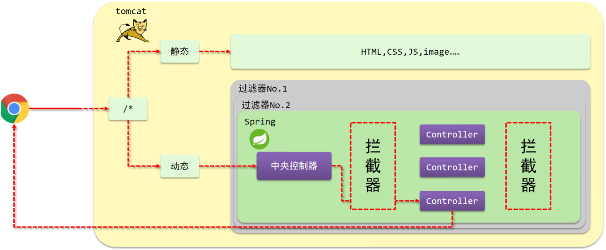

(1)浏览器发送一个请求会先到Tomcat的web服务器

(2)Tomcat服务器接收到请求以后，会去判断请求的是静态资源还是动态资源

(3)如果是静态资源，会直接到Tomcat的项目部署目录下去直接访问

(4)如果是动态资源，就需要交给项目的后台代码进行处理

(5)在找到具体的方法之前，我们可以去配置过滤器(可以配置多个)，按照顺序进行执行

(6)然后进入到到中央处理器(SpringMVC中的内容)，SpringMVC会根据配置的规则进行拦截

(7)如果满足规则，则进行处理，找到其对应的controller类中的方法进行执行,完成后返回结果

(8)如果不满足规则，则不进行处理

(9)这个时候，如果我们需要在每个Controller方法执行的前后添加业务，具体该如何来实现?

这个就是拦截器要做的事。

* 拦截器（Interceptor）是一种动态拦截方法调用的机制，在SpringMVC中动态拦截控制器方法的执行
* 作用:
  * 在指定的方法调用前后执行预先设定的代码
  * 阻止原始方法的执行
  * 总结：拦截器就是用来做增强

看完以后，大家会发现

* 拦截器和过滤器在作用和执行顺序上也很相似

所以这个时候，就有一个问题需要思考:拦截器和过滤器之间的区别是什么?

- 归属不同：Filter属于Servlet技术，Interceptor属于SpringMVC技术
- 拦截内容不同：Filter对所有访问进行增强，Interceptor仅针对SpringMVC的访问进行增强

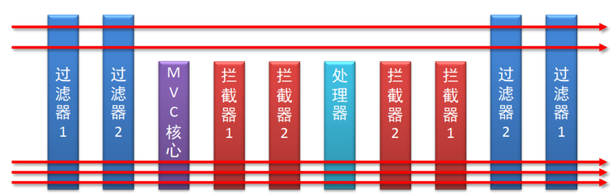

### 5.2 拦截器入门案例

#### 5.2.1 环境准备

- 创建一个Web的Maven项目

- pom.xml添加SSM整合所需jar包

  ```xml
  <?xml version="1.0" encoding="UTF-8"?>
  
  <project xmlns="http://maven.apache.org/POM/4.0.0" xmlns:xsi="http://www.w3.org/2001/XMLSchema-instance"
    xsi:schemaLocation="http://maven.apache.org/POM/4.0.0 http://maven.apache.org/xsd/maven-4.0.0.xsd">
    <modelVersion>4.0.0</modelVersion>
  
    <groupId>com.itheima</groupId>
    <artifactId>springmvc_12_interceptor</artifactId>
    <version>1.0-SNAPSHOT</version>
    <packaging>war</packaging>
  
    <dependencies>
      <dependency>
        <groupId>javax.servlet</groupId>
        <artifactId>javax.servlet-api</artifactId>
        <version>3.1.0</version>
        <scope>provided</scope>
      </dependency>
      <dependency>
        <groupId>org.springframework</groupId>
        <artifactId>spring-webmvc</artifactId>
        <version>5.2.10.RELEASE</version>
      </dependency>
      <dependency>
        <groupId>com.fasterxml.jackson.core</groupId>
        <artifactId>jackson-databind</artifactId>
        <version>2.9.0</version>
      </dependency>
    </dependencies>
  
    <build>
      <plugins>
        <plugin>
          <groupId>org.apache.tomcat.maven</groupId>
          <artifactId>tomcat7-maven-plugin</artifactId>
          <version>2.1</version>
          <configuration>
            <port>80</port>
            <path>/</path>
          </configuration>
        </plugin>
          <plugin>
              <groupId>org.apache.maven.plugins</groupId>
              <artifactId>maven-compiler-plugin</artifactId>
              <configuration>
                  <source>8</source>
                  <target>8</target>
              </configuration>
          </plugin>
      </plugins>
    </build>
  </project>
  
  ```

- 创建对应的配置类

  ```java
  public class ServletContainersInitConfig extends AbstractAnnotationConfigDispatcherServletInitializer {
      protected Class<?>[] getRootConfigClasses() {
          return new Class[0];
      }
  
      protected Class<?>[] getServletConfigClasses() {
          return new Class[]{SpringMvcConfig.class};
      }
  
      protected String[] getServletMappings() {
          return new String[]{"/"};
      }
  
      //乱码处理
      @Override
      protected Filter[] getServletFilters() {
          CharacterEncodingFilter filter = new CharacterEncodingFilter();
          filter.setEncoding("UTF-8");
          return new Filter[]{filter};
      }
  }
  
  @Configuration
  @ComponentScan({"com.itheima.controller"})
  @EnableWebMvc
  public class SpringMvcConfig{
     
  }
  ```

- 创建模型类Book

  ```java
  public class Book {
      private String name;
      private double price;
  
      public String getName() {
          return name;
      }
  
      public void setName(String name) {
          this.name = name;
      }
  
      public double getPrice() {
          return price;
      }
  
      public void setPrice(double price) {
          this.price = price;
      }
  
      @Override
      public String toString() {
          return "Book{" +
                  "书名='" + name + '\'' +
                  ", 价格=" + price +
                  '}';
      }
  }
  ```

- 编写Controller

  ```java
  @RestController
  @RequestMapping("/books")
  public class BookController {
  
      @PostMapping
      public String save(@RequestBody Book book){
          System.out.println("book save..." + book);
          return "{'module':'book save'}";
      }
  
      @DeleteMapping("/{id}")
      public String delete(@PathVariable Integer id){
          System.out.println("book delete..." + id);
          return "{'module':'book delete'}";
      }
  
      @PutMapping
      public String update(@RequestBody Book book){
          System.out.println("book update..."+book);
          return "{'module':'book update'}";
      }
  
      @GetMapping("/{id}")
      public String getById(@PathVariable Integer id){
          System.out.println("book getById..."+id);
          return "{'module':'book getById'}";
      }
  
      @GetMapping
      public String getAll(){
          System.out.println("book getAll...");
          return "{'module':'book getAll'}";
      }
  }
  ```

最终创建好的项目结构如下:

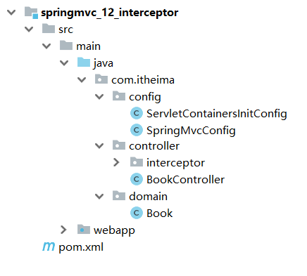

#### 5.2.2 拦截器开发

##### 步骤1:创建拦截器类

让类实现HandlerInterceptor接口，重写接口中的三个方法。

```java
@Component
//定义拦截器类，实现HandlerInterceptor接口
//注意当前类必须受Spring容器控制
public class ProjectInterceptor implements HandlerInterceptor {
    @Override
    //原始方法调用前执行的内容
    public boolean preHandle(HttpServletRequest request, HttpServletResponse response, Object handler) throws Exception {
        System.out.println("preHandle...");
        return true;
    }

    @Override
    //原始方法调用后执行的内容
    public void postHandle(HttpServletRequest request, HttpServletResponse response, Object handler, ModelAndView modelAndView) throws Exception {
        System.out.println("postHandle...");
    }

    @Override
    //原始方法调用完成后执行的内容
    public void afterCompletion(HttpServletRequest request, HttpServletResponse response, Object handler, Exception ex) throws Exception {
        System.out.println("afterCompletion...");
    }
}
```

**注意:**拦截器类要被SpringMVC容器扫描到。

##### 步骤2:配置拦截器类

```java
@Configuration
public class SpringMvcSupport extends WebMvcConfigurationSupport {
    @Autowired
    private ProjectInterceptor projectInterceptor;

    @Override
    protected void addResourceHandlers(ResourceHandlerRegistry registry) {
        registry.addResourceHandler("/pages/**").addResourceLocations("/pages/");
    }

    @Override
    protected void addInterceptors(InterceptorRegistry registry) {
        //配置拦截器
        registry.addInterceptor(projectInterceptor).addPathPatterns("/books" );
    }
}
```

##### 步骤3:SpringMVC添加SpringMvcSupport包扫描

```java
@Configuration
@ComponentScan({"com.itheima.controller","com.itheima.config"})
@EnableWebMvc
public class SpringMvcConfig{
   
}
```

##### 步骤4:运行程序测试

使用PostMan发送`http://localhost/books`

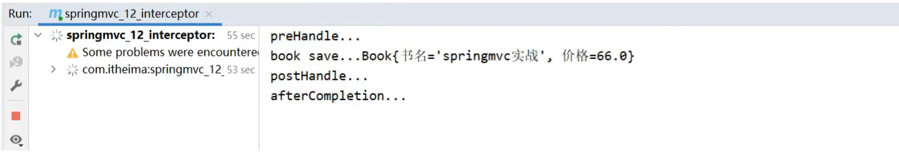

如果发送`http://localhost/books/100`会发现拦截器没有被执行，原因是拦截器的`addPathPatterns`方法配置的拦截路径是`/books`,我们现在发送的是`/books/100`，所以没有匹配上，因此没有拦截，拦截器就不会执行。

##### 步骤5:修改拦截器拦截规则

```java
@Configuration
public class SpringMvcSupport extends WebMvcConfigurationSupport {
    @Autowired
    private ProjectInterceptor projectInterceptor;

    @Override
    protected void addResourceHandlers(ResourceHandlerRegistry registry) {
        registry.addResourceHandler("/pages/**").addResourceLocations("/pages/");
    }

    @Override
    protected void addInterceptors(InterceptorRegistry registry) {
        //配置拦截器
        registry.addInterceptor(projectInterceptor).addPathPatterns("/books","/books/*" );
    }
}
```

这个时候，如果再次访问`http://localhost/books/100`，拦截器就会被执行。

最后说一件事，就是拦截器中的`preHandler`方法，如果返回true,则代表放行，会执行原始Controller类中要请求的方法，如果返回false，则代表拦截，后面的就不会再执行了。

##### 步骤6:简化SpringMvcSupport的编写

```java
@Configuration
@ComponentScan({"com.itheima.controller"})
@EnableWebMvc
//实现WebMvcConfigurer接口可以简化开发，但具有一定的侵入性
public class SpringMvcConfig implements WebMvcConfigurer {
    @Autowired
    private ProjectInterceptor projectInterceptor;

    @Override
    public void addInterceptors(InterceptorRegistry registry) {
        //配置多拦截器
        registry.addInterceptor(projectInterceptor).addPathPatterns("/books","/books/*");
    }
}
```

此后咱们就不用再写`SpringMvcSupport`类了。

最后我们来看下拦截器的执行流程:

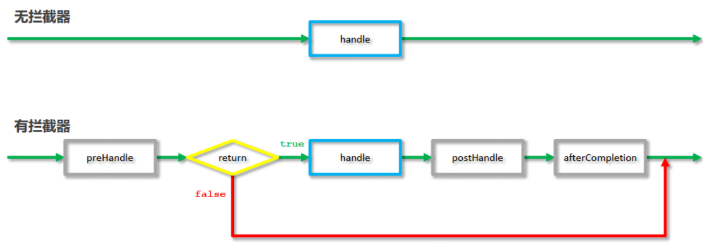

当有拦截器后，请求会先进入preHandle方法，

​	如果方法返回true，则放行继续执行后面的handle[controller的方法]和后面的方法

​	如果返回false，则直接跳过后面方法的执行。

### 5.3 拦截器参数

#### 5.3.1 前置处理方法

原始方法之前运行preHandle

```java
public boolean preHandle(HttpServletRequest request,
                         HttpServletResponse response,
                         Object handler) throws Exception {
    System.out.println("preHandle");
    return true;
}
```

* request:请求对象
* response:响应对象
* handler:被调用的处理器对象，本质上是一个方法对象，对反射中的Method对象进行了再包装

使用request对象可以获取请求数据中的内容，如获取请求头的`Content-Type`

```java
public boolean preHandle(HttpServletRequest request, HttpServletResponse response, Object handler) throws Exception {
    String contentType = request.getHeader("Content-Type");
    System.out.println("preHandle..."+contentType);
    return true;
}
```

使用handler参数，可以获取方法的相关信息

```java
public boolean preHandle(HttpServletRequest request, HttpServletResponse response, Object handler) throws Exception {
    HandlerMethod hm = (HandlerMethod)handler;
    String methodName = hm.getMethod().getName();//可以获取方法的名称
    System.out.println("preHandle..."+methodName);
    return true;
}
```

#### 5.3.2 后置处理方法

原始方法运行后运行，如果原始方法被拦截，则不执行  

```java
public void postHandle(HttpServletRequest request,
                       HttpServletResponse response,
                       Object handler,
                       ModelAndView modelAndView) throws Exception {
    System.out.println("postHandle");
}
```

前三个参数和上面的是一致的。

modelAndView:如果处理器执行完成具有返回结果，可以读取到对应数据与页面信息，并进行调整

因为咱们现在都是返回json数据，所以该参数的使用率不高。

#### 5.3.3 完成处理方法

拦截器最后执行的方法，无论原始方法是否执行

```java
public void afterCompletion(HttpServletRequest request,
                            HttpServletResponse response,
                            Object handler,
                            Exception ex) throws Exception {
    System.out.println("afterCompletion");
}
```

前三个参数与上面的是一致的。

ex:如果处理器执行过程中出现异常对象，可以针对异常情况进行单独处理  

因为我们现在已经有全局异常处理器类，所以该参数的使用率也不高。

这三个方法中，最常用的是==preHandle==,在这个方法中可以通过返回值来决定是否要进行放行，我们可以把业务逻辑放在该方法中，如果满足业务则返回true放行，不满足则返回false拦截。

### 5.4 拦截器链配置

目前，我们在项目中只添加了一个拦截器，如果有多个，该如何配置?配置多个后，执行顺序是什么?

#### 5.4.1 配置多个拦截器

##### 步骤1:创建拦截器类

实现接口，并重写接口中的方法

```java
@Component
public class ProjectInterceptor2 implements HandlerInterceptor {
    @Override
    public boolean preHandle(HttpServletRequest request, HttpServletResponse response, Object handler) throws Exception {
        System.out.println("preHandle...222");
        return false;
    }

    @Override
    public void postHandle(HttpServletRequest request, HttpServletResponse response, Object handler, ModelAndView modelAndView) throws Exception {
        System.out.println("postHandle...222");
    }

    @Override
    public void afterCompletion(HttpServletRequest request, HttpServletResponse response, Object handler, Exception ex) throws Exception {
        System.out.println("afterCompletion...222");
    }
}
```

##### 步骤2:配置拦截器类

```java
@Configuration
@ComponentScan({"com.itheima.controller"})
@EnableWebMvc
//实现WebMvcConfigurer接口可以简化开发，但具有一定的侵入性
public class SpringMvcConfig implements WebMvcConfigurer {
    @Autowired
    private ProjectInterceptor projectInterceptor;
    @Autowired
    private ProjectInterceptor2 projectInterceptor2;

    @Override
    public void addInterceptors(InterceptorRegistry registry) {
        //配置多拦截器
        registry.addInterceptor(projectInterceptor).addPathPatterns("/books","/books/*");
        registry.addInterceptor(projectInterceptor2).addPathPatterns("/books","/books/*");
    }
}
```

步骤3:运行程序，观察顺序

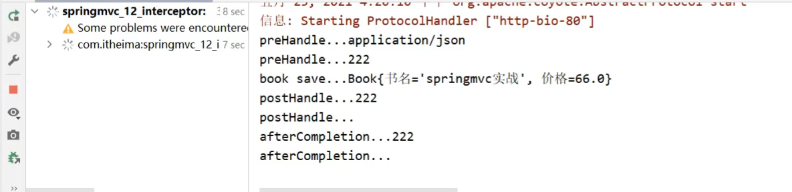

拦截器执行的顺序是和配置顺序有关。就和前面所提到的运维人员进入机房的案例，先进后出。

* 当配置多个拦截器时，形成拦截器链
* 拦截器链的运行顺序参照拦截器添加顺序为准
* 当拦截器中出现对原始处理器的拦截，后面的拦截器均终止运行
* 当拦截器运行中断，仅运行配置在前面的拦截器的afterCompletion操作

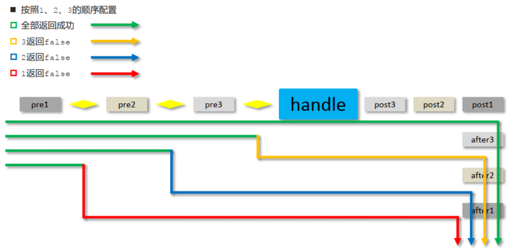

preHandle：与配置顺序相同，必定运行

postHandle:与配置顺序相反，可能不运行

afterCompletion:与配置顺序相反，可能不运行。

这个顺序不太好记，最终只需要把握住一个原则即可:==以最终的运行结果为准==