## SpringBoot

**今日目标：**

> * 掌握基于SpringBoot框架的程序开发步骤
> * 熟练使用SpringBoot配置信息修改服务器配置
> * 基于SpringBoot的完成SSM整合项目开发

## 1，SpringBoot简介

`SpringBoot` 是由 `Pivotal` 团队提供的全新框架，其设计目的是用来==简化== `Spring` 应用的==初始搭建==以及==开发过程==。

使用了 `Spring` 框架后已经简化了我们的开发。而 `SpringBoot` 又是对 `Spring` 开发进行简化的，可想而知 `SpringBoot` 使用的简单及广泛性。既然 `SpringBoot` 是用来简化 `Spring` 开发的，那我们就先回顾一下，以 `SpringMVC` 开发为例：

1. **创建工程，并在 `pom.xml` 配置文件中配置所依赖的坐标**

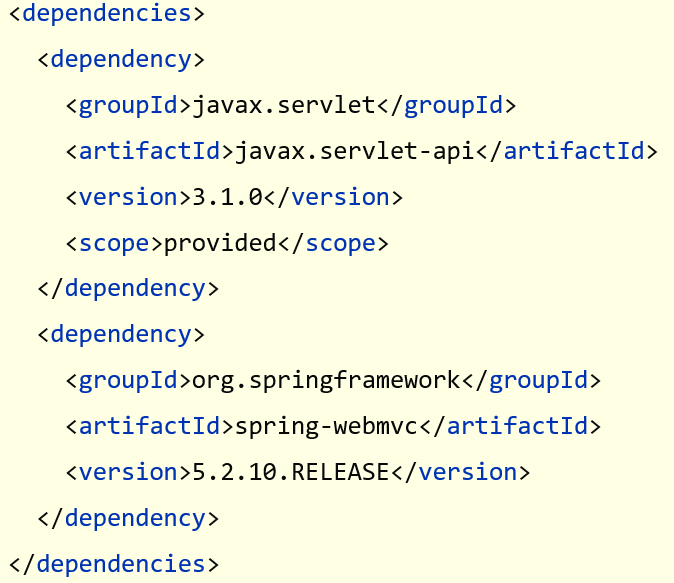

2. **编写 `web3.0` 的配置类**

   作为 `web` 程序，`web3.0` 的配置类不能缺少，而这个配置类还是比较麻烦的，代码如下

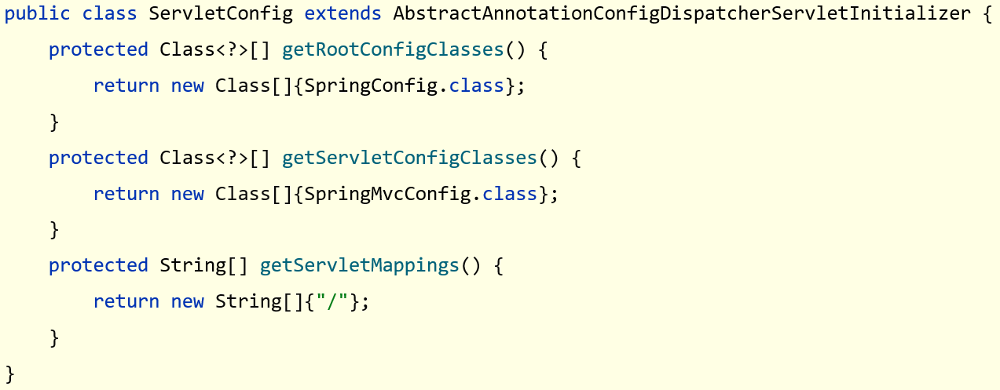

3. **编写 `SpringMVC` 的配置类**

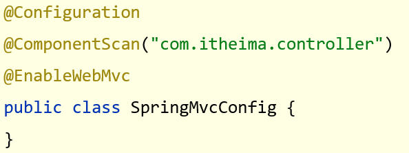

​	做到这只是将工程的架子搭起来。要想被外界访问，最起码还需要提供一个 `Controller` 类，在该类中提供一个方法。

4. **编写 `Controller` 类**

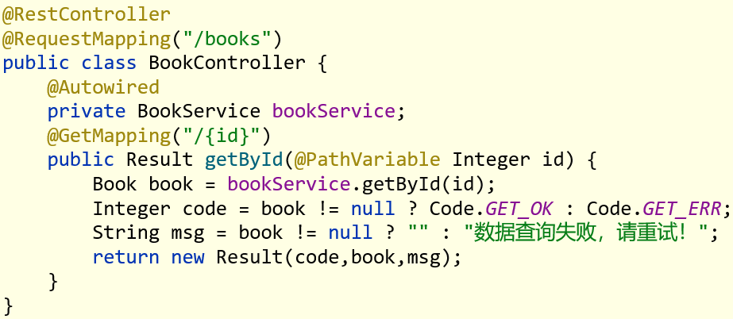

从上面的 `SpringMVC` 程序开发可以看到，前三步都是在搭建环境，而且这三步基本都是固定的。`SpringBoot` 就是对这三步进行简化了。接下来我们通过一个入门案例来体现 `SpingBoot` 简化 `Spring` 开发。

### 1.1  SpringBoot快速入门

#### 1.1.1  开发步骤

`SpringBoot` 开发起来特别简单，分为如下几步：

* 创建新模块，选择Spring初始化，并配置模块相关基础信息
* 选择当前模块需要使用的技术集
* 开发控制器类
* 运行自动生成的Application类

知道了 `SpringBoot` 的开发步骤后，接下来我们进行具体的操作

##### 1.1.1.1  创建新模块

* 点击 `+` 选择 `New Module` 创建新模块

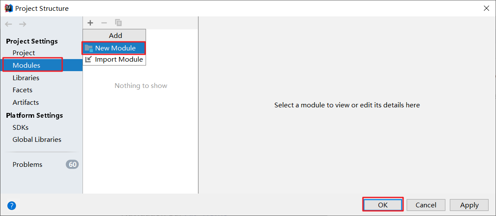

* 选择 `Spring Initializr` ，用来创建 `SpringBoot` 工程

  以前我们选择的是 `Maven` ，今天选择 `Spring Initializr` 来快速构建 `SpringBoot` 工程。而在 `Module SDK` 这一项选择我们安装的 `JDK` 版本。

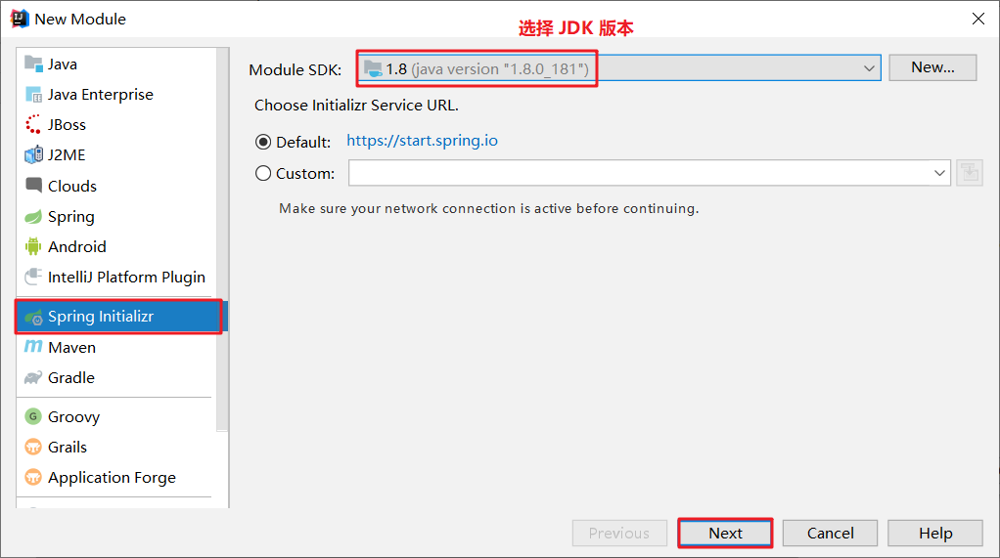

* 对 `SpringBoot` 工程进行相关的设置

  我们使用这种方式构建的 `SpringBoot` 工程其实也是 `Maven` 工程，而该方式只是一种快速构建的方式而已。

  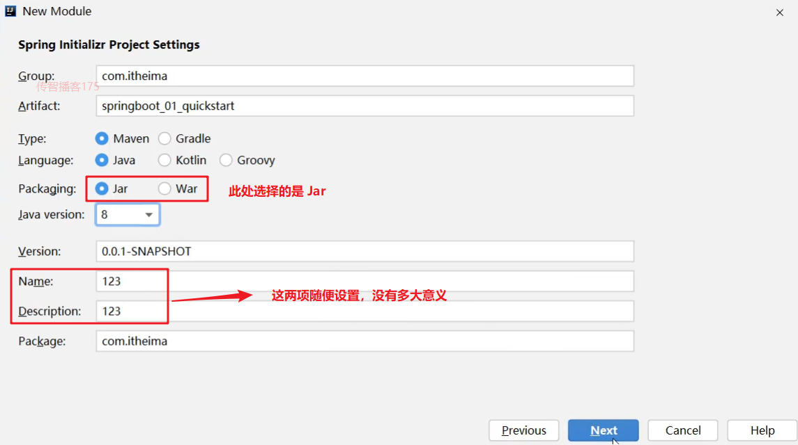

  > ==注意：打包方式这里需要设置为 `Jar`==

* 选中 `Web`，然后勾选 `Spring Web`

  由于我们需要开发一个 `web` 程序，使用到了 `SpringMVC` 技术，所以按照下图红框进行勾选

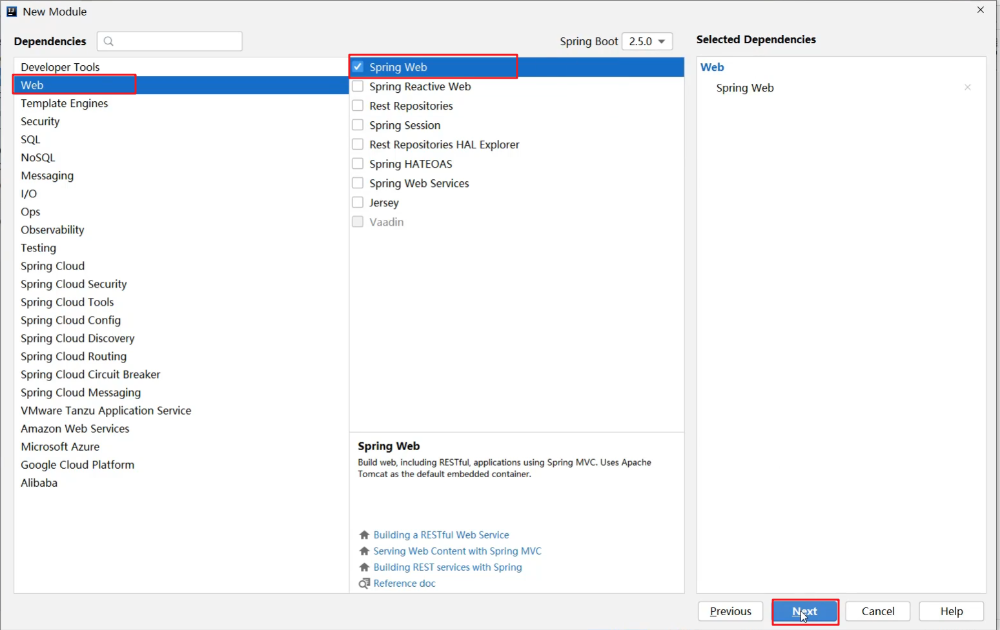

* 下图界面不需要任何修改，直接点击 `Finish` 完成 `SpringBoot` 工程的构建

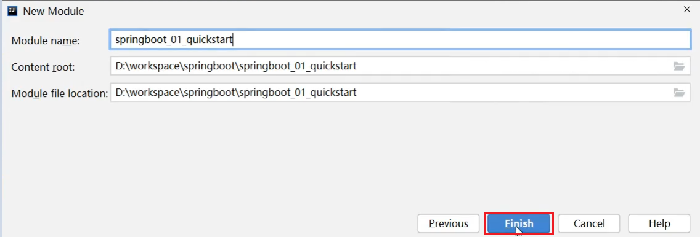

经过以上步骤后就创建了如下结构的模块，它会帮我们自动生成一个 `Application` 类，而该类一会再启动服务器时会用到

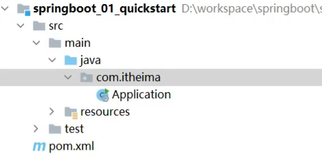

> ==注意：==
>
> 1. 在创建好的工程中不需要创建配置类
>
> 2. 创建好的项目会自动生成其他的一些文件，而这些文件目前对我们来说没有任何作用，所以可以将这些文件删除。
>
>    可以删除的目录和文件如下：
>
>    * `.mvn`	
>    * `.gitignore`
>    * `HELP.md`
>    * `mvnw`
>    * `mvnw.cmd`

##### 1.1.1.2  创建 `Controller`

在  `com.itheima.controller` 包下创建 `BookController` ，代码如下：

```java
@RestController
@RequestMapping("/books")
public class BookController {

    @GetMapping("/{id}")
    public String getById(@PathVariable Integer id){
        System.out.println("id ==> "+id);
        return "hello , spring boot!";
    }
}
```

##### 1.1.1.3  启动服务器

运行 `SpringBoot` 工程不需要使用本地的 `Tomcat` 和 插件，只运行项目 `com.itheima` 包下的 `Application` 类，我们就可以在控制台看出如下信息

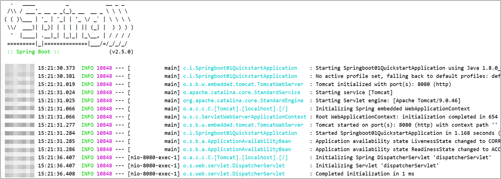

##### 1.1.1.4  进行测试

使用 `Postman` 工具来测试我们的程序

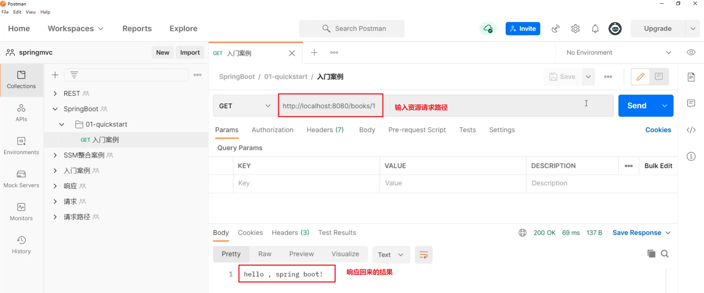

通过上面的入门案例我们可以看到使用 `SpringBoot` 进行开发，使整个开发变得很简单，那它是如何做到的呢？

要研究这个问题，我们需要看看 `Application` 类和 `pom.xml` 都书写了什么。先看看 `Applicaion` 类，该类内容如下：

```java
@SpringBootApplication
public class Application {
    public static void main(String[] args) {
        SpringApplication.run(Application.class, args);
    }
}
```

这个类中的东西很简单，就在类上添加了一个 `@SpringBootApplication` 注解，而在主方法中就一行代码。我们在启动服务器时就是执行的该类中的主方法。

再看看 `pom.xml` 配置文件中的内容

```xml
<?xml version="1.0" encoding="UTF-8"?>
<project xmlns="http://maven.apache.org/POM/4.0.0" xmlns:xsi="http://www.w3.org/2001/XMLSchema-instance"
         xsi:schemaLocation="http://maven.apache.org/POM/4.0.0 https://maven.apache.org/xsd/maven-4.0.0.xsd">
    <modelVersion>4.0.0</modelVersion>
    
    <!--指定了一个父工程，父工程中的东西在该工程中可以继承过来使用-->
    <parent>
        <groupId>org.springframework.boot</groupId>
        <artifactId>spring-boot-starter-parent</artifactId>
        <version>2.5.0</version>
    </parent>
    <groupId>com.itheima</groupId>
    <artifactId>springboot_01_quickstart</artifactId>
    <version>0.0.1-SNAPSHOT</version>

    <!--JDK 的版本-->
    <properties>
        <java.version>8</java.version>
    </properties>
    
    <dependencies>
        <!--该依赖就是我们在创建 SpringBoot 工程勾选的那个 Spring Web 产生的-->
        <dependency>
            <groupId>org.springframework.boot</groupId>
            <artifactId>spring-boot-starter-web</artifactId>
        </dependency>
		<!--这个是单元测试的依赖，我们现在没有进行单元测试，所以这个依赖现在可以没有-->
        <dependency>
            <groupId>org.springframework.boot</groupId>
            <artifactId>spring-boot-starter-test</artifactId>
            <scope>test</scope>
        </dependency>
    </dependencies>

    <build>
        <plugins>
            <!--这个插件是在打包时需要的，而这里暂时还没有用到-->
            <plugin>
                <groupId>org.springframework.boot</groupId>
                <artifactId>spring-boot-maven-plugin</artifactId>
            </plugin>
        </plugins>
    </build>
</project>
```

我们代码之所以能简化，就是因为指定的父工程和 `Spring Web` 依赖实现的。具体的我们后面在聊。

#### 1.1.2  对比

做完 `SpringBoot` 的入门案例后，接下来对比一下 `Spring` 程序和 `SpringBoot` 程序。如下图

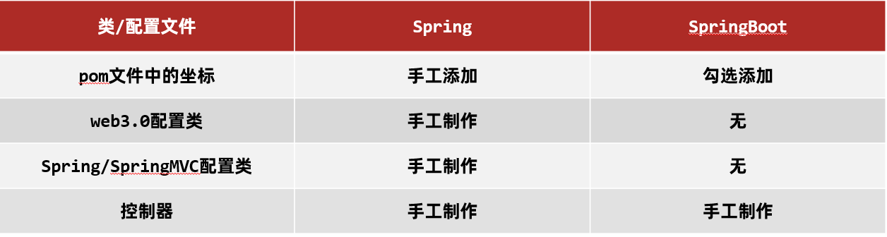

* **坐标**

  `Spring` 程序中的坐标需要自己编写，而且坐标非常多

  `SpringBoot` 程序中的坐标是我们在创建工程时进行勾选自动生成的

* **web3.0配置类**

  `Spring` 程序需要自己编写这个配置类。这个配置类大家之前编写过，肯定感觉很复杂

  `SpringBoot` 程序不需要我们自己书写

* **配置类**

  `Spring/SpringMVC` 程序的配置类需要自己书写。而 `SpringBoot`  程序则不需要书写。

> ==注意：基于Idea的 `Spring Initializr` 快速构建 `SpringBoot` 工程时需要联网。== 

#### 1.1.3  官网构建工程

在入门案例中之所以能快速构建 `SpringBoot` 工程，是因为 `Idea` 使用了官网提供了快速构建 `SpringBoot` 工程的组件实现的。那如何在官网进行工程构建呢？通过如下步骤构建

##### 1.1.3.1  进入SpringBoot官网

官网地址如下：

```
https://spring.io/projects/spring-boot
```

进入到 `SpringBoot` 官网后拖到最下方就可以看到如下内容


然后点击 `Spring Initializr` 超链接就会跳转到如下页面

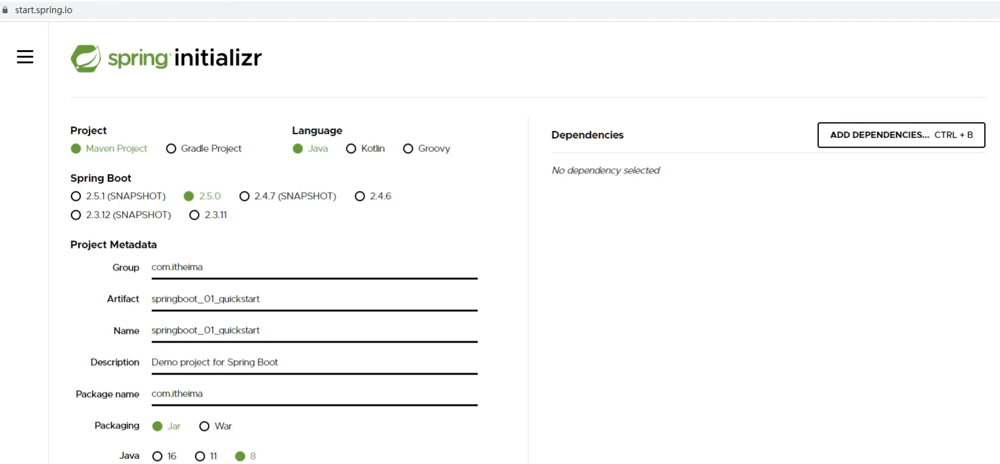

这个页面内容是不是感觉很眼熟的，这和我们使用 `Idea` 快速构建 `SpringBoot` 工程的界面基本相同。在上面页面输入对应的信息

##### 1.1.3.2  选择依赖

选择 `Spring Web` 可以点击上图右上角的 `ADD DEPENDENCIES... CTRL + B` 按钮，就会出现如下界面

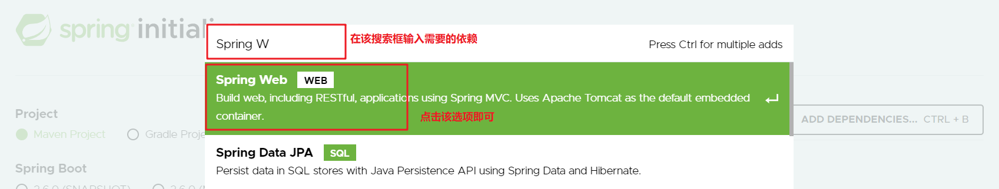

##### 1.1.3.3  生成工程

以上步骤完成后就可以生成 `SpringBoot` 工程了。在页面的最下方点击 `GENERATE CTRL + 回车` 按钮生成工程并下载到本地，如下图所示


打开下载好的压缩包可以看到工程结构和使用 `Idea` 生成的一模一样，如下图

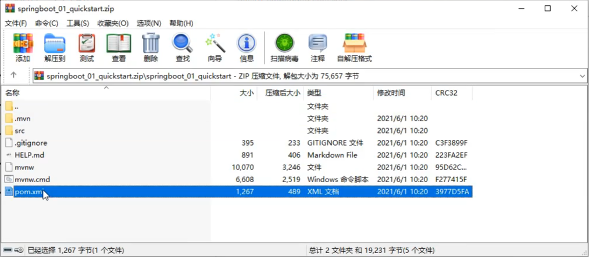

而打开 `pom.xml` 文件，里面也包含了父工程和 `Spring Web` 的依赖。

通过上面官网的操作，我们知道 `Idea` 中快速构建 `SpringBoot` 工程其实就是使用的官网的快速构建组件，那以后即使没有 `Idea` 也可以使用官网的方式构建 `SpringBoot` 工程。

#### 1.1.4  SpringBoot工程快速启动

##### 1.1.4.1  问题导入


以后我们和前端开发人员协同开发，而前端开发人员需要测试前端程序就需要后端开启服务器，这就受制于后端开发人员。为了摆脱这个受制，前端开发人员尝试着在自己电脑上安装 `Tomcat` 和 `Idea` ，在自己电脑上启动后端程序，这显然不现实。

我们后端可以将 `SpringBoot` 工程打成 `jar` 包，该 `jar` 包运行不依赖于 `Tomcat` 和 `Idea` 这些工具也可以正常运行，只是这个 `jar` 包在运行过程中连接和我们自己程序相同的 `Mysql` 数据库即可。这样就可以解决这个问题，如下图


那现在问题是如何打包呢？

##### 1.1.4.2  打包

由于我们在构建 `SpringBoot` 工程时已经在 `pom.xml` 中配置了如下插件

```xml
<plugin>
    <groupId>org.springframework.boot</groupId>
    <artifactId>spring-boot-maven-plugin</artifactId>
</plugin>
```

所以我们只需要使用 `Maven` 的 `package` 指令打包就会在 `target` 目录下生成对应的 `Jar` 包。

> ==注意：该插件必须配置，不然打好的 `jar` 包也是有问题的。==

##### 1.1.4.3  启动

进入 `jar` 包所在位置，在 `命令提示符` 中输入如下命令

```shell
jar -jar springboot_01_quickstart-0.0.1-SNAPSHOT.jar
```

执行上述命令就可以看到 `SpringBoot` 运行的日志信息

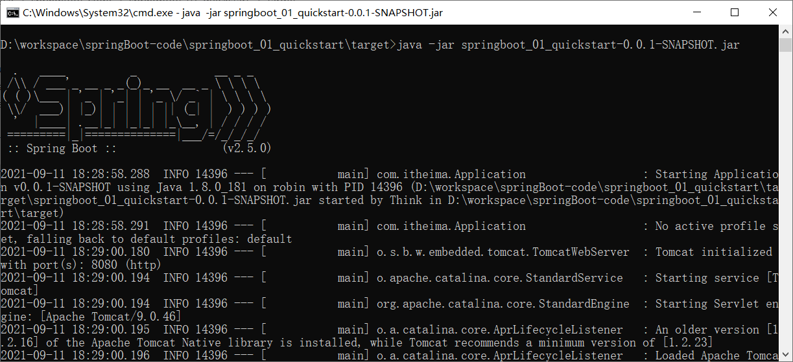

### 1.2  SpringBoot概述

`SpringBoot` 是由Pivotal团队提供的全新框架，其设计目的是用来==简化==Spring应用的==初始搭建==以及==开发过程==。

大家已经感受了 `SpringBoot` 程序，回过头看看 `SpringBoot` 主要作用是什么，就是简化 `Spring` 的搭建过程和开发过程。

原始 `Spring` 环境搭建和开发存在以下问题：

* 配置繁琐
* 依赖设置繁琐

`SpringBoot` 程序优点恰巧就是针对 `Spring` 的缺点

* 自动配置。这个是用来解决 `Spring` 程序配置繁琐的问题
* 起步依赖。这个是用来解决 `Spring` 程序依赖设置繁琐的问题
* 辅助功能（内置服务器,...）。我们在启动 `SpringBoot` 程序时既没有使用本地的 `tomcat` 也没有使用 `tomcat` 插件，而是使用 `SpringBoot` 内置的服务器。

接下来我们来说一下 `SpringBoot` 的起步依赖

#### 1.2.1  起步依赖

我们使用 `Spring Initializr`  方式创建的 `Maven` 工程的的 `pom.xml` 配置文件中自动生成了很多包含 `starter` 的依赖，如下图

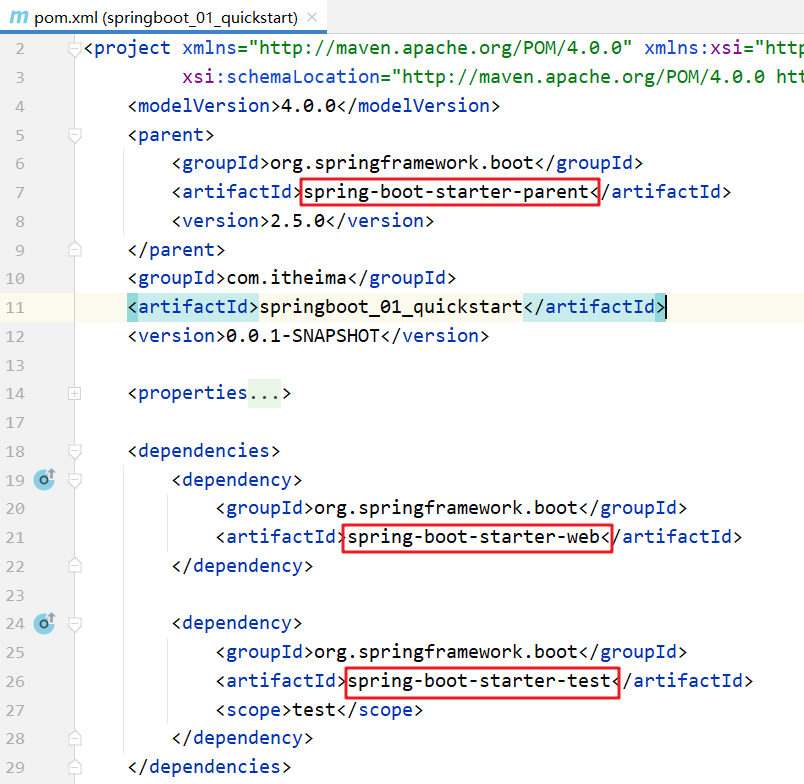

这些依赖就是==启动依赖==，接下来我们探究一下他是如何实现的。

##### 1.2.1.1  探索父工程

从上面的文件中可以看到指定了一个父工程，我们进入到父工程，发现父工程中又指定了一个父工程，如下图所示

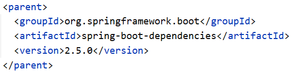

再进入到该父工程中，在该工程中我们可以看到配置内容结构如下图所示

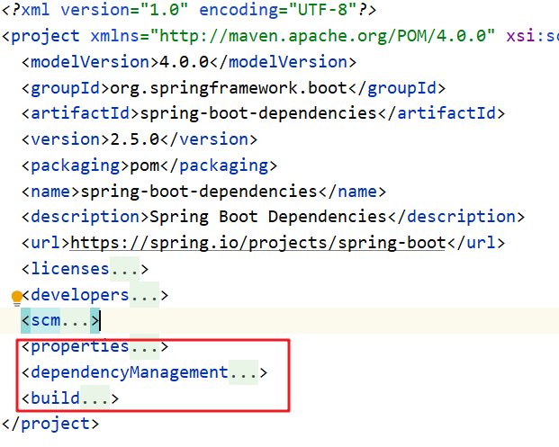

上图中的 `properties` 标签中定义了各个技术软件依赖的版本，避免了我们在使用不同软件技术时考虑版本的兼容问题。在 `properties` 中我们找 `servlet`  和 `mysql` 的版本如下图

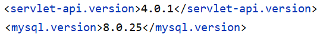

`dependencyManagement` 标签是进行依赖版本锁定，但是并没有导入对应的依赖；如果我们工程需要那个依赖只需要引入依赖的 `groupid` 和 `artifactId` 不需要定义 `version`。

而 `build` 标签中也对插件的版本进行了锁定，如下图

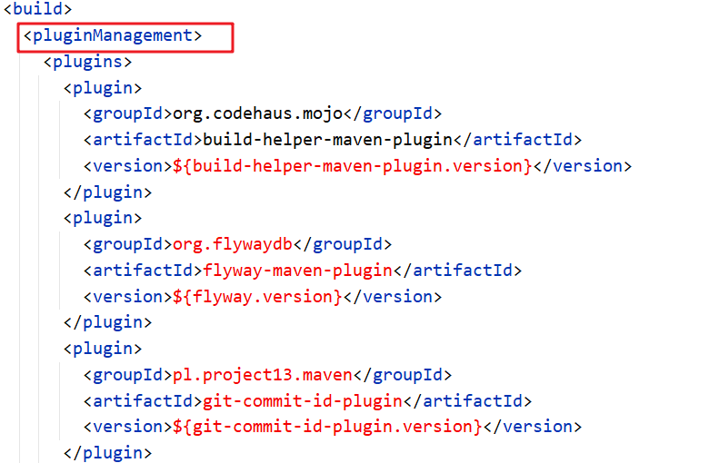

看完了父工程中 `pom.xml` 的配置后不难理解我们工程的的依赖为什么都没有配置 `version`。

##### 1.2.1.2  探索依赖

在我们创建的工程中的 `pom.xml` 中配置了如下依赖

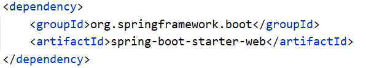

进入到该依赖，查看 `pom.xml` 的依赖会发现它引入了如下的依赖

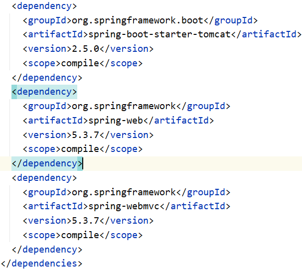

里面的引入了 `spring-web` 和 `spring-webmvc` 的依赖，这就是为什么我们的工程中没有依赖这两个包还能正常使用 `springMVC` 中的注解的原因。

而依赖 `spring-boot-starter-tomcat` ，从名字基本能确认内部依赖了 `tomcat`，所以我们的工程才能正常启动。

==结论：以后需要使用技术，只需要引入该技术对应的起步依赖即可==

##### 1.2.1.3  小结

**starter**

* `SpringBoot` 中常见项目名称，定义了当前项目使用的所有项目坐标，以达到减少依赖配置的目的

**parent**

* 所有 `SpringBoot` 项目要继承的项目，定义了若干个坐标版本号（依赖管理，而非依赖），以达到减少依赖冲突的目的

* `spring-boot-starter-parent`（2.5.0）与 `spring-boot-starter-parent`（2.4.6）共计57处坐标版本不同

**实际开发**

* 使用任意坐标时，仅书写GAV中的G和A，V由SpringBoot提供

  > G：groupid
  >
  > A：artifactId
  >
  > V：version

* 如发生坐标错误，再指定version（要小心版本冲突）

#### 1.2.2  程序启动

创建的每一个 `SpringBoot` 程序时都包含一个类似于下面的类，我们将这个类称作引导类

```java
@SpringBootApplication
public class Springboot01QuickstartApplication {
    
    public static void main(String[] args) {
        SpringApplication.run(Springboot01QuickstartApplication.class, args);
    }
}
```

==注意：==

* `SpringBoot` 在创建项目时，采用jar的打包方式

* `SpringBoot` 的引导类是项目的入口，运行 `main` 方法就可以启动项目

  因为我们在 `pom.xml` 中配置了 `spring-boot-starter-web` 依赖，而该依赖通过前面的学习知道它依赖 `tomcat` ，所以运行 `main` 方法就可以使用 `tomcat` 启动咱们的工程。

#### 1.2.3  切换web服务器

现在我们启动工程使用的是 `tomcat` 服务器，那能不能不使用 `tomcat` 而使用 `jetty` 服务器，`jetty` 在我们 `maven` 高级时讲 `maven` 私服使用的服务器。而要切换 `web` 服务器就需要将默认的 `tomcat` 服务器给排除掉，怎么排除呢？使用 `exclusion` 标签

```xml
<dependency>
    <groupId>org.springframework.boot</groupId>
    <artifactId>spring-boot-starter-web</artifactId>
    <exclusions>
        <exclusion>
            <artifactId>spring-boot-starter-tomcat</artifactId>
            <groupId>org.springframework.boot</groupId>
        </exclusion>
    </exclusions>
</dependency>
```

现在我们运行引导类可以吗？运行一下试试，打印的日志信息如下

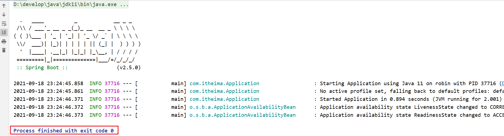

程序直接停止了，为什么呢？那是因为排除了 `tomcat` 服务器，程序中就没有服务器了。所以此时不光要排除 `tomcat` 服务器，还要引入 `jetty` 服务器。在 `pom.xml` 中因为 `jetty` 的起步依赖

```xml
<dependency>
    <groupId>org.springframework.boot</groupId>
    <artifactId>spring-boot-starter-jetty</artifactId>
</dependency>
```

接下来再次运行引导类，在日志信息中就可以看到使用的是 `jetty` 服务器

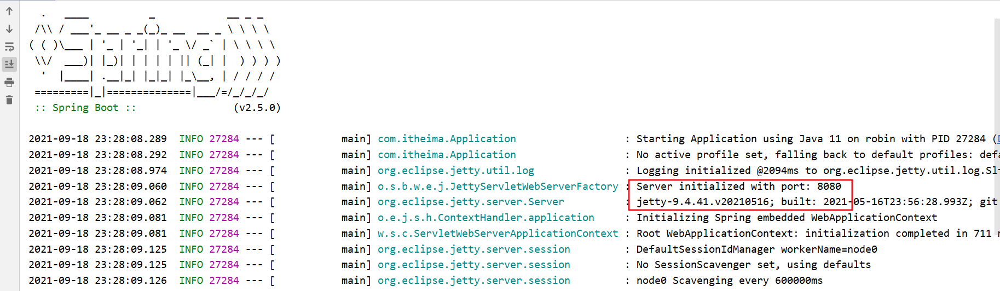

**小结：**

通过切换服务器，我们不难发现在使用 `SpringBoot` 换技术时只需要导入该技术的起步依赖即可。

## 2，配置文件

### 2.1  配置文件格式

我们现在启动服务器默认的端口号是 `8080`，访问路径可以书写为

```
http://localhost:8080/books/1
```

在线上环境我们还是希望将端口号改为 `80`，这样在访问的时候就可以不写端口号了，如下

```
http://localhost/books/1
```

而 `SpringBoot` 程序如何修改呢？`SpringBoot` 提供了多种属性配置方式

* `application.properties`

  ```
  server.port=80
  ```

* `application.yml`

  ```yaml
  server:
  	port: 81
  ```

* `application.yaml`

  ```yaml
  server:
  	port: 82
  ```

> ==注意：`SpringBoot` 程序的配置文件名必须是 `application` ，只是后缀名不同而已。==

#### 2.1.1  环境准备

创建一个新工程 `springboot_02_base_config` 用来演示不同的配置文件，工程环境和入门案例一模一样，结构如下：

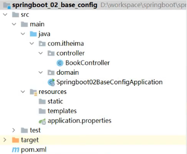

在该工程中的 `com.itheima.controller` 包下创建一个名为 `BookController` 的控制器。内容如下：

```java
@RestController
@RequestMapping("/books")
public class BookController {

    @GetMapping("/{id}")
    public String getById(@PathVariable Integer id){
        System.out.println("id ==> "+id);
        return "hello , spring boot!";
    }
}
```

#### 2.1.2  不同配置文件演示

* **application.properties配置文件**

现在需要进行配置，配合文件必须放在 `resources` 目录下，而该目录下有一个名为 `application.properties` 的配置文件，我们就可以在该配置文件中修改端口号，在该配置文件中书写 `port` ，`Idea` 就会提示，如下

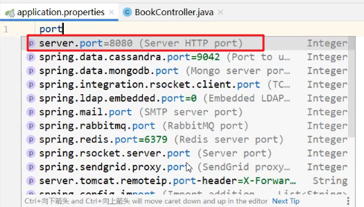

`application.properties` 配置文件内容如下：

```properties
server.port=80
```

启动服务，会在控制台打印出日志信息，从日志信息中可以看到绑定的端口号已经修改了

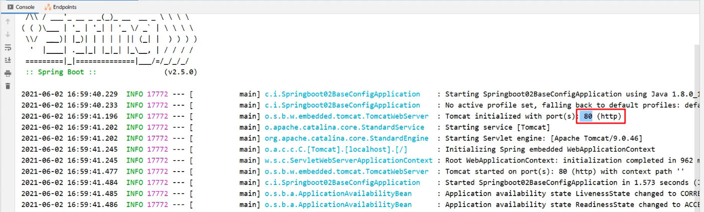

* **application.yml配置文件**

删除 `application.properties` 配置文件中的内容。在 `resources` 下创建一个名为 `application.yml` 的配置文件，在该文件中书写端口号的配置项，格式如下：

```yaml
server:
	port: 81
```

> ==注意： 在`:`后，数据前一定要加空格。==

而在 `yml` 配置文件中也是有提示功能的，我们也可以在该文件中书写 `port` ，然后 `idea` 就会提示并书写成上面的格式

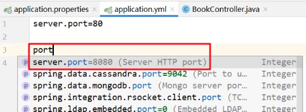

启动服务，可以在控制台看到绑定的端口号是 `81`


* **application.yaml配置文件**

删除 `application.yml` 配置文件和 `application.properties` 配置文件内容，然后在 `resources` 下创建名为 `application.yaml` 的配置文件，配置内容和后缀名为 `yml` 的配置文件中的内容相同，只是使用了不同的后缀名而已

`application.yaml` 配置文件内容如下：

```yaml
server:
	port: 83
```

启动服务，在控制台可以看到绑定的端口号

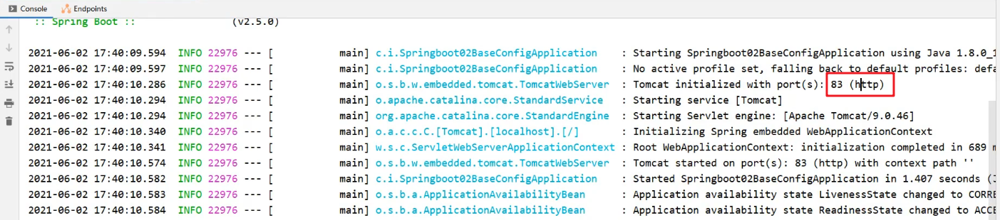

==注意：在配合文件中如果没有提示，可以使用一下方式解决==

* 点击 `File` 选中 `Project Structure`

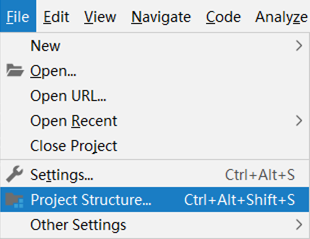

* 弹出如下窗口，按图中标记红框进行选择

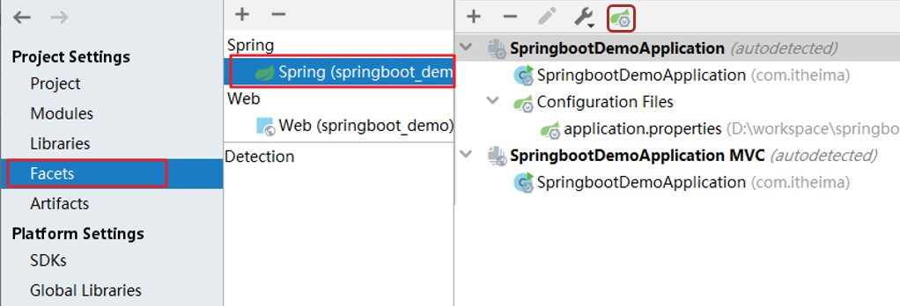

* 通过上述操作，会弹出如下窗口


* 点击上图的 `+` 号，弹出选择该模块的配置文件


* 通过上述几步后，就可以看到如下界面。`properties` 类型的配合文件有一个，`ymal` 类型的配置文件有两个

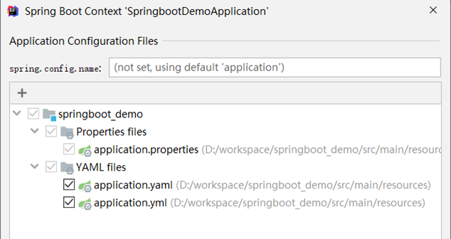

#### 2.1.3  三种配合文件的优先级

在三种配合文件中分别配置不同的端口号，启动服务查看绑定的端口号。用这种方式就可以看到哪个配置文件的优先级更高一些

`application.properties` 文件内容如下：

```properties
server.port=80
```

`application.yml` 文件内容如下：

```yaml
server:
	port: 81
```

`application.yaml` 文件内容如下：

```yaml
server:
	port: 82
```

启动服务，在控制台可以看到使用的端口号是 `80`。说明 `application.properties` 的优先级最高

注释掉 `application.properties` 配置文件内容。再次启动服务，在控制台可以看到使用的端口号是 `81`，说明 `application.yml` 配置文件为第二优先级。

从上述的验证结果可以确定三种配置文件的优先级是：

==`application.properties`  >  `application.yml`   >  `application.yaml`==

> ==注意：==
>
> * `SpringBoot` 核心配置文件名为 `application`
>
> * `SpringBoot` 内置属性过多，且所有属性集中在一起修改，在使用时，通过提示键+关键字修改属性
>
>   例如要设置日志的级别时，可以在配置文件中书写 `logging`，就会提示出来。配置内容如下
>
>   ```yaml
>   logging:
>     level:
>       root: info
>   ```

### 2.2  yaml格式

上面讲了三种不同类型的配置文件，而 `properties` 类型的配合文件之前我们学习过，接下来我们重点学习 `yaml` 类型的配置文件。

**YAML（YAML Ain't Markup Language），一种数据序列化格式。**这种格式的配置文件在近些年已经占有主导地位，那么这种配置文件和前期使用的配置文件是有一些优势的，我们先看之前使用的配置文件。

最开始我们使用的是 `xml` ，格式如下：

```xml
<enterprise>
    <name>itcast</name>
    <age>16</age>
    <tel>4006184000</tel>
</enterprise>
```

而 `properties` 类型的配置文件如下

```properties
enterprise.name=itcast
enterprise.age=16
enterprise.tel=4006184000
```

`yaml` 类型的配置文件内容如下

```yaml
enterprise:
	name: itcast
	age: 16
	tel: 4006184000
```

**优点：**

* 容易阅读

  `yaml` 类型的配置文件比 `xml` 类型的配置文件更容易阅读，结构更加清晰

* 容易与脚本语言交互

* 以数据为核心，重数据轻格式

  `yaml` 更注重数据，而 `xml` 更注重格式

**YAML 文件扩展名：**

* `.yml` (主流)
* `.yaml`

上面两种后缀名都可以，以后使用更多的还是 `yml` 的。

#### 2.2.1  语法规则

* 大小写敏感

* 属性层级关系使用多行描述，每行结尾使用冒号结束

* 使用缩进表示层级关系，同层级左侧对齐，只允许使用空格（不允许使用Tab键）

  空格的个数并不重要，只要保证同层级的左侧对齐即可。

* 属性值前面添加空格（属性名与属性值之间使用冒号+空格作为分隔）

* \# 表示注释

==核心规则：数据前面要加空格与冒号隔开==

数组数据在数据书写位置的下方使用减号作为数据开始符号，每行书写一个数据，减号与数据间空格分隔，例如

```yaml
enterprise:
  name: itcast
  age: 16
  tel: 4006184000
  subject:
    - Java
    - 前端
    - 大数据
```

### 2.3  yaml配置文件数据读取

#### 2.3.1  环境准备

新创建一个名为 `springboot_03_read_data` 的 `SpringBoot` 工程，目录结构如下

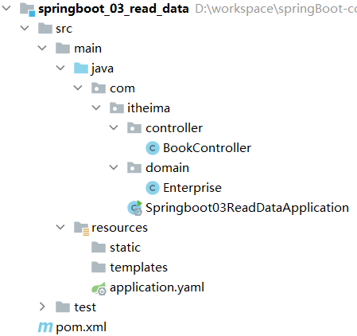

在 `com.itheima.controller` 包写创建名为 `BookController` 的控制器，内容如下

```java
@RestController
@RequestMapping("/books")
public class BookController {

    @GetMapping("/{id}")
    public String getById(@PathVariable Integer id){
        System.out.println("id ==> "+id);
        return "hello , spring boot!";
    }
}
```

在 `com.itheima.domain` 包下创建一个名为 `Enterprise` 的实体类等会用来封装数据，内容如下

```java
public class Enterprise {
    private String name;
    private int age;
    private String tel;
    private String[] subject;
    
    //setter and getter
    
    //toString
}
```

在 `resources` 下创建一个名为 `application.yml` 的配置文件，里面配置了不同的数据，内容如下

```yaml
lesson: SpringBoot

server:
  port: 80

enterprise:
  name: itcast
  age: 16
  tel: 4006184000
  subject:
    - Java
    - 前端
    - 大数据
```

#### 2.3.2  读取配置数据

##### 2.3.2.1  使用 @Value注解

使用 `@Value("表达式")` 注解可以从配合文件中读取数据，注解中用于读取属性名引用方式是：`${一级属性名.二级属性名……}`

我们可以在 `BookController` 中使用 `@Value`  注解读取配合文件数据，如下

```java
@RestController
@RequestMapping("/books")
public class BookController {
    
    @Value("${lesson}")
    private String lesson;
    @Value("${server.port}")
    private Integer port;
    @Value("${enterprise.subject[0]}")
    private String subject_00;

    @GetMapping("/{id}")
    public String getById(@PathVariable Integer id){
        System.out.println(lesson);
        System.out.println(port);
        System.out.println(subject_00);
        return "hello , spring boot!";
    }
}
```

##### 2.3.2.2  Environment对象

上面方式读取到的数据特别零散，`SpringBoot` 还可以使用 `@Autowired` 注解注入 `Environment` 对象的方式读取数据。这种方式 `SpringBoot` 会将配置文件中所有的数据封装到 `Environment` 对象中，如果需要使用哪个数据只需要通过调用 `Environment` 对象的 `getProperty(String name)` 方法获取。具体代码如下：

```java
@RestController
@RequestMapping("/books")
public class BookController {
    
    @Autowired
    private Environment env;
    
    @GetMapping("/{id}")
    public String getById(@PathVariable Integer id){
        System.out.println(env.getProperty("lesson"));
        System.out.println(env.getProperty("enterprise.name"));
        System.out.println(env.getProperty("enterprise.subject[0]"));
        return "hello , spring boot!";
    }
}
```

> ==注意：这种方式，框架内容大量数据，而在开发中我们很少使用。==

##### 2.3.2.3  自定义对象

`SpringBoot` 还提供了将配置文件中的数据封装到我们自定义的实体类对象中的方式。具体操作如下：

* 将实体类 `bean` 的创建交给 `Spring` 管理。

  在类上添加 `@Component` 注解

* 使用 `@ConfigurationProperties` 注解表示加载配置文件

  在该注解中也可以使用 `prefix` 属性指定只加载指定前缀的数据

* 在 `BookController` 中进行注入

**具体代码如下：**

`Enterprise` 实体类内容如下：

```java
@Component
@ConfigurationProperties(prefix = "enterprise")
public class Enterprise {
    private String name;
    private int age;
    private String tel;
    private String[] subject;

    public String getName() {
        return name;
    }

    public void setName(String name) {
        this.name = name;
    }

    public int getAge() {
        return age;
    }

    public void setAge(int age) {
        this.age = age;
    }

    public String getTel() {
        return tel;
    }

    public void setTel(String tel) {
        this.tel = tel;
    }

    public String[] getSubject() {
        return subject;
    }

    public void setSubject(String[] subject) {
        this.subject = subject;
    }

    @Override
    public String toString() {
        return "Enterprise{" +
                "name='" + name + '\'' +
                ", age=" + age +
                ", tel='" + tel + '\'' +
                ", subject=" + Arrays.toString(subject) +
                '}';
    }
}
```

`BookController` 内容如下：

```java
@RestController
@RequestMapping("/books")
public class BookController {
    
    @Autowired
    private Enterprise enterprise;

    @GetMapping("/{id}")
    public String getById(@PathVariable Integer id){
        System.out.println(enterprise.getName());
        System.out.println(enterprise.getAge());
        System.out.println(enterprise.getSubject());
        System.out.println(enterprise.getTel());
        System.out.println(enterprise.getSubject()[0]);
        return "hello , spring boot!";
    }
}
```

==注意：==

使用第三种方式，在实体类上有如下警告提示

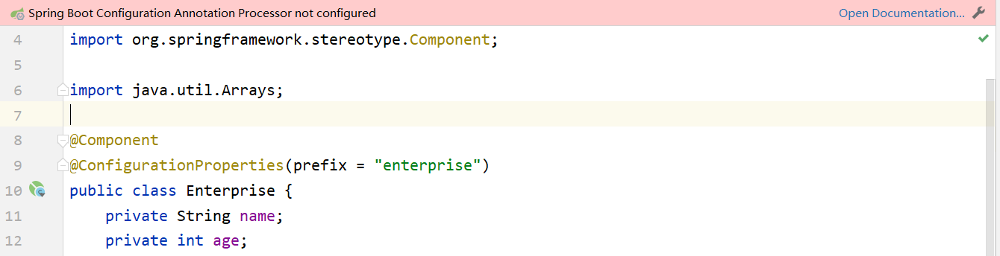

这个警告提示解决是在 `pom.xml` 中添加如下依赖即可

```xml
<dependency>
    <groupId>org.springframework.boot</groupId>
    <artifactId>spring-boot-configuration-processor</artifactId>
    <optional>true</optional>
</dependency>
```

### 2.4  多环境配置

以后在工作中，对于开发环境、测试环境、生产环境的配置肯定都不相同，比如我们开发阶段会在自己的电脑上安装 `mysql` ，连接自己电脑上的 `mysql` 即可，但是项目开发完毕后要上线就需要该配置，将环境的配置改为线上环境的。

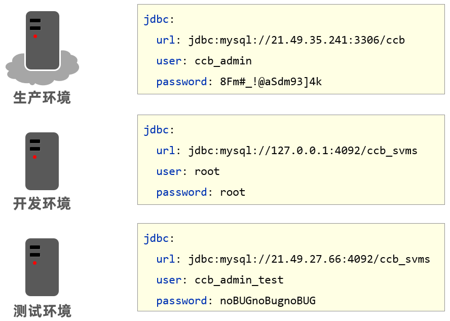

来回的修改配置会很麻烦，而 `SpringBoot` 给开发者提供了多环境的快捷配置，需要切换环境时只需要改一个配置即可。不同类型的配置文件多环境开发的配置都不相同，接下来对不同类型的配置文件进行说明

#### 2.4.1  yaml文件

在 `application.yml` 中使用 `---` 来分割不同的配置，内容如下

```yaml
#开发
spring:
  profiles: dev #给开发环境起的名字
server:
  port: 80
---
#生产
spring:
  profiles: pro #给生产环境起的名字
server:
  port: 81
---
#测试
spring:
  profiles: test #给测试环境起的名字
server:
  port: 82
---
```

上面配置中 `spring.profiles` 是用来给不同的配置起名字的。而如何告知 `SpringBoot` 使用哪段配置呢？可以使用如下配置来启用都一段配置

```yaml
#设置启用的环境
spring:
  profiles:
    active: dev  #表示使用的是开发环境的配置
```

综上所述，`application.yml` 配置文件内容如下

```yaml
#设置启用的环境
spring:
  profiles:
    active: dev

---
#开发
spring:
  profiles: dev
server:
  port: 80
---
#生产
spring:
  profiles: pro
server:
  port: 81
---
#测试
spring:
  profiles: test
server:
  port: 82
---
```

==注意：==

在上面配置中给不同配置起名字的 `spring.profiles` 配置项已经过时。最新用来起名字的配置项是 

```yaml
#开发
spring:
  config:
    activate:
      on-profile: dev
```

#### 2.4.2  properties文件

`properties` 类型的配置文件配置多环境需要定义不同的配置文件

* `application-dev.properties` 是开发环境的配置文件。我们在该文件中配置端口号为 `80`

  ```properties
  server.port=80
  ```

* `application-test.properties` 是测试环境的配置文件。我们在该文件中配置端口号为 `81`

  ```properties
  server.port=81
  ```

* `application-pro.properties` 是生产环境的配置文件。我们在该文件中配置端口号为 `82`

  ```properties
  server.port=82
  ```

`SpringBoot` 只会默认加载名为 `application.properties` 的配置文件，所以需要在 `application.properties` 配置文件中设置启用哪个配置文件，配置如下:

```properties
spring.profiles.active=pro
```

#### 2.4.3  命令行启动参数设置

使用 `SpringBoot` 开发的程序以后都是打成 `jar` 包，通过 `java -jar xxx.jar` 的方式启动服务的。那么就存在一个问题，如何切换环境呢？因为配置文件打到的jar包中了。

我们知道 `jar` 包其实就是一个压缩包，可以解压缩，然后修改配置，最后再打成jar包就可以了。这种方式显然有点麻烦，而 `SpringBoot` 提供了在运行 `jar` 时设置开启指定的环境的方式，如下

```shell
java –jar xxx.jar –-spring.profiles.active=test
```

那么这种方式能不能临时修改端口号呢？也是可以的，可以通过如下方式

```shell
java –jar xxx.jar –-server.port=88
```

当然也可以同时设置多个配置，比如即指定启用哪个环境配置，又临时指定端口，如下

```shell
java –jar springboot.jar –-server.port=88 –-spring.profiles.active=test
```

大家进行测试后就会发现命令行设置的端口号优先级高（也就是使用的是命令行设置的端口号），配置的优先级其实 `SpringBoot` 官网已经进行了说明，参见 :

```
https://docs.spring.io/spring-boot/docs/current/reference/html/spring-boot-features.html#boot-features-external-config
```

进入上面网站后会看到如下页面

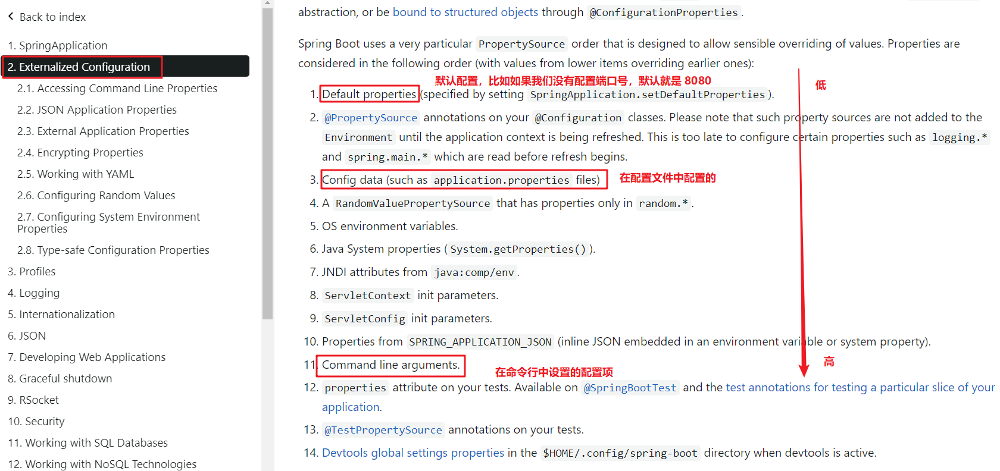

如果使用了多种方式配合同一个配置项，优先级高的生效。

### 2.5  配置文件分类


有这样的场景，我们开发完毕后需要测试人员进行测试，由于测试环境和开发环境的很多配置都不相同，所以测试人员在运行我们的工程时需要临时修改很多配置，如下

```shell
java –jar springboot.jar –-spring.profiles.active=test --server.port=85 --server.servlet.context-path=/heima --server.tomcat.connection-timeout=-1 …… …… …… …… ……
```

针对这种情况，`SpringBoot` 定义了配置文件不同的放置的位置；而放在不同位置的优先级时不同的。

`SpringBoot` 中4级配置文件放置位置：

* 1级：classpath：application.yml  
* 2级：classpath：config/application.yml
* 3级：file ：application.yml
* 4级：file ：config/application.yml 

> ==说明：==级别越高优先级越高

#### 2.5.1  代码演示

在这里我们只演示不同级别配置文件放置位置的优先级。

##### 2.5.1.1  环境准备

创建一个名为 `springboot_06_config_file` 的 `SpringBoot` 工程，目录结构如下

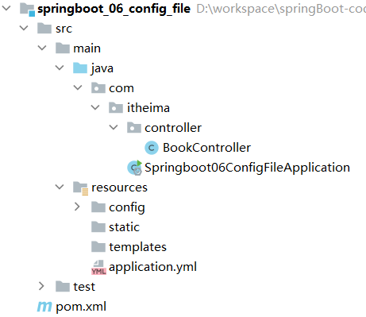

在 `resources` 下创建一个名为 `config` 的目录，在该目录中创建 `application.yml` 配置文件，而在该配置文件中将端口号设置为 `81`，内容如下

```yaml
server:
  port: 81
```

而在 `resources` 下创建的 `application.yml` 配置文件中并将端口号设置为 `80`，内容如下

```yaml
server:
  port: 80
```

##### 2.5.1.2  验证1级和2级的优先级

运行启动引导类，可以在控制台看到如下日志信息

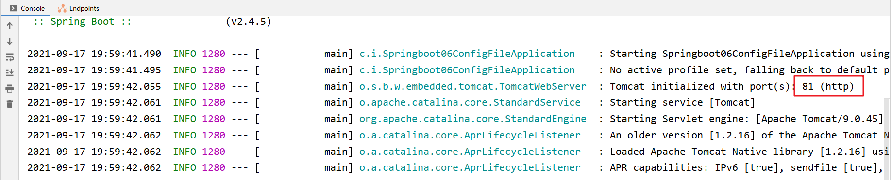

通过这个结果可以得出==类路径下的 `config` 下的配置文件优先于类路径下的配置文件。==

##### 2.5.1.3  验证2级和4级的优先级

要验证4级，按照以下步骤完成

* 将工程打成 `jar` 包

  点击工程的 `package` 来打 `jar` 包

  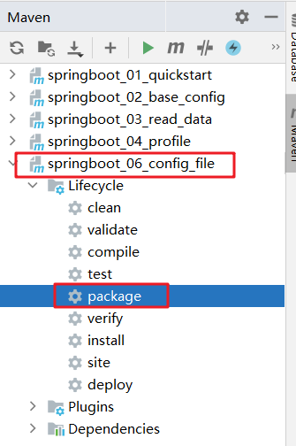

* 在硬盘上找到 `jar` 包所在位置

  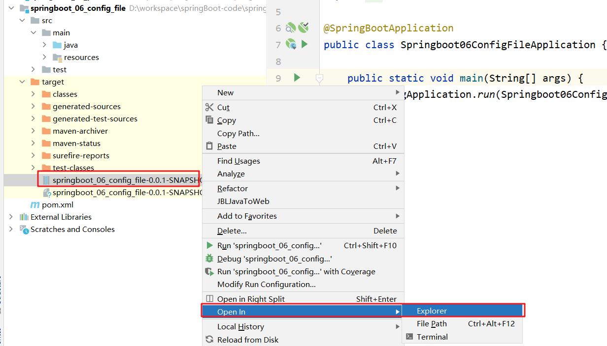

* 在 `jar` 包所在位置创建 `config` 文件夹，在该文件夹下创建 `application.yml` 配置文件，而在该配合文件中将端口号设置为 `82` 

* 在命令行使用以下命令运行程序

  ```shell
  java -jar springboot_06_config_file-0.0.1-SNAPSHOT.jar
  ```

  运行后日志信息如下

  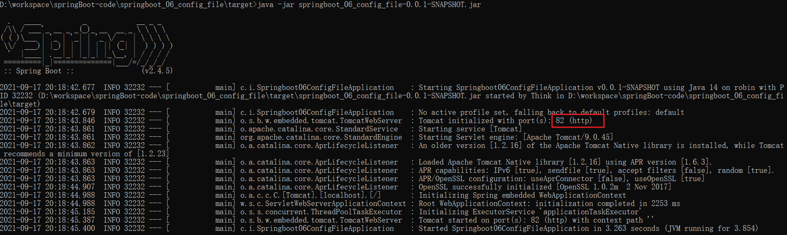

  通过这个结果可以得出==file： `config` 下的配置文件优先于类路径下的配置文件。==

> ==注意：==
>
> SpringBoot 2.5.0版本存在一个bug，我们在使用这个版本时，需要在 `jar` 所在位置的 `config` 目录下创建一个任意名称的文件夹

## 3，SpringBoot整合junit

回顾 `Spring` 整合 `junit`

```java
@RunWith(SpringJUnit4ClassRunner.class)
@ContextConfiguration(classes = SpringConfig.class)
public class UserServiceTest {
    
    @Autowired
    private BookService bookService;
    
    @Test
    public void testSave(){
        bookService.save();
    }
}
```

使用 `@RunWith` 注解指定运行器，使用 `@ContextConfiguration` 注解来指定配置类或者配置文件。而 `SpringBoot` 整合 `junit` 特别简单，分为以下三步完成

* 在测试类上添加 `SpringBootTest` 注解
* 使用 `@Autowired` 注入要测试的资源
* 定义测试方法进行测试

### 3.1  环境准备

创建一个名为 `springboot_07_test` 的 `SpringBoot` 工程，工程目录结构如下

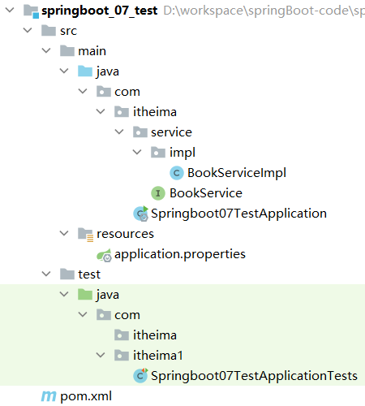

在 `com.itheima.service` 下创建 `BookService` 接口，内容如下

```java
public interface BookService {
    public void save();
}
```

在 `com.itheima.service.impl` 包写创建一个 `BookServiceImpl` 类，使其实现 `BookService` 接口，内容如下

```java
@Service
public class BookServiceImpl implements BookService {
    @Override
    public void save() {
        System.out.println("book service is running ...");
    }
}
```

### 3.2  编写测试类

在 `test/java` 下创建 `com.itheima` 包，在该包下创建测试类，将 `BookService` 注入到该测试类中

```java
@SpringBootTest
class Springboot07TestApplicationTests {

    @Autowired
    private BookService bookService;

    @Test
    public void save() {
        bookService.save();
    }
}
```

> ==注意：==这里的引导类所在包必须是测试类所在包及其子包。
>
> 例如：
>
> * 引导类所在包是 `com.itheima`
> * 测试类所在包是 `com.itheima`
>
> 如果不满足这个要求的话，就需要在使用 `@SpringBootTest` 注解时，使用 `classes` 属性指定引导类的字节码对象。如 `@SpringBootTest(classes = Springboot07TestApplication.class)`

## 4，SpringBoot整合mybatis

### 4.1  回顾Spring整合Mybatis

`Spring` 整合 `Mybatis` 需要定义很多配置类

* `SpringConfig` 配置类

  * 导入 `JdbcConfig` 配置类

  * 导入 `MybatisConfig` 配置类

    ```java
    @Configuration
    @ComponentScan("com.itheima")
    @PropertySource("classpath:jdbc.properties")
    @Import({JdbcConfig.class,MyBatisConfig.class})
    public class SpringConfig {
    }
    
    ```

*  `JdbcConfig` 配置类

  * 定义数据源（加载properties配置项：driver、url、username、password）

    ```java
    public class JdbcConfig {
        @Value("${jdbc.driver}")
        private String driver;
        @Value("${jdbc.url}")
        private String url;
        @Value("${jdbc.username}")
        private String userName;
        @Value("${jdbc.password}")
        private String password;
    
        @Bean
        public DataSource getDataSource(){
            DruidDataSource ds = new DruidDataSource();
            ds.setDriverClassName(driver);
            ds.setUrl(url);
            ds.setUsername(userName);
            ds.setPassword(password);
            return ds;
        }
    }
    ```

* `MybatisConfig` 配置类

  * 定义 `SqlSessionFactoryBean`

  * 定义映射配置

    ```java
    @Bean
    public MapperScannerConfigurer getMapperScannerConfigurer(){
        MapperScannerConfigurer msc = new MapperScannerConfigurer();
        msc.setBasePackage("com.itheima.dao");
        return msc;
    }
    
    @Bean
    public SqlSessionFactoryBean getSqlSessionFactoryBean(DataSource dataSource){
        SqlSessionFactoryBean ssfb = new SqlSessionFactoryBean();
        ssfb.setTypeAliasesPackage("com.itheima.domain");
        ssfb.setDataSource(dataSource);
        return ssfb;
    }
    
    ```

### 4.2  SpringBoot整合mybatis

#### 4.2.1  创建模块

* 创建新模块，选择 `Spring Initializr`，并配置模块相关基础信息

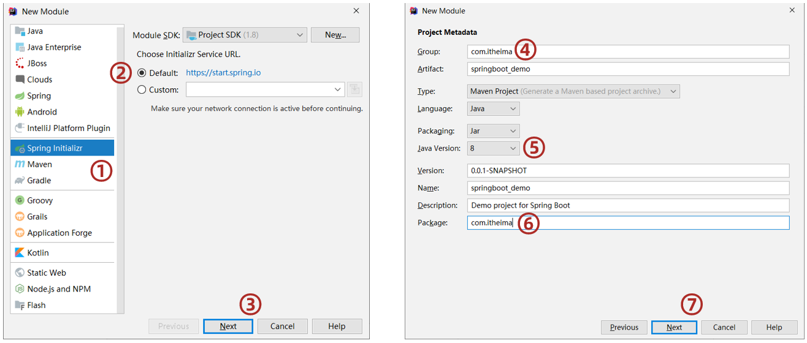

* 选择当前模块需要使用的技术集（MyBatis、MySQL）

  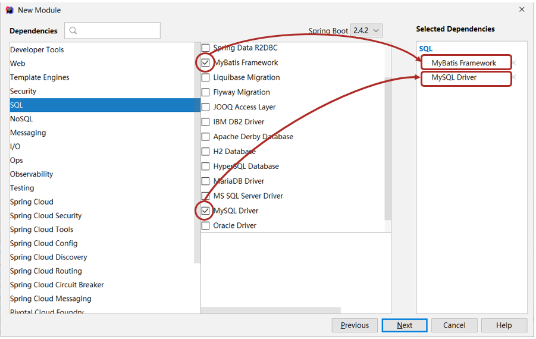

#### 4.2.2  定义实体类

在 `com.itheima.domain` 包下定义实体类 `Book`，内容如下

```java
public class Book {
    private Integer id;
    private String name;
    private String type;
    private String description;
    
    //setter and  getter
    
    //toString
}
```

#### 4.2.3  定义dao接口

在 `com.itheima.dao` 包下定义 `BookDao` 接口，内容如下

```java
public interface BookDao {
    @Select("select * from tbl_book where id = #{id}")
    public Book getById(Integer id);
}
```

#### 4.2.4  定义测试类

在 `test/java` 下定义包 `com.itheima` ，在该包下测试类，内容如下

```java
@SpringBootTest
class Springboot08MybatisApplicationTests {

	@Autowired
	private BookDao bookDao;

	@Test
	void testGetById() {
		Book book = bookDao.getById(1);
		System.out.println(book);
	}
}
```

#### 4.2.5  编写配置

我们代码中并没有指定连接哪儿个数据库，用户名是什么，密码是什么。所以这部分需要在 `SpringBoot` 的配置文件中进行配合。

在 `application.yml` 配置文件中配置如下内容

```yml
spring:
  datasource:
    driver-class-name: com.mysql.jdbc.Driver
    url: jdbc:mysql://localhost:3306/ssm_db
    username: root
    password: root
```

#### 4.2.6  测试

运行测试方法，我们会看到如下错误信息

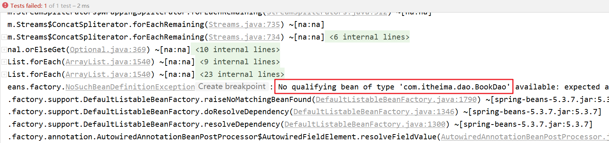

错误信息显示在 `Spring` 容器中没有 `BookDao` 类型的 `bean`。为什么会出现这种情况呢？

原因是 `Mybatis` 会扫描接口并创建接口的代码对象交给 `Spring` 管理，但是现在并没有告诉 `Mybatis` 哪个是 `dao` 接口。而我们要解决这个问题需要在`BookDao` 接口上使用 `@Mapper` ，`BookDao` 接口改进为

```java
@Mapper
public interface BookDao {
    @Select("select * from tbl_book where id = #{id}")
    public Book getById(Integer id);
}
```

> ==注意：==
>
> `SpringBoot` 版本低于2.4.3(不含)，Mysql驱动版本大于8.0时，需要在url连接串中配置时区 `jdbc:mysql://localhost:3306/ssm_db?serverTimezone=UTC`，或在MySQL数据库端配置时区解决此问题

#### 4.2.7  使用Druid数据源

现在我们并没有指定数据源，`SpringBoot` 有默认的数据源，我们也可以指定使用 `Druid` 数据源，按照以下步骤实现

* 导入 `Druid` 依赖

  ```xml
  <dependency>
      <groupId>com.alibaba</groupId>
      <artifactId>druid</artifactId>
      <version>1.1.16</version>
  </dependency>
  ```

* 在 `application.yml` 配置文件配置

  可以通过 `spring.datasource.type` 来配置使用什么数据源。配置文件内容可以改进为

  ```yaml
  spring:
    datasource:
      driver-class-name: com.mysql.cj.jdbc.Driver
      url: jdbc:mysql://localhost:3306/ssm_db?serverTimezone=UTC
      username: root
      password: root
      type: com.alibaba.druid.pool.DruidDataSource
  ```

## 5，案例

`SpringBoot` 到这就已经学习完毕，接下来我们将学习 `SSM` 时做的三大框架整合的案例用 `SpringBoot` 来实现一下。我们完成这个案例基本是将之前做的拷贝过来，修改成 `SpringBoot` 的即可，主要从以下几部分完成

1. pom.xml

   配置起步依赖，必要的资源坐标(druid)

2. application.yml

   设置数据源、端口等

3. 配置类

   全部删除

4. dao

   设置@Mapper

5. 测试类

6. 页面

   放置在resources目录下的static目录中

### 5.1  创建工程

创建 `SpringBoot` 工程，在创建工程时需要勾选 `web`、`mysql`、`mybatis`，工程目录结构如下

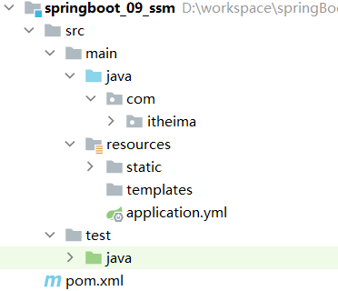

由于我们工程中使用到了 `Druid` ，所以需要导入 `Druid` 的坐标

```xml
<dependency>
    <groupId>com.alibaba</groupId>
    <artifactId>druid</artifactId>
    <version>1.1.16</version>
</dependency>
```

### 5.2  代码拷贝

将 `springmvc_11_page` 工程中的 `java` 代码及测试代码连同包拷贝到 `springboot_09_ssm` 工程，按照下图进行拷贝

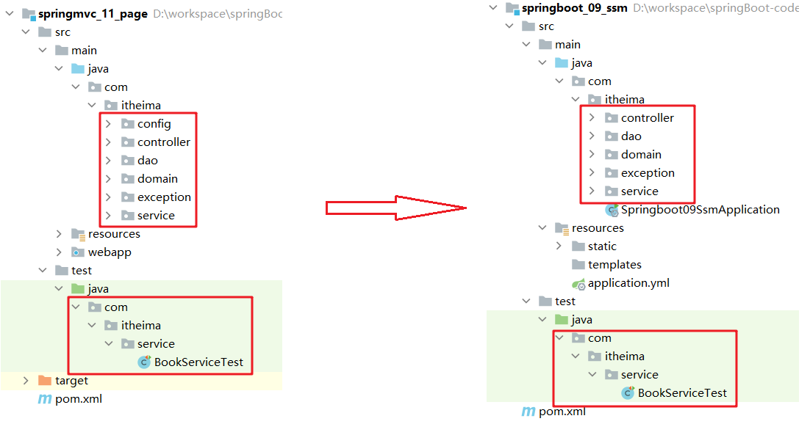

需要修改的内容如下：

* `Springmvc_11_page` 中 `config` 包下的是配置类，而 `SpringBoot` 工程不需要这些配置类，所以这些可以直接删除

* `dao` 包下的接口上在拷贝到 `springboot_09-ssm` 工程中需要在接口中添加 `@Mapper` 注解

* `BookServiceTest` 测试需要改成 `SpringBoot` 整合 `junit` 的

  ```java
  @SpringBootTest
  public class BookServiceTest {
  
      @Autowired
      private BookService bookService;
  
      @Test
      public void testGetById(){
          Book book = bookService.getById(2);
          System.out.println(book);
      }
  
      @Test
      public void testGetAll(){
          List<Book> all = bookService.getAll();
          System.out.println(all);
      }
  }
  ```

### 5.3  配置文件

在 `application.yml` 配置文件中需要配置如下内容

* 服务的端口号
* 连接数据库的信息
* 数据源

```yaml
server:
  port: 80

spring:
  datasource:
    type: com.alibaba.druid.pool.DruidDataSource
    driver-class-name: com.mysql.cj.jdbc.Driver
    url: jdbc:mysql://localhost:3306/ssm_db #?servierTimezone=UTC
    username: root
    password: root
```

### 5.4  静态资源

在 `SpringBoot` 程序中是没有 `webapp` 目录的，那么在 `SpringBoot` 程序中静态资源需要放在什么位置呢？

静态资源需要放在 `resources` 下的 `static` 下，如下图所示

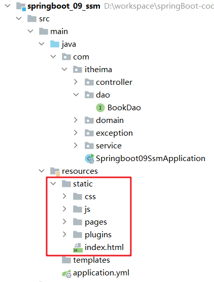


