# 2022 年几个热门又实用的 Vue.js 库！

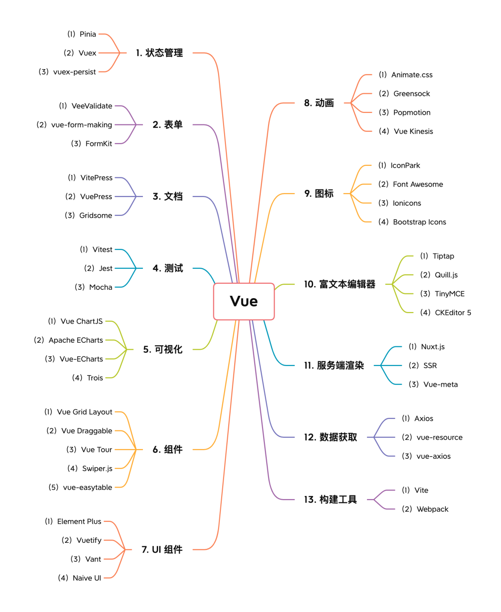

## 1. 状态管理

### （1）Pinia

Pinia 是最新一代的 Vue 轻量级状态管理库。它适用于 Vue 2.x 和 Vue 3.x。它是 Vue 官方成员在2019年11月重新设计的一个状态存储库，它允许你跨组件/页面共享状态，并且是响应式的，类似于 Vuex。

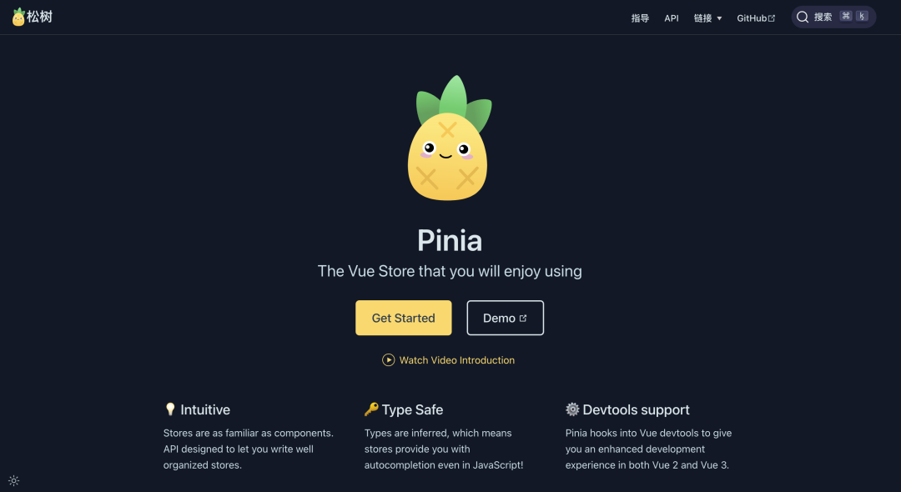

**Github：**https://github.com/vuejs/pinia

### （2）Vuex

Vuex 是一个专为 Vue.js 应用程序开发的状态管理模式。它采用集中式存储管理应用的所有组件的状态，并以相应的规则保证状态以一种可预测的方式发生变化。

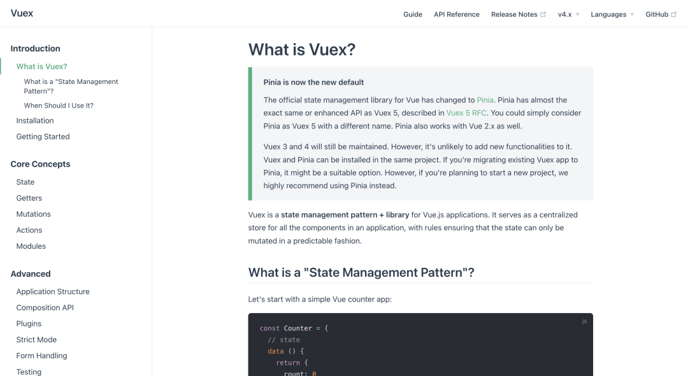

**Github：**https://github.com/vuejs/vuex

### （3）vuex-persist

vuex-persistedstate 是一个支持 Typescript 的Vuex插件，使你能够将应用程序的状态保存到持久存储中，例如 Cookies 或 localStorage。

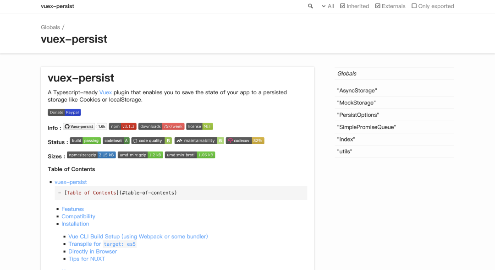

**Github：**https://github.com/championswimmer/vuex-persist

## 2. 表单

### （1）VeeValidate

vee-validate 是Vue.js的表单验证库，它允许验证输入并以熟悉的声明式样式或使用组合函数构建更好的表单 UI。

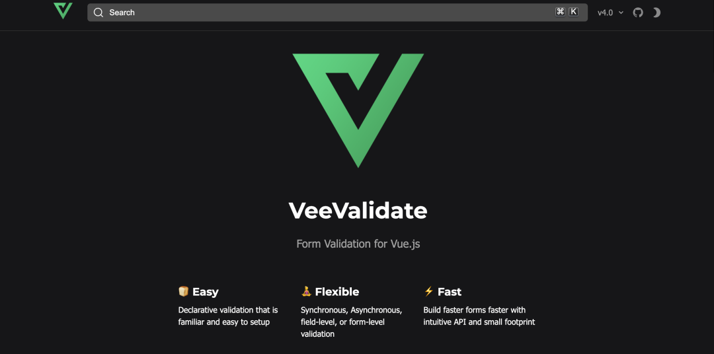

**Github：**https://github.com/logaretm/vee-validate

### （2）vue-form-making

vue-form-making 是一个基于 vue 和 element-ui 实现的可视化表单设计器，使用了最新的前端技术栈，内置了 i18n 国际化解决方案，可以让表单开发简单而高效。

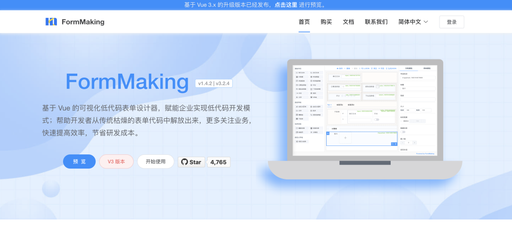

**Github：**https://github.com/GavinZhuLei/vue-form-making

### （3）FormKit

FormKit 是一个面向 Vue 开发人员的表单创作框架，它使构建高质量的生产就绪表单的速度提高了 10 倍。

**Github：**https://github.com/formkit/formkit

## 3. 文档

### （1）VitePress

VitePress 是 VuePress 的继承者，建立在vite 之上。目前，正处于alpha阶段。它已经适合开箱即用的文档使用，但配置和主题 API 可能仍会在次要版本之间发生变化。

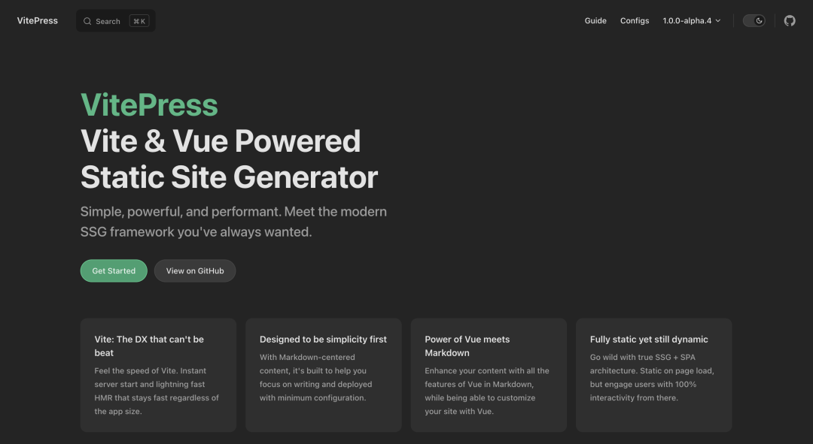

**Github：**https://github.com/vuejs/vitepress

### （2）VuePress

VuePress 是一个基于 Vue 的轻量级静态网站生成器，以及为编写技术文档而优化的默认主题。它是为了满足 Vue 自己的子项目文档的需求而创建的。

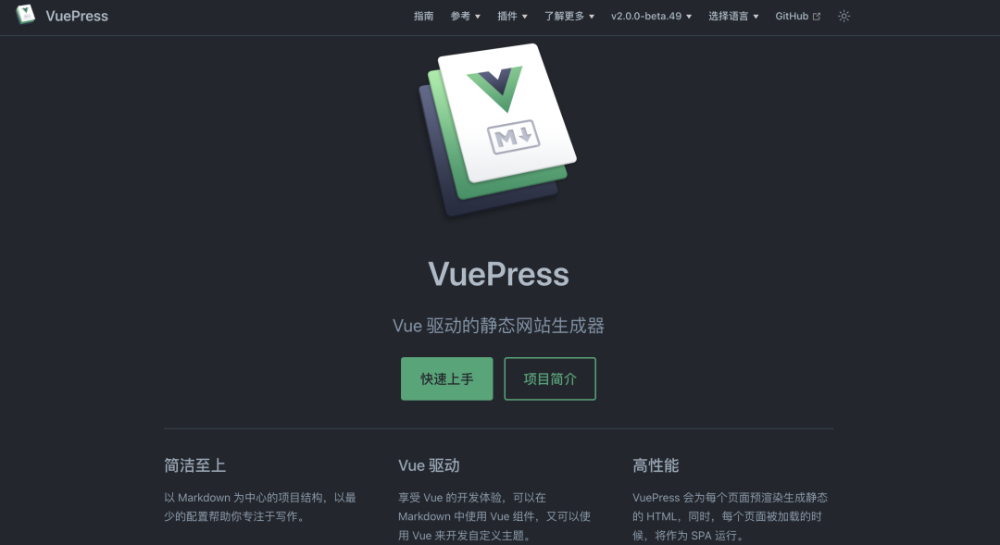

**Github：**https://github.com/vuepress/vuepress-next

### （3）Gridsome

Gridsome 是一个基于 Vue.js 构建的 Jamstack 框架，它让开发人员可以轻松地构建静态生成的网站和应用程序，这些网站和应用程序天生速度快。

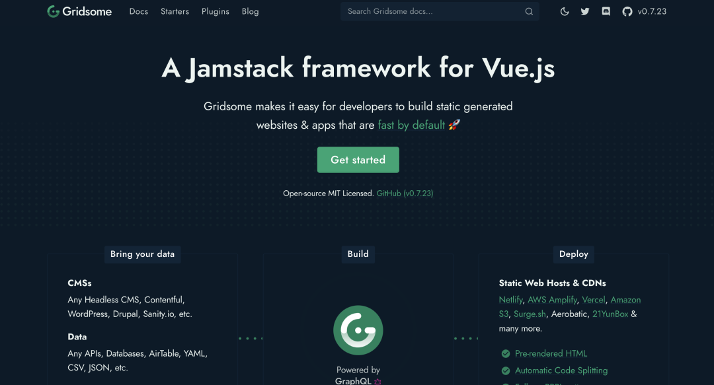

**Github：**https://github.com/gridsome/gridsome

## 4. 测试

### （1）Vitest

Vitest 是一个由 Vite 提供支持的极速单元测试框架。其和 Vite 的配置、转换器、解析器和插件保持一致，具有开箱即用的 TypeScript / JSX 支持。

**Github：**https://github.com/vitest-dev/vitest

### （2）Jest

Jest 是一个全面的 JavaScript 测试解决方案，专注于简洁明快。适用于大多数 JavaScript 项目。

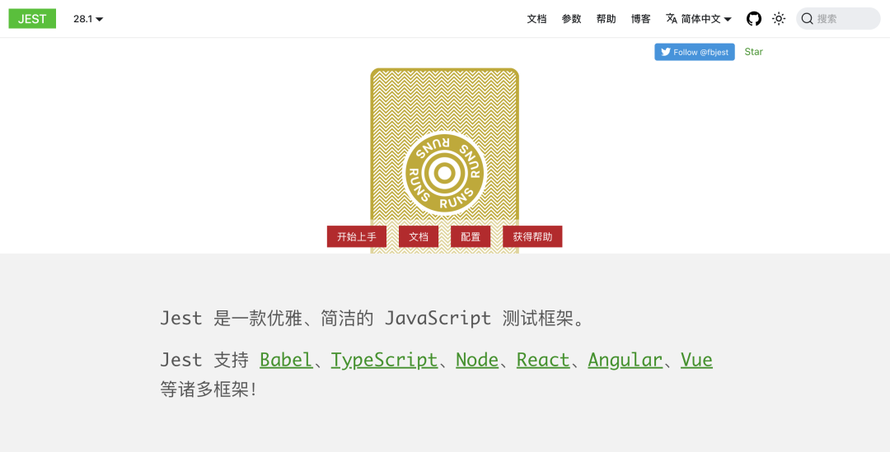

**Github：**https://github.com/facebook/jest

### （3）Mocha

mocha是一个功能丰富的javascript测试框架，运行在node.js和浏览器中，使异步测试变得简单有趣。Mocha测试连续运行，允许灵活和准确的报告，同时将未捕获的异常映射到正确的测试用例。

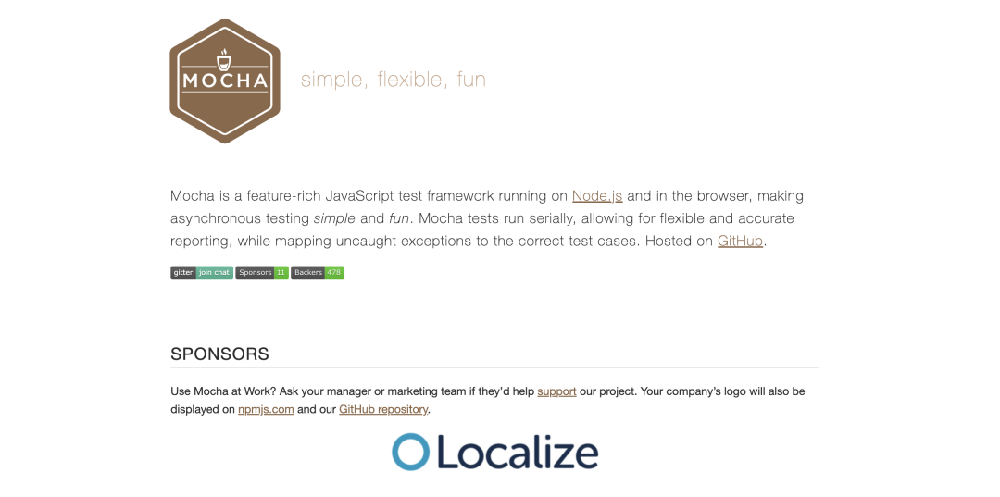

**Github：**https://github.com/mochajs/mocha

## 5. 可视化

### （1）Vue ChartJS

vue-chartjs 是一个 Vue 对于 Chart.js 的封装，让用户可以在Vue中轻松使用Chart.js，很简单的创建可复用的图表组件，非常适合需要简单的图表并尽可能快地运行的人。vue-chartjs抽象了基本逻辑，同时也暴露了Chart.js对象，让用户获得最大的灵活性。它支持 Vue 3 和 Vue 2。

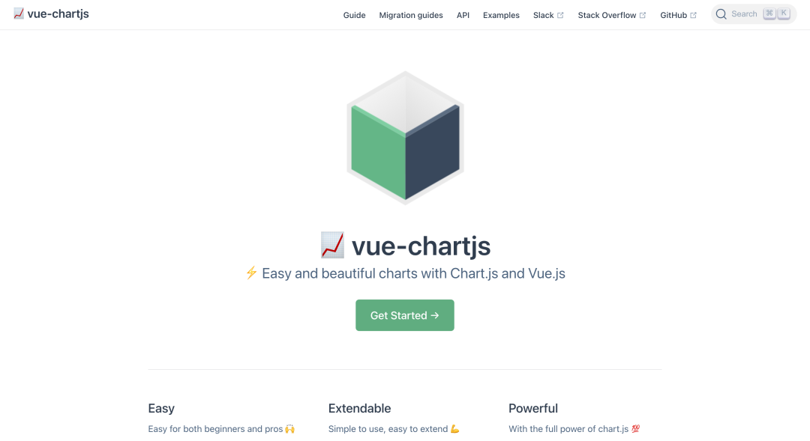

**Github：**https://github.com/apertureless/vue-chartjs

### （2）Apache ECharts

Apache ECharts 是一款基于Javascript的数据可视化图表库，提供直观，生动，可交互，可个性化定制的数据可视化图表。它是用纯 JavaScript 编写的，基于zrender，是一个全新的轻量级画布库。!

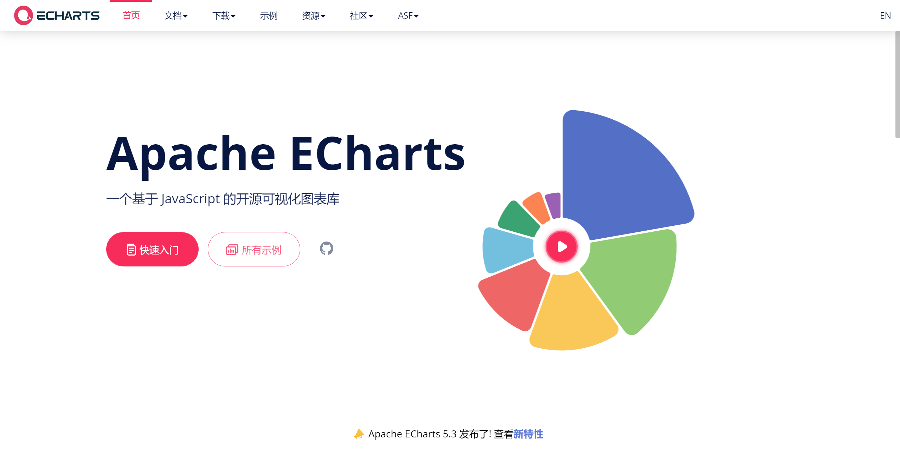

**GitHub：**https://github.com/apache/echarts

### （3）Vue-ECharts

Vue-ECharts 是 Apache ECharts 的 Vue.js 组件。使用 Apache ECharts 5，同时支持 Vue.js 2/3。

**Github：**https://github.com/ecomfe/vue-echarts

### （4）Trois

Trois 是一个基于 Three.JS 的 Vue 3 可视化库，它是一个流行的 WebGL 库。Three.JS 对桌面和移动设备都有很好的支持。该库允许我们使用 VueJS 组件轻松为网站创建 3D 效果。

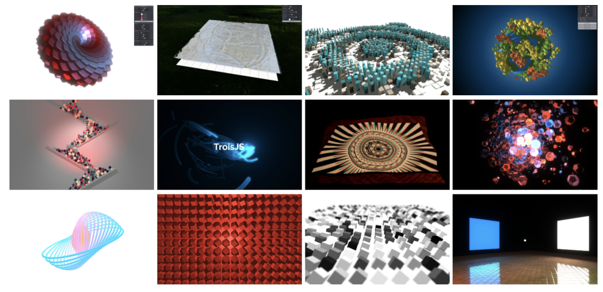

**Github：**https://github.com/troisjs/trois

## 6. 组件

### （1）Vue Grid Layout

vue-grid-layout 是一个网格布局系统，类似于 Gridster，用于 Vue.js。

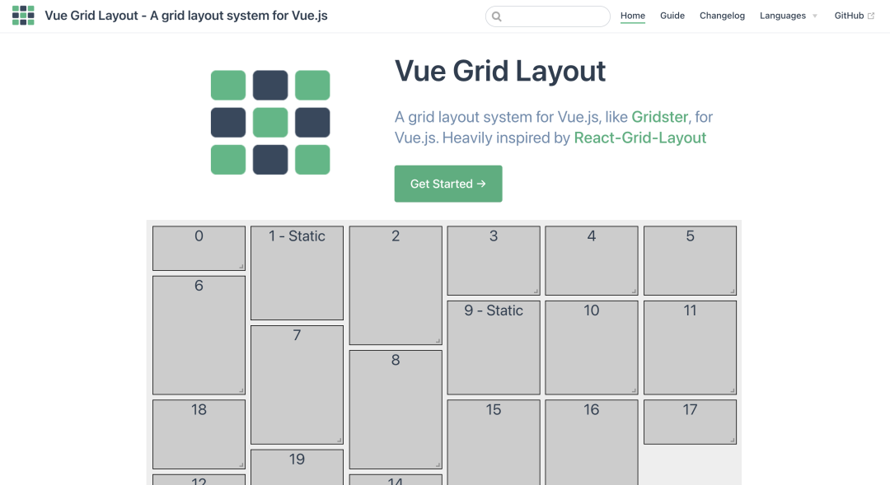

**Github：**https://github.com/jbaysolutions/vue-grid-layout

### （2）Vue Draggable

Vue Draggable 是一个基于 Sortable.js 的 Vue 拖拽组件。

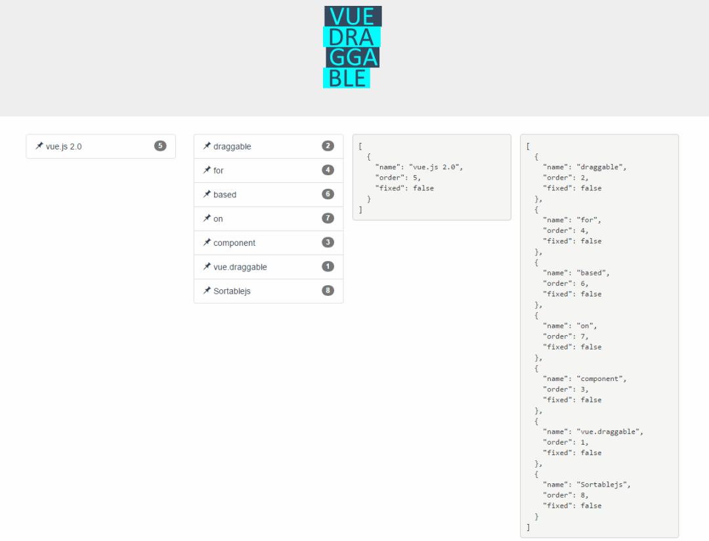

**Github：**https://github.com/SortableJS/Vue.Draggable

### （3）Vue Tour

Vue Tour 是一个轻量级、简单且可定制的导览插件，可与 Vue.js 一起使用。它提供了一种快速简便的方法来指导用户完成你的应用程序。

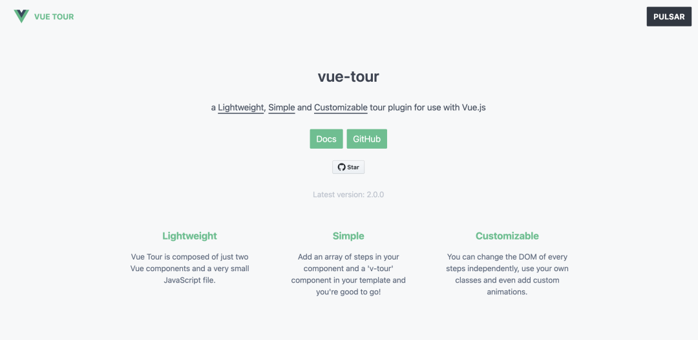

**Github：**https://github.com/pulsardev/vue-tour

### （4）Swiper.js

Swiper 是一款免费以及轻量级的移动设备触控滑块的框架，使用硬件加速过渡。主要使用与移动端的网站、网页应用程序，以及原生的应用程序。

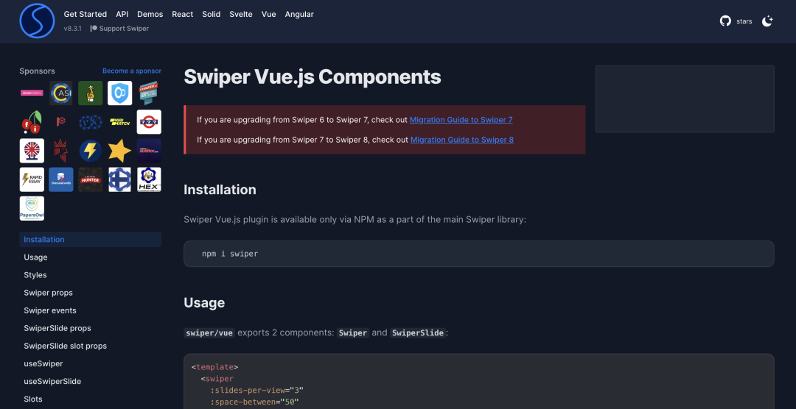

**Github：**https://github.com/nolimits4web/swiper

### （5）vue-easytable

该库提供了一个功能齐全且高度可定制的表格组件/数据网格。它支持许多功能，如虚拟滚动、列固定、标题固定、标题分组、过滤器、排序、单元格省略号、行扩展、行复选框等。

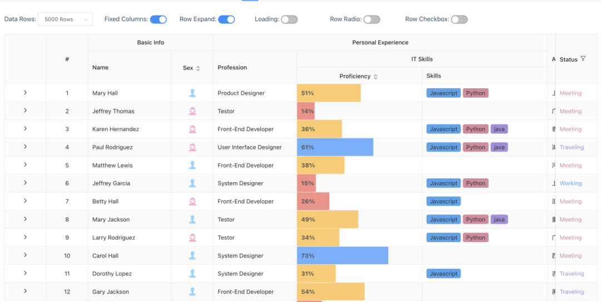

**Github：**https://github.com/Happy-Coding-Clans/vue-easytable

## 7. UI 组件

### （1）Element Plus

Element Plus，由饿了么大前端团队开源出品的一套为开发者、设计师和产品经理准备的基于 Vue 3.0 的组件库，Element Plus 是基于 Vue3 面向设计师和开发者的组件库，提供了配套设计资源，帮助你的网站快速成型。

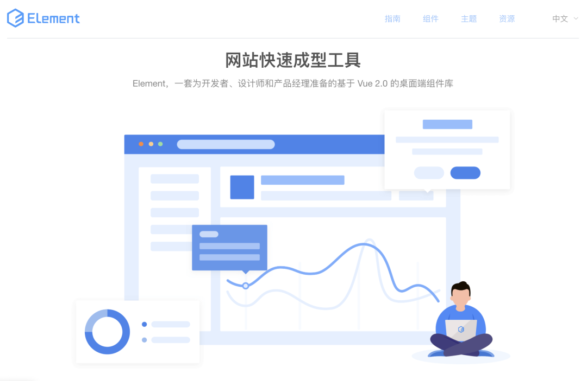

**GitHub**：https://github.com/ElemeFE/element

### （2）Vuetify

Vuetify 是一个基于 Vue.js 精心打造 UI 组件库，整套 UI 设计为 Material 风格。能够让没有任何设计技能的开发者创造出时尚的 Material 风格界面。

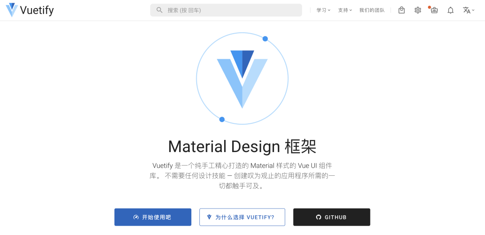

**GitHub**：https://github.com/vuetifyjs/vuetify

### （3）Vant

Vant 是一套轻量、可靠的移动端组件库。通过 Vant，可以快速搭建出风格统一的页面，提升开发效率，支持 Vue 3。

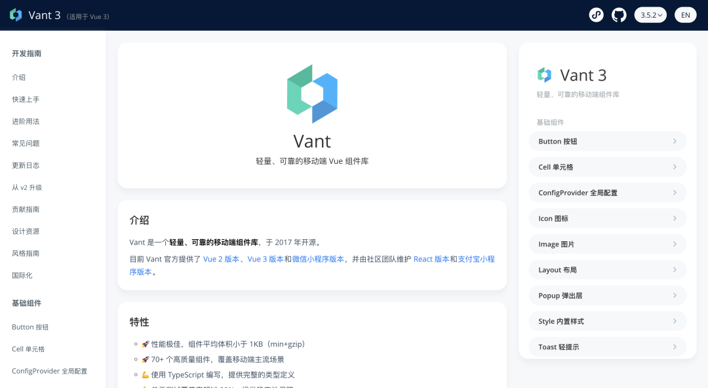

**Github：**https://github.com/youzan/vant

### （4）Naive UI

Naive UI 是一款基于当前比较新的 Vue 3.0/TypeScript 技栈开发的前端 UI 组件库。

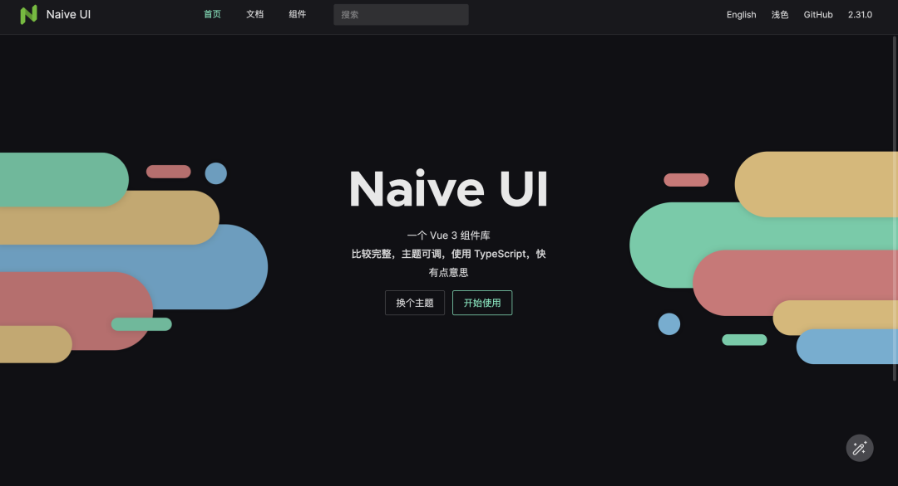

**Github：**https://github.com/TuSimple/naive-ui

## 8. 动画

### （1）Animate.css

animate.css 是一个使用CSS3的animation制作的动画效果的CSS集合，里面预设了很多种常用的动画，且使用非常简单。

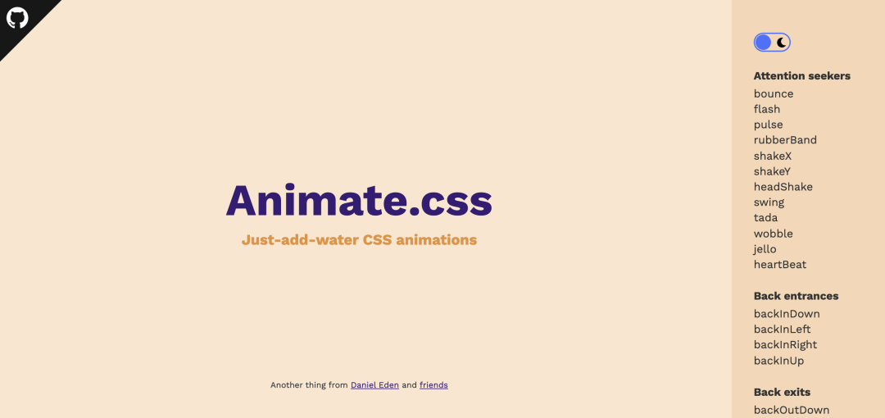

**GitHub：**https://github.com/animate-css/animate.css

### （2）Greensock

GreenSock是一个JavaScript动画库，可轻松对HTML元素进行动画处理。用于创建高性能，零依赖性，跨浏览器动画，声称在超过 400 万个网站中使用。

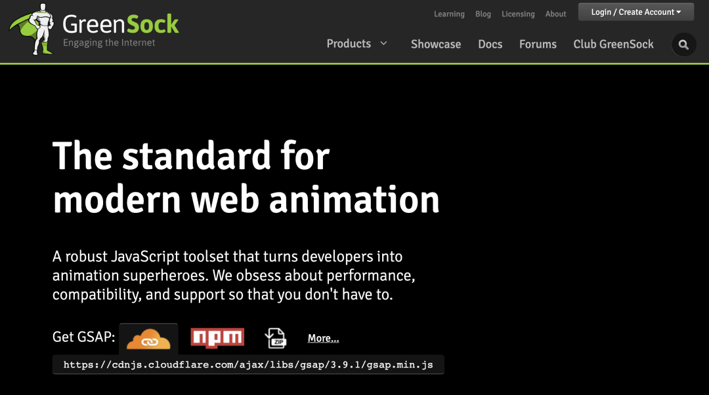

**Github：**https://github.com/greensock/GreenSock-JS/

### （3）Popmotion

Popmotion 是一个只有12KB的 JavaScript 运动引擎，可以用来实现动画，物理效果和输入跟踪。原生的DOM支持：CSS，SVG，SVG路径和DOM属性的支持，开箱即用。

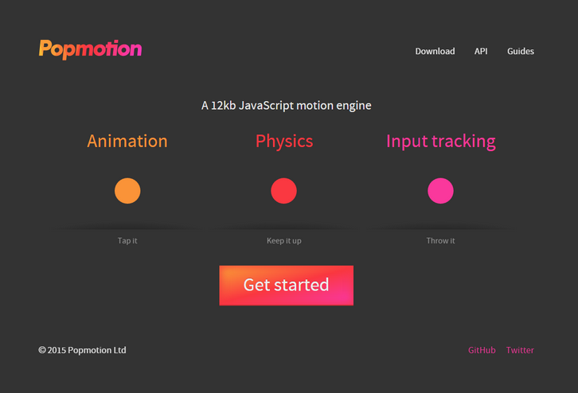

**Github：**https://github.com/Popmotion/popmotion

### （4）Vue Kinesis

Vue Kinesis 支持使用 Vue.js 轻松创建复杂的交互式动画，其支持 Vue 3。

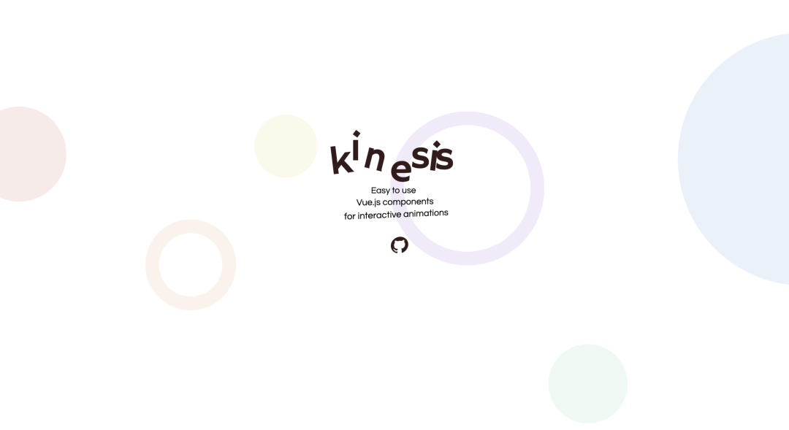

**Github：**https://github.com/Aminerman/vue-kinesis

## 9. 图标

### （1）IconPark

IconPark 提供超过 2400 个高质量图标，还提供了每个图标的含义和来源的描述，便于开发者使用。除此之外，该网站还可以自定义图标，这是与其他图标网站与众不同的地方。该图标库是字节跳动旗下的技术驱动图标样式的开源图标库。

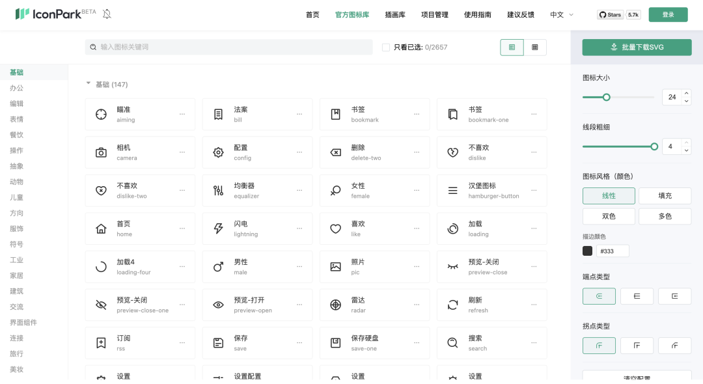

**Github：**https://github.com/bytedance/iconpark

### （2）Font Awesome

Font Awesome 提供了可缩放的矢量图标，可以使用CSS所提供的所有特性对它们进行更改，包括：大小、颜色、阴影或者其它任何支持的效果。

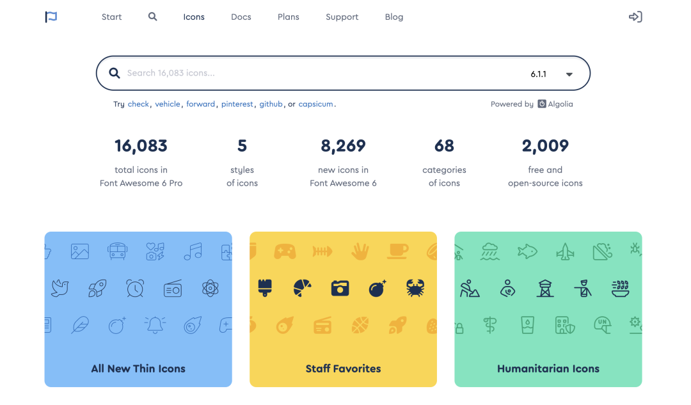

**Github：**https://github.com/FortAwesome/Font-Awesome

### （3）Ionicons

Ionicons 是一个完全开源的图标集，是知名混合开发框架 Ionic Framework 内置的图标库，包含 1300 个设计优雅、风格统一的高质量图标，能满足大多数的业务场景。

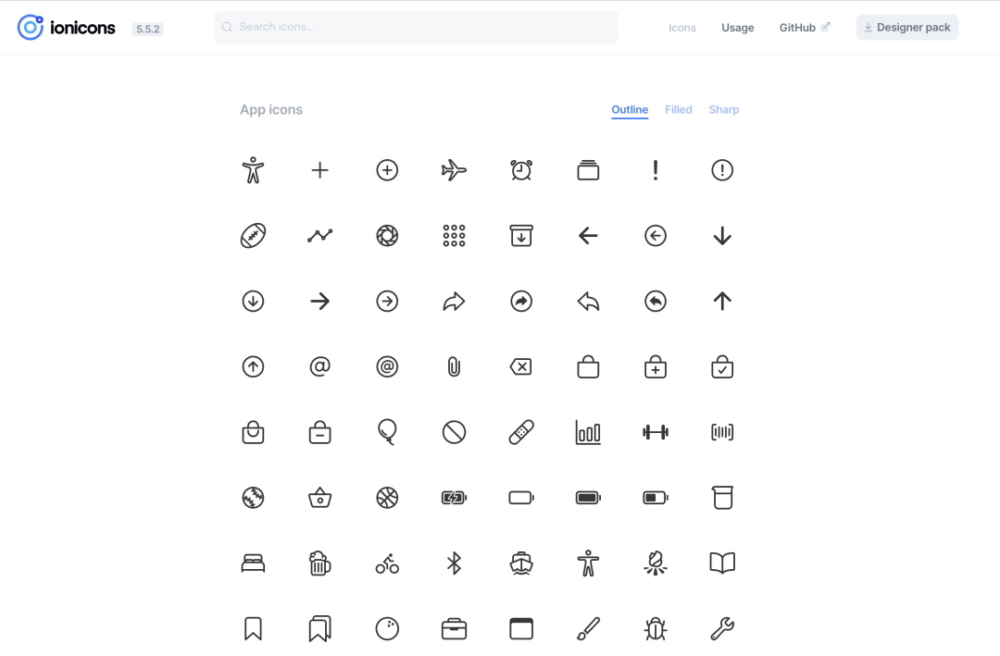

**Github：**https://github.com/ionic-team/ionicons

### （4）Bootstrap Icons

Bootstrap Icons 是 Bootstrap 开源的 SVG 图标库，此图标库起初专门针对其组件（从表单控件到导航）和文档进行定制设计和构建，现在可以免费用于任何项目。

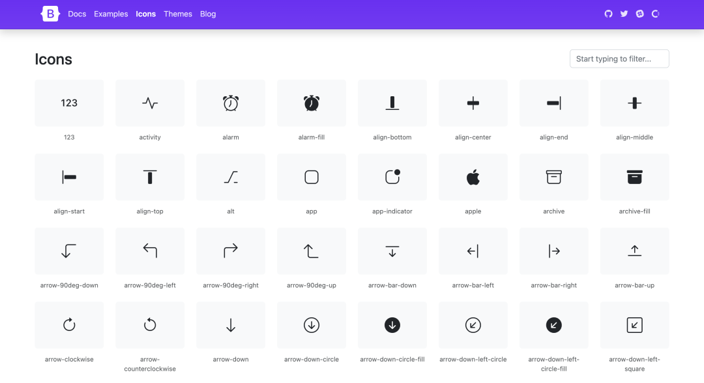

**Github：**https://github.com/twbs/icons

## 10. 富文本编辑器

### （1）Tiptap

Tiptap 是一个基于 Vue 的无渲染的富文本编辑器，它基于 Prosemirror，完全可扩展且无渲染。可以轻松地将自定义节点添加为Vue组件。使用无渲染组件（函数式组件），几乎完全控制标记和样式。菜单的外观或在DOM中的显示位置。这完全取决于使用者。

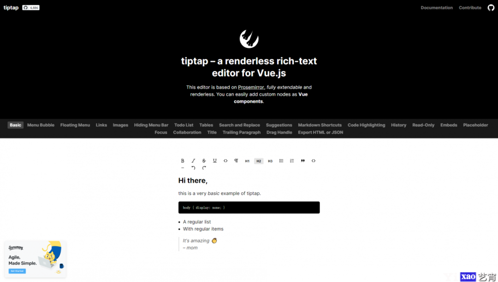

**GitHub：**https://github.com/ueberdosis/tiptap

### （2）Quill.js

Quill.js 是一个具有跨平台和跨浏览器支持的富文本编辑器。凭借其可扩展架构和富有表现力的 API，可以完全自定义它以满足个性化的需求。

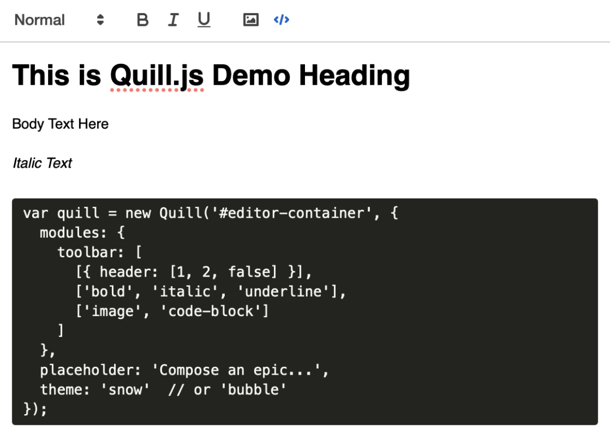

**GitHub：**https://github.com/quilljs/quill/

### （3）TinyMCE

TinyMCE 是一个热门的富文本编辑器。它的目标是帮助其他开发人员构建精美的 Web 内容解决方案。它易于集成，可以部署在基于云的、自托管或混合环境中。该设置使得合并诸如 Angular、React 和 Vue 等框架成为可能。它还可以使用 50 多个插件进行扩展，每个插件都有 100 多个自定义选项。

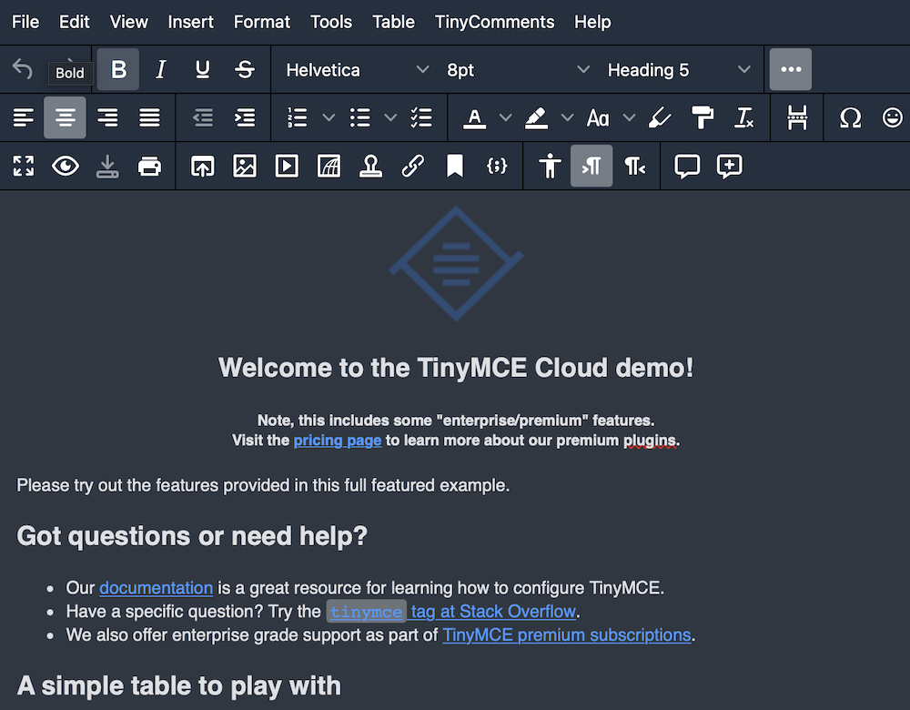

**GitHub：**https://github.com/tinymce/tinymce

### （4）**CKEditor 5**

CKEditor 是一个强大的富文本编辑器框架，具有模块化架构、现代集成和协作编辑等功能。它可以通过基于插件的架构进行扩展，从而可以将必要的内容处理功能引入。它是在 ES6 中从头开始编写的，并且具有出色的 webpack支持。可以使用与Angular、React和Vue.js的原生集成。

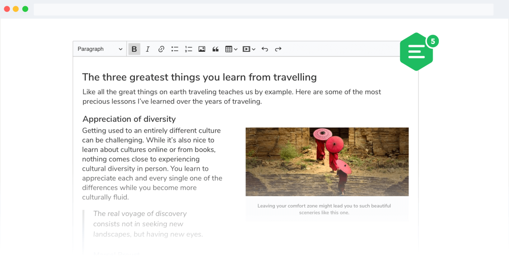

**GitHub：**https://github.com/ckeditor/ckeditor5

## 11. 服务端渲染

### （1）Nuxt.js

Nuxt.js 是一个基于 Vue.js 的通用应用框架。通过对客户端/服务端基础架构的抽象组织，Nuxt.js 主要关注的是应用的 UI 渲染。它预设了利用 Vue.js 开发服务端渲染的应用所需要的各种配置。

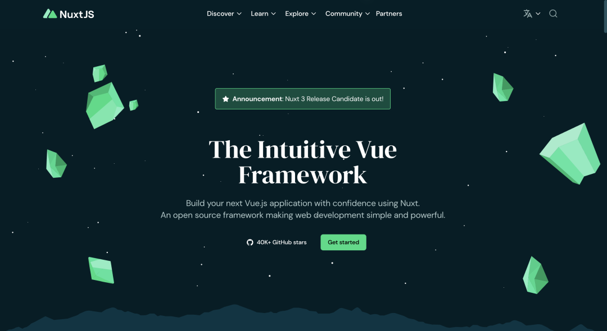

**Github：**https://github.com/nuxt/nuxt.js

### （2）SSR

ssr 框架是为前端框架在服务端渲染的场景下所打造的开箱即用的服务端渲染框架。面向 Serverless，同时支持 React，Vue2，Vue3。

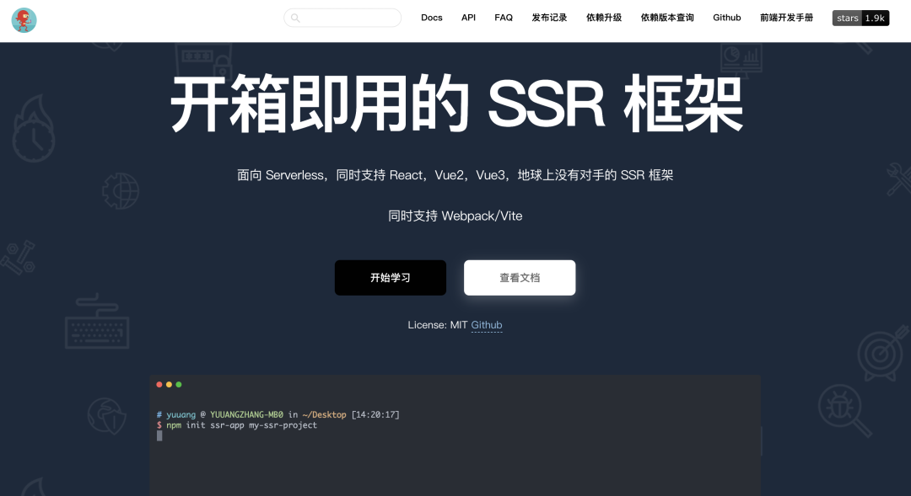

**Github：**https://github.com/zhangyuang/ssr

### （3）Vue-meta

Vue-meta 是 Vue.js 的一个插件，它可以帮助你使用 SSR 支持管理 Vue.js 组件中的 HTML 元数据。Vue-meta 使用 Vue 的内置响应性使管理应用程序的元数据变得简单。

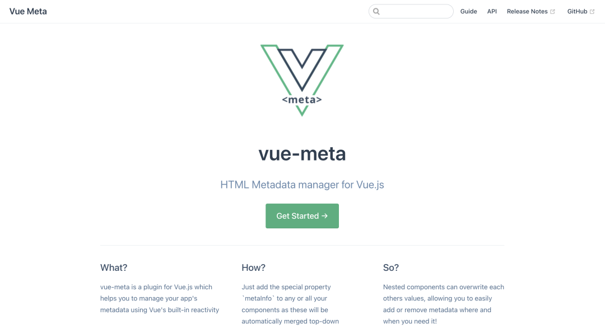

**Github：**https://vue-meta.nuxtjs.org/

## 12. 数据获取

### （1）Axios

Axios 是一个基于promise 的网络请求库，作用于node.js和浏览器中。

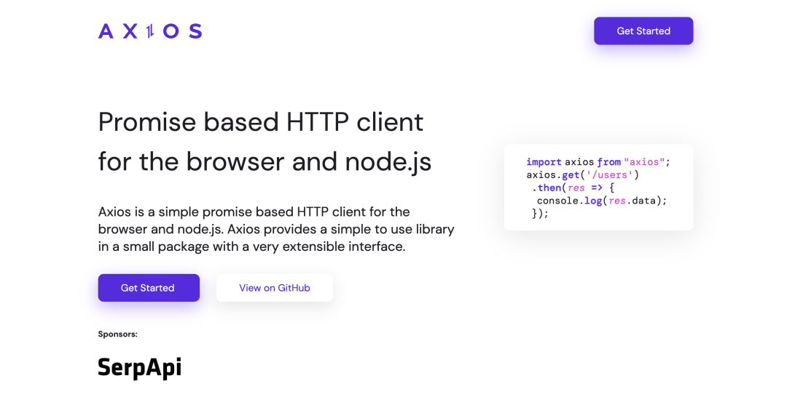

**Github：**https://github.com/axios/axios

### （2）vue-resource

vue-resource是 Vue.js 的一款插件，它可以通过XMLHttpRequest或JSONP发起请求并处理响应。

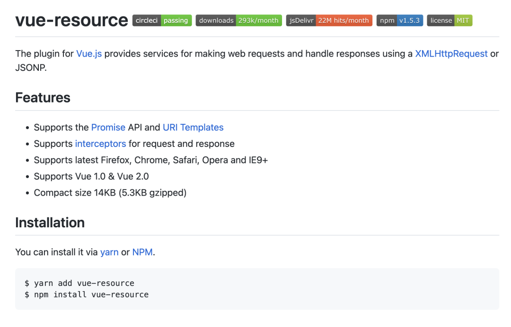

**Github：**https://github.com/pagekit/vue-resource

### （3）vue-axios

vue-axios 是一个将 axios 集成到 Vuejs 的小型库。

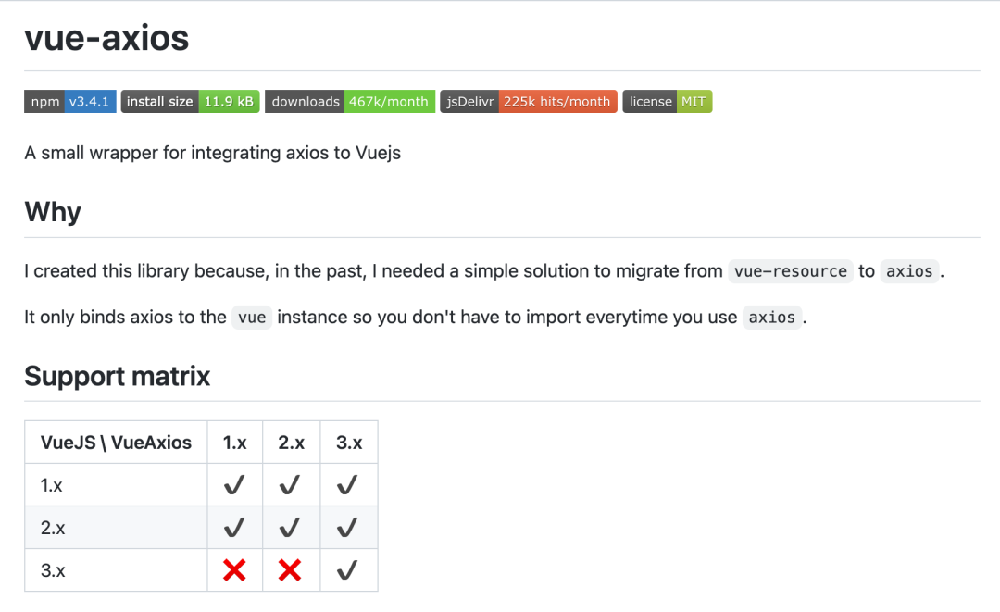

**Github：**https://github.com/imcvampire/vue-axios

## 13. 构建工具

### （1）Vite

Vite 是下一代前端开发与构建工具。Vite 意在提供开箱即用的配置，同时它的插件 API 和 JavaScript API 带来了高度的可扩展性，并有完整的类型支持。

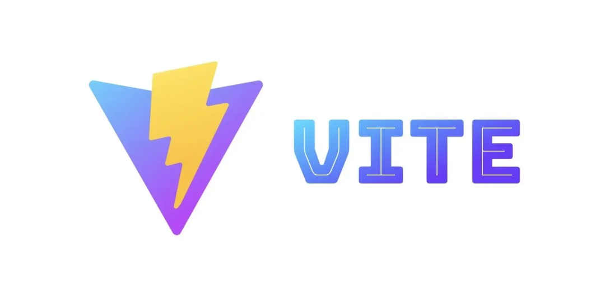

**Github：**https://github.com/vitejs/vite

### （2）Webpack

webpack 是一个用于现代JavaScript应用程序的静态模块打包工具。当 webpack 处理应用程序时，它会在内部构建一个依赖图(dependency graph)，此依赖图对应映射到项目所需的每个模块，并生成一个或多个 bundle。

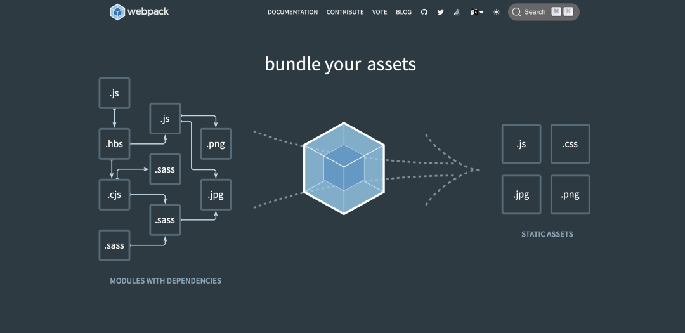

**Github：**https://github.com/webpack/webpack