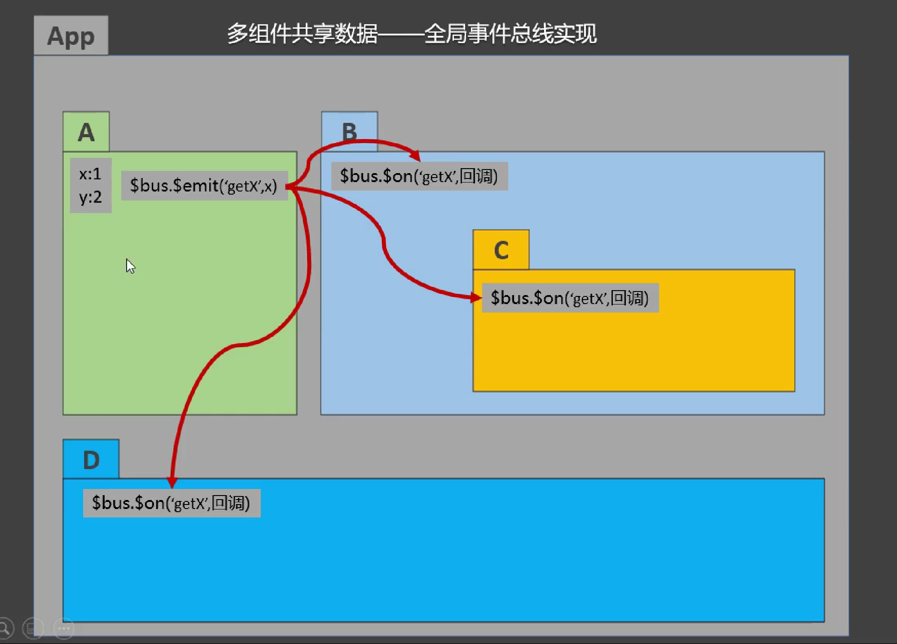
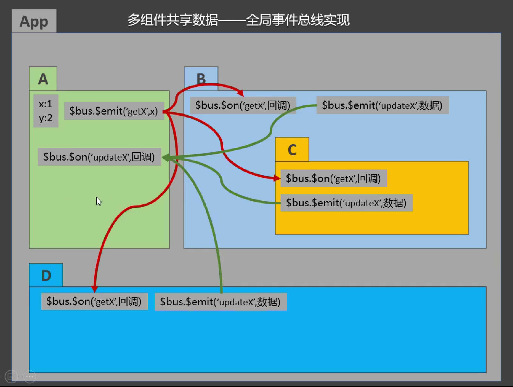

# 笔记

> 该笔记只是核心知识点的罗列，详细内容请配合项目文件看！

## 脚手架文件结构

	├── node_modules 依赖资源文件夹
	├── public
	│   ├── favicon.ico: 页签图标
	│   └── index.html: 主页面
	├── src
	│   ├── assets: 存放静态资源
	│   │   └── logo.png
	│   │── component: 存放组件
	│   │   └── HelloWorld.vue
	│   │── App.vue: 汇总所有组件
	│   │── main.js: 入口文件
	├── .gitignore: git版本管制忽略的配置
	├── babel.config.js: babel的配置文件
	├── package.json: 应用包配置文件
	├── README.md: 应用描述文件
	├── package-lock.json：包版本控制文件
	├── vue.config.js：脚手架配置文件（可选）

## 关于不同版本的Vue

1. vue.js 与 vue.runtime.xxx.js 的区别：
    1. vue.js 是完整版的 Vue，包含：核心功能 + 模板解析器。
    2. vue.runtime.xxx.js 是运行版的 Vue，只包含：核心功能；没有模板解析器。
2. 因为 vue.runtime.xxx.js 没有模板解析器，所以不能使用 template 这个配置项，需要使用 render 函数去指定具体内容。

## vue.config.js配置文件

1. 使用 vue inspect > output.js 可以查看到 Vue 脚手架的默认配置。
2. 使用 vue.config.js 可以对脚手架进行个性化定制，详情见：https://cli.vuejs.org/zh

## ref属性

1. 被用来给元素或子组件注册引用信息（id 的替代者）
2. 应用在 html 标签上获取的是真实 DOM 元素，应用在组件标签上是组件实例对象（vc）
3. 使用方式：
    1. 打标识：```<h1 ref="xxx">.....</h1>``` 或 ```<School ref="xxx"></School>```
    2. 获取：```this.$refs.xxx```

## props配置项

1. 功能：让组件接收外部传过来的数据（父组件 ——> 子组件）

2. 传递数据：```<Demo name="xxx"/>```

3. 接收数据：

    1. 第一种方式（只接收）：```props:['name'] ```

    2. 第二种方式（限制类型）：```props:{name:String}```

    3. 第三种方式（限制类型、限制必要性、指定默认值）：

        ```js
        props: {
        	name: {
                type: String, 	 // 类型
                required: true,  // 必要性
                default: '老王'   // 默认值（在有 required 的前提下就没必要再有 default 了）
        	}
        }
        ```

   > 备注：props 是只读的，Vue 底层会监测你对 props 的修改，如果进行了修改，就会发出警告，若业务需求确实需要修改，那么请复制
   props 的内容到 data 中一份，然后去修改 data 中的数据。

## mixin(混入)

1. 功能：可以把多个组件共用的配置提取成一个混入对象

2. 使用方式：

   第一步定义混合：

    ```
    {
        data(){....},
        methods:{....}
        ....
    }
    ```

   第二步使用混入：

    全局混入：```Vue.mixin(xxx)```
   ​ 局部混入：```mixins:['xxx']    ```

3. 优先级

   当组件生命周期与混入生命周期冲突时，都会执行

   当组件数据、方法与混入数据、方法冲突时，优先使用组件的，虽然都执行，但是混入的执行在前，组件的执行在后

## 插件

1. 功能：用于增强 Vue

2. 本质：包含 install 方法的一个对象，install 的第一个参数是 Vue，第二个以后的参数是插件使用者传递的数据。

3. 定义插件：

    ```js
    对象.install = function (Vue, options) {
        // 1. 添加全局过滤器
        Vue.filter(....)
    
        // 2. 添加全局指令
        Vue.directive(....)
    
        // 3. 配置全局混入(合)
        Vue.mixin(....)
    
        // 4. 添加实例方法
        Vue.prototype.$myMethod = function () {...}
        Vue.prototype.$myProperty = xxxx
    }
    ```

4. 使用插件：```Vue.use()```

## scoped样式

1. 作用：让样式在局部生效，防止冲突。
2. 写法：```<style scoped>```

## 总结TodoList案例


1. 组件化编码流程：

   ​    (1).拆分静态组件：组件要按照功能点拆分，命名不要与 html 元素冲突（最好就是用多单词）

   ​    (2).实现动态组件：考虑好数据的存放位置，数据是一个组件在用，还是一些组件在用：

    1).一个组件在用：放在组件自身即可。

    2). 一些组件在用：放在他们共同的父组件上（<span style="color:red">状态提升</span>）。

   ​    (3).实现交互：从绑定事件开始。

   > 就目前来说，我们可以实现父子组件之间的通信，但是无法实现兄弟（平行）组件之间的通信，当然后续有办法解决，但是就目前而言，最初始最基本的方法是将其要通信的数据直接统一放到兄弟（平行）组件的父组件中（状态提升）……
   >
   > 

2. props 适用于：

   ​    (1).父组件 ==> 子组件 通信

   ​    (2).子组件 ==> 父组件 通信（要求父先给子一个函数）

    原理：父组件向子组件传递一个函数，当在子组件中接受并调用该函数时，由于该函数是定义在父组件中所以自然就在父组件中执行！！！

    如果是爷爷要给孙子通信，那么只能是爷爷先与儿子，儿子在与孙子。反之同理。

3. 使用 v-model 时要切记：v-model 绑定的值不能是 props 传过来的值，因为 props 是不可以修改的！

4. props 传过来的若是对象类型的值，修改对象中的属性时 Vue 不会报错，但不推荐这样做。

## webStorage

1. 存储内容大小一般支持 5MB 左右（不同浏览器可能还不一样）

2. 浏览器端通过 Window.sessionStorage 和 Window.localStorage 属性来实现本地存储机制。

3. 相关API：

    1. ```xxxxxStorage.setItem('key', 'value');```
       该方法接受一个键和值作为参数，会把键值对添加到存储中，如果键名存在，则更新其对应的值。

    2. ```xxxxxStorage.getItem('person');```

        该方法接受一个键名作为参数，返回键名对应的值。

    3. ```xxxxxStorage.removeItem('key');```

        该方法接受一个键名作为参数，并把该键名从存储中删除。

    4. ``` xxxxxStorage.clear()```

        该方法会清空存储中的所有数据。

4. 备注：

    1. SessionStorage 存储的内容会随着浏览器窗口关闭而消失。
    2. LocalStorage 存储的内容，需要手动清除才会消失。
    3. ```xxxxxStorage.getItem(xxx)```如果 xxx 对应的 value 获取不到，那么 getItem 的返回值是 null。
    4. ```JSON.parse(null)```的结果依然是 null。

## 组件的自定义事件

1. 一种组件间通信的方式，适用于：<strong style="color:red">子组件 ===> 父组件</strong>（兄弟之间占时无法解决，在后面学习）

2. 使用场景：A是父组件，B是子组件，B想给A传数据，那么就要在A中给B绑定自定义事件（<span style="color:red">
   事件的回调在A中</span>）。

3. 绑定自定义事件：

    1. 第一种方式，在父组件中：```<Demo @atguigu="test"/>```  或 ```<Demo v-on:atguigu="test"/>```

    2. 第二种方式，在父组件中：

        ```js
        <Demo ref="demo"/>
        ......
        mounted(){
           this.$refs.xxx.$on('atguigu',this.test)
        }
        ```

    3. 若想让自定义事件只能触发一次，可以使用```once```修饰符，或```$once```方法。

4. 触发自定义事件```this.$emit('atguigu', 数据)```

5. 解绑自定义事件```this.$off('atguigu')```

6. 组件上也可以绑定原生 DOM 事件，需要使用```native```修饰符。

7. 注意：通过```this.$refs.xxx.$on('atguigu', 回调)```绑定自定义事件时，回调<span style="color:red">要么配置在 methods
   中</span>，<span style="color:red">要么用箭头函数</span>，否则 this 指向会出问题！

## 全局事件总线（GlobalEventBus）

1. 一种组件间通信的方式，适用于<span style="color:red">任意组件间通信</span>。

2. 安装全局事件总线：

   ```js
   new Vue({
   	......
   	beforeCreate() {
   		Vue.prototype.$bus = this // 安装全局事件总线，this 就是当前应用的 vm，所以 $bus 也就是 vm
   	},
       ......
   }) 
   ```

3. 使用事件总线：

    1. 接收数据：A组件想接收数据，则在A组件中给 $bus 绑定自定义事件，事件的<span style="color:red">回调留在A组件自身。</span>

       ```js
       methods(){
         demo(data){......}
       }
       ......
       mounted() {
         this.$bus.$on('xxxx', this.demo)
       }
       ```

    2. 提供数据：```this.$bus.$emit('xxxx', 数据)```

4. 最好在 beforeDestroy 钩子中，用 $off 去解绑<span style="color:red">当前组件所用到的</span>事件。

## 消息订阅与发布（pubsub）

1. 一种组件间通信的方式，适用于<span style="color:red">任意组件间通信</span>。

2. 使用步骤：

    1. 安装pubsub：```npm i pubsub-js```

    2. 引入：```import pubsub from 'pubsub-js'```

    3. 接收数据：A组件想接收数据，则在A组件中订阅消息，订阅的<span style="color:red">回调留在A组件自身。</span>

       ```js
       methods(){
         demo(data){......}
       }
       ......
       mounted() {
         this.pid = pubsub.subscribe('xxx', this.demo) //订阅消息
       }
       ```

    4. 提供数据：```pubsub.publish('xxx', 数据)```

    5. 最好在 beforeDestroy 钩子中，用```PubSub.unsubscribe(pid)```去<span style="color:red">取消订阅。</span>

## nextTick

1. 语法：```this.$nextTick(回调函数)```
2. 作用：在下一次 DOM 更新结束后执行其指定的回调。
3. 什么时候用：当改变数据后，要基于更新后的新DOM进行某些操作时，要在nextTick所指定的回调函数中执行。

## Vue封装的过度与动画

1. 作用：在插入、更新或移除 DOM元素时，在合适的时候给元素添加样式类名。

2. 演示

    

3. 写法：

    1. 准备好样式：

        - 元素进入的样式：
            1. v-enter：进入的起点
            2. v-enter-active：进入过程中
            3. v-enter-to：进入的终点
        - 元素离开的样式：
            1. v-leave：离开的起点
            2. v-leave-active：离开过程中
            3. v-leave-to：离开的终点

        

    2. 使用```<transition>```包裹要过度的元素，并配置name属性：

       ```vue
       <transition name="hello">
           <h1 v-show="isShow">你好啊！</h1>
       </transition>
       ```

    3. 备注：若有多个元素需要过度，则需要使用：```<transition-group>```，且每个元素都要指定```key```值。

## vue脚手架配置代理

### 方法一

 在 vue.config.js 中添加如下配置：

```js
devServer:{
    proxy:"http://localhost:5000"
}
```

说明：

1. 优点：配置简单，请求资源时直接发给前端（8080）即可。
2. 缺点：不能配置多个代理，不能灵活的控制请求是否走代理。
3. 工作方式：若按照上述配置代理，当请求了前端不存在的资源时，那么该请求会转发给服务器 （优先匹配前端资源）

### 方法二

 编写 vue.config.js 配置具体代理规则：

```js
module.exports = {
    devServer: {
        proxy: {
            '/api1': {		// 匹配所有以 '/api1'开头的请求路径
                target: 'http://localhost:5000',	// 代理目标的基础路径
                changeOrigin: true,
                pathRewrite: {'^/api1': ''}
            },
            '/api2': {		// 匹配所有以 '/api2'开头的请求路径
                target: 'http://localhost:5001',	// 代理目标的基础路径
                changeOrigin: true,
                pathRewrite: {'^/api2': ''}
            }
        }
    }
}
/*
   changeOrigin 设置为 true 时，服务器收到的请求头中的 host 为：localhost:5000
   changeOrigin 设置为 false 时，服务器收到的请求头中的 host 为：localhost:8080
   changeOrigin 默认值为 true
*/
```

说明：

1. 优点：可以配置多个代理，且可以灵活的控制请求是否走代理。
2. 缺点：配置略微繁琐，请求资源时必须加前缀。

## 插槽

1. 作用：让父组件可以向子组件指定位置插入 html 结构，也是一种组件间通信的方式，适用于 <strong style="color:red">父组件 ===>
   子组件</strong> 

1. 分类：默认插槽、具名插槽、作用域插槽

2. 使用方式：

    1. 默认插槽：

       ```vue
       父组件中：
               <Category>
                  <div>html结构1</div>
               </Category>
       子组件中：
               <template>
                   <div>
                      <!-- 定义插槽 -->
                      <slot>插槽默认内容...</slot>
                   </div>
               </template>
       ```

    2. 具名插槽：

       ```vue
       父组件中：
               <Category>
                   <template slot="center">
                     <div>html结构1</div>
                   </template>
       
                   <template v-slot:footer>
                      <div>html结构2</div>
                   </template>
               </Category>
       子组件中：
               <template>
                   <div>
                      <!-- 定义插槽 -->
                      <slot name="center">插槽默认内容...</slot>
                      <slot name="footer">插槽默认内容...</slot>
                   </div>
               </template>
       ```

    3. 作用域插槽：

        1. 理解：<span style="color:red">数据在组件的自身，但根据数据生成的结构需要组件的使用者来决定。</span>
           （games 数据在 Category 组件中，但使用数据所遍历出来的结构由 App 组件决定）

        2. 具体编码：

           ```vue
           父组件中：
                   <Category>
                       <template scope="scopeData">
                           <!-- 生成的是ul列表 -->
                           <ul>
                               <li v-for="g in scopeData.games" :key="g">{{g}}</li>
                           </ul>
                       </template>
                   </Category>
           
                   <Category>
                       <template slot-scope="scopeData">
                           <!-- 生成的是h4标题 -->
                           <h4 v-for="g in scopeData.games" :key="g">{{g}}</h4>
                       </template>
                   </Category>
           子组件中：
                   <template>
                       <div>
                           <slot :games="games"></slot>
                       </div>
                   </template>
                   
                   <script>
                       export default {
                           name:'Category',
                           props:['title'],
                           // 数据在子组件自身
                           data() {
                               return {
                                   games:['红色警戒','穿越火线','劲舞团','超级玛丽']
                               }
                           },
                       }
                   </script>
           ```

## Vuex

### 1、概念

在 Vue 中实现集中式状态（数据）管理的一个 Vue 插件，对 Vue 应用中多个组件的共享状态进行集中式的管理（读/写），也是一种组件间通信的方式，且适用于任意组件间通信。

全局事件总线实现**读**：



全局事件总线实现**读和写**：



可见，利用全局事件总线实现又读又写且通信方比较多的情况下，实现起来比较复杂。

所以 Vuex 出现了，就是为了解决多组件之间的共享数据问题。


可见，vuex 把需要共享的数据放在了自身上，并且 vuex 不属于任何一个组件，vuex 与每个组件都有一个双向通信的通道（即可读又可写）

【Vuex 工作原理】

State：状态（数据）、Vue Components：组件、Actions：动作集、Mutations：加工集、Dispatch：发送、Commit：提交、Mutate：改变、Render：渲染（解析组件）、Backend API：后端接口、Devtools：开发者工具


> 【原理图剖析】
>
> 1. 我们把需要让 Vuex 管理的数据放在 State（状态/数据） 对象中，这个 State 本质上是一个 Object 对象 `{}`
> 2. 我们在组件（Vue Components）中调用 `dispatch('动作类型'[, 原始动作数据])` API 发送（Dispatch）动作到动作集（Actions）
> 3. 动作集（Actions）本质上也是一个 Object 对象 `{}`，里面的 key 对应各种各样的 ”动作类型“（函数），当 Actions 找到 dispatch 对应的 ”动作类型“ 后就会对 ”原始动作数据“ 进行处理（也可以不做任何处理），比如：对原始数据再加工、请求后端API获取原始数据、延时处理……，之后便会生成 ”最终动作数据“，最后 Actions  调用 `commit('动作类型', 最终动作数据)` API 提交动作到加工集（Mutations）中进行加工
> 4. 加工集（Mutations）本质上还是一个 Object 对象 `{}`，里面的 key 也对应各种各样的 ”动作类型“（函数），当 Mutations 找到 commit 对应的 ”动作类型“ 后就会利用 ”最终动作数据“ 根据事先设定好的处理逻辑对 State 中的数据进行处理（Mutate）
> 5. 一但 State 中的数据发生改变，那么就会自动 Render 重新解析组件
>
> > 提示：
> >
> > - 当 ”原始动作数据“ 不需要做任何处理时（”原始动作数据“ === ”最终动作数据“），那么其实可以直接跳过 Dispatch 阶段，直接  Commit 到 Mutations 中。
> > - Vuex 包括 State、Actions、Mutations，但是协作过程中的 API 不是 Vuex 直接提供的，而是 Store 提供的，而 Store 也是统一协调管理 State、Actions、Mutations 的大哥，不过要注意：Store 是 Vuex 提供的一个对象，需要 Vuex.Store({}) 来创建。

### 2、何时使用？

 多个组件需要共享数据时。

### 3、搭建 vuex 环境

1. 安装：npm i vuex@3（注意：目前默认版本已经是 Vue3，而 Vuex 的默认版本是 Vuex4，而 Vuex4 只支持 Vue3，所以我们安装指定的 Vuex3 版本）

1. 创建文件：```src/store/index.js```

   ```js
   // 引入 Vue 核心库
   import Vue from 'vue'
   // 引入 Vuex
   import Vuex from 'vuex'
   // 应用 Vuex 插件
   Vue.use(Vuex)
   
   // 准备 actions 对象————响应组件中用户的动作
   const actions = {}
   // 准备 mutations 对象————修改 state 中的数据
   const mutations = {}
   // 准备 state 对象————保存具体的数据
   const state = {}
   
   // 创建并暴露 store
   export default new Vuex.Store({
   	actions,
   	mutations,
   	state
   })
   ```

2. 在```main.js```中创建 vm 时传入```store```配置项

   ```js
   ......
   // 引入 store
   import store from './store'
   ......
   
   // 创建 vm
   new Vue({
   	el:'#app',
   	render: h => h(App),
   	store
   })
   ```

### 4、基本使用

1. 初始化数据、配置```actions```、配置```mutations```，操作文件```store.js```

   ```js
   // 引入 Vue 核心库
   import Vue from 'vue'
   // 引入 Vuex
   import Vuex from 'vuex'
   // 引用 Vuex
   Vue.use(Vuex)
   
   const actions = {
       // 响应组件中加的动作
   	jia(context, value){
   		// console.log('actions中的jia被调用了', miniStore,value)
   		context.commit('JIA', value)
   	},
   }
   
   const mutations = {
       // 执行加
   	JIA(state,value){
   		// console.log('mutations中的JIA被调用了', state, value)
   		state.sum += value
   	}
   }
   
   // 初始化数据
   const state = {
      sum:0
   }
   
   // 创建并暴露 store
   export default new Vuex.Store({
   	actions,
   	mutations,
   	state,
   })
   ```

2. 组件中读取 vuex 中的数据：```$store.state.sum```

3. 组件中修改 vuex 中的数据：```$store.dispatch('action中的方法名',数据)```
   或 ```$store.commit('mutations中的方法名',数据)```

   > 备注：若没有网络请求或其他业务逻辑，组件中也可以越过 actions，即不写```dispatch```，直接编写```commit```

### 5、getters 的使用

1. 概念：当 state 中的数据需要经过加工后再使用时，可以使用 getters 加工。

2. 在```store.js```中追加```getters```配置

   ```js
   ......
   
   const getters = {
   	bigSum(state){
   		return state.sum * 10
   	}
   }
   
   // 创建并暴露 store
   export default new Vuex.Store({
   	......
   	getters
   })
   ```

3. 组件中读取数据：```$store.getters.bigSum```

### 6、四个 map 方法的使用

1. <strong>mapState方法：</strong>用于帮助我们映射```state```中的数据为计算属性

   ```js
   computed: {
       // 借助 mapState 生成计算属性：sum、school、subject（对象写法）
        ...mapState({sum:'sum',school:'school',subject:'subject'}),
            
       // 借助 mapState 生成计算属性：sum、school、subject（数组写法）
       ...mapState(['sum','school','subject']),
   },
   ```

2. <strong>mapGetters 方法：</strong>用于帮助我们映射```getters```中的数据为计算属性

   ```js
   computed: {
       // 借助 mapGetters 生成计算属性：bigSum（对象写法）
       ...mapGetters({bigSum:'bigSum'}),
   
       // 借助 mapGetters 生成计算属性：bigSum（数组写法）
       ...mapGetters(['bigSum'])
   },
   ```

3. <strong>mapActions方法：</strong>用于帮助我们生成与```actions```对话的方法，即：包含```$store.dispatch(xxx)```的函数

   ```js
   methods:{
       // 靠 mapActions 生成：incrementOdd、incrementWait（对象形式）
       ...mapActions({incrementOdd:'jiaOdd',incrementWait:'jiaWait'})
   
       // 靠 mapActions 生成：incrementOdd、incrementWait（数组形式）
       ...mapActions(['jiaOdd','jiaWait'])
   }
   ```

4. <strong>mapMutations方法：</strong>用于帮助我们生成与```mutations```对话的方法，即：包含```$store.commit(xxx)```的函数

   ```js
   methods:{
       // 靠 mapActions 生成：increment、decrement（对象形式）
       ...mapMutations({increment:'JIA',decrement:'JIAN'}),
       
       // 靠 mapMutations 生成：JIA、JIAN（对象形式）
       ...mapMutations(['JIA','JIAN']),
   }
   ```

> 备注：mapActions 与 mapMutations 使用时，若需要传递参数需要：在模板中绑定事件时传递好参数，否则参数是事件对象。

### 7、模块化+命名空间

1. 目的：让代码更好维护，让多种数据分类更加明确。

2. 修改```store.js```

   ```javascript
   const countAbout = {
     namespaced:true, // 开启命名空间
     state:{x:1},
     mutations: { ... },
     actions: { ... },
     getters: {
       bigSum(state){
          return state.sum * 10
       }
     }
   }
   
   const personAbout = {
     namespaced:true, // 开启命名空间
     state:{ ... },
     mutations: { ... },
     actions: { ... }
   }
   
   const store = new Vuex.Store({
     modules: {
       countAbout,
       personAbout
     }
   })
   ```

3. 开启命名空间后，组件中读取 state 数据：

   ```js
   // 方式一：自己直接读取
   this.$store.state.personAbout.list
   // 方式二：借助 mapState 读取：
   ...mapState('countAbout',['sum','school','subject']),
   ```

4. 开启命名空间后，组件中读取 getters 数据：

   ```js
   // 方式一：自己直接读取
   this.$store.getters['personAbout/firstPersonName']
   // 方式二：借助 mapGetters 读取：
   ...mapGetters('countAbout',['bigSum'])
   ```

5. 开启命名空间后，组件中调用 dispatch

   ```js
   // 方式一：自己直接 dispatch
   this.$store.dispatch('personAbout/addPersonWang',person)
   // 方式二：借助 mapActions：
   ...mapActions('countAbout',{incrementOdd:'jiaOdd',incrementWait:'jiaWait'})
   ```

6. 开启命名空间后，组件中调用 commit

   ```js
   // 方式一：自己直接 commit
   this.$store.commit('personAbout/ADD_PERSON',person)
   // 方式二：借助 mapMutations：
   ...mapMutations('countAbout',{increment:'JIA',decrement:'JIAN'}),
   ```

## 路由

> vue-router：Vue 的一个插件库，专门用来实现 SPA（单页）应用。
>
> 【单页应用】
>
> 1、整个应用只有一个完整的页面
>
> 2、点击页面中的导航链接不会刷新页面，只会做页面的局部更新
>
> 3、数据需要通过 Ajax 请求获取
>
> 4、缺陷：首屏加载速度慢、不易于SEO
>
> 【路由】
>
> 1、一个路由就是一组映射关系（key-value）
>
> 2、key 是路径，value 是 function（函数） 或 component（组件）
>
> 3、后端路由：value 是 funciton，用于处理客服的提交的请求（服务器接收到一个前端请求时，根据请求路径找到匹配的函数来处理请求，返回响应数据）
>
> 3、前端路由：value 是 component，用于展示页面内容（当浏览器的路径改变时，路由器就会监测到路径变化，并根据匹配的路由规则，显示对应的组件）

1. 理解： 一个路由（route）就是一组映射关系（key - value），多个路由需要路由器（router）进行管理。
2. Vue 路由：key 是路径，value 是组件。

### 1、基本使用

1. 安装 vue-router，命令：```npm i vue-router```

   > 注意：目前 Vue 默认版本已经是 Vue3.x，npm i vue-router 默认安装的是 vue-router@4，而 4 版本只能在 Vue3.x 中，使用，所以我们指定安装 3 版本：`npm i vue-router@3`

2. 应用插件：```Vue.use(VueRouter)```

3. 编写 router 配置项：

   ```js
   // 引入VueRouter
   import VueRouter from 'vue-router'
   // 引入Luyou组件
   import About from '../components/About'
   import Home from '../components/Home'
   
   // 创建router实例对象，去管理一组一组的路由规则
   const router = new VueRouter({
   	routes:[
   		{
   			path:'/about',
   			component:About
   		},
   		{
   			path:'/home',
   			component:Home
   		}
   	]
   })
   
   // 暴露router
   export default router
   ```

4. 实现切换（active-class可配置高亮样式）

   ```vue
   <router-link active-class="active" to="/about">About</router-link>
   ```

5. 指定展示位置

   ```vue
   <router-view></router-view>
   ```

### 2、几个注意点

> 通过路由规则动态呈现的组件称为 “路由组件”，通过手动在模板中写组件标签的组件称为 “一般组件”。

1. 路由组件通常存放在```pages```文件夹，一般组件通常存放在```components```文件夹。
2. 通过切换，“隐藏”了的路由组件，默认是被销毁掉的，需要的时候再去挂载，而不是单纯的隐藏。
3. 每个组件都有自己的```$route```属性，里面存储着自己的路由信息。
4. 整个应用只有一个router，可以通过组件的```$router```属性获取到。

### 3、多级路由（多级路由）

1. 配置路由规则，使用children配置项：

   ```js
   routes:[
   	{
   		path:'/about',
   		component:About,
   	},
   	{
   		path:'/home',
   		component:Home,
   		children:[ 	// 通过children配置子级路由
   			{
   				path:'news', 	// 此处一定不要写：/news
   				component:News
   			},
   			{
   				path:'message',	// 此处一定不要写：/message
   				component:Message
   			}
   		]
   	}
   ]
   ```

2. 跳转（要写完整路径）：

   ```vue
   <router-link to="/home/news">News</router-link>
   ```

### 4、路由的query参数

1. 传递参数

   ```vue
   <!-- 跳转并携带query参数，to的字符串写法 -->
   <router-link :to="/home/message/detail?id=666&title=你好">跳转</router-link>
   				
   <!-- 跳转并携带query参数，to的对象写法 -->
   <router-link 
   	:to="{
   		path:'/home/message/detail',
   		query:{
   		   id:666,
               title:'你好'
   		}
   	}"
   >跳转</router-link>
   ```

2. 接收参数：

   ```js
   $route.query.id
   $route.query.title
   ```

### 5、命名路由

1. 作用：可以简化路由的跳转。

2. 如何使用

    1. 给路由命名：

       ```js
       {
           path:'/demo',
           component:Demo,
           children:[
               {
                   path:'test',
                   component:Test,
                   children:[
                       {
                           name:'hello',	 // 给路由命名
                           path:'welcome',
                           component:Hello,
                       }
                   ]
               }
           ]
       }
       ```

    2. 简化跳转：

       ```vue
       <!-- 简化前，需要写完整的路径 -->
       <router-link to="/demo/test/welcome">跳转</router-link>
       
       <!-- 简化后，直接通过名字跳转 -->
       <router-link :to="{name:'hello'}">跳转</router-link>
       
       <!-- 简化写法配合传递参数 -->
       <router-link 
           :to="{
               name:'hello',
               query:{
                  id:666,
                   title:'你好'
               }
           }"
       >跳转</router-link>
       ```

### 6、路由的params参数

1. 配置路由，声明接收params参数

   ```js
   {
   	path:'/home',
   	component:Home,
   	children:[
   		{
   			path:'news',
   			component:News
   		},
   		{
   			component:Message,
   			children:[
   				{
   					name:'xiangqing',
   					path:'detail/:id/:title', 	// 使用占位符声明接收params参数
   					component:Detail
   				}
   			]
   		}
   	]
   }
   ```

2. 传递参数

   ```vue
   <!-- 跳转并携带params参数，to的字符串写法 -->
   <router-link :to="/home/message/detail/666/你好">跳转</router-link>
   				
   <!-- 跳转并携带params参数，to的对象写法 -->
   <router-link 
   	:to="{
   		name:'xiangqing',
   		params:{
   		   id:666,
               title:'你好'
   		}
   	}"
   >跳转</router-link>
   ```

   > 特别注意：路由携带params参数时，若使用to的对象写法，则不能使用path配置项，必须使用name配置！

3. 接收参数：

   ```js
   $route.params.id
   $route.params.title
   ```

### 7、路由的props配置

 作用：让路由组件更方便的收到参数

```js
{
    name:'xiangqing',
        path:'detail/:id',
        component:Detail,

        // 第一种写法：props值为对象，该对象中所有的key-value的组合最终都会通过props传给Detail组件
        // props:{a:900}

        // 第二种写法：props值为布尔值，布尔值为true，则把路由收到的所有params参数通过props传给Detail组件
        // props:true

        // 第三种写法：props值为函数，该函数返回的对象中每一组key-value都会通过props传给Detail组件
        props(route){
        return {
            id: route.query.id,
            title: route.query.title
        }
    }
}
```

### 8、```<router-link>```的replace属性

1. 作用：控制路由跳转时操作浏览器历史记录的模式
2. 浏览器的历史记录有两种写入方式：分别为```push```和```replace```，```push```是追加历史记录，```replace```
   是替换当前记录，路由跳转时候默认为```push```
3. 如何开启```replace```模式：```<router-link replace .......>News</router-link>```

### 9、编程式路由导航

1. 作用：不借助```<router-link> ```实现路由跳转，让路由跳转更加灵活

2. 具体编码：

   ```js
   // $router的两个API
   this.$router.push({
   	name:'xiangqing',
   		params:{
   			id:xxx,
   			title:xxx
   		}
   })
   
   this.$router.replace({
   	name:'xiangqing',
   		params:{
   			id:xxx,
   			title:xxx
   		}
   })
   this.$router.forward()	 // 前进
   this.$router.back() 	// 后退
   this.$router.go() 		// 可前进也可后退
   ```

### 10、缓存路由组件

1. 作用：让不展示的路由组件保持挂载，不被销毁。

2. 具体编码：

   ```vue
   <keep-alive include="News"> 
       <router-view></router-view>
   </keep-alive>
   ```

### 11、两个新的生命周期钩子

1. 作用：路由组件所独有的两个钩子，用于捕获路由组件的激活状态。
2. 具体名字：
    1. ```activated```路由组件被激活时触发。
    2. ```deactivated```路由组件失活时触发。

### 12、路由守卫

1. 作用：对路由进行权限控制

2. 分类：全局守卫、独享守卫、组件内守卫

3. 全局守卫:

   ```js
   // 全局前置守卫：初始化时执行、每次路由切换前执行
   router.beforeEach((to,from,next)=>{
   	console.log('beforeEach',to,from)
   	if(to.meta.isAuth){ 	// 判断当前路由是否需要进行权限控制
   		if(localStorage.getItem('school') === 'atguigu'){ 	// 权限控制的具体规则
   			next() 		// 放行
   		}else{
   			alert('暂无权限查看')
   			// next({name:'guanyu'})
   		}
   	}else{
   		next() 	// 放行
   	}
   })
   
   // 全局后置守卫：初始化时执行、每次路由切换后执行
   router.afterEach((to,from)=>{
   	console.log('afterEach',to,from)
   	if(to.meta.title){ 
   		document.title = to.meta.title 	// 修改网页的title
   	}else{
   		document.title = 'vue_test'
   	}
   })
   ```

4. 独享守卫:

   ```js
   beforeEnter(to,from,next){
   	console.log('beforeEnter',to,from)
   	if(to.meta.isAuth){ 	// 判断当前路由是否需要进行权限控制
   		if(localStorage.getItem('school') === 'atguigu'){
   			next()
   		}else{
   			alert('暂无权限查看')
   			// next({name:'guanyu'})
   		}
   	}else{
   		next()
   	}
   }
   ```

5. 组件内守卫：

   ```js
   // 进入守卫：通过路由规则，进入该组件时被调用
   beforeRouteEnter (to, from, next) {
   },
   // 离开守卫：通过路由规则，离开该组件时被调用
   beforeRouteLeave (to, from, next) {
   }
   ```

### 13、路由器的两种工作模式

1. 对于一个 url 来说，什么是 hash 值？—— `#`及其后面的内容就是 hash 值。
2. hash 值不会包含在 HTTP 请求中，即：hash 值不会带给服务器。
3. hash 模式：
    1. 地址中永远带着`#`号，不美观 。
    2. 若以后将地址通过第三方手机 App 分享，若 App 校验严格，则地址会被标记为不合法。
    3. 兼容性较好。
4. history 模式：
    1. 地址干净，美观 。
    2. 兼容性和 hash 模式相比略差。
    3. 应用部署上线时需要后端人员支持，解决刷新页面服务端 404 的问题。
	4. history 在正式上线的项目中应用得更多！！！
	
	 