# Vue3 笔记


> 该笔记只是核心知识点的罗列，详细内容请配合示例代码看！

> Vue3 改变较大，详细内容请一定结合[官网文档](https://cn.vuejs.org/)进行学习！

# 一、Vue3 简介

- 2020 年 9 月 18 日，Vue.js 发布 3.0 版本，代号：One Piece（海贼王）
- 耗时 2 年多、2600+ Commits、30+ RFCs、600+  pull requests、99 位贡献者
- GitHub 上的 tags 地址：https://github.com/vuejs/vue-next/releases/tag/v3.0.0
- 官网文档：[Vue.js - 渐进式 JavaScript 框架 | Vue.js (vuejs.org)](https://cn.vuejs.org/)

# 二、Vue3 带来了什么

【性能的提升】

- 打包大小减少 41%

- 初次渲染快 55%，更新渲染快 133%

- 内存减少 54%

  ......

【源码的升级】

- 使用 Proxy 代替 defineProperty 实现响应式

- 重写虚拟 DOM 的实现和 Tree-Shaking

  ......

【拥抱 TypeScript】

- Vue3 可以更好的支持 TypeScript

【新的特性】

- Composition API（组合式 API）

  - setup 配置

  - ref 与 reactive

  - watch 与 watchEffect

  - provide 与 inject

  - ......

- 新的内置组件

  - Fragment 

  - Teleport

  - Suspense

- 其他改变

  - 新的生命周期钩子

  - data 选项应始终被声明为一个函数
  - 移除 filter 过滤器

  - 移除 keyCode 支持作为 v-on 的修饰符

  - ......

# 三、创建 Vue3 工程

## 3.1 使用 Vue CLI 创建

官方文档：[创建一个项目 | Vue CLI (vuejs.org)](https://cli.vuejs.org/zh/guide/creating-a-project.html)

> 目前 Vue CLI 只处于维护阶段，Vue3 官方推荐使用 Vite！

```bash
# 查看 @vue/cli 版本，确保 @vue/cli 版本在 4.5.0 以上
vue --version
# 安装或者升级你的 @vue/cli
npm install -g @vue/cli
# 创建
vue create <project-name>
# 启动
cd <project-name>
npm run serve
```

## 3.2 使用 Vite 创建

【背景】

> 在浏览器支持 ES 模块之前，JavaScript 并没有提供原生机制让开发者以模块化的方式进行开发。 这也正是我们对 “打包” 这个概念熟悉的原因：使用工具抓取、处理并将我们的源码模块串联成可以在浏览器中运行的文件。
>
> 时过境迁，我们见证了诸如 [webpack](https://webpack.js.org/)、[Rollup](https://rollupjs.org/) 和 [Parcel](https://parceljs.org/) 等工具的变迁，它们极大地改善了前端开发者的开发体验。
>
> 然而，当我们开始构建越来越大型的应用时，需要处理的 JavaScript 代码量也呈指数级增长。 包含数千个模块的大型项目相当普遍。 基于 JavaScript 开发的工具就会开始遇到性能瓶颈：通常需要很长时间（甚至是几分钟！ ）才能启动开发服务器，即使使用了模块热替换（HMR），文件修改后的效果也需要几秒钟才能在浏览器中反映出来。 如此循环往复，迟钝的反馈会极大地影响开发者的开发效率和幸福感。
>
> 随着前端生态的发展，大量的浏览器开始原生支持 ES 模块，且越来越多 JavaScript 工具使用编译型语言编写，而 Vite 就是希望利用这些新成果来解决之前打包的问题。

官方文档：[快速上手 | Vue.js (vuejs.org)](https://cn.vuejs.org/guide/quick-start.html#creating-a-vue-application)

Vite官网：[Vite | 下一代的前端工具链 (vitejs.dev)](https://cn.vitejs.dev/)

- 什么是 Vite？—— 新一代前端构建工具。
- 优势如下：
  - 开发环境中，无需打包操作，可快速的冷启动
  - 轻量快速的热重载（HMR）
  - 真正的按需编译，不再等待整个应用编译完成
- 传统构建 与 Vite 构建对比图

传统打包方式：把所有文件都编译打包完，服务器才进入就绪状态……

Vite 打包方式：服务器直接进入就绪状态，请求哪部分页面就处理哪部分页面……

| 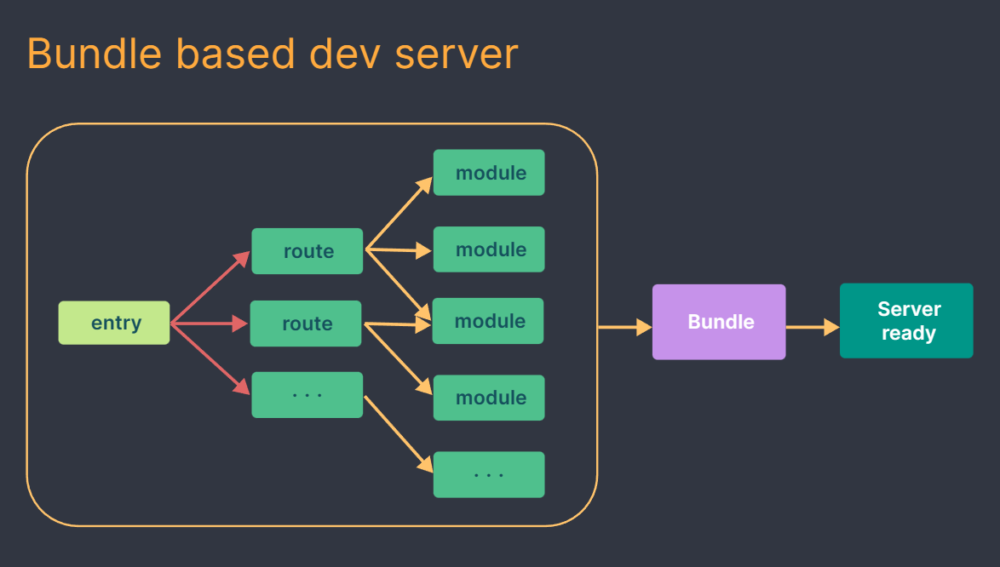 | 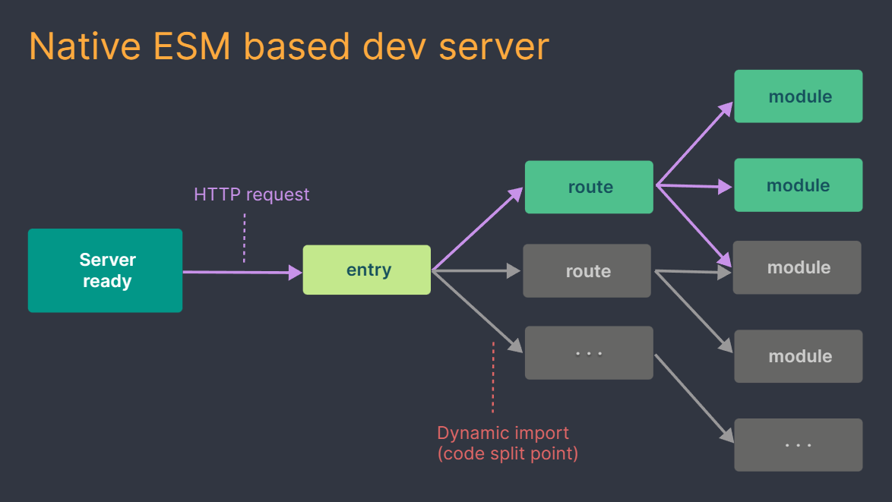 |
| ------------------------------------------------------------ | ------------------------------------------------------------ |

> 需要注意一下 Vite 的生产环境下打包是通过 Rollup 来完成的！
>
> > Rollup 是 JavaScript 的模块 bundler（打包器）
>
> 也就是说 Vite 提供的是开发环境中的编译，打包工作是依靠的 Rollup！

> 一些来自官网的说明：
>
> Vite 使用 [esbuild](https://esbuild.github.io/) [预构建依赖](https://cn.vitejs.dev/guide/dep-pre-bundling.html)。 esbuild 使用 Go 编写，并且比以 JavaScript 编写的打包器预构建依赖快 10-100 倍。
>
> Vite 以 [原生 ESM](https://developer.mozilla.org/en-US/docs/Web/JavaScript/Guide/Modules) 方式提供源码。 这实际上是让浏览器接管了打包程序的部分工作：Vite 只需要在浏览器请求源码时进行转换并按需提供源码。 根据情景动态导入代码，即只在当前屏幕上实际使用时才会被处理。
>
> 为什么生产环境仍需打包？
>
> 尽管原生 ESM 现在得到了广泛支持，但由于嵌套导入会导致额外的网络往返，在生产环境中发布未打包的 ESM 仍然效率低下（即使使用 HTTP/2）。 为了在生产环境中获得最佳的加载性能，最好还是将代码进行 tree-shaking、懒加载和 chunk 分割（以获得更好的缓存）。
>
> 要确保开发服务器和生产环境构建之间的最优输出和行为一致并不容易。 所以 Vite 附带了一套 [构建优化](https://cn.vitejs.dev/guide/features.html#build-optimizations) 的 [构建命令](https://cn.vitejs.dev/guide/build.html)，开箱即用。
>
> 为何不用 ESBuild 打包？
>
> 虽然 快得惊人，并且已经是一个在构建库方面比较出色的工具，但一些针对构建 *应用* 的重要功能仍然还在持续开发中 —— 特别是代码分割和 CSS 处理方面。 就目前来说，Rollup 在应用打包方面更加成熟和灵活。 尽管如此，当未来这些功能稳定后，我们也不排除使用 作为生产构建器的可能。
>
> > 特别强调：Vite 是建立在原生支持 ES 模块的浏览器上的，这也是 Vite 为什么能快的核心原因！所以对于兼容性要求比较高的项目来说，暂时还是建议用 Vue CLI，虽然 Vite 也提供了针对 ES5 浏览器的兼容性配置方法。不过话说回来，Vite 不出意外应该是不远未来的趋势！

```shell
# 安装并执行 create-vue，它是 Vue 官方的项目脚手架工具
npm init vue@latest

# 项目初始化配置
Need to install the following packages:
  create-vue@3.5.0
Ok to proceed? (y) y

Vue.js - The Progressive JavaScript Framework

√ Project name: ... <project-name>
√ Add TypeScript? ... No / Yes
√ Add JSX Support? ... No / Yes
√ Add Vue Router for Single Page Application development? ... No / Yes
√ Add Pinia for state management? ... No / Yes
√ Add Vitest for Unit Testing? ... No / Yes
√ Add an End-to-End Testing Solution? » No
√ Add ESLint for code quality? ... No / Yes

Scaffolding project in F:\Vue\Vue3\<project-name>...

Done. Now run:

  cd <project-name>
  npm install
  npm run dev
  
# 进入项目
cd <project-name>

# 安装依赖
npm install

# 运行（开发环境）
npm run dev

# 打包
npm run build

# 直接在本地测试打包好的应用（为 dist 文件夹启动一个静态 Web 服务器）
npm run preview
```

> 项目初始化配置说明：
>
> - 项目名称：`<project-name>`（项目名称）
>
> - 添加 TypeScript？（Vue3 对 TS 支持非常好！以后建议利用 TS 开发）
>
> - 添加 JSX 支持？（JSX 是 JavaScript 的一种语法扩展）
>
> - 为单页应用程序开发添加 Vue Router？（单页应用必选）
>
> - 添加 Pinia 进行状态管理？（Pinia 是 Vue 官方出品的类似与 Vuex 的新一代状态管理工具）
>
> - 添加 Vitest 进行单元测试？（由 Vite 提供支持的极速单元测试框架）
>
> - 添加端到端测试解决方案？
>
> - 添加 ESLint 以提高代码质量？（未来开发实际项目，推荐用 ESLint 约束代码质量）

`npm run dev`：

  VITE v4.0.4  ready in 607 ms

  ➜  Local: http://localhost:5173/
  ➜  Network: use --host to expose
  ➜  press h to show help

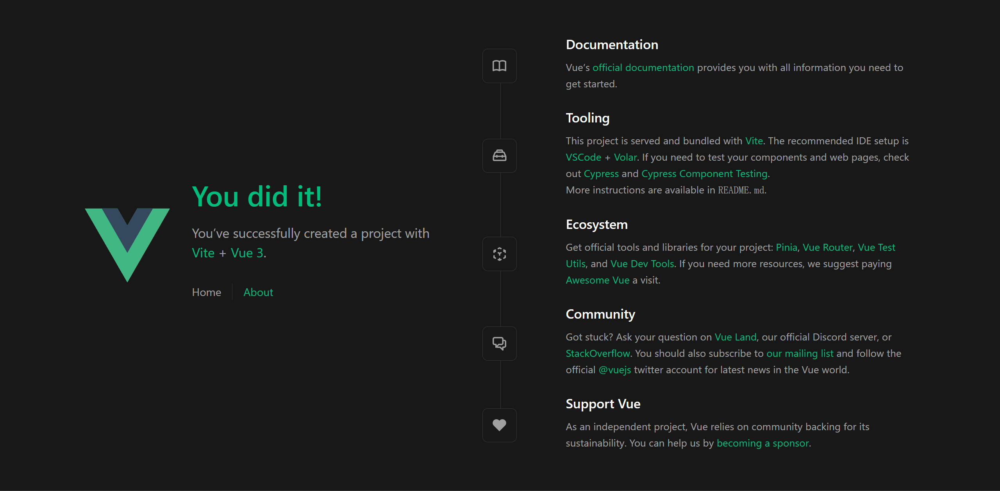

也可以通过这种方式创建：

- `npm create vite@latest <project-name> -- --template vue`（JS 版本）
- `npm create vite@latest <project-name> -- --template vue-ts`（TS 版本）

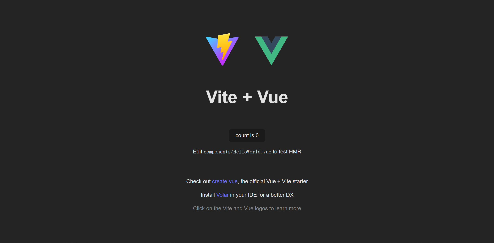

Vite 基本项目结构：

- `node_modules`：项目依赖包目录
- `public`：项目公用文件
  - `favicon.ico`：网站标签栏小图标
- `src`：源文件目录
  - `assets`：静态文件目录（图标、图片、视频……）
  - `components`：自定义组件目录
  - `App.vue`：项目的根组件
  - `main.js`：项目入口文件
- `.gitignore`：Git 管理配置文件（设置那些目录或文件不管理）
- `index.html`：项目的默认首页（Vue 的组件需要挂载到这个文件上）
- `package-lock.json`：项目包的锁定文件（用于防止包版本不一样导致的错误）
- `package.json`：项目配置文件（项目名称、版本、命令、包管理……）
- `vite.config.js`：Vite 配置文件

> 注意：以上结构是最基础的 Vite + Vue3 项目结构，如果创建项目时我们选择了其他配置项，那么项目结构还会有其他文件，比如：我们选择了 TypeScript，那么项目根目录会出现 `tsconfig.json`  等文件，如果我们选择了 Vue Router，那么 src 目录下还会有 `router` 及 `views` 文件夹，如果我们选择了 ESLint，那么项目根目录会出现 `.eslintrc.cjs` 文件……

【Vite + Vue3 对 TypeScript、CSS、JSON、Sass、Less 的支持】

- TypeScript

在 `<script>` 标签中加入 `lang=ts` 就可以了……

```vue
<script lang="ts">
// ...
</script>
```

- CSS 直接引入

在 `.vue` 及 `.js` `.ts` 文件中，可以直接使用 `import` 进行引入 CSS 文件……

```js
import './assets/main.css'
```

> 其中，在 App.vue 及 main.js 中引入的 CSS 将会全局生效！

- JSON 直接引入

在 `.vue` 及 `.js` `.ts` 文件中，还支持 JSON 文件的引入，方法和引入 CSS 一样……

```js
import users from './assets/users.json'
```

- Sass、Less

Vite 推荐原生 CSS（因为 Vite 就是建立在现代浏览器上），不过也内置支持了 Sass、Less（不需要安装插件，只需要有预处理器依赖），安装了预处理器依赖后直接在 `<style>` 标签中加入 `lang=""` 即可……

安装预处理器：`npm i sass -D`、`npm i less -D`

```vue
<style lang="scss">
</style>
----------------------------
<style lang="less">
</style>
```

## 3.3 Vue3 结构变化

main.js 文件：

```js
// 引入的不再是 Vue 构造函数了，而是一个名为 createApp 的工厂函数
import { createApp } from 'vue';
import App from './App.vue';
import router from './router';

// 支持引入 CSS 文件（此处全局生效）
import './assets/main.css';

// 创建应用实例对象（类似 Vue2 中的 vm，但比 vm 更“轻”）
// “轻”：更少、更精简、更合理、更高效的属性和方法（见图）
const app = createApp(App);

app.use(router);

// 挂载到 index.html 中的 #app 上
app.mount('#app');
// 对应的还有一个 unmount 卸载方法
```

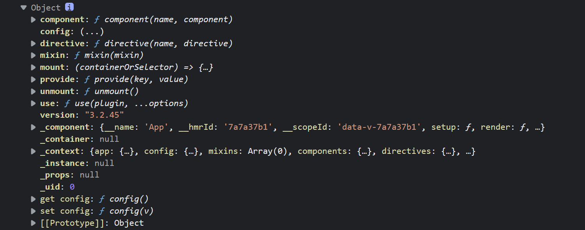

App.vue 文件：

```vue
<!-- Vue3 中，官方推荐将 script 放在 .vue 文件最上方，因为 js/ts 是操作频率最高的部分，且 结构 与 样式 在一块更合理 -->
<script setup>
<!-- <script setup> 是 Vue3 组合式 API 写法中 setup 函数的语法糖（帮助开发者省略 return 步骤）-->
<!-- 截止至 2021-07-16 ，<script setup> 方案已在 Vue3.2.0-beta.1 版本中脱离实验状态，正式进入 Vue3 的队伍，在新的版本中已经可以作为一个官方标准的开发方案使用（但初期仍需注意与开源社区的项目兼容性问题，特别是 UI 框架）-->
import { RouterLink, RouterView } from 'vue-router';
import HelloWorld from './components/HelloWorld.vue';
</script>

<!-- Vue3 中，template 内不再需要一个根标签包裹 -->
<template>
    <header>
        

        <div class="wrapper">
            <HelloWorld msg="You did it!" />

            <nav>
                <RouterLink to="/">Home</RouterLink>
                <RouterLink to="/about">About</RouterLink>
            </nav>
        </div>
    </header>

    <RouterView />
</template>

<style scoped>
/* ... */
</style>
```

# 四、常用 Composition API

官方说明：[组合式 API 常见问答 | Vue.js (vuejs.org)](https://cn.vuejs.org/guide/extras/composition-api-faq.html)

官网文档：[Vue.js - 渐进式 JavaScript 框架 | Vue.js (vuejs.org)](https://cn.vuejs.org/)

## 4.1 拉开序幕的 setup

1. 理解：Vue3 中一个新的配置项，值为一个函数。
2. setup 是所有 <strong style="color:#DD5145">Composition API（组合API）</strong><i style="color:gray;font-weight:bold">“ 表演的舞台 ”</i>。
4. 组件中所用到的：数据、方法、计算属性、监视属性、生命周期钩子等，均要配置在 setup 中！
5. setup 函数的两种返回值：
   1. 若返回一个对象，则对象中的属性、方法在模板中均可以直接使用（重点关注！）
   2. 若返回一个渲染函数：则可以自定义渲染内容（了解即可）
6. 注意点：
   1. 尽量不要与 Vue2 配置混用
      - Vue2 配置（data、methos、computed...）中 <strong style="color:#DD5145">可以访问到</strong> setup 中的属性、方法！
      - 但在 setup 中 <strong style="color:#DD5145">不能访问到</strong> Vue2 配置（data、methos、computed...）
      - 如果有重名的属性和方法，setup 优先！
   
      - 实际上 Vue2 之前的写法在 Vue3 中称为：**选项式 API**，而 setup 函数的写法在 Vue3 中称为：**组合式 API**，目前 Vue3 两种写法都支持！但请不要混用两种写法！并且，选项式 API 其实是组合式 API 的封装，选项式 API 对于初学者比较友好，但是组合式 API 更加自由，也需要你对 Vue 的响应式系统有更深的理解才能高效使用。相应的，它的灵活性也使得组织和重用逻辑的模式变得更加强大。官网推荐在低复杂度的场景中可以用选项式 API（例如渐进增强的应用场景），当你打算用 Vue 构建完整的单页应用，推荐采用组合式 API + 单文件组件。
   2. setup 不能是一个 async 函数，因为返回值将不再是普通 return 的对象, 而是 Promise，模板看不到 return 对象中的属性！（后期也可以返回一个 Promise 实例，但需要 Suspense 和异步组件的配合）

```vue
<!-- App.vue -->
<script>
export default {
    name: 'App',
    setup() {
        // 数据
        let name = '张三';
        let age = 18;

        // 方法
        function sayHello() {
            alert(`我叫 ${name}，我 ${age} 岁了……`);
        }

        // 返回对象（对象里的内容可以在模板中直接使用）
        return {
            name,
            age,
            sayHello
        };

        // 返回渲染函数（了解即可）
        // 前提：import {h} from 'vue'
        // 渲染内容会替换模板中的全部内容
        // return h('h1', '尚硅谷');
    }
};
</script>

<template>
    <h1>个人信息</h1>
    <h2>姓名：{{ name }}</h2>
    <h2>年龄：{{ age }}</h2>
    <button @click="sayHello">说话</button>
</template>

<style scoped></style>
```

##  4.2 ref 函数

- 作用：定义一个响应式的数据
- 语法：```const ref对象 = ref(源值)``` 
  - 创建一个包含响应式数据的 <strong style="color:#DD5145">ref 对象（RefImpl 对象【Reflmpl：reference 引用 + implement 实现】，即：引用实现对象，我们通常简称 ref 对象）</strong>
  - JS 中操作数据： ```ref对象.value```
  - 模板中读取数据：不需要 `.value`，直接：```<div>{{xxx}}</div>```
- 备注：
  - 接收的数据可以是：基本类型、也可以是对象类型。
  - 基本类型的数据：响应式依然是靠 `Object.defineProperty()` 的 `get` 与 `set` 来实现。
  - 对象类型的数据（包括数组）：内部属性（元素）的响应式 “求助” 了 Vue3 中的一个新函数 `reactive` 来实现。
  - 对象类型的数据（包括数组）在操作其内部属性（元素）时不用加 `.value`。

**setup 中普通的数据和函数的修改只会在内存中完成，不会带有响应式！**

```vue
<!-- App.vue -->
<script>
export default {
    name: 'App',
    setup() {
        // 数据
        let name = '张三';
        let age = 18;

        // 方法
        function changeInfo() {
            name = '李四';
            age = 81;
            console.log(`${name}：${age}`);
        }

        // 返回对象（对象里的内容可以在模板中直接使用）
        return {
            name,
            age,
            changeInfo
        };
    }
};
</script>

<template>
    <h1>个人信息</h1>
    <h2>姓名：{{ name }}</h2>
    <h2>年龄：{{ age }}</h2>
    <button @click="changeInfo">修改信息</button>
</template>

<style scoped></style>
```

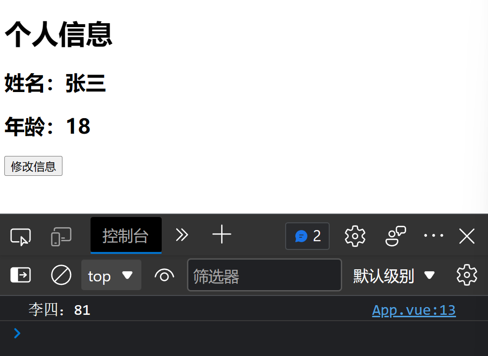

我们需要借助 `ref` 函数定义响应式数据（也包含对象和数组），利用 `.value` 在 JS 中操作数据，其中对象和数组的内部属性和元素不需要使用 `.value`！模板中可以直接使用数据不需要 `.value`！

```vue
<!-- App.vue -->
<script>
// 引入 ref
import { ref } from 'vue';
export default {
    name: 'App',
    setup() {
        // 数据
        let name = ref('张三');
        let age = ref(18);

        // 方法
        function changeInfo() {
            name.value = '李四';
            age.value = 81;
        }

        // 返回对象（对象里的内容可以在模板中直接使用）
        return {
            name,
            age,
            changeInfo
        };
    }
};
</script>

<template>
    <h1>个人信息</h1>
	<!-- 模板中不需要 .value，Vue3 会帮我们自动检测并加工 -->
    <h2>姓名：{{ name }}</h2>
    <h2>年龄：{{ age }}</h2>
    <button @click="changeInfo">修改信息</button>
</template>

<style scoped></style>
```

注意：`ref()` 返回的是一个 RefImpl 的实例对象！

橙色框的 value 就类似 Vue2 中 vm 上的数据，绿色框的 value 就类似与 Vue2 中 _data 上的数据，而且这里巧妙的把绿色框的 value 放在了原型对象上，这样橙色框的 value 找不到就会自动去找绿色款（原型对象）上的 value，所以橙色框的 value 不需要有 get set（从这个角度就可以看出 Vue3 的先进之处）！

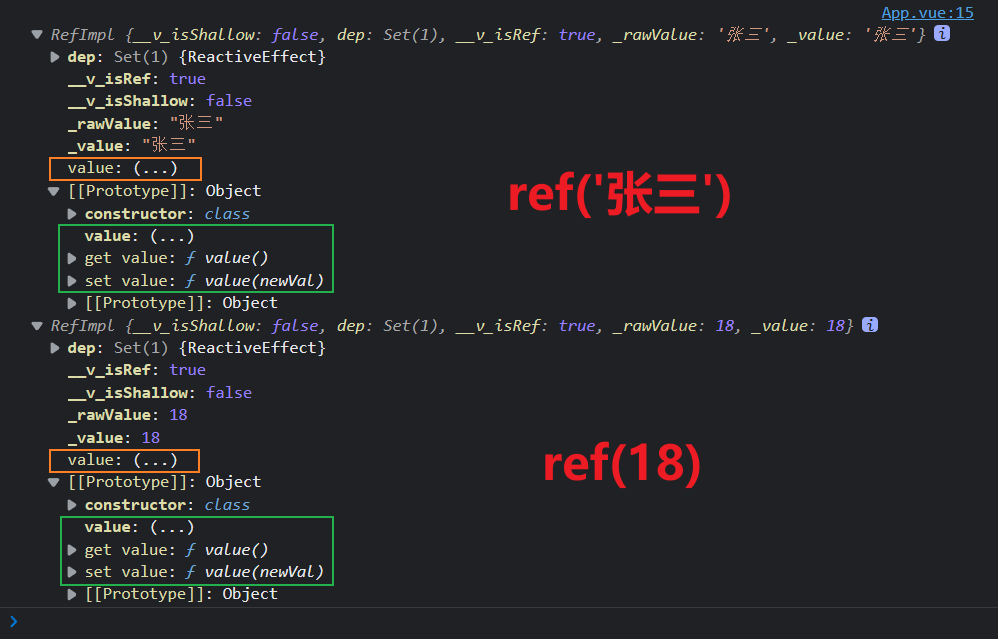

注意：对于对象类型（包括数组）来说，内部属性（元素）的响应式 “求助” 了 Vue3 中的一个新函数 `reactive` 来实现，而 `reactive` 函数接收一个对象（或数组），返回一个 <strong style="color:#DD5145">代理对象（Proxy 的实例对象，简称 proxy 对象）</strong>，所以访问对象内部属性或元素时是不用加 `.value` 的！（Proxy 是 ES6 的新特性）

```vue
<script>
// 引入 ref
import { ref } from 'vue';
export default {
    name: 'App',
    setup() {
        // 数据
        let name = ref('张三');
        let age = ref(18);
        // 对象类型数据
        let job = ref({
            tpye: '前端工程师',
            salary: '40K'
        });

        // 方法
        function changeInfo() {
            name.value = '李四';
            age.value = 81;
            console.log(job);
            console.log(job.value);
            // 对象类型数据的内层属性(元素)不用加 .value
            // job.value.tpye.value = 'UI设计师';
            // job.value.salary.value = '60K';
            job.value.tpye = 'UI设计师';
            job.value.salary = '60K';
        }

        // 返回对象（对象里的内容可以在模板中直接使用）
        return {
            name,
            age,
            job,
            changeInfo
        };
    }
};
</script>

<template>
    <h1>个人信息</h1>
    <!-- 模板中不需要 .value，Vue3 会帮我们自动检测并加工 -->
    <h2>姓名：{{ name }}</h2>
    <h2>年龄：{{ age }}</h2>
    <h2>工种：{{ job.tpye }}</h2>
    <h2>薪水：{{ job.salary }}</h2>
    <button @click="changeInfo">修改信息</button>
</template>

<style scoped></style>
```

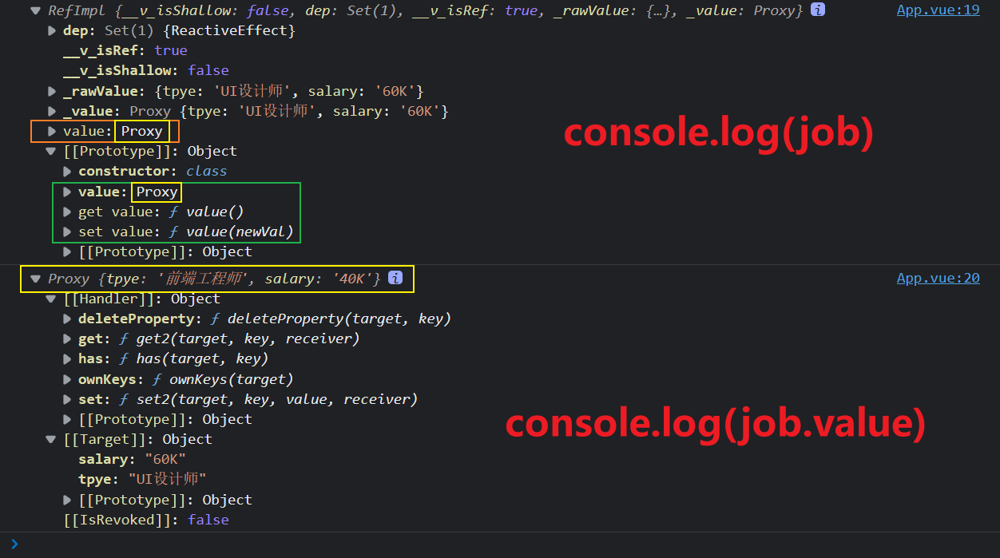

## 4.3 reactive 函数

- 作用：定义一个 <strong style="color:#DD5145">对象类型</strong>（包括数组）的响应式数据（基本类型不要用它，要用 `ref` 函数）
- 语法：`const 代理对象 = reactive(源对象)` 接收一个对象（或数组），返回一个 <strong style="color:#DD5145">代理对象（Proxy 的实例对象，简称 proxy 对象）</strong>
- reactive 定义的响应式数据是 “深层次的”！
- 内部基于 ES6 的 Proxy 实现，通过代理对象操作源对象内部数据。
- 推荐对象类型的响应式数据，直接用 reactive 定义，因为它可以直接得到一个 Proxy 实例对象！而 ref 定义的话虽然也能实现，但是中间需要多一个流程，中间会多一个 `.value`！

```vue
<script>
// 引入 ref reactive
import { ref, reactive } from 'vue';
export default {
    name: 'App',
    setup() {
        // 数据
        let name = ref('张三');
        let age = ref(18);
        // 对象类型数据
        
        // ref 方法
        // let job = ref({
        //     tpye: '前端工程师',
        //     salary: '40K'
        // });
        
        // reactive 方法
        let job = reactive({
            tpye: '前端工程师',
            salary: '40K',
            address: ['北京', '上海'],
            family: {
                mom: {
                    name: '妈妈',
                    age: 50
                }
            }
        });
        let hobby = ['抽烟', '喝酒', '烫头'];

        // 方法
        function changeInfo() {
            name.value = '李四';
            age.value = 81;
            
            // job.value.tpye = 'UI设计师';
            // job.value.salary = '60K';
            
            job.tpye = 'UI设计师';
            job.salary = '60K';
            // reactive 定义的响应式数据是 “深层次的”！
            job.address[0] = '深圳';
            job.address[1] = '杭州';
            // reactive 定义的响应式数据是 “深层次的”！
            job.family.mom.name = '母亲';
            job.family.mom.age = 60;
            hobby[0] = '学习';
            hobby[1] = '运动';
            hobby[2] = '做饭';
        }

        // 返回对象（对象里的内容可以在模板中直接使用）
        return {
            name,
            age,
            job,
            hobby,
            changeInfo
        };
    }
};
</script>

<template>
    <h1>个人信息</h1>
    <!-- 模板中不需要 .value，Vue3 会帮我们自动检测并加工 -->
    <h2>姓名：{{ name }}</h2>
    <h2>年龄：{{ age }}</h2>
    <h2>工种：{{ job.tpye }}</h2>
    <h2>薪水：{{ job.salary }}</h2>
    <h2>地点：{{ job.address }}</h2>
    <h2>家人：{{ job.family }}</h2>
    <h2>爱好：</h2>
    <li v-for="(data, index) in hobby" :key="index">{{ data }}</li>
    <br />
    <button @click="changeInfo">修改信息</button>
</template>

<style scoped></style>
```

## 4.4 Vue3 中的响应式原理

### Vue2 的响应式

- 实现原理：
  - 对象类型：通过 `Object.defineProperty()` 对属性的读取、修改进行拦截（数据劫持）
  
  - 数组类型：通过重写更新数组的一系列方法来实现拦截（对数组的变更方法进行了包裹）
  
- 存在问题：
  - 对象中新增属性、删除属性，界面不会更新！
  - 直接通过下标修改数组，界面不会自动更新！

> 注意：内存中的数据是变了，只是通过这种方式 Vue 监测不到！

- 解决办法：
  - 修改/新增属性：`this.$set(this.xxx, '属性名', 属性值)` 或 `Vue.set(this.xxx, '属性名', 属性值)`
  - 删除属性：`this.$delete(this.xxx, '属性名')` 或 `Vue.delete(this.xxx, '属性名')`
  - 修改数组：`this.$set(this.xxx, 索引, 元素值)` 或 `Vue.set()` 或 `splice()` 等数组方法……

### Vue3 的响应式

解决了 Vue2 存在的问题！

回顾 Vue2 中实现响应式原理：

```html
<!DOCTYPE html>
<html lang="en">
    <head>
        <meta charset="UTF-8" />
        <meta http-equiv="X-UA-Compatible" content="IE=edge" />
        <meta name="viewport" content="width=device-width, initial-scale=1.0" />
        <title>Document</title>
    </head>
    <body>
        <script>
            // 源数据
            let person = {
                name: '张三',
                age: 18
            };

            // 模拟 Vue2 中实现响应式
            let p = {};
            Object.defineProperty(p, 'name', {
                configurable: true,
                get() {
                    return person.name;
                },
                set(value) {
                    person.name = value;
                    console.log('更新界面');
                }
            });
            Object.defineProperty(p, 'age', {
                configurable: true,
                get() {
                    return person.age;
                },
                set(value) {
                    person.age = value;
                    console.log('更新界面');
                }
            });
        </script>
    </body>
</html>
```

 通过测试可见，对象中新增属性不具备 get set（响应式）、删除属性也不会触发响应式……

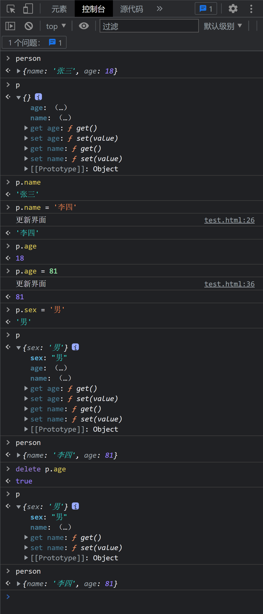

我们再来看 Vue3 中实现响应式原理：

```html
<!DOCTYPE html>
<html lang="en">
    <head>
        <meta charset="UTF-8" />
        <meta http-equiv="X-UA-Compatible" content="IE=edge" />
        <meta name="viewport" content="width=device-width, initial-scale=1.0" />
        <title>Document</title>
    </head>
    <body>
        <script>
            // 源数据
            let person = {
                name: '张三',
                age: 18
            };

            // 模拟 Vue3 中实现响应式
            // ES6 提供的 Proxy 代理函数，能用来映射对某个对象的操作
            // 第一个参数：被代理对象(源对象)，第二个参数：配置对象（没有配置时可以为空对象）
            // 返回值：Proxy 代理对象
            // const p = new Proxy(person, {});
            // 对代理对象操作后需要触发的逻辑可以写到配置对象中
            const p = new Proxy(person, {
                // 读取时触发的逻辑
                get(target, propName) {
                    // target：new Proxy 时传入的对象（源对象）此处为 person
                    // propName：当前读取的属性名，读 name 时就是 'name'，读 age 时就是 'age'
                    return target[propName];
                },
                // 修改或增加时触发的逻辑
                set(target, propName, value) {
                    // value 为修改或增加的值
                    target[propName] = value;
                    console.log('更新界面');
                },
                // 删除时触发的逻辑
                deleteProperty(target, propName) {
                    // 删除成功返回 true，失败返回 false
                    let delStatus = delete target[propName];
                    // 如果为 true 即成功删除，那么更新界面
                    if (delStatus === true) console.log('更新界面');
                    // 返回删除状态 true or false
                    return delStatus;
                }
            });
        </script>
    </body>
</html>
```

测试：

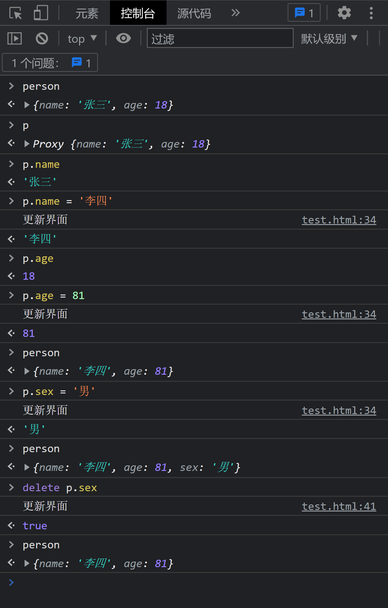

在此基础上，Vue3 源码中对象的操作利用了 ES6 的 Reflect（反射）新特性，相比之前原生的方式 Reflect 封装了更多的功能（Object 上的功能几乎都逐渐在涵盖），并且对操作的成功与否有相应的返回值，而不是直接报错，在框架实现中，相比之前直接用原生的方法要更合理更科学……

```vue
<!DOCTYPE html>
<html lang="en">
    <head>
        <meta charset="UTF-8" />
        <meta http-equiv="X-UA-Compatible" content="IE=edge" />
        <meta name="viewport" content="width=device-width, initial-scale=1.0" />
        <title>Document</title>
    </head>
    <body>
        <script>
            let person = {
                name: '张三',
                age: 18
            };

            const p = new Proxy(person, {
                get(target, propName) {
                    return Reflect.get(target, propName);
                },
                set(target, propName, value) {
                    Reflect.set(target, propName, value);
                    console.log('更新界面');
                },
                deleteProperty(target, propName) {
                    let delStatus = Reflect.deleteProperty(target, propName);
                    if (delStatus === true) console.log('更新界面');
                    return delStatus;
                }
            });
        </script>
    </body>
</html>
```

- 实现原理：
  - 通过 Proxy（代理）:  拦截对象中任意属性的变化，包括：属性值的读写、属性的添加、属性的删除等。
  - 通过 Reflect（反射）:  对源对象的属性进行操作。
  - MDN 文档中描述的 Proxy 与 Reflect：
    - Proxy：https://developer.mozilla.org/zh-CN/docs/Web/JavaScript/Reference/Global_Objects/Proxy
    
    - Reflect：https://developer.mozilla.org/zh-CN/docs/Web/JavaScript/Reference/Global_Objects/Reflect
    

## 4.5 reactive 对比 ref

-  从定义数据角度对比：
   -  ref 用来定义：<strong style="color:#DD5145">基本类型数据</strong>。
   -  reactive 用来定义：<strong style="color:#DD5145">对象（或数组）类型数据</strong>。
   -  备注：ref 也可以用来定义 <strong style="color:#DD5145">对象（或数组）类型数据</strong>，它内部会自动通过 `reactive` 转为 <strong style="color:#DD5145">代理对象</strong>。
-  从原理角度对比：
   -  ref 通过 `Object.defineProperty()` 的 `get` 与 `set` 来实现响应式（数据劫持）。
   -  reactive 通过使用 <strong style="color:#DD5145">Proxy</strong> 来实现响应式（数据劫持），并通过 <strong style="color:#DD5145">Reflect</strong> 操作 <strong style="color:orange">源对象</strong> 内部的数据。
-  从使用角度对比：
   -  ref 定义的数据：操作数据 <strong style="color:#DD5145">需要</strong> `.value`，读取数据时模板中直接读取<strong style="color:#DD5145">不需要</strong> `.value`。
   -  reactive 定义的数据：操作数据与读取数据 <strong style="color:#DD5145">均不需要</strong> `.value`。

> 注意：此处的 ref 函数与 ref 属性没有关系，它们只是刚好名称相同！

## 4.6 setup 的两个注意点

- setup 执行的时机
  - 在 beforeCreate 之前就执行一次，且执行时的 this 是 undefined！
  - 所以，在 setup 中 `this` 是没有任何意义的！我们不会去碰 this！
  
- setup 的参数（setup 是可以接收参数的！）
  - props：值为对象（Proxy 对象），包含：组件外部传递过来，且组件内部声明接收了的属性（注意：组件内部也要配置相应的 `props:[]` 进行接受（也支持 `props:{}` 指定接收的类型），如果不配置会发出警告！这是 Vue3 比较严谨的地方）
  - context：上下文对象（普通对象）
    - attrs：值为对象（Proxy 对象），包含：组件外部传递过来，但没有在 props 配置中声明的属性，相当于 Vue2 中的 `this.$attrs`
    - slots：值为对象（Proxy 对象），包含：收到的插槽内容，相当于 Vue2 的 `this.$slots`
    - emit：分发自定义事件的函数，相当于 Vue2 的 `this.$emit`（注意：组件内部也要配置相应的 `emit:[]` 进行声明自定义事件，如果不配置会发出警告！这是 Vue3 比较严谨的地方【最新版本的 Vue3 已经移除了这个警告】）


## 4.7 计算属性与监视

### computed 函数

- 与 Vue2 中 computed 配置功能一致

- 写法

  ```vue
  <template>
      <h1>一个人的信息</h1>
      姓：<input type="text" v-model="person.firstName" />
      <br />
      名：<input type="text" v-model="person.lastName" />
      <br />
      <span>全名：{{ person.fullName }}</span>
      <br />
      全名：<input type="text" v-model="person.fullName" />
      <!-- 
  	<span>全名：{{ fullName }}</span>
      <br />
      全名：<input type="text" v-model="fullName" />
  	-->
  </template>
  
  <script>
  // 引入 reactive 和 computed
  import { reactive, computed } from 'vue';
  export default {
      name: 'Demo',
      setup() {
          // 数据
          let person = reactive({
              firstName: '张',
              lastName: '三'
          });
  
          // 计算属性 ———— 简写（没有考虑计算属性被修改的情况）
          /* 
  		// setup 中不用考虑 this，所以可以随便用回调函数
  		person.fullName = computed(() => {
  			return person.firstName + '-' + person.lastName;
  		});
  		*/
  
          // 计算属性 ———— 完整写法（考虑读和写）
          person.fullName = computed({
              get() {
                  return person.firstName + '-' + person.lastName;
              },
              set(value) {
                  const nameArr = value.split('-');
                  person.firstName = nameArr[0];
                  person.lastName = nameArr[1];
              }
          });
  
          // fullName 直接添加到 person 里更合理
          // let fullName = computed({
          //     get() {
          //         return person.firstName + '-' + person.lastName;
          //     },
          //     set(value) {
          //         const nameArr = value.split('-');
          //         person.firstName = nameArr[0];
          //         person.lastName = nameArr[1];
          //     }
          // });
  
          // 返回一个对象（常用）
          return {
              person
              // fullName
          };
      }
  };
  </script>
  ```

- 由于是组合式 API，我们可以直接把计算属性追加到对象中，例如有个 Student 对象，里面有 firstName 和 lastName 两个属性，那么按理来说 fullName 应该也属于 Student 对象的属性，所以我们可以直接把计算属性加到 Student 对象里，`Student.fullName = computed(...)` ！并且 Vue3 已经帮我们处理好响应式问题了，无论 computed 是直接用一个新变量来接收，还是赋值给对象内部的属性，我们都不用担心响应式！（这也是 Vue3 的优点之一）

### watch 函数

- 与 Vue2 中 watch 配置功能一致

- 两几个小 “坑”：

  - 监视 reactive 定义的响应式数据时：oldValue 无法正确获取（底层的原因）
  - 监视 reactive 定义的响应式数据时：强制开启了深度监视（deep 配置无效）
  - 监视 reactive 定义的响应式数据中的某个属性时：需要利用箭头函数来返回，且 deep 配置有效
  
  ```vue
  <template>
      <h2>当前求和为：{{ sum }}</h2>
      <button @click="sum++">点我+1</button>
      <hr />
      <h2>当前信息为：{{ msg }}</h2>
      <button @click="msg += '~'">点我修改</button>
      <br />
      <h2>姓名：{{ person.name }}</h2>
      <h2>年龄：{{ person.age }}</h2>
      <h2>薪资：{{ person.job.j1.salary }}K</h2>
      <button @click="person.name += '~'">修改姓名</button>
      <button @click="person.age++">年龄+1</button>
      <button @click="person.job.j1.salary++">薪资+1</button>
  </template>
  
  <script>
  // 引入 ref reactive watch
  import { ref, reactive, watch } from 'vue';
  export default {
      name: 'Demo',
      setup() {
          let sum = ref(0);
          let msg = ref('你好！');
          let person = reactive({
              name: '张三',
              age: 18,
              job: {
                  j1: {
                      salary: 20
                  }
              }
          });
  
          // watch 监视（情况1：监视 ref 定义的一个响应式数据）
          // 参数1：被监视的数据
          // 参数2：回调函数（监视逻辑）
          // 参数3：配置对象（没有配置可以不写该参数）
          watch(
              sum,
              (newValue, oldValue) => {
                  console.log('--------------1--------------');
                  console.log('sum变了！', newValue, oldValue);
              },
              { immediate: true }
          );
  
          // watch 监视（情况2：监视 ref 定义的多个响应式数据）
          // 参数1：被监视的数据数组
          // 参数2：回调函数（监视逻辑）
          // 参数3：配置对象
          // 当然，我们也可以写多个 watch，分别对 sum msg 进行监视，不过某些情况下将其组合起来更合理
          watch([sum, msg], (newValue, oldValue) => {
              // newValue 及 oldValue 也是数组！
              console.log('--------------2--------------');
              console.log('sum或msg变了！', newValue, oldValue);
              console.log('sum变了！', newValue[0], oldValue[0]);
              console.log('msg变了！', newValue[1], oldValue[1]);
          });
  
          // watch 监视（情况3：监视 reactive 定义的一个响应式对象）
          // 参数1：被监视的对象
          // 参数2：回调函数（监视逻辑）
          // 参数3：配置对象
          // 注意1：此处 oldValue 无法获取到正确的值！（底层语法实现的锅！暂时无法解决！）
          // 注意2：对于 reactive 对象，watch 默认就是深度监视的！并且 deep 设置在这里也不生效！比如我们配置 {deep: false} 是不会关闭深度监视的！
          watch(person, (newValue, oldValue) => {
              // newValue 和 oldValue 都是一个 Proxy 对象！
              // oldValue 的值是不正确的（oldValue 的值与 newValue 的值一模一样）！
              console.log('--------------3--------------');
              console.log('person变了！', newValue, oldValue);
          });
          // }, { deep: false }); // 对于 reactive 对象，watch 默认就是深度监视的！并且也关闭不了！
          // 注意：即便将对象用 ref 定义也不行！因为 ref 处理对象依旧是调用 reactive 来实现的！
  
          // watch 监视（情况4：监视 reactive 定义的一个响应式对象中的某个属性）
          // 参数1：被监视的对象某个属性（回调函数包裹）
          // 参数2：回调函数（监视逻辑）
          // 参数3：配置对象
          // watch 第一个参数只能接受 getter/effect 函数；ref 值；reactive 对象；或者是以上类型构成的数组！
          // 所以，如果我们监视的是一个对象里的属性，那么我们必须要用回调函数进行包装，例如：() => person.name
          watch(
              () => person.name,
              (newValue, oldValue) => {
                  console.log('--------------4--------------');
                  console.log('name变了！', newValue, oldValue);
              }
          );
  
          // watch 监视（情况5：监视 reactive 定义的一个响应式对象的某些属性）
          // 参数1：被监视的对象的某些属性（数组，元素为回调函数包裹的对象属性）
          // 参数2：回调函数（监视逻辑）
          // 参数3：配置对象
          watch([() => person.name, () => person.age], (newValue, oldValue) => {
              console.log('--------------5--------------');
              console.log('person的name或age变了！', newValue, oldValue);
              console.log('name变了！', newValue[0], oldValue[0]);
              console.log('age变了！', newValue[1], oldValue[1]);
          });
  
          // watch 监视（情况6：监视 reactive 定义的一个响应式对象中的某个属性，且该属性是一个对象或数组）
          // 参数1：被监视的对象某个属性（回调函数包裹）
          // 参数2：回调函数（监视逻辑）
          // 参数3：配置对象
          // 注意：当我们监视的是 reactive 对象中的某个对象(数组)属性时，如果我们修改了该对象(数组)属性的内部属性(元素)时，监视是不起作用的！因为此时没有深度监视！
          // 解决办法：手动配置上 deep: true
          watch(
              () => person.job,
              (newValue, oldValue) => {
                  console.log('--------------6--------------');
                  console.log('job.j1.salary的变了！', newValue, oldValue);
              },
              { deep: true }
          );
  
          return {
              sum,
              msg,
              person
          };
      }
  };
  </script>
  ```

【watch 函数有关 value 问题的说明】

通过之前的学习，我们知道用 `watch` 时，我们第一个参数是没有 `.value` 的，而是直接写 ref 变量名，那么为什么要这样呢？如果 `.value` 后会发生什么？

答案是：`.value` 后会报错！

原因是：`watch` 检测的是 ref 变量！而我们 `.value` 返回的是一个普通值！`watch` 是不能对一个普通的值做监视的！

不过，当我们用 ref 定义对象时，问题就特殊了！

我们通过之前的学习知道，对象用 ref 定义后会返回一个 Reflmpl 对象（ref 对象），而这个 Reflmpl 对象的 value 值是一个 Proxy 对象！所以，如果我们用 ref 定义对象的话，我们在对其属性进行监视时，我们一定要在 `watch` 第一个参数上加上 `.value`（取到 Reflmpl 中的 Proxy）！当然，不加 `.value` 也有一种情况也可以监视到，就是我们直接替换这个 Reflmpl 对象（引用的内存地址发生改变），因为当我们不加 `.value` 那么 watch 检测的实际是这个 Reflmpl 对象，只有这个 Reflmp 对象的内存地址发生改变了，才会触发监视！而当我们加上 `.value` 则 watch 监视的就是  Proxy 对象！ 

### watchEffect 函数

- watch 的套路是：既要指明监视的属性，也要指明监视的回调。

- watchEffect 的套路是：不用指明监视哪个属性，监视的回调中用到哪个属性，那就监视哪个属性。

- 一旦运行就会立即监听并自动触发一次，用到的数据改变时再次触发，组件卸载的时候会停止监听。

- watchEffect 有点像 computed：

  - 但 computed 注重的计算出来的值（回调函数的返回值），所以必须要写返回值。
  - 而 watchEffect 更注重的是过程（回调函数的函数体），所以不用写返回值。

-   watchEffect 默认监听不了对象内部的数据改变！即：不具备深度监听！
  
  ```vue
  <template>
      <h2>当前求和为：{{ sum }}</h2>
      <button @click="sum++">点我+1</button>
      <hr />
      <h2>当前信息为：{{ msg }}</h2>
      <button @click="msg += '~'">点我修改</button>
      <br />
      <h2>姓名：{{ person.name }}</h2>
      <h2>年龄：{{ person.age }}</h2>
      <h2>薪资：{{ person.job.j1.salary }}K</h2>
      <button @click="person.name += '~'">修改姓名</button>
      <button @click="person.age++">年龄+1</button>
      <button @click="person.job.j1.salary++">薪资+1</button>
      <button
          @click="
              person.job = {
                  j1: {
                      salary: 24
                  }
              }
          "
      >
          直接替换person.job对象
      </button>
  </template>
  
  <script>
  // 引入 ref reactive watchEffect
  import { ref, reactive, watchEffect } from 'vue';
  export default {
      name: 'Demo',
      setup() {
          let sum = ref(0);
          let msg = ref('你好！');
          let person = reactive({
              name: '张三',
              age: 18,
              job: {
                  j1: {
                      salary: 20
                  }
              }
          });
  
          // 执行时间：初始化时自动执行一次，所用到的数据变化时自动执行一次
          watchEffect(
              () => {
                  let s = sum.value;
  
                  // 特别注意：watchEffect 不具备深度监视能力！
                  // person 内的属性变化是监测不到的！（除非直接替换了 person 对象，即发生引用内存改变）
                  // let p = person;
  
                  // 只能监测单层数据
                  let pn = person.name;
  
                  // person.job 内的属性变化是监测不到的！（除非直接替换了 person.job 对象，即发生引用内存改变）
                  let pj = person.job;
  
                  // person.job.j1 内的属性变化是监测不到的！（除非直接替换了 person.job.j1 对象，即发生引用内存改变）
                  // let pjj = person.job.j1;
  
                  // 只能监测单层数据
                  // let pjjs = person.job.j1.salary;
  
                  console.log('watchEffect监视到了！', s, pn, pj);
              },
              { deep: true }
          );
  
          return {
              sum,
              msg,
              person
          };
      }
  };
  </script>
  ```

## 4.8 生命周期

Vue2 vs Vue3 生命周期：

|  |  |
| ------------------------------------------------------------ | ------------------------------------------------------------ |

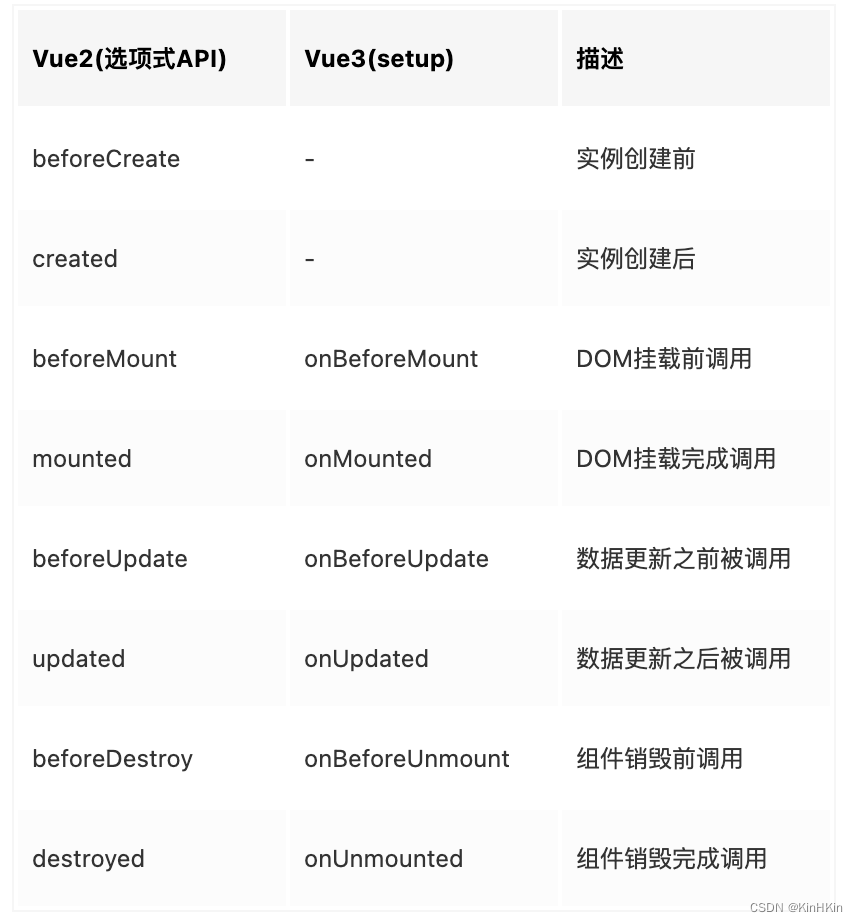

- Vue3 整体上生命周期与 Vue2 变化不大，值得注意的是 `setup` 在 beforeCreate 之前就执行一次，且执行时的 this 是 undefined！（我们几乎不会在 setup 中用到 this）
- Vue3 中可以继续使用 Vue2 中的生命周期钩子，但有有两个被更名：
  - `beforeDestroy` 改名为 `beforeUnmount`
  - `destroyed` 改名为 `unmounted`
- Vue3 也提供了 Composition API 形式的生命周期钩子，与 Vue2 中钩子对应关系如下：
  - `beforeMount` ===> `onBeforeMount`
  - `mounted` =======> `onMounted`
  - `beforeUpdate` ===> `onBeforeUpdate`
  - `updated` =======> `onUpdated`
  - `beforeUnmount` ==> `onBeforeUnmount`
  - `unmounted` =====> `onUnmounted`
  - 可以发现，Vue3 的 Composition API 中并没有提供 `beforeCreate` 和 `created` 两个生命周期钩子的 API，这是因为在 Composition API 中 `beforeCreate` 和 `created` 被 `setup()` 替代！Vue3 官方认为 `setup()` 就是  `beforeCreate` + `created`！

- 注意：Vue3 中支持两种风格的生命周期混用！其中有相同的钩子时， Composition API 形式的生命周期钩子优先级更高！先执行 Composition API 形式的生命周期钩子再执行 Options API（选项式 API，Vue2 风格 API）形式的生命周期钩子！不过，极度不建议混用！

## 4.10 自定义 hook 函数

- 什么是 hook？—— 本质是一个函数，把 setup 函数中使用的 Composition API（ref、reactive、computed、watch、生命周期……）进行封装的办法。

- 类似于 Vue2 中的 mixin。

- 自定义 hook 的优势：复用代码，让 setup 中的逻辑更清楚易懂。

> 命名规范：hook 函数一般放在 src/hooks 下，文件命名一般是 `useXxx.js`

## 4.11 toRef

- 作用：创建一个 ref 对象，其 value 值指向另一个对象中的某个属性
- 语法：`const name = toRef(person, 'name')`
- 应用：将响应式对象中的某个属性单独提供给外部使用时


- 扩展：`toRefs` 与 `toRef` 功能一致，但可以批量创建多个 ref 对象，语法：`toRefs(person)`


# 五、其它 Composition API

## 5.1 shallowReactive 与 shallowRef

- shallowReactive：只处理对象最外层属性的响应式（浅响应式）。
- shallowRef：只处理基本数据类型的响应式，不进行对象的响应式处理。

- 什么时候使用？
  -  如果有一个对象数据，结构比较深，但变化时只是外层属性变化 ===> shallowReactive。
  -  如果有一个对象数据，后续功能不会修改该对象中的属性，而是生新的对象来替换 ===> shallowRef。

## 5.2 readonly 与 shallowReadonly

- readonly：让一个响应式数据变为只读的（深只读）。
- shallowReadonly：让一个响应式数据变为只读的（浅只读）。
- 应用场景：不希望数据被修改时。

## 5.3 toRaw 与 markRaw

- toRaw：
  - 作用：将一个由 `reactive` 生成的<strong style="color:orange">响应式对象</strong>转为<strong style="color:orange">普通对象</strong>。
  - 使用场景：用于读取响应式对象对应的普通对象，对这个普通对象的所有操作，不会引起页面更新。
- markRaw：
  - 作用：标记一个对象，使其永远不会再成为响应式对象。
  - 应用场景:
    1. 有些值不应被设置为响应式的，例如复杂的第三方类库等。
    2. 当渲染具有不可变数据源的大列表时，跳过响应式转换可以提高性能。

## 5.4 customRef

- 作用：创建一个自定义的 ref，并对其依赖项跟踪和更新触发进行显式控制。

- 实现防抖效果：

  ```vue
  <template>
  	<input type="text" v-model="keyword">
  	<h3>{{keyword}}</h3>
  </template>
  
  <script>
  	import {ref, customRef} from 'vue';
  	export default {
  		name:'Demo',
  		setup() {
  			// let keyword = ref('hello');  // 使用 Vue 准备好的内置 ref
  			// 自定义一个 myRef
  			function myRef(value, delay) {
  				let timer;
  				// 通过 customRef 去实现自定义
  				return customRef((track, trigger) => {
  					return {
  						get() {
  							track(); // 告诉 Vue 这个 value 值是需要被“追踪”的
  							return value;
  						},
  						set(newValue) {
  							clearTimeout(timer);
  							timer = setTimeout(() => {
  								value = newValue;
  								trigger(); // 告诉 Vue 去更新界面
  							}, delay);
  						}
  					}
  				})
  			}
  			let keyword = myRef('hello', 500); // 使用程序员自定义的 ref
  			return {
  				keyword
  			};
  		}
  	}
  </script>
  ```


## 5.5 provide 与 inject

- 作用：实现<strong style="color:#DD5145">祖与后代组件间</strong>通信

- 套路：父组件有一个 `provide` 选项来提供数据，后代组件有一个 `inject` 选项来开始使用这些数据

- 具体写法：

  1. 祖组件中：

     ```js
     setup() {
     	......
         let car = reactive({name:'奔驰', price:'40万'});
         provide('car', car);
         ......
     }
     ```

  2. 后代组件中：

     ```js
     setup(props, context) {
     	......
         const car = inject('car');
         return {car};
     	......
     }
     ```

## 5.6 响应式数据的判断

- isRef：检查一个值是否为一个 ref 对象
- isReactive：检查一个对象是否是由 `reactive` 创建的响应式代理
- isReadonly：检查一个对象是否是由 `readonly` 创建的只读代理
- isProxy：检查一个对象是否是由 `reactive` 或者 `readonly` 方法创建的代理

# 六、Composition API 的优势

## 6.1 Options API 存在的问题

传统 Options API（选项式 API）开发方式中，新增或修改一个需求，就需要分别在 data、methods、computed…… 里实现 。这种开发方式，对于小型项目没有太大的问题，但是对于稍微复杂的一点的项目，代码结构的混乱度与割裂感就会明显突显出来。

|  |  |
| ------------------------------------------------------------ | ------------------------------------------------------------ |


## 6.2 Composition API 的优势

我们可以更加优雅的组织我们的代码（数据、函数、生命周期……）让相关功能的代码更加有序的组织在一起。

同时，Composition API 借助 hook 函数的方式，能在更大的程度上，优化代码结构，提高复用性！

| 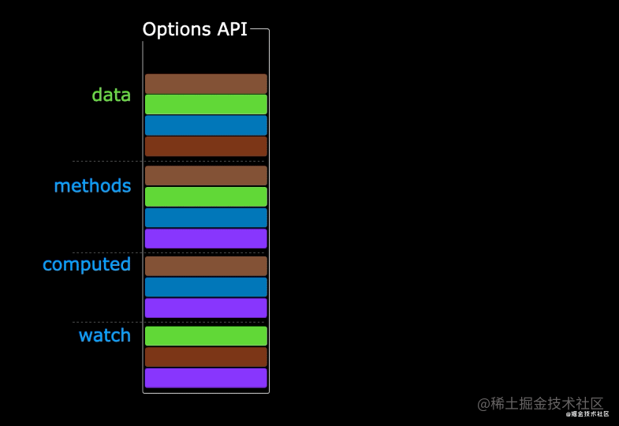 | 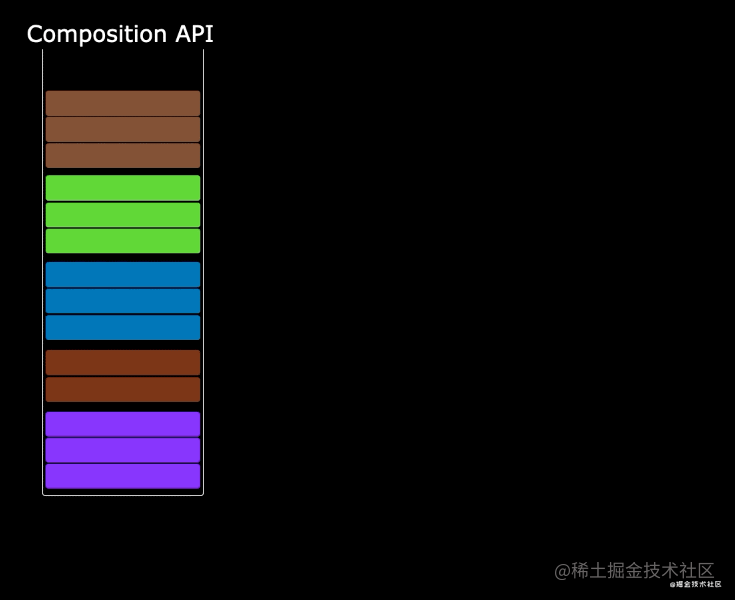 |
| ------------------------------------------------------------ | ------------------------------------------------------------ |


# 七、新的组件

## 7.1 Fragment

- 在 Vue2 中：组件必须有一个根标签
- 在 Vue3 中：组件可以没有根标签，内部会将多个标签包含在一个 Fragment 虚拟元素中
- 好处：减少标签层级，减小内存占用

## 7.2 Teleport

- 什么是 Teleport？—— `Teleport` 是一种能够将我们的<strong style="color:#DD5145">组件 html 结构</strong>移动到指定位置的技术。

  ```vue
  <teleport to="移动位置（CSS选择器）">
  	<div v-if="isShow" class="mask">
  		<div class="dialog">
  			<h3>我是一个弹窗</h3>
  			<button @click="isShow = false">关闭弹窗</button>
  		</div>
  	</div>
  </teleport>
  ```

## 7.3 Suspense

- 等待异步组件时渲染一些额外内容，让应用有更好的用户体验

- 使用步骤：

  - 异步引入组件

    ```js
    import {defineAsyncComponent} from 'vue';
    const Child = defineAsyncComponent(() => import('./components/Child.vue'));
    ```

  - 使用 `Suspense` 包裹组件，并配置好 `default`  与 `fallback`

  - `<Suspense></Suspense>` 底层就是一个插槽实现的！
  
    ```vue
    <template>
    	<div class="app">
    		<h3>我是App组件</h3>
    		<Suspense>
    			<template v-slot:default>
    				<Child/>
    			</template>
    			<template v-slot:fallback>
    				<h3>加载中.....</h3>
    			</template>
    		</Suspense>
    	</div>
    </template>
    ```

# 八、其他

## 8.1 全局 API 的转移

- Vue 2 有许多全局 API 和配置。
  - 例如：注册全局组件、注册全局指令等。

    ```js
    // 注册全局组件
    Vue.component('MyButton', {
      data: () => ({
        count: 0
      }),
      template: '<button @click="count++">Clicked {{ count }} times.</button>'
    });
    
    // 注册全局指令
    Vue.directive('focus', {
      inserted: el => el.focus();
    });
    ```

- Vue3 中对这些 API 做出了调整：

  - 将全局的 API，即：`Vue.xxx` 调整到应用实例（`app`）上

    | Vue2 全局 API（`Vue`）   | Vue3 实例 API（`app`）                                       |
    | ------------------------ | ------------------------------------------------------------ |
    | Vue.config.xxx           | app.config.xxx                                               |
    | Vue.config.productionTip | <strong style="color:#DD5145">移除</strong>（开发状态下能自动检测到，不进行生产提示） |
    | Vue.component            | app.component                                                |
    | Vue.directive            | app.directive                                                |
    | Vue.mixin                | app.mixin                                                    |
    | Vue.use                  | app.use                                                      |
    | Vue.prototype            | app.config.globalProperties                                  |
  

## 8.2 其他改变

- data 选项应始终被声明为一个函数。

- 过度类名的更改：

  - Vue2 写法

    ```css
    .v-enter,
    .v-leave-to {
      opacity: 0;
    }
    
    .v-leave,
    .v-enter-to {
      opacity: 1;
    }
    ```

  - Vue3 写法

    ```css
    .v-enter-from,
    .v-leave-to {
      opacity: 0;
    }
    
    .v-leave-from,
    .v-enter-to {
      opacity: 1;
    }
    ```

- <strong style="color:#DD5145">移除</strong> keyCode 作为 v-on 的修饰符，同时也不再支持 `config.keyCodes`

- <strong style="color:#DD5145">移除</strong> `v-on.native` 修饰符

  - 父组件中绑定事件

    ```vue
    <my-component
      v-on:close="handleComponentEvent"
      v-on:click="handleNativeClickEvent"
    />
    ```

  - 子组件中声明自定义事件

    ```vue
    <script>
      export default {
        // 没有在 emits 中声明的，能作为原生事件的就自动作为原生事件
        emits: ['close']
      }
    </script>
    ```

- <strong style="color:#DD5145">移除</strong>过滤器（filter）

  > 过滤器虽然这看起来很方便，但它需要一个自定义语法，打破大括号内表达式是 “只是 JavaScript” 的假设，这不仅有学习成本，而且有实现成本！建议用方法调用或计算属性去替换过滤器。

- 已经没有 `$on` `$emit` `$off` 方法，所以我们无法在使用全局事件总线！在 Vue3 中，官方推荐使用 [mitt - npm (npmjs.com)](https://www.npmjs.com/package/mitt) 这个三方库来帮助我们实现全局事件总线。

- ……