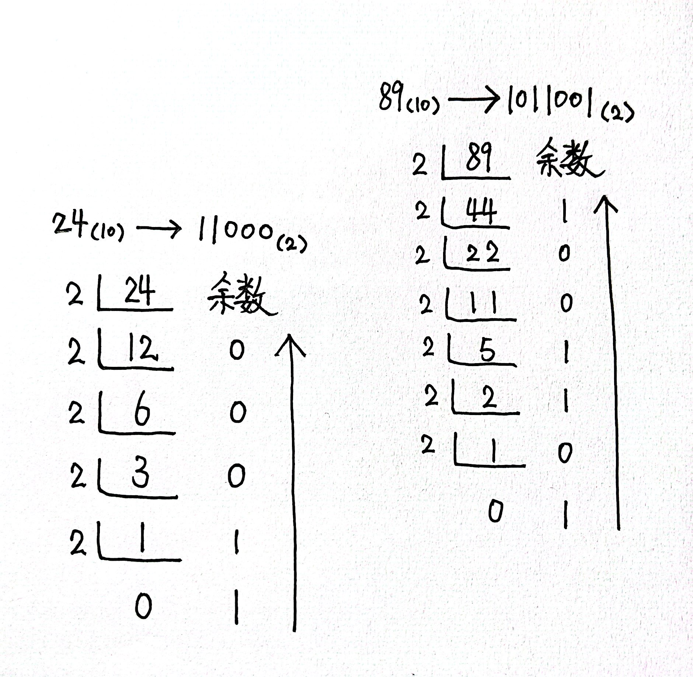
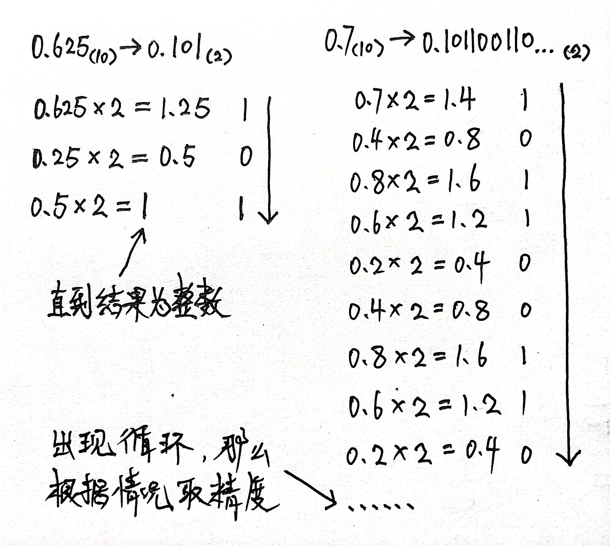
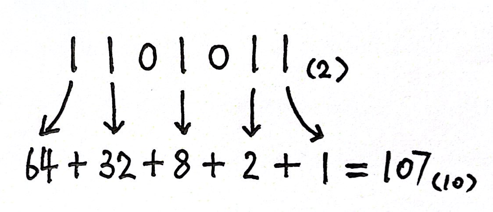
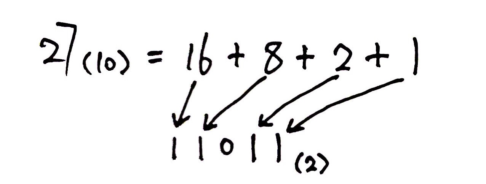
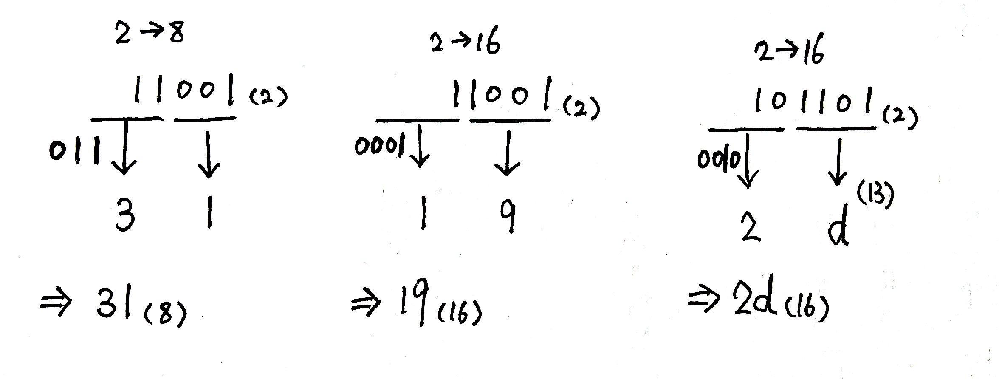
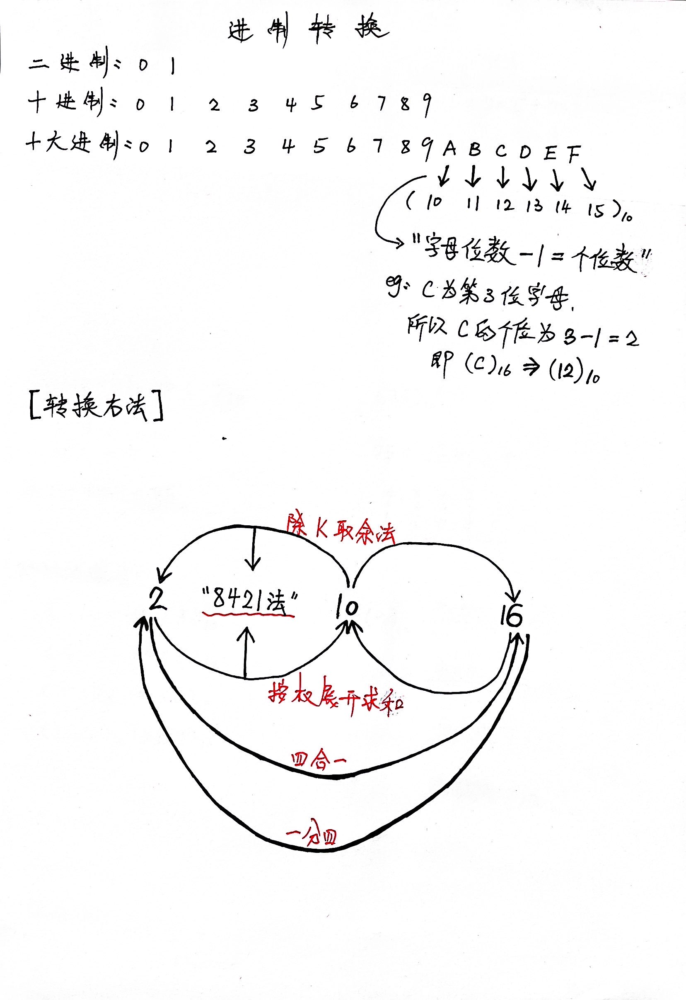
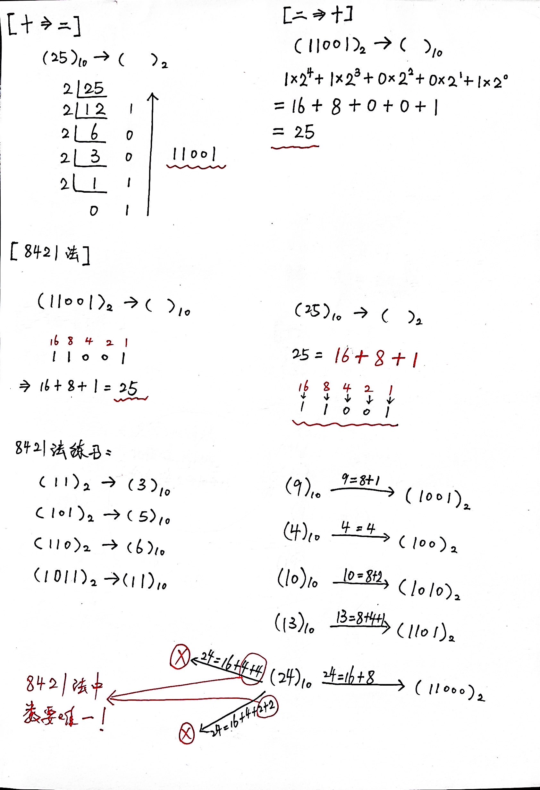
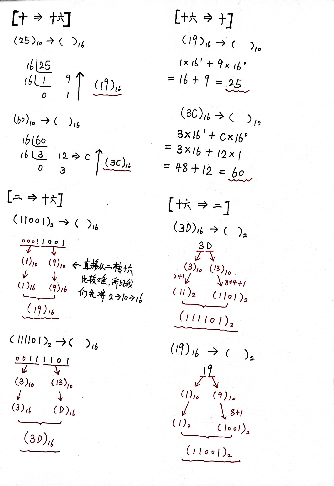

# 【进制转换】

> 原创内容，转载请注明出处！

> 进制转换的方法是：二进制、八进制、十六进制数可以采用“按权展开法”转化为十进制数；十进制转化为K进制要分为两部分，其中整数部分要采用“除K取余法”，直到商为0（下往上），小数部分要采用“乘K取整法”直到得到整数（上往下）。
>
> > 由于整数和小数的转换方法不同，所以先将K进制数的整数部分和小数部分分别转换后，再进行合并。

进位计数制：人们利用符号来计数的方法，一种进位计数制包含一组数码符号和两个基本因素。

1. 数码：用不同的数字符号来表示一种数制的数值，这些数字符号称为“数码”

   - 二进制：`0`——`1`

   - 八进制：`0`——`7`

   - 十进制：`0`——`9`

   - 十六进制：`0`——`9`，`a`——`f`
1. 基：数制所使用的数码个数称为“基”
   - 二进制：`2`
   - 八进制：`8`
   - 十进制：`10`
   - 十六进制：`16`
1. 权：某数制每一位所具有的值称为“权”
   - 权 = 当前数码×基(位数-1)

## K进制转十进制（按权展开法）

- 二进制转十进制：101101(2)

1×25 + 0×24 + 1×23 + 1×22 + 0×21 + 1×20 = 32+0+8+4+0+1 = 45(10)

- 八进制转十进制：4703(8)

4×83 + 7×82 + 0×81 + 3×80 = 2048+448+0+3 = 2499(10)

- 十六进制转十进制：3cf9(16)

3×163 + 12×162 + 15×161 + 9×160 = 12288+3072+240+9 = 15609(10)

> K进制包含小数时（有小数点及小数点后有数值），小数部分依旧采用的是“按权展开法”，不过幂从`-1`开始，每次减1。

## 十进制转K进制（除K取余法、乘K取整法）

> 以十进制转二进制为例，其他进制类比。

【整数部分“除K取余法”】

【小数部分“乘K取整法”】

## 十进制与二进制的快速转换（8421法）

因为

1：1

10：2

100：4

1000：8

10000：16

100000：32

1000000：64

10000000：128

……

所以，有了8421法这种十进制与二进制的快速转换方法。

【二进制转十进制】

【十进制转二进制】

> 同时，应该牢记一部分特殊值：
>
> | 二进制（八位） | 十进制     |
> | -------------- | ---------- |
> | 10000000       | 128        |
> | 11000000       | 192（+64） |
> | 11100000       | 224（+32） |
> | 11110000       | 240（+16） |
> | 11111000       | 248（+8）  |
> | 11111100       | 252（+4）  |
> | 11111110       | 254（+2）  |
> | 11111111       | 255（+1）  |

## 二进制与八进制十六进制的快速转换（三位、四位法）

> 八进制（三位一体，不足添0）、十六进制（四位一体，不足添0）

> 八进制或十六进制快速转二进制步骤与之相反。

## 总结（重点）

