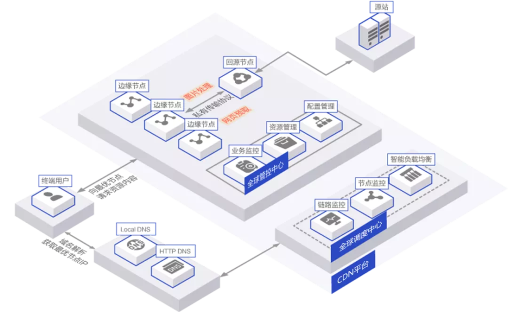

# Web服务器带宽的选择

当我们需要配置 Web 服务器，或是购买云服务器时，通常带宽选择上会带来一定的困惑，一般的云服务器基础配置都是 1Mbps 起步的带宽，根据实际需求最多可以加到 200Mbps 甚至更高，同时对于云服务器费用来说，最贵的也是带宽费用，所以合理的选择带宽是节约服务器成本的重要且必要的一环。

**1M，作为云服务器最低的带宽配置，到底能承受多大的流量？**

在选配云服务器带宽的时候，看到带宽大小的时候，头疼病总是发作，带宽买小了，网站太卡，用户体验不好影响业务，带宽买大了，又实在浪费。

那么云服务器的带宽，到底多大够用？1M 的带宽，流量承受极限是多少？

带宽知识扫盲：

首先普及一下带宽的一些基础知识。

云服务器的带宽，指的是出网带宽，用户发起请求，服务器发送数据给终端时，会占用这一部分的带宽。

假如云服务器的带宽是 1M，最大的传输速度就是 128kb/s，当用户浏览网站的时候，云服务器向用户发送数据，传输速度就是128kb/s。

1M=1024/8=128kb/s（1Mbps = 1024Kbps = 1024/8KBps = 128KB/s）

这个传输速度，看起来很慢，但实际上很多时候是够用的。

我们浏览的网页，大多由文字和图片组成，一个汉字才 2 个字节，图片经过压缩，通常也在几十 KB 左右。只要页面内容不是特别多的话，1M 带宽的速度，跟 5M 带宽的打开速度没有什么差别。

当然，这只是算同一时间只有一个用户在请求网站资源的情况。如果网站同时有两个用户在请求资源，理论上每个用户只能分到 60 多 KB，如果 10 个用户同时请求，每个人只有 12.8KB/s 的速度，网站速度就会非常慢。

值得一提的是，只有云服务器响应用户请求，发送数据时，才会占用带宽。用户点击网站某一个链接（请求服务器资源）时，带宽资源才会被占用，页面完全加载出来后（数据响应结束），就不会占用带宽了。

此外，还有缓存，CDN 等各种技术的支持，所以小型网站云服务器同时向多用户发送数据的情况并不多见，1M 的带宽就能满足需求了。

**那么，1M 的带宽到底能承受多少人在线呢？**

根据用户每秒请求数据量的大小估算

接口类的用户，每秒请求 10 次，每次数据量是 50 个汉字（100字节），那这 1M 的带宽，可以承载的用户数量约为：128*1000/10/100 = 128 个用户。

用户需接收图片，假设每秒下载一次图片大小为 10KB，那么可以同时承载 12.8 人。

如果是个人博客网站，一篇文章 1000 字，还会配 2 张图，那么这一篇文章大小在 100KB 左右，相当于每秒可以接收一个用户的访问。

1 秒可以接收一个用户，相当于每小时能接收 3600 个用户，一天就是 86400 名！

当然，这个只是理论数据，用户的访问不可能那么均匀，也不可能每秒请求一次。

**怎么检测带宽够不够用？**

不同网站，页面大小和流量高峰期都不同，怎么计算 1M 的带宽够不够用呢？

一种是通过经验估算，一般来说日均两三千 IP 以下的网站，1M 的带宽就够用了。

另一种是观察云服务提供商的监控后台，出网带宽经常处于 128kb/s 峰值时，说明需要升级带宽了。

有人会说，1M 带宽用那么久了，都有“情怀”在里面，不想换，又不想影响用户体验，有没有办法？

有，使用 CDN。

使用 CDN 后，网站的内容会分发到各个 CDN 缓存节点上，当用户发起请求后，内容数据会从最近的 CDN 节点发送给用户，不再经过源站，也就不会占用云服务器的带宽。只有 CDN 缓存节点找不到对应内容，才会返回源站，占用带宽。

这样一来，1M 的带宽承载并发请求量，会大很多。

1M 的带宽具体能承受多少人在线，决定因素实在太多，涉及到方方面面，例如页面优化技术、CDN 技术、网站架构、以及云计算平台提供的各种各样针对性的服务等，没有一个确切的答案，但可以肯定的是，对于绝大部分用户量不是太多的网站（非视频音频图片类）来说，1M 的带宽肯定够用了。

而且，对于用户数量巨大，且属于视频、流媒体、直播等这类的网站来说，往往不会用云服务器而是自购硬件服务器然后托管到数据中心，甚至是自建机房（中大型企业）。