# 一文看懂HTTPS(SSL/TLS)

> 作者：Xieyezi
> 链接：https://juejin.cn/post/6955767063524671524
> 来源：稀土掘金
> 著作权归作者所有。商业转载请联系作者获得授权，非商业转载请注明出处。

阅读本文之前，咱们先来看几道面试题：

- 什么是`HTTPS`？
- `HTTPS`改进`HTTP`存在的哪些问题？
- `HTTPS`加密原理是什么？
- 什么是`对称加密`和`非对称加密`？
- `HTTPS`传输过程？
- 什么是数字证书？为什么需要数字证书？
- 为什么需要数字签名？

如果你能准确无误的回答以上问题，你可以不用继续往下面看了，如果不能，通过阅读这篇文章，我相信你肯定能完全掌握`HTTPS`。好了废话不多说，我们开始。

## 什么是 HTTPS？

当我们在访问一个地址采用`HTTPS`协议的`Web`网站时，浏览器的地址栏内会出现一个带锁的标记，就像这样：


我们想要了解一个东西之前，我们得先知道它是什么，那么`HTTPS`是什么呢？

可能很多同学都能说道说道：“`HTTPS`就是能够给我们的请求加密的一个东西”。的确，我们都知道，`HTTPS`可以加密，但是很多同学的理解仅限于此，无法深层次的理解`HTTPS`。那么到底什么是`HTTPS`？

`HTTPS`是在`HTTP`上建立`SSL`加密层，并对传输数据进行加密，是`HTTP`协议的安全版。 说得再简单一点，`HTTPS`就是 `HTTP + SSL`：

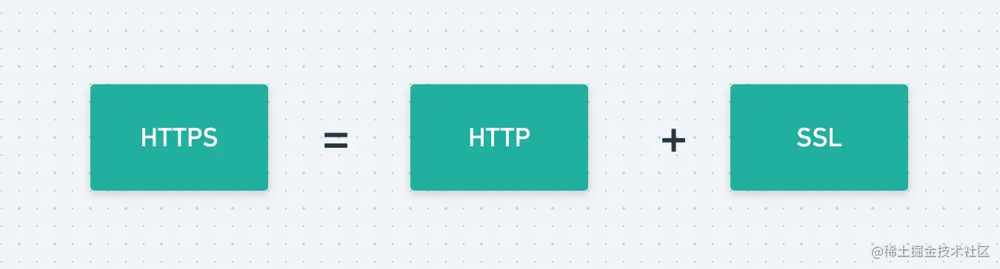

哦明白了，原来`HTTPS`就是“披着羊皮的狼”啊。`HTTP`你肯定是理解的，如果不理解，建议先去阅读`HTTP`相关知识。

那`SSL`又是什么呢？

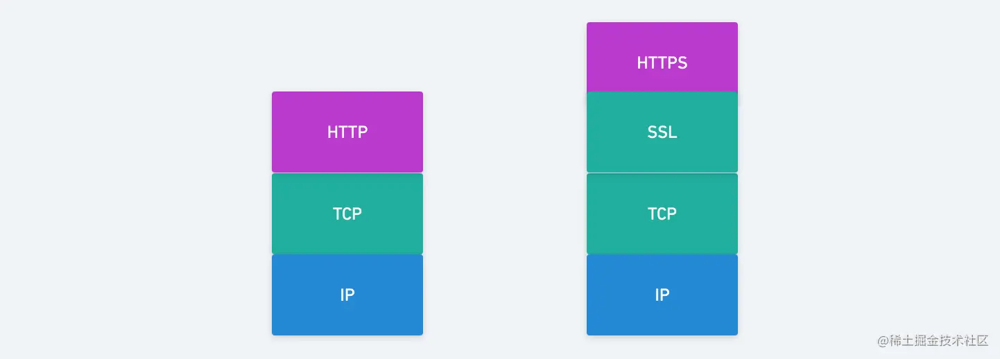

我们都知道，`HTTP`是应用层的协议，`HTTP`是直接和`TCP`通信的，当我们更换为`HTTPS`的时候，它就演变成了，先和`SSL`通信、然后再由`SSL`和`TCP`通信了。知道了这一流程，我们思考一下，加密过程是在哪个过程进行的？ 结果很显然，加密过程就是在`HTTP`->`SSL`这一阶段实现的，所以`SSL`简单来说，就是实现`HTTP`的加密过程：

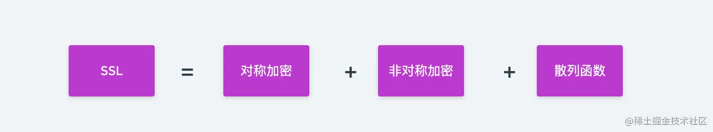

`对称加密`和`非对称加密`、`散列函数`这些又是啥啊？没事后面会讲，这些概念你先记住咯。

> HTTPS 不是一种全新的协议，它是建立在 SSL/TLS 传输层安全协议之上的一种 HTTP 协议，相当于 HTTPS = HTTP + SSL/TLS，可保护用户计算机与网站服务器之间数据传输的完整性、机密性。
>
> 从 OSI 模型图上看主要是在应用层和传输层直接多了一个 SSL/TLS 协议。
>
> SSL/TLS 就是我们学习 HTTPS 的关键部分，SSL/TLS 做为一种安全的加密协议，其在不安全的基础设施之上为我们提供了安全的通信通道。
>
> SSL/TLS 这个名字有时也会让人迷，现在我们所说的 SSL/TLS 一般特指 TLS 协议，因为 TLS 就是 SSL 的升级版，目前广泛使用的就是 TLS。

## HTTPS 有什么用

在讲明HTTPS的作用之前，我们先来看看`HTTP`有哪些弊端：

- 和服务器通信时，直接采用明文传输，那么明文内容有可能被挟持监听和篡改

由于`HTTP`本身不具备加密的功能，所以无法做到对通信内容进行加密。也就是说，我们传输的方式，都是直接以明文的形式进行传输，这些明文数据会经过中间代理服务器、路由器、wifi热点、通信服务运营商等多个物理节点，相当于所有通信的数据都在网络中`裸奔`，想想都刺激。

那么显而易见，明文传输有什么缺陷呢？明文传输可能会导致`数据泄露`、`数据篡改`、`流量劫持`、`钓鱼攻击`等一系列危险。假设有这么一个场景，某一天，你的另一个女朋友“小三”过生日，于是你用浏览器登录了你的邮箱，想给她发送一封生日祝福的邮件。假如这个邮箱网站使用的是`HTTP`协议，当你点击发送的时候，你的祝福内容“生日快乐！亲爱的，我女友今天不在家，我来找你，等我！”（注意：是明文），被某个黑客拦截到，然后将这份“祝福内容”直接转发到你的“现任女朋友”，那后果简直不堪设想。

- 和服务器通信时，无法验证身份

使用 HTTP 发起请求时，服务器不会验证请求方的身份，响应请求时，请求方也不会验证服务方的身份。说简单点就是，任何人都可以发起请求，同时，服务器只要接收到请求，不管对方是谁都会返回一个响应。所以任何人都可以伪造虚假服务器欺骗用户，实现“钓鱼欺诈”，用户无法察觉。

了解到 HTTP 这些缺陷之后，我们就自然知道了 HTTPS 到底有什么用：

- 保证数据的安全性（加密我们的明文数据）
- 保证数据的完整性
- 身份认证

## HTTPS如何加密（SSL过程）？

通过上面的内容，我们知道了`HTTPS`能够对数据进行加密，那么它具体是如何加密的呢？

这里我们需要先了解两种加密方式：

- 对称加密
- 非对称加密

> 别觉得它们会有多么难理解，心中坚信，一切计算机网络的知识都是`纸老虎`。

## 什么是对称加密？

那么什么是`对称加密`呢？

简单说就是有一个密钥，它可以加密数据，也可以对加密后的数据进行解密。试想有这样一个场景：两个港口需要运送一批货物，发货方发货时，将货物装进集装箱并用一把锁将集装箱锁起来，收货方收到货物时，需要用同样的钥匙（不一定是同一把）将集装箱打开，从而取出货物。

所以简单来说，对称加密就是通信双方都有一把同样的`钥匙`，用于打开同一个`集装箱`（解密），从而获取数据的一种方式：

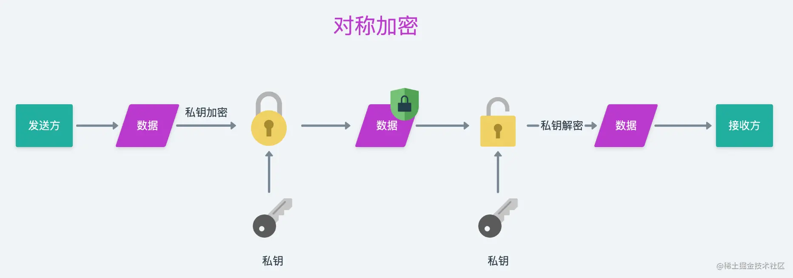

## HTTPS用对称加密可行吗？

如果通信双方（浏览器和服务器）都各自拥有同样的私钥，在发送方发送数据之前，将数据`锁`（加密）起来，然后接收方再用私钥`解锁`（解密），这样就能完美的保证通信的安全。但是关键的问题就在于，在通信之前，服务器或者浏览器如何同时拥有一把同样的私钥呢？我们来想想办法：

1、服务器给浏览器传输私钥

当浏览器发起请求到服务器时，服务器生成一个私钥，然后传输给浏览器，浏览器拿到之后，他们正式通信就开始用这一个私钥进行加密通信，不就行了？那么问题又来了，假设在传输私钥本身的过程中，被中间人挟持了怎么办？中间人拿到私钥之后，就可以解密通信双方的加密内容了，所以这样做肯定是不可行的。

2、在浏览器里面预留服务器提供的私钥。如果我们浏览器一开始就预留了目标网站的私钥，那这样通信的时候，就只有天知地知你知我知了，这不就行了？但是问题的关键是，世界上的网站千千万，浏览器要预留全部`HTTPS`协议网站的私钥，这显然不可能啊。

很显然，以上两种假设，都不能实现我们想要的加密效果，所以`对称加密`暂时被我们 Pass。

## 什么是非对称加密？

既然对称加密不行，那么我们就需要考虑`非对称加密`了，那`非对称加密`又是什么呢？

我们还是来看看还是刚刚上面👆那个`运送货物`的例子：

两个港口需要运送一批货物，发货方发货时，将货物装进集装箱并用一把锁（我们将其称为公钥）将集装箱锁起来，收货方收到货物时，需要用另外一把钥匙（我们将其称为私钥）将集装箱打开，从而取出货物。

> 注意这里的关键是：当通信的一方使用公钥时，另外一方只能使用私钥，反之亦然。

简单的来说就是有两把密钥，一把叫做公钥、一把叫私钥。用公钥加密的内容必须用私钥才能解开，同理，私钥加密的内容只有公钥能解开。公钥对于私钥来说是非对称的，所以我们把这种加密方式称为`非对称加密`：

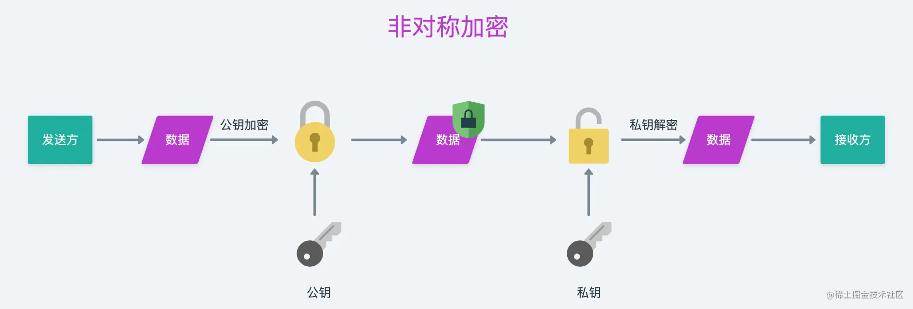

## HTTPS用非对称加密可行吗？

我们利用非对称加密来模拟一下浏览器和服务器通信的过程。

浏览器向服务器发起请求，服务器收到请求之后，将公钥传输给浏览器，然后在接下来的通信中，浏览器要向服务器发送数据时，先用公钥将数据加密，然后发送给服务器，服务器收到之后，再用对应的私钥进行解密，这样就保证了`浏览器->服务器`这条路的数据安全。因为浏览器发送给服务器的数据，只有服务器有私钥能够解密它。那么反过来，`服务器->浏览器`这条路的通信是否安全呢？

捋一捋刚刚的过程，我们就会发现，一开始我们的服务器将公钥传输给浏览器这一步骤，显然是在明文形式下进行传输的。假设这一过程，我们的公钥被中间人挟持了，想想会发生什么情况？显然有了这个公钥，中间人就能解密由服务器利用私钥加密后发送给浏览器的数据了。并且，中间人还可以利用公钥伪造浏览器请求发送给服务器，服务器收到请求之后，利用私钥解密请求数据，之后响应请求，并用私钥对响应数据加密，接着返回给请求方，由于此时这个中间人是有对应的公钥的，所以他就能直接解密服务器返回的数据。

所以很显然，利用`非对称加密` 无法保证`服务器->浏览器`这条链路的数据安全。

还是像上面那样，我们来想想办法呗。

我们刚刚通过分析得知，通过一组 `公钥` + `私钥` ，我们可以保证`浏览器->服务器`的安全，那我们能不能用两组 `公钥` + `私钥` 来实现两条链路的安全呢？

假设现在浏览器预存了一套 `公钥` 和 `私钥`，服务器也预存了一套 `公钥` 和 `私钥`，我们来看看以下通信过程：

1、浏览器向服务器发起请求，同时携带浏览器端的公钥；

2、服务器端收到浏览器的公钥之后，返回服务器端的公钥给浏览器端；

3、浏览器向服务器发送数据之前，利用服务器端提供的公钥对数据进行加密（保证了`浏览器->服务器`的数据安全）；

4、服务器收到数据之后，利用自己的私钥进行解密，并开始响应请求，将响应数据通过浏览器端提供的公钥进行加密（保证了`服务器->浏览器`的数据安全）；

5、浏览器收到数据之后，利用自己的私钥进行解密。

上面这个过程，这样我们就能做到：`浏览器->服务器`、`服务器->浏览器` 两条通道都是安全的，因为他们都能提供彼此的公钥给对方使用，而且都能用自己的私钥解密对方发送的数据。貌似很完美了，对吗？

但是实际上，我们不知道的是，非对称加密其实是非常耗时的，当浏览器向服务器发起请求时，用户肯定是希望越早看到响应数据越好，所以为了提高响应速度，这种两套 `公钥` + `私钥` 的方式也被 Pass。

既然两组`公钥` + `私钥`的方式非常耗时，那我们就想办法减少非对称加密的次数不就行了？

## 非对称加密 + 对称加密

既然`非对称加密`比`对称加密`耗时，那我们能否将他们结合起来解决上面的问题呢？这样的话，我们就将非对称加密的次数减少为了一次。

假设服务器预存了一套 `公钥（假设叫 A+ ）` 和 `私钥（假设叫 A- ）`，我们来看看如下通信过程：

1、浏览器向服务器发起请求；

2、服务器将自己的`公钥A+ `返回给浏览器；

3、浏览器在本地生成一个密钥`B`，然后利用`公钥A+ `对密钥`B`进行加密，加密之后传输给服务器；

4、服务器收到数据，利用`私钥A-`对数据进行解密，拿到浏览器生成的密钥`B`；

5、之后双方的通信，都用密钥`B`进行。

这种方式简直完美，实际上`HTTPS`正是利用了这种加密方式来实现加密的。仔细想想，这样是不是就万无一失了呢？

下面来展示一招`偷梁换柱`:

假设服务器预存了一套 `公钥（假设叫 A+ ）` 和 `私钥（假设叫 A- ）`

中间人也有一套`公钥（假设叫 B+ ）` 和 `私钥（假设叫 B- ）`

现在请看如下过程：

1、浏览器向服务器发起请求；

2、服务器响应请求，并返回`公钥A+`

3、中间人挟持到`公钥A+`之后，给浏览器返回自己的`公钥B+` :

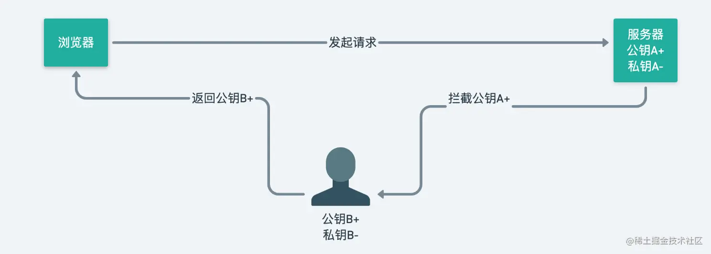

4、浏览器收到`公钥B+ `之后，生成`密钥X`，然后通过`公钥B+`对`密钥X`进行加密，之后传给服务器；

5、中间人挟持到浏览器上传的数据，通过自己的`私钥B- `对数据进行解密，得到`宓钥X`（因为`私钥X`是通过`公钥B+`加密的，所以中间人可以解密），接着，再用刚刚挟持到的`公钥 A+`对`密钥X`进行加密，最后传输给服务器：

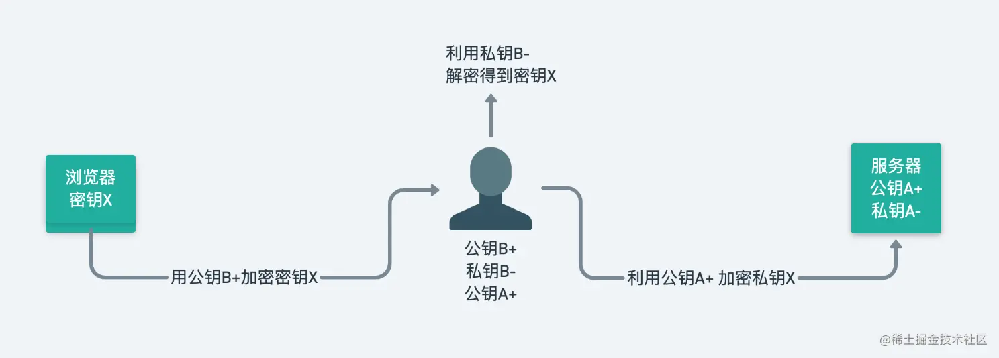

> 注意：此时中间人已经拿到了服务器的`公钥A+`和浏览器的`密钥X`

6、服务器收到中间人的数据，用`私钥A-`解密，得到`密钥X`

接下来浏览器和服务器通信的内容，都能被中间人窃取到，因为他拿到了`密钥X`。

通过这样的方式，中间人在浏览器和服务器都不知情的情况下，拿到了`密钥X`，好一招`偷梁换柱`啊！

那这样看来，`非对称加密 + 对称加密` 是不是也不行了？

## 数字证书

上文说到，`非对称加密`+`对称加密`也是有被挟持破解的风险的，中间人通过一招`偷梁换柱`拿到了`密钥X`，且通信双方都不知道`密钥X`已经泄漏。我们先来分析一下，他之所以能拿到`密钥X`的原因是什么？我们看上面👆的第 3 步：

```
中间人挟持到 公钥A+ 之后，给浏览器返回自己的 公钥B+
```

看出来了吗？问题就出现在这，浏览器根本无法确认自己收到的`公钥`是否是目标网站的`公钥`，就是因为这一点，中间人返回了自己的`公钥B+`，但是浏览器傻傻的以为这就是目标服务器提供的`公钥`哇。

为了解决这个问题，就用到了`数字证书`，那什么又是`数字证书`呢？

在这里，我先问大家一个问题，你如何证明你就是你自己？比如张三，张三如何向别人证明自己就是张三呢？很简单嘛，用身份证不就行了嘛，对的，就是利用`身份证`。我们的国家政府会给每个合法公民颁发一个`身份证`，有了这个身份证，我们在办事的时候就能用它来证明自己的身份，国家说你是张三，其他人还敢怀疑吗？

那有趣的事情就来了，我们能不能给一个网站颁发一个`身份证`呢？

答案当然是肯定的了，说到这里，相信你已经明白了：`数字证书`其实就是网站的`身份证`哇!

那谁来给网站颁发`身份证`呢？

世界上有一个神秘的组织：**CA机构** 。就是它会给网站颁发`身份证`。当某个网站想要启用`HTTPS`协议的时候，需要向`CA机构`申请一份`证书`，这个`证书`就是`数字证书`。

`数字证书`包括了证书持有者信息、公钥和有效期等等信息。

有了这个证书之后，当浏览器向目标网站服务器发起请求时，服务器只需要把`数字证书`返回给浏览器就行了。因为是目标网站有`数字证书`，如同身份证一样，那浏览器就可以认为，返回数据给我的，就是这个网站。

你是不是以为这样就完了？

这里又产生了一个问题，在证书本身传输的过程中，万一被中间人挟持并修改了咋办？

是不是有一种套娃的感觉，哈哈，没事儿，现在我们离目标越来越近了，解决了这个问题，咱们就大获全胜了。

## 数字签名

我们再来看看上面那个问题：在证书本身传输的过程中，万一被中间人挟持并修改了咋办？咱们换个思路。 他想改就让他改呗，咱们只要在浏览器端再校验一下证书的可靠性，不就行了吗？

于是乎，`数字签名`登场了。说到签名，大家肯定都知道，签名嘛，在日常生活中，就是用一支笔，在一张纸上面进行签名。其实咱们的数字签名也是一样的。简单来说，我们可以理解为就是：CA机构在给网站颁发证书之前，在这份证书上面`签个名`。接下来我们来看看到底是如何签名的：

假设CA机构有一套非对称加密的 `公钥A+` 和 `私钥A-`

1、网站向CA机构申请颁发数字证书；

2、CA机构通过审核之后，会生成一份证书数据（此时为明文，内容包括：证书持有者信息、网站公钥、和有效期等）；

3、利用散列函数对证书的明文数据进行`Hash`处理，生成一份`数据摘要`；

> 注意：这里利用散列函数加密的方式叫做：摘要算法。
>
> 摘要算法是一种单向的加密算法，也称为 “散列算法”，在加密数据时不需要提供密钥，加密之后的数据也不能进行逆向推算。
>
> 它能实现对一个大文件加密之后映射为一个小文件，好比一篇文章提取一段摘要，但如果原文发生改变，哪怕是增加或删除一个标点符号再次加密后的结果也会发生完全不同的变化，目前一些常用的摘要算法（MD5、SHA-1）被认为存在安全性问题，在 TLS 1.3 版本已经移除了，现在推荐的是 SHA-2，例如 SHA256。

4、接着利用`私钥A-`对这份`数据摘要`进行加密，得到`数字签名`；

5、将`证书明文数据` + `数字签名` 合并到一起，组成完整的`数字证书`;

5、将这份`数字证书`颁发给对应的网站。

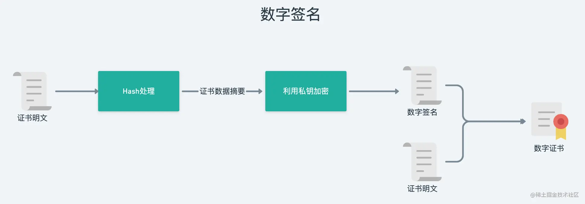

通过上面的步骤我们可以知道，其实`数字签名`就是**CA机构利用自有的一套非对称的私钥对证书数据进行加密之后的数据**。

> 这里需要注意的是，通常我们使用公钥加密，用私钥解密。而在数字签名中，我们使用私钥加密（相当于生成签名），公钥解密（相当于验证签名）。

不知你有没有发现，上面的第3个步骤：

```
利用散列函数对证书的明文数据进行 Hash 处理，生成一份数据摘要
```

其实不是必须的，因为实际上，我们只需要对证书的明文数据进行签名就可以了，为什么这里我们还需要对明文数据先进行`Hash`处理呢？

这是因为，一般来说，一份证书的内容比较冗长，加之非对称加密也非常耗时，所以直接对原文签名，很耗时。其实CA机构签名的时候花的时间长也就罢了，但是在浏览器验证的时候，那就很痛苦了。这时候，我们就可以用散列函数对原数据进行`Hash`，得到短一些的`数据摘要`，然后再对`数据摘要`进行签名就可以了。

那么现在我们有了`数字签名`加持的`数字证书`，浏览器在接收到的时候，如何进行验证呢？

> 需要注意的是，我们的浏览器已经预存了CA机构的`公钥`，这把公钥的作用就是用来解锁`数字签名`的。

1、浏览器向目前网站服务器发起请求；

2、目标服务器把`数字证书`返回给浏览器（包括证书明文数据 + 数字签名）；

3、浏览器拿到`数字证书`之后，先拿到`签名`，利用浏览器预存的CA机构的公钥，对`签名`进行解密，解密之后得到一份`数据摘要`（假设叫`T`），接着利用证书里面提供的`Hash算法`对`明文数据`进行`Hash`，又得到一份数据摘要（假设叫`S`）。此时，如果 `T`=`S` ，那浏览器认为这份证书就是有效的，否则无效。

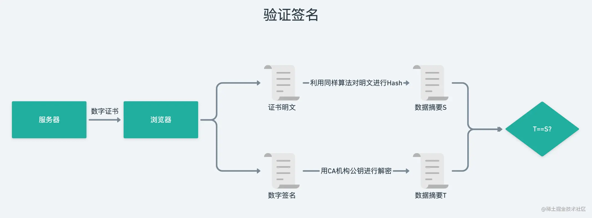

可能到这里，你一下子没转过弯来，把纸和笔拿出来，捋一捋，多看几遍，肯定能懂。

也许你还有疑问，为什么有了`数字签名`，就能校验`数字证书`是否被修改过呢？ 我们来试一试吧：

1、浏览器向目前网站服务器发起请求；

2、目标服务器把`数字证书`返回给浏览器（包括证书明文数据 + 数字签名）；

3、中间人挟持了`数字证书`，并修改了`数字证书`，接着他返回了修改之后的`数字证书`给浏览器；

4、浏览器开始验证，对证书数据（这份数据是被修改过的）进行hash，得到一份数据摘要，然后用公钥解密之后也得到一份数据摘要，两份一对比，发现两份数据摘要对不上，显然是不安全的，于是停止了通信。

> 此处有两个值得说明的地方：
>
> 1. 浏览器需要存储所有 HTTPS 协议网站对应的 CA 公钥么？
>
>    不需要，他只需要存储 CA 机构的公钥就行了。因为 HTTPS 网站的数量是不确定的，但是 CA 机构的数量却是确定的。
>
> 2. 中间人不可以先修改明文数据，再把明文数据 Hash 处理并替换原来的 Hash，最终浏览器收到的明文与 Hash 值不就还是一样吗？
>
>    不可以，因为 Hash 之后还需要加密，而中间人是没有密钥来进行加密的。

> 我们在浏览器打开一个 HTTPS 协议的网址发起请求，在建立 TCP 链接之后，会发起 TLS 的握手协议，之后服务器会返回一系列消息，其中就包括证书消息。
>
> 证书的验证存在一个证书信任链问题，我们向 CA 申请的证书，通常是由中间证书机构颁发的。例如，www.nodejs.red 这个域名你会看到它的证书签发者是 “R3”，它是 Let's Encrypt 在 2020 年 11 月 20 日推出的一个免费证书，通过 R3 我们可以找到它的签发者是 “ISRG Root X1”，而 “ISRG Root X1” 没有了上级的签发者，现在会认为它是根证书。
>
> 下图展示的是 www.nodejs.red 这个域名网站的证书链关系。
>
> 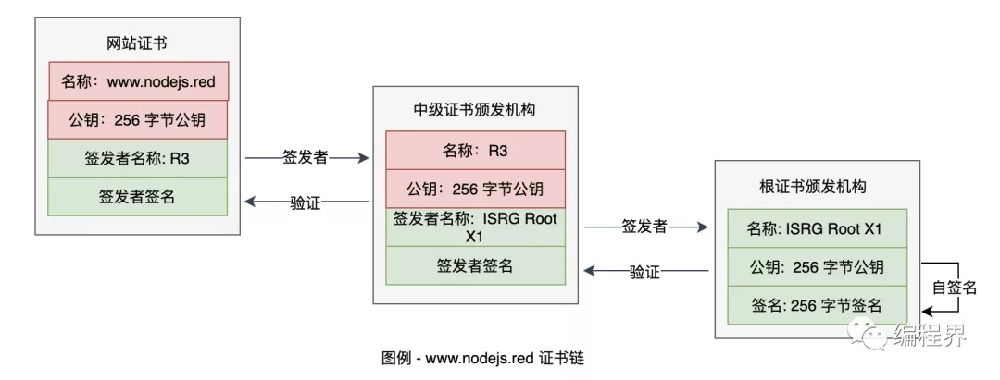
>
> 在我们的操作系统中会预先安装一些权威机构的证书，浏览器信任的是根证书，如果根证书在本地，就用根证书 “ISRG Root X1” 公钥去验证 “ISRG Root X1” 这个中间证书机构是否可信，如果校验通过，再用 “ISRG Root X1” 去验证最终的实体证书 “www.nodejs.red” 是否可信任，如果通过就认为证书 “www.nodejs.red” 是可信的。
>
> 证书验证基本上都是这种模式，最终要找到本地安装的根证书，在反向的逐级验证，确认网站的签发者是可信的。如下图所示。
>
> 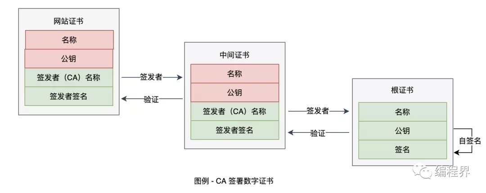
>
> 另一个问题，假设：“我们的证书被黑客用合法证书调包呢?”，证书的域名等信息是不能被篡改的，就算黑客调包换成了自己的合法证书，因为域名信息不一样，浏览器请求的时候一对比也可发现问题。
>
> 没有绝对的安全，如果黑客把自己的根证书安装在了你的计算机上，那么它就可以签发任意域名的虚假证书了，因此，遇到一些不可信的文件还是不要乱安装的好，保证根证书的安全。

## HTTPS完整的工作流程

其实看完了上面这些内容，我相信你已经对`HTTPS`有了一个完完整整的认识，接下来，就让我们一起来总结一下，`HTTPS`完整的工作流程吧。

假设现在CA机构有一套非对称加密的`公钥A+` 和 `私钥A-`（浏览器会预存`公钥A+`）

目标服务器也有一套非对称加密的`公钥B+` 和 `私钥B-`

1、浏览器向服务器发起请求；

2、目标服务器收到请求，将`数字证书`返回给浏览器（包括`公钥B+` + 数字签名）；

3、浏览器收到证书之后，先取到`签名`，利用浏览器预存的CA机构的`公钥A+`，对`签名`进行解密，解密之后得到一份`数据摘要`（假设叫`T`），接着利用证书里面提供的`Hash算法`对`明文数据`进行`Hash`，又得到一份数据摘要（假设叫`S`）。此时，如果 `T`=`S` ，那认为这份证书就是有效的。有效则进行下一步，否则直接断开连接；

4、浏览器从证书里面取出目标网站的`公钥B+`，然后在本地生成一个密钥`X`，接着利用`公钥B+ `对密钥`X`进行加密，加密之后传输给服务器；

5、服务器收到数据，利用`私钥B-`对数据进行解密，拿到浏览器生成的密钥`X`；

6、之后双方的通信，都用密钥`X`加密之后进行。

现在，你也能完整的说出这个过程吗？

## 为什么不是所有的网站都用HTTPS？

既然 HTTPS 这么安全，为什么还是有很多网站没有启用 HTTPS 呢？

- 买证书要钱哇😄

数字证书是 CA 机构颁发的，但是天下没有免费的午餐，你想要他给你颁发证书，你就得付出一定的金钱。

- 部署、运维比 HTTP 更复杂

对于一个企业或者公司来说，能省成本，那就省成本，选用 HTTPS 之后，人力也会花费一定资源。

- 某些地区或者地域，网络安全意识淡泊，对于加密不加密，压根儿不关心。

## HTTPS 完整过程图示

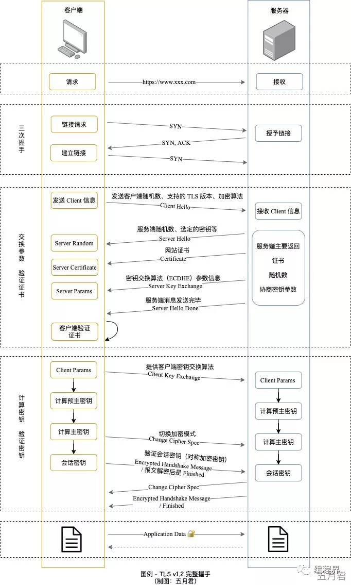

