# 一文看懂抓包

> 基于 [Wireshark](https://www.wireshark.org/) 抓包工具。

## 一、初始抓包

今天用 postman 发了个请求

```
GET http://www.flashhost.com/check
```

只返回了一个字符串

```
success
```

整个过程的网络包，用 wireshark 全都抓下来了

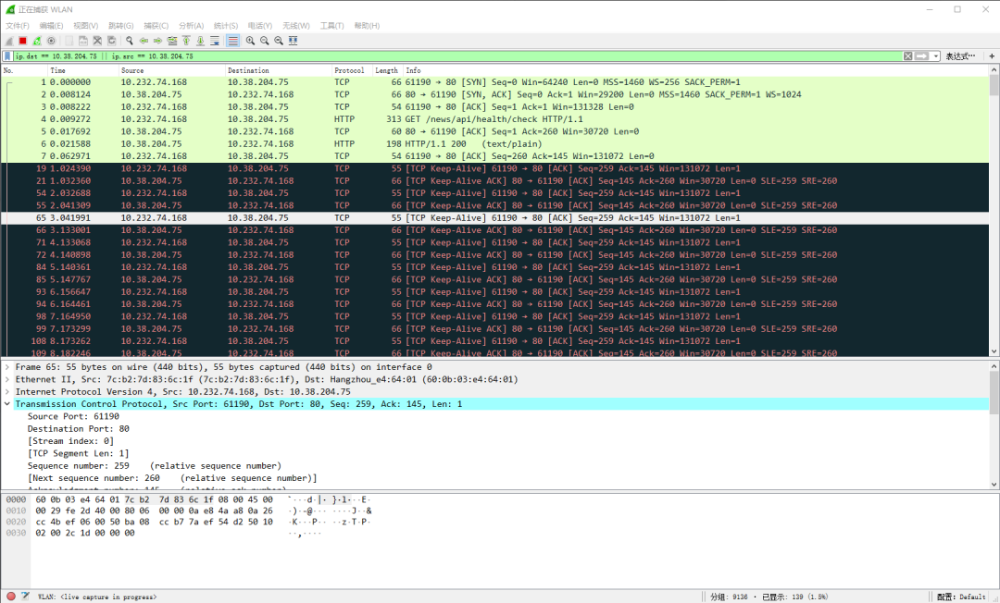

用简单的方式写在下面就是这个样子滴

A 和 B 分别代表我本机的 IP 和远程服务的 IP 地址

【三次握手】

A->B  TCP  [SYN]

A<-B  TCP  [SYN,ACK]

A->B  TCP  [ACK]

【HTTP 请求】

A->B  HTTP GET / HTTP/1.1

A<-B  TCP  [ACK]

A<-B  HTTP 200(text/plain)

A->B  TCP  [ACK]

【Keep-Alive】

A->B  TCP  [TCP Keep-Alive]

A<-B  TCP  [TCP Keep-Alive ACK]

A->B  TCP  [TCP Keep-Alive]

A<-B  TCP  [TCP Keep-Alive ACK]

……（几分钟后）

A->B  TCP  [TCP Keep-Alive]

A<-B  TCP  [TCP Keep-Alive ACK]

【四次挥手】

A<-B  TCP  [FIN,ACK]

A->B  TCP  [ACK]

A->B  TCP  [FIN,ACK]

A<-B  TCP  [ACK]

---

这么多包，我看心情点开了 A->B 发送的第一个 HTTP 协议的包

**A->B  HTTP GET / HTTP/1.1**

在 wireshark 里查看它的详情

aa aa aa aa aa aa bb bb bb bb bb bb 08 00 45 00 01 1d 6d 7e 40 00 80 06 00 00 c0 a8 1f a4 6e f2 44 04 db 08 00 50 2c 85 bd c9 05 ae c5 63 50 18 02 02 94 52 00 00 47 45 54 20 63 68 65 63 6b 20 48 54 54 50 2f 31 2e 31 0d 0a 0d 0a

没错，这一长串用 16 进制表示的数据，就是从**网卡**直接发出去的数据，一个字节都没有省略

来，我们拆包！

**【数据链路层】**

**aa aa aa aa aa aa bb bb bb bb bb bb 08 00** 45 00 01 1d 6d 7e 40 00 80 06 00 00 c0 a8 1f a4 6e f2 44 04 db 08 00 50 2c 85 bd c9 05 ae c5 63 50 18 02 02 94 52 00 00 47 45 54 20 63 68 65 63 6b 20 48 54 54 50 2f 31 2e 31 0d 0a 0d 0a

最开头是**数据链路层**，使用的协议是 **Ethernet 以太网协议**，协议格式如下：

- **原地址（6字节）**：aa aa aa aa aa aa（mac地址）
- **目标地址（6字节）**：bb bb bb bb bb bb（mac地址）
- **类型（2字节）**：08 00（ipv4）
- **数据**：45 00 01 ... ... ...

原地址和目标地址其实是 **mac 地址**，这里我用了假的，怕你们人肉我哈哈

类型是指其**上一层**，也就是后面的数据部分的**协议类型**，这里的 80 00 指的是 **IP 协议**（ipv4）

后面对于数据链路层来说，就是一堆数据了，它不关心是什么

**【网络层】**

我们把数据链路层去掉，也就相当于 **拆包**

aa aa aa aa aa aa bb bb bb bb bb bb 08 00 **45 00 01 1d 6d 7e 40 00 80 06 00 00 c0 a8 1f a4 6e f2 44 04** db 08 00 50 2c 85 bd c9 05 ae c5 63 50 18 02 02 94 52 00 00 47 45 54 20 63 68 65 63 6b 20 48 54 54 50 2f 31 2e 31 0d 0a 0d 0a

拆包后的开头部分就是**网络层**，使用的协议当然就是上面数据链路层指定的 **IP 协议**，它的数据格式如下：

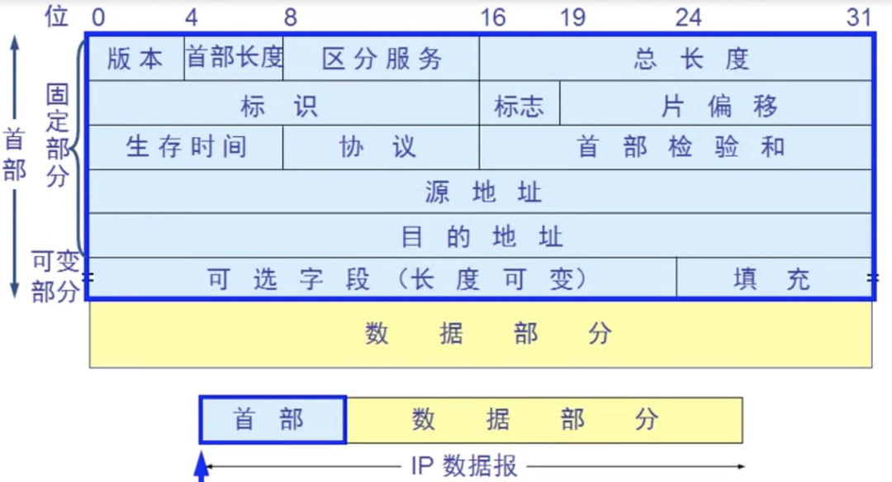

信息太多，只提取几个关键的信息

- **协议**：06（TCP）
- **源地址**：c0 a8 1f a4（IP地址：192.168.31.164）
- **目的地址**：6e f2 44 04（IP地址：110.242.68.4）
- **数据**：db 08 00 50 ... ... ...

其实和上面数据链路层的分析过程一样，关键信息还是这些，协议表示上一层也就是数据部分的协议是 TCP 协议，源地址和目的地址不再是 mac，在网络层就表示 IP 地址了。

这里的地址为啥不用假的呢？因为源地址是我局域网的地址你知道了也没用，目的地址是百度，哈哈你去人肉吧~

收~

我们接着拆……

**【传输层】**

再次去掉网络层的 IP 协议的首部

aa aa aa aa aa aa bb bb bb bb bb bb 08 00 45 00 01 1d 6d 7e 40 00 80 06 00 00 c0 a8 1f a4 6e f2 44 04 **db 08 00 50 2c 85 bd c9 05 ae c5 63 50 18 02 02 94 52 00 00** 47 45 54 20 63 68 65 63 6b 20 48 54 54 50 2f 31 2e 31 0d 0a 0d 0a

剩下的开头部分，就到了**数据传输层**，由于在网络层中已经指出，其上一层的数据部分是 **TCP 协议**，所以接下来用 TCP 协议的格式来分析就好了


TCP 协议大家都知道，超级多的细节，这里不展开，仍然提取关键信息，走主流程

- **源端口**：db 08（端口号：56072）
- **目的端口**：00 50（端口号：80）
- **数据**：47 45 54 20 ... ..

这里的 **源** 和 **目的** 不再是 mac 地址，也不再是 IP 地址了，因为此时包已经到达了目标机器，需要找具体对应的进程，所以这里是**端口号**。

同样由于进程自己知道将以什么样的协议，来解读数据部分，所以这里也没有上层协议的指定，因为这已经是应用程序的事了。

我们接着拆……

**【应用层】**

再次去掉传输层的 TCP 协议的首部

aa aa aa aa aa aa bb bb bb bb bb bb 08 00 45 00 01 1d 6d 7e 40 00 80 06 00 00 c0 a8 1f a4 6e f2 44 04 db 08 00 50 2c 85 bd c9 05 ae c5 63 50 18 02 02 94 52 00 00 **47 45 54 20 63 68 65 63 6b 20 48 54 54 50 2f 31 2e 31 0d 0a 0d 0a**

就来到了我们最熟悉的**应用层**，使用的协议是什么呢？因为我知道我请求的服务是提供 HTTP 协议的 web 服务，同时我发送的也是 HTTP 协议的数据，所以使用的协议当然就是 HTTP 协议啦~

- **请求行**：47 ... 0a（GET /check HTTP/1.0 \r\n）
- **请求头**：无
- **请求体**：无
- **最后**：0d 0a（\r\n）

难怪熟悉，只看结构确实简单，且容易理解，都可以转换成字符来解读。

今天没做什么，就是拆了个包

其实我手动拆包的过程，也是各种硬件或软件拆包的过程，就是将**数据的指针不断往后移动**而已。

然后每一层都有不同的**协议**来解读，刚刚上述过程的协议，只是我向一个提供 http 协议的 web 服务器发请求所用到的各层协议，不过这也是最常见的了，所以今天就简单带你抓个包梳理下。

## 二、WireShark的使用

WireShark 是一个网络封包分析软件。网络封包分析软件的功能是撷取网络封包，并尽可能显示出最为详细的网络封包资料。Wireshark 使用 WinPCAP 作为接口，直接与网卡进行数据报文交换。在网络封包和流量分析领域有着十分强大功能的工具，深受各类网络工程师和网络分析师的喜爱。

本文主要内容包括：

> 1、Wireshark 主界面介绍。
>
> 2、WireShark 简单抓包示例。通过该例子学会怎么抓包以及如何简单查看分析数据包内容。
>
> 3、Wireshark 过滤器使用。通过过滤器可以筛选出想要分析的内容。包括按照协议过滤、端口和主机名过滤、数据包内容过滤。

我们首先来介绍一下 Wireshark 这款软件：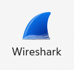

首先我们先认识一下这个软件的主界面是长这样的：

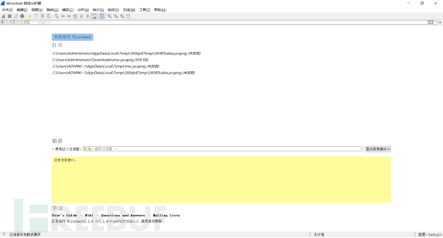

在这个界面中为 Wireshark 的主界面

选择菜单栏上 Capture -> Option，勾选 WLAN 网卡（这里需要根据各自电脑网卡使用情况选择，简单的办法可以看使用的 IP 对应的网卡）。点击 Start，启动抓包。

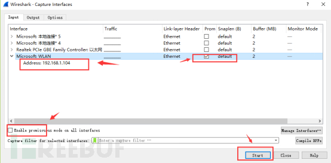

wireshark 启动后，wireshark 处于抓包状态中。

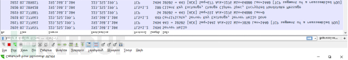

4、执行需要抓包的操作，如 `ping www.baidu.com`。

5、操作完成后相关数据包就抓取到了。为避免其他无用的数据包影响分析，可以通过在过滤栏设置过滤条件进行数据包列表过滤，获取结果如下。说明：`ip.addr == 119.75.217.26 and icmp` 表示只显示 ICPM 协议且源主机 IP 或者目的主机 IP 为 119.75.217.26 的数据包。

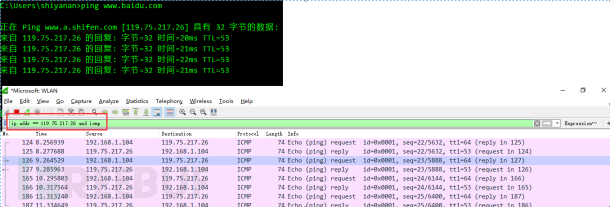

5、wireshark 抓包完成，就这么简单。关于 wireshark 过滤条件和如何查看数据包中的详细内容在后面介绍。

**【Wireshakr 抓包界面】**

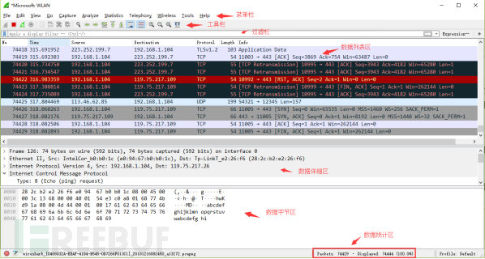

说明：数据包列表区中不同的协议使用了不同的颜色区分。协议颜色标识定位在菜单栏 View --> Coloring Rules，如下所示：

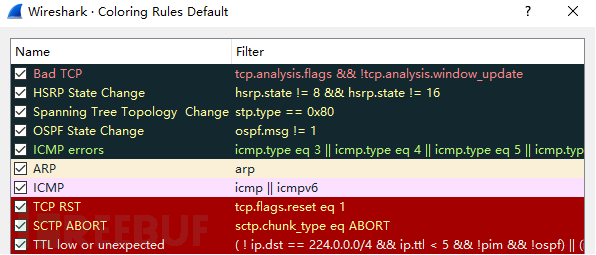

**【WireShark 主要分为这几个界面】**

1. Display Filter（显示过滤器）， 用于设置过滤条件进行数据包列表过滤。菜单路径：Analyze --> Display Filters。

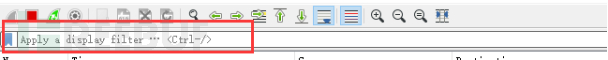

1. Packet List Pane（数据包列表）， 显示捕获到的数据包，每个数据包包含编号，时间戳，源地址，目标地址，协议，长度，以及数据包信息。 不同协议的数据包使用了不同的颜色区分显示。

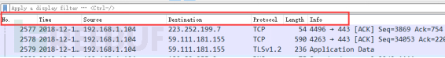

1. Packet Details Pane（数据包详细信息），在数据包列表中选择指定数据包，在数据包详细信息中会显示数据包的所有详细信息内容。数据包详细信息面板是最重要的，用来查看协议中的每一个字段。各行信息分别为：

（1）Frame：物理层的数据帧概况

（2）Ethernet II：数据链路层以太网帧头部信息

（3）Internet Protocol Version 4：互联网层 IP 包头部信息

（4）Transmission Control Protocol：传输层的数据段头部信息，此处是 TCP

（5）Hypertext Transfer Protocol：应用层的信息，此处是 HTTP 协议

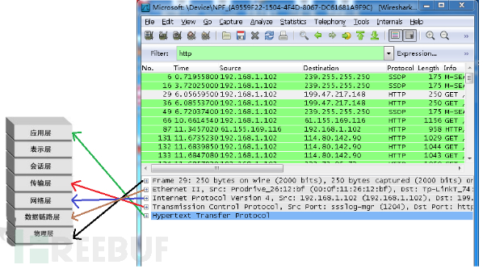

**【TCP 包的具体内容】**

从下图可以看到wireshark捕获到的TCP包中的每个字段。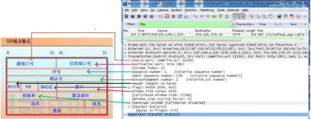

**【Wireshark 过滤器设置】**

初学者使用 wireshark 时，将会得到大量的冗余数据包列表，以至于很难找到自己自己抓取的数据包部分。wireshark 工具中自带了两种类型的过滤器，学会使用这两种过滤器会帮助我们在大量的数据中迅速找到我们需要的信息。

（1）抓包过滤器

捕获过滤器的菜单栏路径为 Capture --> Capture Filters，用于在抓取数据包前设置。

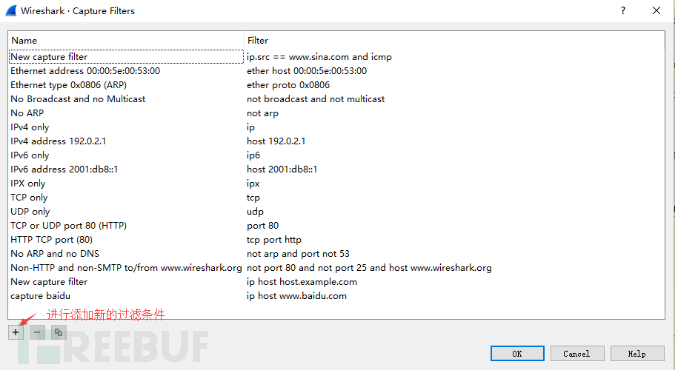

如何使用？可以在抓取数据包前设置如下。

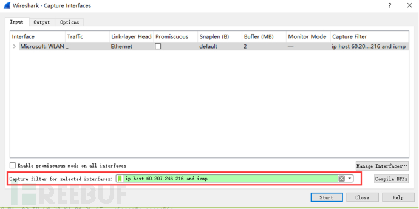

`ip host 60.207.246.216 and icmp` 表示只捕获主机 IP 为 60.207.246.216 的 ICMP 数据包。获取结果如下：

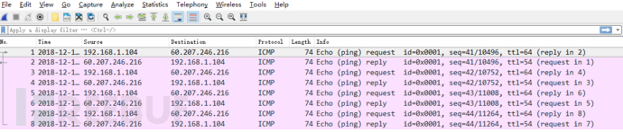

（2）显示过滤器

显示过滤器是用于在抓取数据包后设置过滤条件进行过滤数据包。通常是在抓取数据包时设置条件相对宽泛，抓取的数据包内容较多时使用显示过滤器设置条件顾虑以方便分析。同样上述场景，在捕获时未设置捕获规则直接通过网卡进行抓取所有数据包，如下：

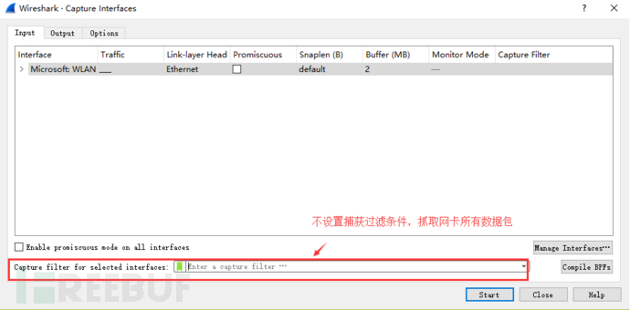

执行 `ping www.huawei.com` 获取的数据包列表如下：

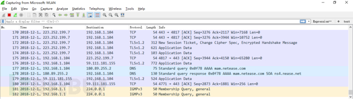

观察上述获取的数据包列表，含有大量的无效数据。这时可以通过设置显示器过滤条件进行提取分析信息。

`ip.addr == 211.162.2.183 and icmp` 并进行过滤。


上述介绍了抓包过滤器和显示过滤器的基本使用方法。在组网不复杂或者流量不大情况下，使用显示器过滤器进行抓包后处理就可以满足我们使用。下面介绍一下两者间的语法以及它们的区别。

**【wireshark 过滤器表达式的规则】**

1、抓包过滤器语法和实例

抓包过滤器类型 Type（host、net、port）、方向 Dir（src、dst）、协议 Proto（ether、ip、tcp、udp、http、icmp、ftp等）、逻辑运算符（&& 与、|| 或、！非）

（1）协议过滤

比较简单，直接在抓包过滤框中直接输入协议名即可。

TCP，只显示 TCP 协议的数据包列表

HTTP，只查看 HTTP 协议的数据包列表

ICMP，只显示 ICMP 协议的数据包列表


（2）IP过滤

`host 192.168.1.104`

`src host 192.168.1.104`

`dst host 192.168.1.104`

（3）端口过滤

`port 80`

`src port 80`

`dst port 80`

（4）逻辑运算符 && 与、|| 或、！非

`src host 192.168.1.104 && dst port 80` 抓取主机地址为 192.168.1.80、目的端口为 80 的数据包

`host 192.168.1.104 || host 192.168.1.102` 抓取主机为 192.168.1.104 或者 192.168.1.102 的数据包

`!broadcast` 不抓取广播数据包

2、显示过滤器语法和实例

（1）比较操作符

比较操作符有 == 等于、！= 不等于、> 大于、< 小于、>= 大于等于、<=小于等于。

（2）协议过滤

比较简单，直接在Filter框中直接输入协议名即可。**注意：协议名称需要输入小写。**

tcp，只显示 TCP 协议的数据包列表

http，只查看 HTTP 协议的数据包列表

icmp，只显示 ICMP 协议的数据包列表

（3） ip过滤

`ip.src ==192.168.1.104` 显示源地址为 192.168.1.104 的数据包列表

`ip.dst==192.168.1.104` 显示目标地址为 192.168.1.104 的数据包列表

`ip.addr == 192.168.1.104` 显示源 IP 地址或目标 IP 地址为 192.168.1.104 的数据包列表

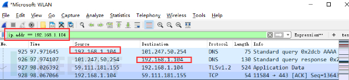

（4）端口过滤

`tcp.port ==80` 显示源主机或者目的主机端口为 80 的数据包列表。

`tcp.srcport == 80` 只显示 TCP 协议的源主机端口为 80 的数据包列表。

`tcp.dstport == 80` 只显示 TCP 协议的目的主机端口为 80 的数据包列表。

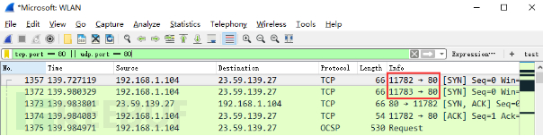

（5） Http 模式过滤

`http.request.method=="GET"`,  只显示 HTTP GET 方法的。

（6）逻辑运算符为 and/or/not

过滤多个条件组合时，使用 and/or。比如获取 IP 地址为 192.168.1.104 的 ICMP 数据包表达式为 `ip.addr == 192.168.1.104 and icmp`

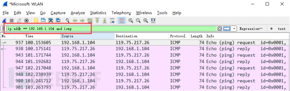

（7）按照数据包内容过滤。假设我要以 IMCP 层中的内容进行过滤，可以单击选中界面中的码流，在下方进行选中数据。如下：


右键单击选中后出现如下界面

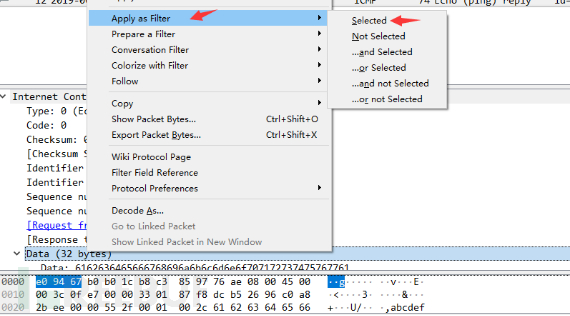

选中 Select 后在过滤器中显示如下

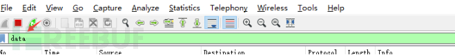

后面条件表达式就需要自己填写。如下我想过滤出 data 数据包中包含 "abcd" 内容的数据流。包含的关键词是 contains 后面跟上内容。

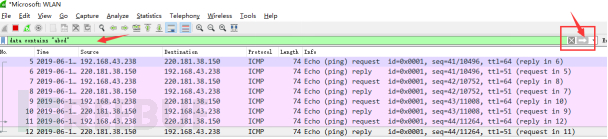

看到这， 基本上对 wireshak 有了初步了解。

**【Wireshark 抓包分析 TCP 三次握手】**

（1）TCP三次握手连接建立过程

Step1：客户端发送一个 SYN=1，ACK=0 标志的数据包给服务端，请求进行连接，这是第一次握手；

Step2：服务端收到请求并且允许连接的话，就会发送一个 SYN=1，ACK=1 标志的数据包给发送端，告诉它，可以通讯了，并且让客户端发送一个确认数据包，这是第二次握手；

Step3：服务端发送一个 SYN=0，ACK=1 的数据包给客户端端，告诉它连接已被确认，这就是第三次握手。TCP 连接建立，开始通讯。

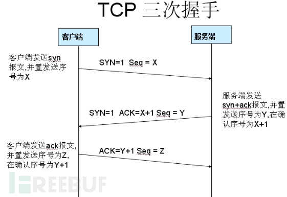

（2）wireshark 抓包获取访问指定服务端数据包

Step1：启动 wireshark 抓包，打开浏览器输入 `www.huawei.com`。

Step2：使用 `ping www.huawei.com` 获取 IP。

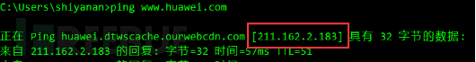

Step3：输入过滤条件获取待分析数据包列表 `ip.addr == 211.162.2.183`

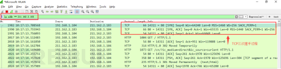

图中可以看到 wireshark 截获到了三次握手的三个数据包。第四个包才是 HTTP 的， 这说明 HTTP 的确是使用 TCP 建立连接的。

**【第一次握手数据包】**

客户端发送一个 TCP，标志位为 SYN，序列号为 0， 代表客户端请求建立连接。 如下图。

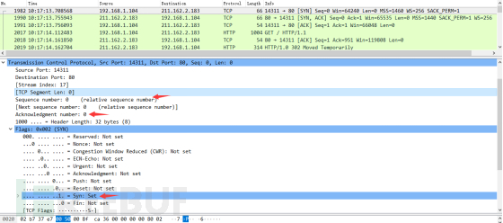

数据包的关键属性如下：

SYN：标志位，表示请求建立连接

Seq = 0：初始建立连接值为 0，数据包的相对序列号从 0 开始，表示当前还没有发送数据

Ack =0：初始建立连接值为 0，已经收到包的数量，表示当前没有接收到数据

**【第二次握手的数据包】**

服务器发回确认包，标志位为 SYN, ACK 将确认序号（Acknowledgement Number）设置为客户的 ISN 加 1 即 0+1=1，如下图

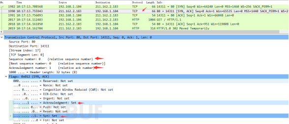

数据包的关键属性如下：

[SYN + ACK]: 标志位，同意建立连接，并回送SYN+ACK

Seq = 0：初始建立值为 0，表示当前还没有发送数据

Ack = 1：表示当前端成功接收的数据位数，虽然客户端没有发送任何有效数据，确认号还是被加 1，因为包含 SYN 或 FIN 标志位。（并不会对有效数据的计数产生影响，因为含有 SYN 或 FIN 标志位的包并不携带有效数据）

**【第三次握手的数据包】**

客户端再次发送确认包（ACK）SYN 标志位为 0,ACK 标志位为 1。并且把服务器发来 ACK 的序号字段+1，放在确定字段中发送给对方。并且在数据段放写 ISN 的 +1, 如下图:

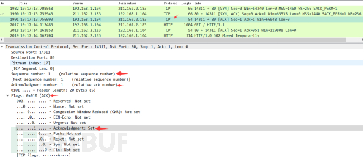

数据包的关键属性如下：

ACK ：标志位，表示已经收到记录

Seq = 1 ：表示当前已经发送1个数据

Ack = 1 : 表示当前端成功接收的数据位数，虽然服务端没有发送任何有效数据，确认号还是被加 1，因为包含 SYN 或 FIN 标志位（并不会对有效数据的计数产生影响，因为含有 SYN 或 FIN 标志位的包并不携带有效数据)。

就这样通过了 TCP 三次握手，建立了连接。开始进行数据交互

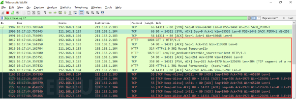

下面针对数据交互过程的数据包进行一些说明：

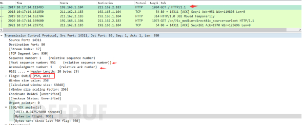

数据包的关键属性说明

Seq: 1

Ack: 1：说明现在共收到1字节数据

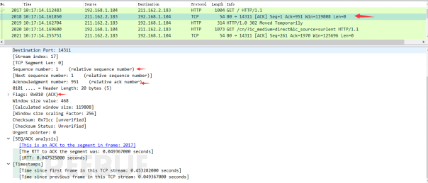

Seq: 1
Ack: 951：说明现在服务端共收到 951 字节数据

在 TCP 层，有个 FLAGS 字段，这个字段有以下几个标识：SYN, FIN, ACK, PSH, RST, URG。如下：

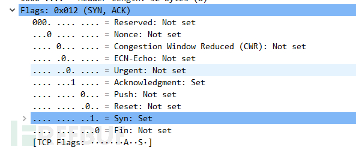

**其中，对于我们日常的分析有用的就是前面的五个字段。它们的含义是：SYN 表示建立连接，FIN 表示关闭连接，ACK 表示响应， PSH 表示有 DATA 数据传输，RST 表示连接重置。**

**【Wireshark 分析常用操作】**

调整数据包列表中时间戳显示格式。调整方法为 View -->Time Display Format --> Date and Time of Day。调整后格式如下：

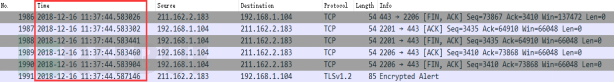

这些就是 WireShark 的常用操作了。

## 三、WireShark抓包分析

简述：本文介绍了抓包数据含义，有 TCP 报文、HTTP 报文、DNS 报文。

**【TCP 报文】**

TCP：（TCP 是面向连接的通信协议，通过三次握手建立连接，通讯完成时要拆除连接，由于 TCP 是面向连接的，所以只能用于点对点的通讯）源 IP 地址：发送包的 IP 地址；目的IP地址：接收包的 IP 地址；源端口：源系统上的连接的端口；目的端口：目的系统上的连接的端口。TCP 是因特网中的传输层协议，使用三次握手协议建立连接。当主动方发出 SYN 连接请求后，等待对方回答 SYN， ACK。这种建立连接的方法可以防止产生错误的连接，TCP 使用的流量控制协议是可变大小的滑动窗口协议。第一次握手：建立连接时，客户端发送 SYN 包（SEQ=x）到服务器，并进入 SYN_SEND 状态，等待服务器确认。第二次握手：服务器收到 SYN 包，必须确认客户的 SYN（ack=x+1），同时自己也送一个 SYN 包（SEQ=y），即 SYN+ACK 包，此时服务器进入 SYN_RECV 状态。第三次握手：客户端收到服务器的 SYN+ACK 包，向服务器发送确认包 ACK（ack=y+1）,此包发送完毕，客户端和服务器进入 Established 状态，完成三次握手。
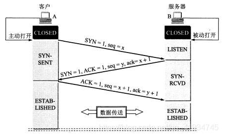

ACK：为 TCP 报文段首部中的 “ACK字段”，置 1 时该报文段为确认报文段。
ack：为 TCP 报文段首部中 “确认号字段” 的具体数值。ack=x+1 说明服务器希望客户端下次发来的报文段的第一个数据字节为 序号=x+1 的字节；ack=y+1 说明客户端希望服务器下次发来的报文段的第一个数据字节为 序号=y+1 的字节。

【1】封包详细信息：

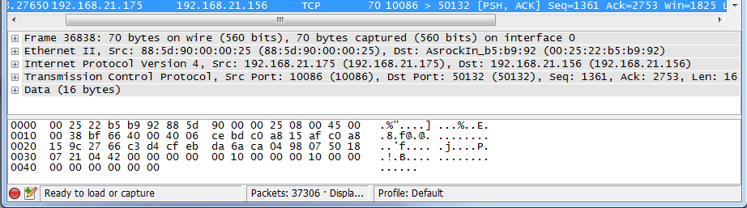

A. 第一行，帧 Frame 36838 指的是要发送的数据块，其中，所抓帧的序号为 36838，捕获字节数等于传送字节数：70字节；

B. 第二行，以太网，有线局域网技术，是数据链路层。源 Mac 地址为 88:5d:90:00:00:25；目标 Mac 地址为 00:25:22:b5:b9:92；

C. 第三行，IPV4 协议，也称网际协议，是网络层；源 IP 地址为 192.168.21.175；目标 IP 地址为 192.168.21.156；

D. 第四行，TCP 协议，也称传输控制协议，是传输层；源端口(10086)；目标端口(50132)；序列号(1361)；ACK 是 TCP 数据包首部中的确认标志，对已接收到的 TCP 报文进行确认，值为 1 表示确认号有效；长度为 16；

E. 第五行，数据共有 16 字节

【2】Frame 信息分析：

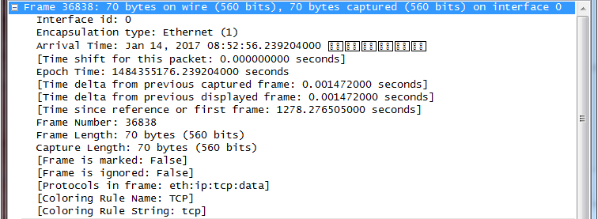

A. Arrival Time：到达时间，值为 Jan 14, 2017 08:52:56.239204000

B. EPoch Time：信息出现时间，值为 1484355176.239204000秒

C. [ Time delta from previous captured frame: 0.001472000 seconds] ：与之前捕获的数据帧时间差：0.001472000秒；

     [Time delta from previous displayed frame: 0.001472000 seconds]：与之前显示的帧时间差： 0.001472000秒；
    
     [Time since reference or first frame: 1278.276505000 seconds]：距参考帧或第一帧的时间差：1278.276505000秒；

D. Frame Number: 36838，帧编号为 36838；

E. Frame Length: 70 bytes (560 bits)，帧长度为 70 字节；

     Capture Length: 70 bytes (560 bits)，捕获到的长度为70字节；

F. [Frame is marked: False]，帧标记：无；

     [Frame is ignored: False]，帧被忽略：无；

G. [Protocols in frame: eth:ip:tcp:data]，协议帧：eth(以太网)、IP、tcp、data

H. [Coloring Rule Name: TCP]，色彩规则名称：TCP；

    [Coloring Rule String: tcp]，色彩规则字符串：TCP；
【3】Trasmission Control Protocol 信息分析

其中，对应的 TCP 首部的数据信息

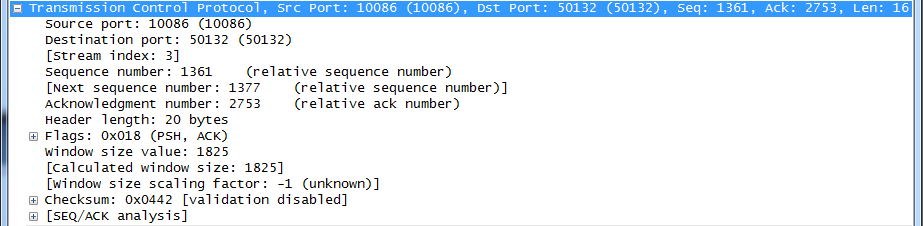

A. 端口号，数据传输的16位源端口号和16位目标端口号(用于寻找发端和收端应用进程)；

B. 相对序列号，该数据包的相对序列号为1361(此序列号用来确定传送数据的正确位置，且序列号用来侦测丢失的包)；下一个数据包的序列号是1377；

C. Acknowledgment number是32位确认序列号，值等于1表示数据包收到，确认有效；

D. 手动的数据包的头字节长度是20字节；

E. Flags，含6种标志；ACK：确认序号有效；SYN：同步序号用来发起一个连接；FIN：发端完成发送任务；RST：重新连接；PSH：接收方应该尽快将这个报文段交给应用层；URG：紧急指针(urgentpointer)有效；

F. window，TCP的流量控制由连接的每一端通过声明的窗口大小来提供。窗口大小为字节数，起始于确认序号字段指明的值，这个值是接收端正期望接收的字节。窗口大小是一个16bit字段，因而窗口大小最大为65536字节，上面显示窗口大小为1825字节；

G. Checksum，16位校验和，检验和覆盖了整个的TCP报文段，由发端计算和存储，并由收端进行验证；
【4】Data 信息分析

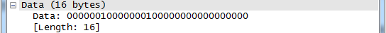

TCP 报文段中的数据（该部分是可选的），长度为 16 字节；

**【HTTP 报文】**

【1】封装包详细信息

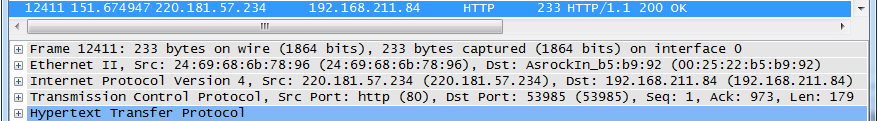

A. 第一行，帧Frame 12411 指的是要发送的数据块，其中，所抓帧的序号为12411，捕获字节数等于传送字节数：233字节；

B. 第二行，以太网，有线局域网技术，是数据链路层。源Mac地址为24:69:68:6b:78:96；目标Mac地址为00:25:22:b5:b9:92；

C. 第三行，IPV4协议，也称网际协议，是网络层；源IP地址为220.181.57.234；目标IP地址为192.168.21.156；

D. 第四行，TCP协议，也称传输控制协议，是传输层；源端口(80)；目标端口(53985)；序列号(1)；ACK是TCP数据包首部中的确认标志，对已接收到的TCP报文进行确认，值为1表示确认号有效；长度为179；

E. 第五行，Http协议，也称超文本传输协议，是应用层。
【2】HTTP 请求报文分析

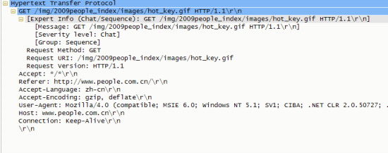

报文分析：

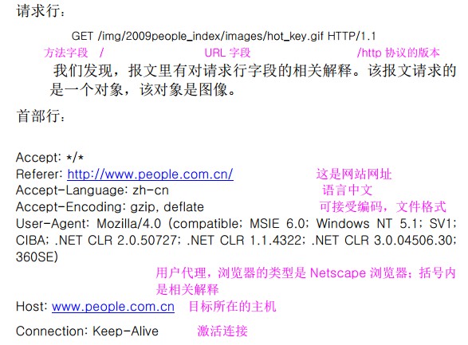

在抓包分析过程中还发现了另外一些 http 请求报文中所特有的首部字段名，比如下面 http 请求报文中橙黄色首部字段名：

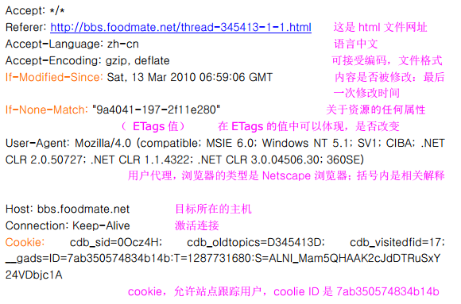

【3】HTTP 响应报文分析

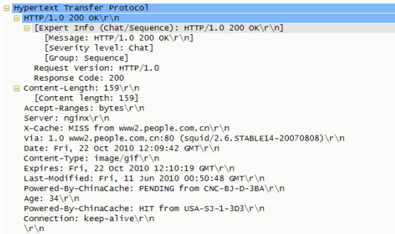

报文分析：

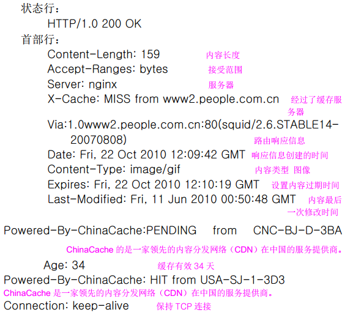

【DNS 报文】

【1】封包详细信息

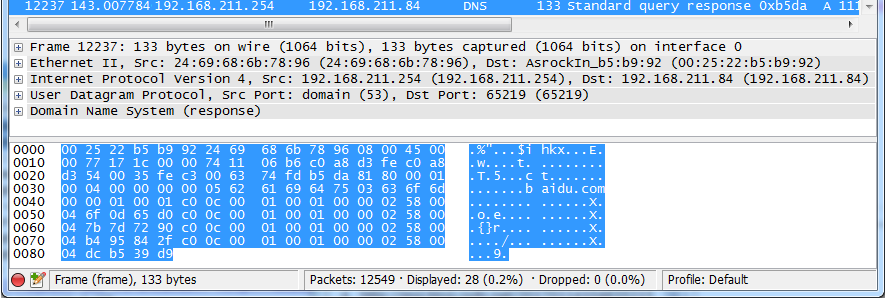

A. 第一行，帧Frame 12237 指的是要发送的数据块，其中，所抓帧的序号为12237，捕获字节数等于传送字节数：133字节；

B. 第二行，以太网，有线局域网技术，是数据链路层。源Mac地址为24:69:68:6b:78:96；目标Mac地址为00:25:22:b5:b9:92；

C. 第三行，IPV4协议，也称网际协议，是网络层；源IP地址为192.168.211.254；目标IP地址为192.168.211.84；

D. 第四行，UDP协议，是传输层；源端口domain(53)；目标端口(65219)；

E. 第五行，DNS协议，是应用层。

【2】 DNS 查询报文

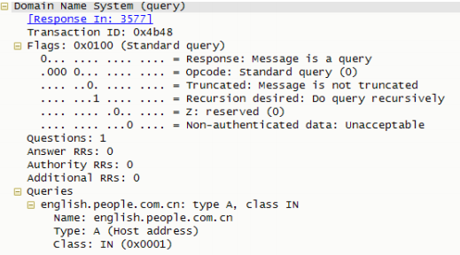

报文分析：

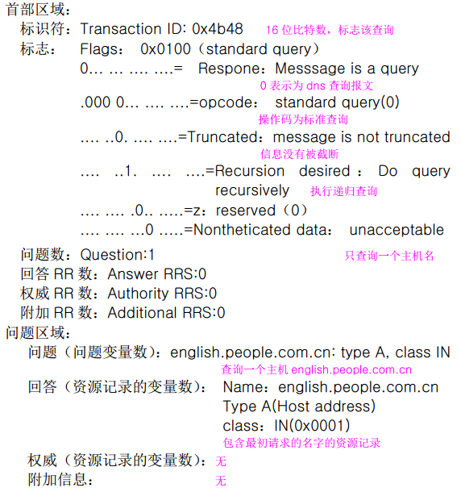

【3】DNS 响应报文

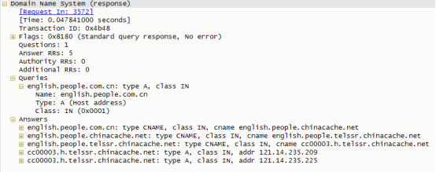

报文分析：


**【Ping】**


