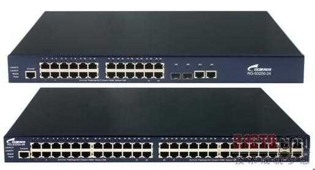
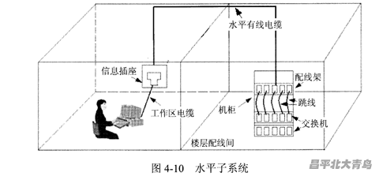
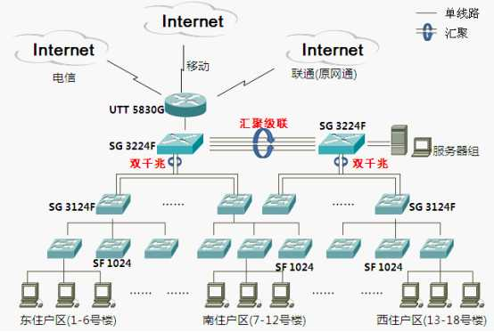
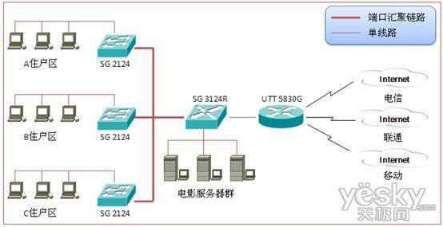

# 从源头讲起，宽带是如何接入家里的

> 作者：A4君
> 链接：https://www.zhihu.com/question/24418922/answer/29334799
> 来源：知乎
> 著作权归作者所有。商业转载请联系作者获得授权，非商业转载请注明出处。

这里主要介绍比较传统的方案。

让我们从上门安装师傅带进来的那根网线讲起……

这跟网线末端连接的是一台**交换机，**同时连接这台交换机的还有你的邻居们。这类直接面向用户连接的交换机我们称为**接入层交换机，**一般有 24 个端口，意味着可以提供 24 个用户的接入（当然每个用户可以额外购置无线路由器来实现多个终端的接入）。根据楼盘规模，这一台交换机负责的范围也不尽相同。如果用户多，那么一台接入层交换机就只能负责一层楼甚至半层楼的用户接入，如果用户少，那么一栋楼可能只有一台。这个具体根据需求来定。

接入层交换机一般长这样（随便在网上拉的图，这个是锐捷的交换机，在校园网络中用的比较多）

这台交换机一般会安置在每栋楼的配线间中，总之找一个安全的地方放着，出了问题 24 个接入的用户就无法上网了。

以一层楼一台交换机为例，那么看起来就是这样

由于受到技术限制，标准规定信息插座到这个配线间不能超过 90 米，超过了 90 米信号就会衰减，产生各种掉线延迟问题。

**那么这些接入层交换机又连到哪了呢？**

一个小区少说也有十来栋楼，对应了几十台接入层交换机，为了把这些接入层交换机汇聚起来，就需要**汇聚层交换机。**[汇聚层](https://www.zhihu.com/search?q=汇聚层&search_source=Entity&hybrid_search_source=Entity&hybrid_search_extra={"sourceType"%3A"answer"%2C"sourceId"%3A29334799})是多台接入层交换机的汇聚点，它必须能够处理来自接入层设备的所有通信量。

从住户到本栋楼的弱电间用有 90 米限制的网线勉强能解决问题（事实上现在这段距离有的也用光纤了），那么楼栋之间的汇聚用 90 米的网线是绝对无法解决的，这时候就需要光纤出场了，[多模光纤](https://www.zhihu.com/search?q=多模光纤&search_source=Entity&hybrid_search_source=Entity&hybrid_search_extra={"sourceType"%3A"answer"%2C"sourceId"%3A29334799})最高可以支持 2000 米的传输距离，解决了接入层交换机汇聚到汇聚层交换机的问题。

汇聚层交换机一般放在小区的中心机房，到这里大部分的普通用户就接触不到了，都是各个运营商或者小区网管负责管理了。

其实汇聚层有时候还是不够用，就有了核心层。

但有时候根据需求（比如说小区规模较小），核心层和汇聚层就合并了，核心层承担起了汇聚层的功能。

然后这台核心层交换机就连接了一台路由器，再接入了 Internet 的大海洋。

