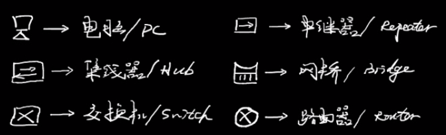
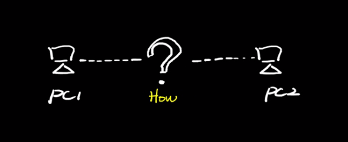
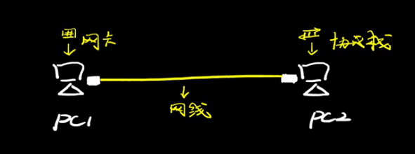
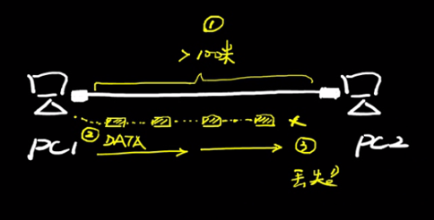
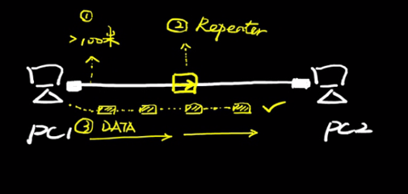
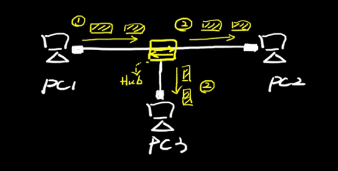
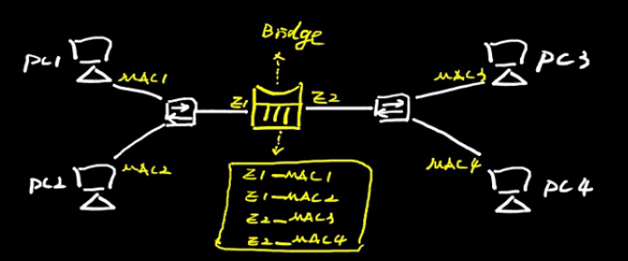
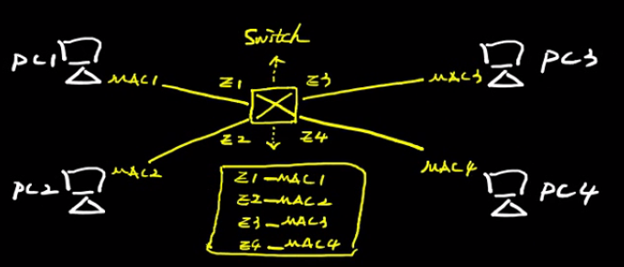
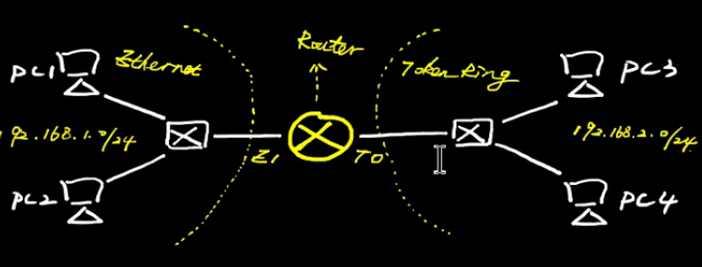

# 常见网络硬件设备简析

# 一、计算机网络层次模型

- OSI协议（7层）：物理层、数据链路层、网络层、传输层、会话层、表示层、应用层

- TCP/IP协议（4层）：网络接口层、网际层、运输层、应用层

- 五层协议（5层）：物理层、数据链路层、网络层、运输层、应用层

# 二、宏观理解

**全家福**

**两台主机如何连接起来？**

- 在网络诞生之前，电脑之间都是单机运行，没有网卡、没有网线、没有协议栈，数据传输主要通过软盘、光盘等介质。

**网线来了**

- 【网线+网卡+协议栈】三要素，是组成“最小单元网络”的基础，缺一不可。

- 网线提供物理介质，承载比特率/电信号（类似电话线承载语音流/模拟信号）。

- 网卡进行数据处理，例如将电脑磁盘上的数据/字节转换为网线上的电流/比特，将比特流转换为数据。

- 协议栈作为沟通语言，实现通信过程中的数据解析、地址寻址、流控制等。

**网线不够长怎么办？**

- 终端之间如果距离太远，一旦超过网线物理传输距离上限，则数据开始丢失（失真）。

**中继器来了**

- 中继器是一种物理层产品，能够对电信号进行中继和放大，实现设备远距离传输。

**中继口不够怎么办？**

- 中继器一般只有两个接口，意味着如果网络中超过三个终端主机的话，则无法实现多主机直接的数据通信。

**集线器来了**

- 集线器是一种“多口中继器”，也是属于物理层产品，能够对电信号进行中继和放大，从任意接口收到的数据，会往其他所有接口泛洪。
- 集线器不识别数据的寻址信息和上层内容，无法对终端主机进行隔离，多个主机处于同一个冲突域中，采用集线器网络，带宽利用率较低，所以一个时钟周期中，集线器只能处理一组电信号。

- 冲突域就是如果多台主机同时通信会发生冲突，这多台主机就处于一个冲突域。

**怎么解决冲突？网桥来了**

- 网桥是一种链路层产品，能够记录终端主机的 MAC 地址并生成 MAC 表，MAC 表相当于“地图”，网桥根据 MAC 表转发主机之间的数据流。

- 网桥能够进行冲突域隔离，有效的提高网络带宽利用率，不同接口之间的数据不会相互冲突。例如 PC1 发送给 PC2 的数据不会转发到右边（E2 口）。

- 网桥的接口比较有限，默认是两个接口，对网络的冲突隔离比较有限，网桥没有专门的硬件而是采用 CPU 来处理数据，相对速度不够快。

**不够快怎么办？交换机来了**

- 交换机是一种链路层产品，能够记录终端主机的 MAC 地址并生成 MAC 表，MAC 表相当于“地图”，交换机根据 MAC 表转发主机之间的数据流。

- 交换机是在网桥的基础上进行延伸和升级，相比网桥，主要有几个优势：(1) 接口数量更加密集（每个主机在独立的冲突域，带宽利用率大大提高）；(2) 采用专用 ASIC 硬件芯片进行高速转发；(3) 能够进行 VLAN 隔离（不仅仅可以隔离冲突域，而且通过 VLAN 隔离广播域）

- 交换机是一种局域网产品，一般用于本地网络，无法实现远程广域网通信

**不够远怎么办？路由器来了**

- 路由器是一种网络层产品，基于 IP 寻址，采用路由表实现数据转发。
- 路由器主要用于连接不同局域网（可以是不同介质，如令牌网和以太网可以互通），实现广播域隔离，也可以用于远程通信（广域网连接）
- 路由器诞生是互联网大爆发的主要原因，跨介质跨地理的网络大融合称为现实。
- IP 协议等逻辑寻址机制是实现不同类型局域网连通的关键，不同局域网的主机只要有配置逻辑地址（IP 地址），有合理的逻辑地址规划（网段规划），则可以通信。

**总结**

# 三、具体介绍

## 中继器（物理层）

中继器（RP repeater）又称转发器，主要功能是将信号整形并放大再转发出去，以消除信号经过一长段电缆后，因噪声或其他原因而造成的失真和衰减，使信号的波形和强度达到所需要的要求，进而扩大网络传输的距离（局域网网段长度）。

原理：信号再生（而非简单地将衰减的信号放大）。

中继器有两个端口，数据从一个端口输入，再从另一个端口发出。端口仅作用于信号的电气部分，而不管数据是否可用或正确。

中继器是局域网环境下用来扩大网络规模的最简单、最廉价的互联设备。使用中继器连接的几个网段仍然是一个局域网。一般情况下，中继器的两端连接的是相同的媒体，但有的中继器也可以完成不同媒体的转接工作。但由于中继器工作在物理层，因此它不能连接两个具有不同速率的局域网。中继器两端的网络部分是网段，而不是子网。中继器若出现故障，对相邻两个网段的工作都将产生影响。

它属于一种物理层设备，用于连接两根电缆段。中继器不理解帧、分组和头的概念，他们只理解电压值。

**【优点】**

- 扩大了通信距离。
- 增加了节点的最大数目。
- 各个网段可使用不同的通信速率。
- 提高了可靠性。当网络出现故障时，一般只影响个别网段。
- 性能得到改善。

中继器的主要优点是安装简单、使用方便、价格相对低廉。他不仅起到网络距离的作用，甚至还可以将不同传输介质的网络连接在一起。

中继器工作在物理层，对于高层协议完全透明。

**【缺点】**

- 由于中继器对收到被衰减的信号再生（恢复）到发送时的状态，并转发出去，增加了延时。
- CAN 总线的 MAC 子层并没有流量控制功能。当网络上的负荷很重时，可能因中继器中缓冲区的存储空间不够而发生溢出，以致产生帧丢失的现象。
- 中继器若出现故障，对相邻两个子网的工作都将产生影响。

> 问题：中继器是否可以无限使用？
>
> 实际应用中，互相串联的中继器的个数不能超过 4 个，而且用 4 个中继器串联的 5 段通信介质中只有 3 段可以挂接计算机，其余两段只能用作扩展通信范围的链路段，不能挂接计算机，这就是“5-4-3 规则”。
>
> 目前各类双绞线的最远有效传输距离为 100 米！一般取 80-90 米的极限，网线质量低或者是周围干扰强那么这个距离还会进一步缩小，如果要加大传输距离，在两段双绞线之间可安装中继器，最多可安装 4 个中继器。

## 集线器（物理层）

集线器（Hub）就是将网线集中到一起的机器，也就是多台主机和设备的连接器。集线器的主要功能以扩大网络的传输距离，是中继器的一种形式，区别在于集线器能够提供多端口服务，也称为：多端口中继器。集线器在 OSI/RM 中的物理层。集线器的基本功能是信息分发，它把一个端口接收的**所有**信号向**所有**端口分发出去。一些集线器在分发之前将弱信号重新生成，一些集线器整理信号的时序以提供所有端口间的同步数据通信。

集线器实际就是一种多端口的中继器。集线器一般有 4、8、16、24、32 等数量的 RJ45 接口，通过这些接口，集线器便能为相应数量的电脑完成“中继”功能（将已经衰减得不完整的信号经过整理，重新产生出完整的信号再继续传送）。由于它在网络中处于一种“中心”位置，因此集线器也叫做“HUB”。 

集线器的工作原理很简单，比如有一个具备 8 个端口的集线器，共连接了 8 台电脑。集线器处于网络的“中心”，通过集线器对信号进行转发，8 台电脑之间可以互连互通。具体通信过程是这样的：假如计算机 1 要将一条信息发送给计算机 8，当计算机 1 的网卡将信息通过双绞线送到集线器上时，集线器并不会直接将信息送给计算机 8，它会将信息进行“广播”——将信息同时发送给 8 个端口，当 8 个端口上的计算机接收到这条广播信息时，会对信息进行检查，如果发现该信息是发给自己的，则接收，否则不予理睬。由于该信息是计算机 1 发给计算机 8 的，因此最终计算机 8 会接收该信息，而其它 7 台电脑看完信息后，会因为信息不是自己的而不接收该信息。

集线器不具备信号的定向传送能力，即信号传输的方向是固定的（”广播“），是一个标准的共享式设备。

由 Hub 组成的网络是共享式网络，但**逻辑上仍是一个总线网**。Hub 的每个端口连接的网络部分是同一个网络的不同网段。同时 Hub 也只能在半双工状态下工作，网络的吞吐率因而受到限制。

> 问题：连接到一台集线器的多台计算机如何工作？
>
> 多台计算机必然会发生同时通信的情形，因此集线器不能分割冲突域，所有集线器的端口都属于同一个冲突域。集线器在一个时钟周期中只能传输一组信息，如果一台集线器连接的机器数目较多，且多台机器经常需要同时通信，那么将导致信息碰撞，使得集线器的工作效率很差。比如，一个带宽为 10Mb/s 的集线器上连接了 8 台计算机，当这 8 台计算机同时工作时，每台计算机真正所拥有的带宽为 10/8Mb/s = 1.25Mb/s 。

## 网桥（链路层）

网桥（Bridge）是早期的两端口二层网络设备。网桥的两个端口分别有一条独立的交换信道，不是共享一条背板总线，可隔离冲突域。网桥比集线器（Hub）性能更好，集线器上各端口都是共享同一条背板总线的。后来，网桥被具有更多端口、同时也可隔离冲突域的交换机（Switch）所取代。

> 虽然网桥和集线器长得很像，但是网桥处理数据的对象是帧，所以它是工作在数据链路层的设备，中继器、放大器处理数据的对象是电气信号，所以它是工作在物理层的设备。

## 交换机（链路层）

## 路由器（网络层）
