# 有了IP地址为什么还需要MAC地址

> 作者：涛叔
> 链接：https://www.zhihu.com/question/21546408/answer/2120115071
> 来源：知乎
> 著作权归作者所有。商业转载请联系作者获得授权，非商业转载请注明出处。

## 点对点链路

最早的网络是「猫」+电话线。一台电脑接一个猫，连一条电话线。理论上只要完成拨号，双方就能进行通信。这个过程跟两个人电话没什么两样。

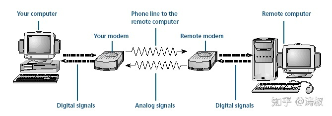

因为是一条电话线的两头，这边电脑发出的所有信号自然会被另一端的电脑收到。所以不需要给双方指定 MAC 地址或者 IP 地址之类东西。这种链路叫**点对点链路**。

## Mesh 拓朴

点对点链路的优点是简单清晰，但缺点也很明显——不支持连接多台电脑。如果你想连多台电脑，就需要给电脑配置多个猫。如果有多台电脑需要相互连接，就需要每台的电脑的每个猫都连到一起。这样做不但成本很高，管理负担也非常重。这种连接方式叫全网状（Full Mesh）拓朴网络。

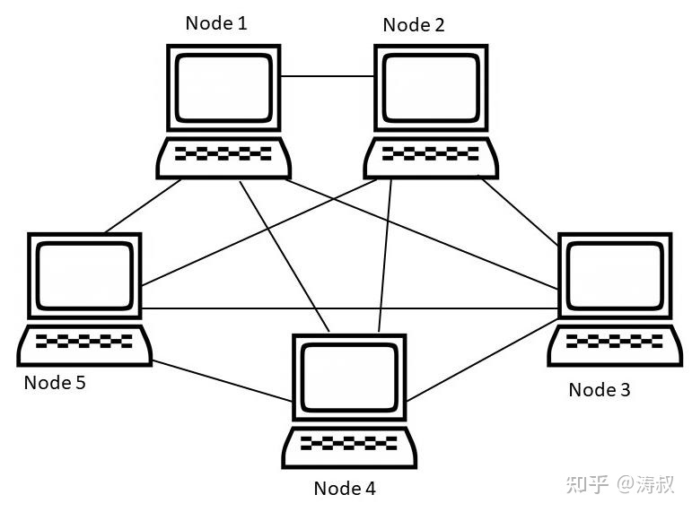

Mesh 网络也不是一无是处，它最大的优点就是可靠性高。网络中的部分链接出现故障不会影响到整个网络。但成本高，维护困难的缺点真是抗不住。

成本高归高，计算机之间还是以点对点的方式进行通信。所以这类网络本质上跟第一种点对点链路没有区别。设备之间的通信也不需要设置 MAC 或 IP。

## 总线网络

为了降低成本，人们想了另外一种连接方式，总线网线。

之所以成本低，是因为所有的电脑只需要接一个猫，然后所有猫接到同一条网线上（叫总线，早期使用的是同轴电缆）。

## CSMA/CD

组网成本确实降低了，但使用成本却上升了。如果上图中 A 想给 B 发数据，可以启动自己的猫开始发送。如果此时 C 也给 D 发数据，那就会形成干扰，最终谁的数据也发不出来。为了解决这个问题，人们规定，如果想发数据，必须先使用自己的猫「听」一下网线上有没有其他电脑正在通信。如果有，就**自觉**等待一段时间，然后再检查。这套机制后来演化了成载波侦听多路访问／碰撞检测（CSMA/CD）机制。教科书上都会讲这个 CSMA/CD。

## MAC 地址

解决了冲突问题，总线网络就能工作吗？不能！我们在前面讲的点对点链路两边各有一台电脑，收发双方非常明确，不需要指定 MAC 或者 IP。但在总线网络中，所有电脑共享一条电缆，可以同时接收网络上的全部信号。那大家怎么确定数据是发给自己的呢？

为了解决这个问题，人们发明了数据帧的概念。帧是发送数据的最小单位。当时是用很多链接层协议，以太网只是后面设计的一种。但不同的帧结构大同小异，核心都包含目标地址、源地址和数据三部分。

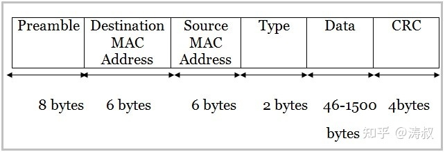

这里首次出现了地址这个概念。**正是因为总线网线中所有设备共享总线，所以需要通过引入地址的概念来区分不同的设备。**对于以太网，这个地址就是我们常说的 MAC 地址。这个时候的「猫」就已经变成了我们现在常说的网卡了。以太网规定 MAC 地址占 6 个字节，也就前面说的 48 位。

所有发出的包都带着目标电脑的 MAC 地址。网络中所有设备收到数据后会**自觉**比较目标地址是不是自己，如果不是就丢弃。你没看错，**全凭大家自觉**。这样就解决了不同电脑之前相互通信的问题。

引入地址的概念，也就产生了新的问题——**如何给计算机设置 MAC 地址呢？**不同的网络有不同的处理方式。

## ARCNET 网络

曾经有一种叫 ARCNET 的网络协议，它的 MAC 地址只有 1 个字节（8位），需要网络管理员通过网卡上的拨动开关**手工设置**。好在当年能连网的设备很少，8 位地址可以支持最多 256 台设备连网，也够用了。

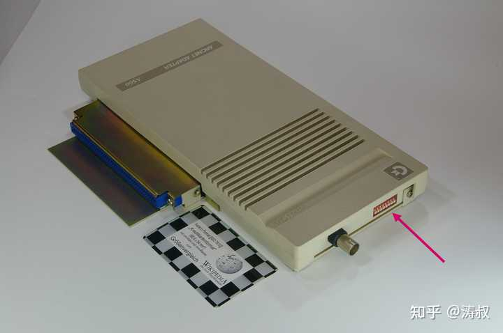

以太网则规定在网卡出厂的时候就得分配 48 位 MAC 地址，全球唯一。

## 网桥

随着总线网络的普及，越来越多的大公司或组织（主要是大学）开始使用网络连接它们的设备。为了方便传输数据，人们还发明了网桥。可以把网桥想象成装有多个网卡的设备，每个网卡连接一个总线网络。网桥唯一的作用就是把**从一个网卡收到的内容原样转发到另一张网卡所在的网络**。

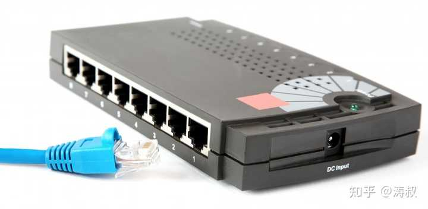

这样网络的规模越来越大，连网的设备越来越多，通信冲突的频率也越来越高。最终的结果就是数据传输的速度越来越低（因为只要有一人在发数据，其他所有人都得等待）。但就这样，**人们对互联互通的要求**还没有被满足。除了公司或者组织内部的网络，人们还想把不同城市的设备和网络都连起来，这就需要用到长途电话线。

我们前面说过网桥是一种无脑转发设备。它的无脑不仅体现在不关心数据内容方面，还体现在尽自己最大能力转发。如果是相同局域网，两边的网速相近，那不会有什么问题。但如果一边是局域网，一边是长途电话线，那来自局域网的广播数据会把电话线挤爆，大家谁也别想玩。

## IP 协议

事情发展到这步田地，就需要人们（另一拨人）坐下来开会讨论了。最终，想了一个办法，就是让网桥变的智能一点。让它可以「学习」不同网络所有设备的 MAC 地址。当有数据需要转发的时候，它可以根据目标地址判断应该转发到哪个网卡，从而减少广播的数量。

但是，因为以太网的 MAC 是在出厂的时候指定的，所以没有一个简单的办法确定某个总线网络中的所有 MAC 地址，只能通过广播来学习，也只能在网桥设备保存全部的 MAC 地址，而且还要及时更新。除此之外，网桥本身只转发，理论上也不需要 MAC 地址。所以网络内的计算机不知道数据是经过几个网桥转发的，也不知道是在哪个环节出了问题。

最终，另一拨人（IETF）想出了再加一层的方案，也就是在以太网上引入了[网络层](https://www.zhihu.com/search?q=网络层&search_source=Entity&hybrid_search_source=Entity&hybrid_search_extra={"sourceType"%3A"answer"%2C"sourceId"%3A2120115071})（也就是IP层）。注意，网络层是 IETF 这拨人鼓捣出来的，以太网是 IEEE 那拨人鼓捣出来的。IETF 这拨人决定给每一台网络设备加一个逻辑地址，也就是 IP 地址，而且觉得 32 位差不多够用了，甚至都没考虑 MAC 地址是 48 位。

引了IP协议层，前面说的网络问题基本得到解决。

## IP 路由

首先，每一台设备都有一个 IP 地址。通信双方使用IP地址进行通信。IP 地址是管理员按需指定的，可以**根据前缀聚合**。所以原来的网桥（现在变成了路由器）不需要保存网络中的所有 MAC 地址，只要保存网络前缀就能进行转发。

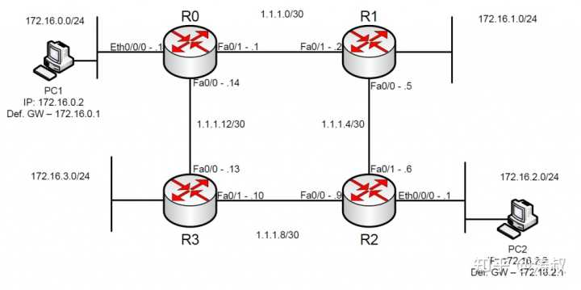

但问题来了，网络层工作在[链路层](https://www.zhihu.com/search?q=链路层&search_source=Entity&hybrid_search_source=Entity&hybrid_search_extra={"sourceType"%3A"answer"%2C"sourceId"%3A2120115071})之上。要想通信，还得需要 MAC 地址。怎样才能得到目标的 MAC 地址呢？这就需要用到 ARP 协议。

## ARP 协议

每当电脑在通信之前会先在网络上发一个广播（这个广播不会被转发到其他网络），问谁的 IP 地址是某某某。这个时候对应的电脑就会回包说是我，我的 MAC 地址是某某某。发送方就拿到了接收方的 MAC 地址，进而完成通信。

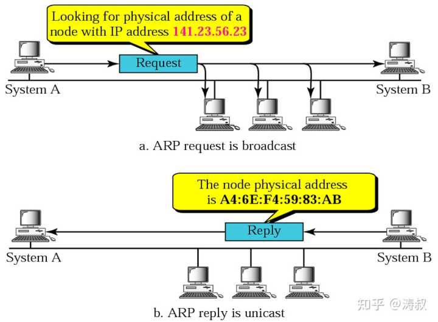

如果目标电脑在另一个网络，这个时候发送方就会在自己的网络里广播说谁的 IP 是[192.168.1.1](https://www.zhihu.com/search?q=192.168.1.1&search_source=Entity&hybrid_search_source=Entity&hybrid_search_extra={"sourceType"%3A"answer"%2C"sourceId"%3A2120115071})（我们假设它的默认网关 IP 是192.168.1.1），网关就会回复自己的 MAC。然后，发送方就会通过网关的 MAC 地址给网关发一条 IP 报文，报文的目标 IP 就是接收方的 IP 地址，来源 IP 自然是发送方的 IP 地址。

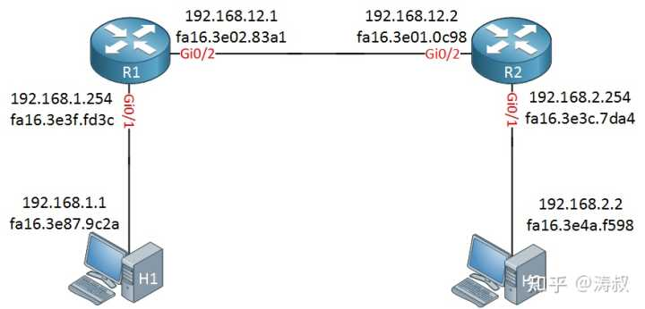

以上图为例，假如 H1 想给 H2 发数据。H1 知道 H2 跟自己不在一个网络，所以它通过 ARP 查到 R1 的 Gi0/1 网卡的 MAC 地址，给 `fa16.ee3f.fd3c` 这个 mac 地址发送了一个 IP 报文，这个报文的目标 IP 是 H2 的 IP 地址，也就是 `192.168.2.2`，原 IP 地址是 H1 的 IP，也就是`192.168.1.1`。 R1 收到这个报文后发现目标地址是`192.168.2.2`，需要通过 Gi0/2 网卡转发给路由器 R2（因为 R1 保存了 H2 所在网络的前缀）。R2 会重复同样的过程，最终 IP 报文被转发给 H2。 

整个过程，H1 和 R1 都不需要知道 H2 的 MAC 地址，但所有节点必须知道相临节点的 MAC 地址（也叫下一跳）。所以说，到现在为止，哪怕是引入了 IP 层，实际通信还是依赖 MAC 地址。

## 交换机

在 IP 网络中，如果目标在同一网络，则通过广播通信；否则，通过网关转发。因为有广播的存在，所以网速还是会受到影响。这时局域网也叫冲突域：

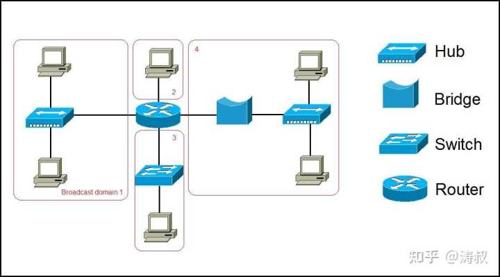

大家不要误会。因为 IP 网络引入了路由器，所以跟原来的总线网络相比，冲突域变小了，广播减少了，网速提高了。但人民群众的要求也提高了，网速必须更快！

于是，人们又发明了交换机。交换机是一种局域网设备，功能跟前面说的网桥类似。

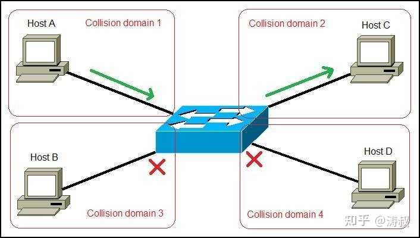

但是，交换交换机可以进一步减少广播的数量。以上图为例。如果 A 想给 C 发送数据，它会先通过 ARP 广播查询 C 的 MAC 地址。这一步是免不了的。但是，这一步也会被交换机监听/学习到，所以交换机会将 C 连接的网口跟 C 的 MAC 地址绑定到一起，等 A 给 C 发数据的时候，交换机只会给 C 发数据。这个时候 B 和 D 都收不到数据。不但收不到，B 和 D 还可以在 A 与 C 通信期间进行通信，这就进一步提高了网络的利用效率。

## MAC 地址的去留

因为有了交换机，所以原来的总线拓朴在一定程度上变成了星形拓朴。又因为交换机可以隔离不同设备间的通信，所以总线网络一定程度上又变成了点对点网络。

那我们能不能最终去掉 MAC 地址，而只保留IP地址呢？理论上是可行的。交换机既然可以学习 MAC 地址，那就一定可以学习 IP 地址。这样，每个网口所连电脑的 IP 映射关系也就知道了。电脑 A 如果想给 C 发数据，可以不查 C 的 MAC 地址，而是直接给交换机发一个 IP 报文（注意，这次没有 MAC 帧）。交换机收到后直接转发给电脑 C。整个过程就仿佛回到了最开始的点对点链接路。是不是有点历史轮回的感觉呢？

现在没有去掉 MAC 地址，可能是因为以太网设备已经遍布全球，也足够便宜，已经没有必要再优化了。但从原理上看，MAC 地址确实可以去掉。

不过，话说回来，IP 与 MAC 都存在也是有一个非常大的好处的：这样分层可以使网络层与[链路层](https://www.zhihu.com/search?q=链路层&search_source=Entity&hybrid_search_source=Entity&hybrid_search_extra={"sourceType"%3A"answer"%2C"sourceId"%3A28155896})的协议更灵活地替换，网络层不一定非要用『IP』协议，链路层也不一定非用『[以太网](https://www.zhihu.com/search?q=以太网&search_source=Entity&hybrid_search_source=Entity&hybrid_search_extra={"sourceType"%3A"answer"%2C"sourceId"%3A28155896})』协议，并且由于 MAC 的存在，与 MAC 相关的其它协议也不需要改变。

所以，这是一个历史与性价比问题，而不是单纯的技术问题。

## IPv6 网络

虽然没有消灭 MAC 地址，但 IPv6 引入了所谓的 link local address，这种地址以 FE80 开头，只在当前链路有效。什么意思，你可以给同一设备的不同网卡设置相同的 link local address。比如你有一个路由器，所有的网卡都设成 FE80::1，那可以把连接这个路由器的所有网络的主机的下一跳地址都设成 FE80::1，而不论主机所在的实际网段是什么。这在管理上比较方便。之前 IPv4 时代只能不同网卡设不同地址，分开配置，比较麻烦。

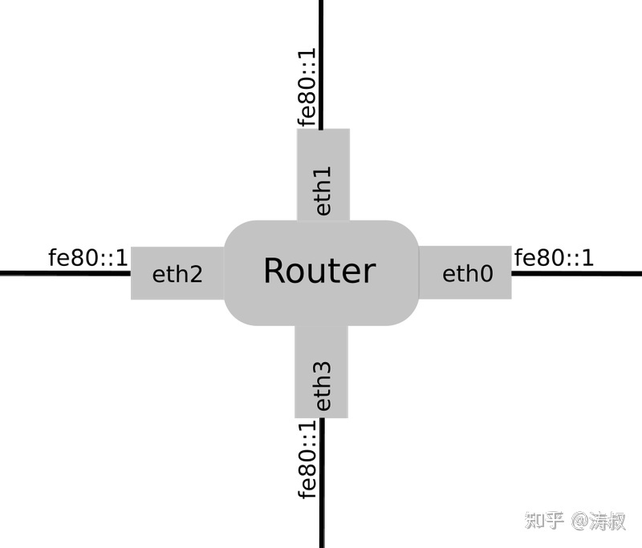

我们前面说过，现在的网络拓朴有点绕回原来的点对点网络。如果能让设备直接跟路由器相连，那么所谓的 Link 上就只有两个设备，这是典型的点对点链路。这个时候设备相要发IP报文，可以直接发给 FE80::1。从而完全去掉 MAC 地址。

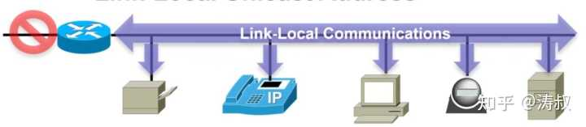
