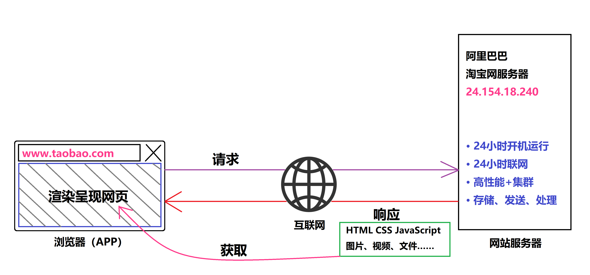
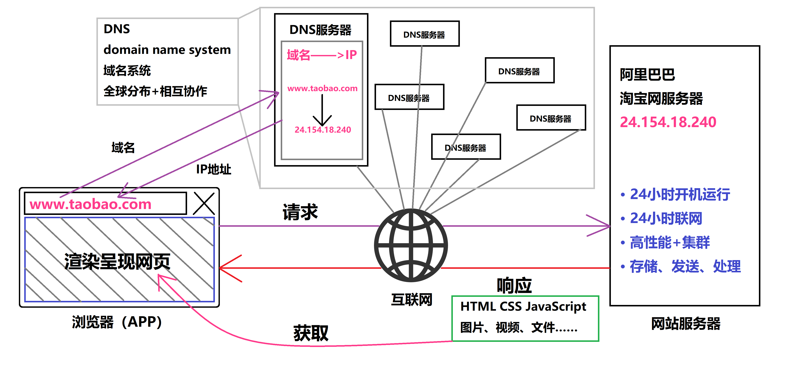

# 浏览器搜索时发生了什么？

如今，我们都处于飞速发展的信息社会中，老师相信互联网早已深深走进了在座的每一位同学的生活，大家与互联网的关系肯定已经是密不可分的了！

在正式讲授本堂课知识之前，老师想请大家回忆一下，我们平时是如何上网查资料的？来~哪位同学给大家分享一下？

（学生回答：我通常是利用百度搜索进行查询）

（教师追问：那请你再告诉老师一下，如何打开百度呢？）

（学生回答：在手机或电脑上打开浏览器一般默认就是百度搜索那个页面，如果不是的话，那么就需要输入百度的网址就会跳转到百度搜索页面了）

好！这位同学回答的不错，那么下面请同学们跟随着老师的思路一起来回顾我们通常的上网流程……

每当我们要去浏览一个网站，不管是在电脑上还是在手机上，我们首先要做的肯定就是启动浏览器，然后在浏览器里面输入一个网址，接着回车确定。

比如，我们希望打开淘宝网买东西，那么我们首先会打开电脑或是手机上的浏览器，这时浏览器窗口中一定会有一个网站输入栏（也叫地址栏），我们便在地址栏中输入淘宝网的网址 [www.taobao.com](http://www.taobao.com)，最后我们敲击回车确定。

如果你的网络不错，那么淘宝网基本上会在 1 秒钟之内出现在你的面前。但是这到底是如何实现的呢？为什么输入一个网址就能出现网站？这背后到底发生了什么？这便是本堂课需要探讨的内容，而这一切还是要从浏览器开始说起。

其实我们使用的浏览器就是电脑和手机里的一款软件，当你在它的地址栏里面输入一个网址，并且点击确定后，其实就是让浏览器向这个网址所对应的网站服务器发送一个请求，通俗理解请求就是一个信号，一个请该网站的服务器向浏览器发送对应网站文件的这样一个信号，而服务器呢其实就是一种专门用来存放网站数据文件并且 24 小时开机联网的电脑。只不过他们的系统大部分不是我们所熟知的 Windows 或者 Mac OS，而是你可能没听说过的 Linux。这个网站的服务器收到你的浏览器的请求之后呢，就会向浏览器传回一个 HTML 文件。当浏览器在解读这个 HTML 文件的时候，发现其中啊还需要某些 css 文件、js 文件或是图片文件、视频文件等，接着浏览器会继续向 HTML 中标注的文件地址发送相应的请求，获取相应的 css、js 等文件。当浏览器把这些文件都接收到了，然后浏览器就会像画画一样在浏览器窗口里面根据所收到的文件把所有页面内容都渲染展示出来，那么完整的网页呢就呈现在了你的面前。

当然，有的同学可能会有疑问。老师，网站服务器是干什么的？为什么服务器里会有网站的文件呢？这里老师给大家略微科普一下，服务器其实就是一些高性能的电脑，当程序员把网站开发好之后呢，就会把网站的程序代码以及相关的文件放在服务器这种 24 小时开机联网的高性能电脑上，这样的话用户才能 24 小时都能访问到该网站，同时由于服务器性能强所以还承担了发送、存储、处理网站数据的任务。目前每个大型的互联网企业基本都有自己的数据中心，里面就运行着成千上万的服务器，而小型企业呢通常是向大型互联网企业（如：阿里云、腾讯云）租聘云服务器使用。并且各大计算中心为了尽可能提高服务器性能，节省功耗，都想尽了法子，比如：著名的微软公司的服务器集群就为了追求极致的散热性能，所以把其沉入了苏格兰海底。

说到这里，相信同学们对服务器应该有一个大概的认识了。

但是如果我们细想一下，这幅流程图里其实还有一个关键的问题没有解决，不知道同学们有没有发现呢？

下面请大家按照之前的小组进行组内讨论，之后老师抽取一个小组代表来进行发言“你觉得刚才的步骤中还有一个什么关键问题我们没有提到？”

好的，请第二小组的组长来分享一下

（老师，我的问题是: 世界上有成千上万的网站，浏览器是怎么知道每一个网址对应的网站服务器在哪里的呢？）

嗯！请坐，回答对啦！正是这个问题！为了解答这个关键问题，这里便需要引出两个概念：IP 和 DNS。

IP 可能很多小伙伴都听说过。我们知道每一台能够联网的设备都是有一个 IP 地址的，IP 地址就像是网络世界里每台设备的门牌号它是独一无二的，那么也就是说每一台服务器肯定也对应有一个 IP 地址。因为他们都是联网的嘛，而我们在浏览器的地址栏中输入的网址其实就对应一个 IP 地址（也就是这个网址对应的网站服务器的IP地址），根据这个 IP 地址呢，设备才能把请求发送到正确的服务器上。

但是也不太可能在每个人的电脑上把世界上所有的网站的网址和对应的所有的服务器的 IP 地址都记录下来了，这不太现实，也太笨了，那么就有人发明了 DNS 这样的系统。

DNS 全称 domain name system，中文就是：域名系统。域名也就是我们常说的网址，是一个网站必不可少的东西。域名系统这个名字看着有点头晕，他到底是干什么的呢？DNS 是一套让网络世界中成千上万的网址和服务器的 IP 地址可以一一对应并可以进行查找管理的这样一套机制。

而让域名机制真正落地运行的呢是 DNS 服务器，它是网络世界中专门用来记录网址对应的服务器 IP 地址的一种服务器。网络世界中有很多的 DNS 服务器，它们是自身体系的相互协作，它具体的运作方式呢我们这里就不细说了，那我们的网址也就是域名要能正常的指向某个服务器的 IP 地址。那么就要在负责管理这个域名的某个 DNS 服务器里面去设置，也就是告诉这个 DNS 服务器这个域名适合哪一个服务器的 IP 地址，这个行为专业的来说叫设置 DNS 解析，一般的域名是你向相关机构租聘的。DNS 解析呢就在相应的域名管理机构后台进行设置的。当你的域名设置完 DNS 解析，并且这个解析生效之后，你就可以正常访问这个网址。

总结一下，当任何人的设备去访问你这个网址的时候，其实就是先通过网络经由 DNS 服务器先去获取网址相对应的这个网站服务器 IP 地址。然后设备再根据获取的这个 IP 地址去访问相应的网站服务器，服务器再返回相应的网站文件，浏览器得到网站文件后在浏览器窗口中渲染出网站内容。

那这样听起来整个网站打开的过程好像做了很多的事情，好像会耗费很长的时间，但是我们实际在打开网站的时候，很多时候都是秒开的，这是因为网络世界的电子信号传输速度是非常非常快的，一眨眼之间就已经能像光一样绕地球好几圈了，那很多数据的传输和处理工作都是在非常非常短的时间内完成，所以我们很多时候是感知不到的。我刚才在介绍整个网站的打开的过程中呢提到了几个关键词：域名、服务器、DNS。而这三者恰恰就是这样一个网站上线的关键。当然了，对于我国来说的话还要加上备案。

以上就是本堂课的内容，希望通过本节课的学习能让同学们更加了解互联网的运作原理。
